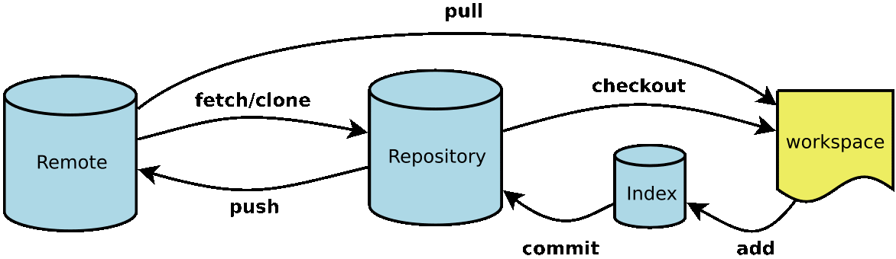

# SYS151 - Linux Commands - Git命令

返回[Bulletin](./bulletin.md)

返回[SYS151 - Linux Commands](./SYS151.md)

[TOC]

## Git和其他版本控制器的区别

GIT是分布式版本控制系统，其他类似于SVN是集中式版本控制系统。

分布式区别于集中式在于：每个节点的地位都是平等，拥有自己的版本库，在没有网络的情况下，对工作空间内代码的修改可以提交到本地仓库，此时的本地仓库相当于集中式的远程仓库，可以基于本地仓库进行提交、撤销等常规操作，从而方便日常开发。

## 结构



- 远程仓库 Remote
- 仓库区/本地仓库 Repository
- 暂存区 Index/Stage
- 工作区 Workspace

## 本地项目添加多个远程仓库

**第一种方式：**

添加一个远程库 名字不能是origin

```bash
git remote add 17MOX http://git.17byh.com/17MOX/mxhy.git  
```

查看远程库及地址

```bash
git remote -v 
```

拉，推

```bash
git pull 17MOX  远程分支名：本地分支名
git push 17MOx  本地分支名：远程分支名
```

**第二种方式：**

好处是推送时，可以同时推送到另外一个库。

添加另外一个远程库

```bash
git remote set-url --add origin git@gitlab.com:mzc/DIVIDE_PKG.git
```

推送

```bash
git remote -v
git push origin master:master
```

取消本地目录下关联的远程库：

```bash
git remote remove origin
```

## 分支合并

### git merge命令

如果你想保留完整的历史记录，并且想要避免重写commit history的风险，你应该选择使用git merge

merge 特点：自动创建一个新的commit, 如果合并的时候遇到冲突，仅需要修改后重新commit

优点：记录了真实的commit情况，包括每个分支的详情

缺点：因为每次merge会自动产生一个merge commit，所以在使用一些git 的GUI tools，特别是commit比较频繁时，看到分支很杂乱。

### git rebase命令

如果你想要一个干净的，没有merge commit的线性历史树，那么你应该选择git rebase

rebase 特点：会合并之前的commit历史

优点：得到更简洁的项目历史，去掉了merge commit

缺点：如果合并出现代码问题不容易定位，因为re-write了history

### git fetch命令

相当于是从远程获取最新版本到本地，不会自动merge.

### git pull命令

pull相当于git fetch 和 git merge，即更新远程仓库的代码到本地仓库，然后将内容合并到当前分支。

## 删除本地分支和远程分支

切换到master分支

```bash
git checkout master
```

查看已有的本地及远程分支

```bash
git branch -a
```

删除远程分支

```bash
git push origin --delete dev
```

删除本地分支

```bash
git branch -d dev
```

## tag命令

tag指向一次commit的id，通常用来给开发分支做一个标记

列出已有的tag：

```bash
git tag
```

打标签 : 

```bash
git tag -a v1.01 -m "Relase version 1.01"
```

提交标签到远程仓库: 

```bash
git push origin --tags
```

查看某两次tag之间的commit：

```bash
git log --pretty=oneline tagA..tagB
```

查看某次tag之后的commit：

```bash
git log --pretty=oneline tagA..
```

本地删除：

```bash
git tag -d v0.1.2
```

## 撤销git add命令

如果是撤销所有的已经add的文件:

```bash
git reset HEAD .
```

如果是撤销某个文件或文件夹：

```bash
git reset HEAD –filename
```

## 查看代码修改历史

查看提交记录：

```bash
git log
```

查看某行代码谁写的：

```bash
git blame file_name

git blame -L 58,100 file_name # 58~100 行代码
```

其输出格式为：

```bash
commit_ID | 代码提交作者 | 提交时间 | 代码位于文件中的行数 | 实际代码 
```

根据 commit_ID 可以查看对应的提交记录：

```bash
git show commit_ID
```

