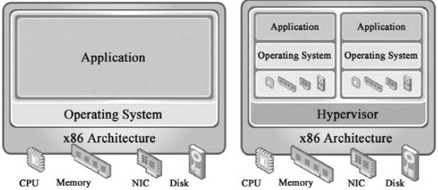
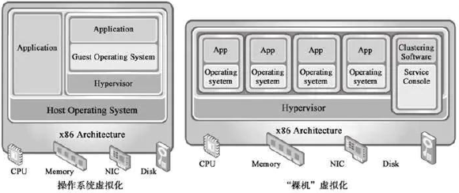

# SYS181 - Containerization & Software Delivery

返回[Bulletin](./bulletin.md)

[TOC]

> **来源说明**：本课程由原 SYS3016（虚拟化技术 / Docker）与《软件所 Chapter 9》中的 Docker 与上线部署工程链整合而成。Spring Cloud 相关内容属于 CSE401 Spring 生态，HTTPS/TLS 相关内容属于 SYS201 计算机网络，均未并入本课程。

## 1. From Code to Production

本课程回答一个问题：**一个 Senior Java Backend Engineer 写完 Spring Boot 服务之后，它如何从 Source Code 变成真正运行在生产环境里的服务？**

```
Spring Boot Code
        ↓
Git Commit / Push
        ↓
CI
        ↓
Compile
        ↓
Unit Test
        ↓
Package
        ↓
JAR (Maven Package)
        ↓
Build Image (Dockerfile)
        ↓
Push Registry
        ↓
Deploy Test / Staging
        ↓
Health Check
        ↓
Integration / Smoke Test
        ↓
Production Release
        ↓
Rolling / Canary
        ↓
Metrics / Logs / Alerts
        ↓
Success / Rollback
```

这张图是 SYS181 的总纲。注意：这是**通用 Software Delivery Model**，不是某一家公司的真实生产流水线。后续每一章对应这条链路中的一个环节，以及理解该环节所必需的底层知识（第 2-3 章）。

## 2. Virtual Machine vs Container

虚拟化技术属于计算技术的基础架构即服务层（IaaS），是一种将计算机物理资源进行抽象、转换为虚拟的计算机资源，提供给程序使用的技术。

每个虚拟机都有独立的 CMOS、硬盘和操作系统，可以像使用实体机一样对虚拟机进行操作。在容器技术之前，业界的网红是虚拟机。虚拟机技术的代表，是 VMware 和 OpenStack。

**虚拟机（VM）的层级**：

```
Physical Machine
    └── Hypervisor
        └── Virtual Machine
            └── Guest OS
                └── Application
```

**容器（Container）的层级**：

```
Physical Machine
    └── Host OS / Kernel
        └── Container Runtime
            └── Containerized Processes
```

核心区别：

- **VM**：虚拟化硬件，运行完整的 Guest OS，每个 VM 有独立的内核。
- **Container**：主要利用 OS-level isolation（Namespace）与 resource control（cgroup），多个 container 通常共享 host kernel。

"Container = Lightweight VM" 只能作为帮助理解的类比，机制并不相同：容器没有虚拟出一套硬件，也没有独立 Guest OS，它只是 host 上一组受隔离、受资源控制的普通进程（见第 3 章）。

## 3. Linux Container Fundamentals

Linux Container（简称LXC）是一种内核轻量级的操作系统层虚拟化技术，由cgroup+namespace+rootfs+容器引擎组成。核心技术是 Cgroup + Namespace。

首先建立一个关键认知：**Container 本质上仍然运行普通 OS Process**，只是这个 Process 处在受隔离和资源控制的环境中。

### Cgroup（资源管理和控制）

Cgroup是Control group的简称，是Linux内核提供的一个特性，用于限制和隔离一组进程对系统资源的使用。

在Cgroup出现之前，只能对一个进程做资源限制，如ulimit限制一个进程的打开文件上限、栈大小。而Cgroup可以对进程进行任意分组，如何分组由用户自定义。

对不同资源的具体管理是由各个子系统分工完成的。

Cgroup → **Resource Accounting / Limiting / Control**：对一组进程做资源统计、限制与控制（CPU、内存、IO 等）。

### Namespace（资源隔离）

Namespace是将内核的全局资源做封装，使得每个namespace都有一份独立的资源，因此不同的进程在各自的namespace内对同一种资源的使用互不干扰。

Namespace → **Isolation**：进程、网络、挂载点等资源在每个容器里拥有独立的视图，互相不可见。

### rootfs

rootfs代表一个Docker容器在启动时(而非运行后)其内部进程可见的文件系统视角，或者叫Docker容器的根目录。

rootfs → **Filesystem view**：容器内进程看到的文件系统环境。

整体关系：

```
Container（本质上仍是一个普通 OS Process）
│
├── Namespace           → isolation（视图隔离）
├── cgroup              → resource control（资源统计 / 限制 / 控制）
└── rootfs / filesystem → filesystem view（文件系统视角）
```

本课程只要求以上理解程度，不深入 namespace kernel source、cgroup source 与 OverlayFS implementation internals。

## 4. Docker Core Model

Docker 是围绕 image、container、build、distribution、runtime workflow 提供工程化体验的平台/工具体系。现代 Linux container 技术主要依赖 namespaces、cgroups 与 filesystem/runtime 机制。

容器是在操作系统层面上实现虚拟化，直接复用本地主机的操作系统，而传统方式则是在硬件层面实现。

> 历史背景：早期 Docker 历史上曾使用 LXC（详见 Appendix C）。不要把"LXC 封装"当作现代 Docker 的核心定义——现代 Docker 默认使用自己的 runtime（containerd/runc），直接建立在 namespaces/cgroups 之上。

核心模型：

- **Image**：immutable / read-only 的应用模板（template），包含运行应用所需的一切：代码、依赖、运行时与默认配置。
- **Container**：基于 Image 运行起来的实例。

辅助类比：Image ≈ Class / Template，Container ≈ Running Object / Instance。这只是理解类比，技术机制并不等价。

```
Dockerfile
    ↓ docker build
Image
    ↓ docker run
Container
    ↓
Java Process
```

## 5. Dockerfile & Java Application Image

最简单的 Java 应用 Dockerfile：

```dockerfile
FROM eclipse-temurin:17-jre
WORKDIR /app
COPY target/app.jar app.jar
ENTRYPOINT ["java", "-jar", "app.jar"]
```

逐项解释：

- **FROM**：基于哪个 base image。`eclipse-temurin:17-jre` 是 Eclipse Temurin 发行的 Java 17 JRE 镜像。
- **WORKDIR**：容器内的工作目录。
- **COPY**：把构建产物复制进镜像。`target/app.jar` 来自上一步 Maven 打包（`mvn clean package`）。
- **ENTRYPOINT**：容器启动时执行的命令，这里以 exec 形式直接启动 Java 进程。

目标：能看懂并写出这个最简单的 Java Dockerfile。本课程不扩展成 Dockerfile 指令百科。

以下为**补充的现代工程知识**（非原资料内容）：

- **Base Image**：优先选用官方维护、持续更新补丁的镜像（如 eclipse-temurin），减小安全攻击面。
- **Image Layer**：每条指令产生一个 layer，未变化的层可被缓存复用；指令书写顺序影响构建缓存命中率。
- **Image Size**：镜像越小，拉取与启动越快，潜在漏洞也越少；生产镜像通常选用 jre/slim 而非完整 jdk。
- **JVM Version**：base image 的 Java 版本必须与编译 target 兼容（编译用 17，运行时就用 17-jre）。
- **Non-root User**：生产镜像应创建并以非 root 用户运行应用。
- **Configuration Externalization**：配置不进镜像，通过环境变量 / 外部配置注入（见第 6 章）。

## 6. Container Runtime Configuration

### Port

应用监听端口（如 Spring Boot 的 `server.port`）与外部访问端口之间的关系：容器内应用监听自身端口，外部通过端口映射（`-p 宿主机端口:容器端口`）访问。容器是独立网络命名空间，不映射端口时外部无法直接访问。

### Environment Variable

不同环境（dev / test / staging / prod）通过环境变量注入不同配置（如 `-e SPRING_PROFILES_ACTIVE=prod`）。**镜像保持不变，配置外部化**，同一份 Image 可以在任意环境运行。

### Volume

容器的可写层随容器销毁而丢失，持久数据不应依赖 container writable layer；需要保留的数据（日志、上传文件等）应挂载 volume 或写入外置存储。

**Senior Java 常见原则：Stateless Application Container**。业务持久化应放在：

- DB
- Object Storage
- Distributed Storage

而不是容器本地文件系统。只有容器无状态，才能任意重建、水平扩展、滚动发布（见第 10 章）。

## 7. CI/CD Delivery Pipeline

标准构建/发布流水线的前半段：

```
Git
 ↓
CI
 ↓
Compile
 ↓
Unit Test
 ↓
Static Check
 ↓
Package
 ↓
Image Build
```

- **CI**：Continuous Integration，代码提交合并后自动完成编译、单元测试、静态检查、打包与镜像构建。
- **CD**：根据上下文区分两个含义——
  - **Continuous Delivery**（持续交付）：构建产物发布到制品仓库/Staging，上线由人工决策；
  - **Continuous Deployment**（持续部署）：通过流水线检查后自动部署到生产环境。

二者不要强行混成一个定义。

Senior Java 重点：我不一定维护 CI 平台，但必须理解代码如何进入标准构建/发布流水线——保证本地 `mvn clean package` 可构建、与 CI 行为一致，是基本要求。

## 8. Container Registry & Versioning

三类仓库各司其职：

- **Git Repository** → Source Code
- **Artifact Repository** → JAR / build artifact
- **Container Registry** → Image

**为什么 Image 需要版本**：生产部署必须能精确回答"线上跑的是哪份代码"。例如：

```
payment-service:1.3.7
```

补充（现代工程知识）：tag 是可变的——同一个 tag 可以被重新推送覆盖。生产系统不应只依赖 mutable tag 来理解部署版本，至少应理解 tag 与 image digest（immutable identity）的区别，关键发布按 digest 定位镜像。本课程不深入 Registry implementation。

## 9. Health Check

核心思想：**Process Alive ≠ Application Ready to Serve Traffic**。进程还在，不代表应用还能正常服务。

- **Liveness**：进程/应用是否需要被认为存活。Liveness 失败通常触发重启——期望重启能让它恢复。
- **Readiness**：当前实例是否适合接收流量。Readiness 失败通常只是把它从流量中摘除，而不重启。

Spring Boot 可通过 Actuator 暴露 `/actuator/health` 等端点（本课程不展开 Actuator 配置教程）。

**必须避免的错误设计**：不要简单写"DB 不通 → Liveness false"。数据库抖动会让所有实例同时被判死并重启，形成 cascading restart，把下游故障放大成全局故障。Liveness 应只反映进程本身是否卡死；依赖项问题通常体现在 Readiness、metrics 与 alert 上。

## 10. Release Strategies

### Rolling Deployment

逐批替换实例：先起一部分新版本实例，健康检查通过后摘掉等量旧版本，如此滚动直到全部替换完成。降低一次性全量替换的风险，出问题时可随时停止滚动。

### Canary Release

先让少量实例/少量流量进入新版本，观察关键指标（Error Rate、Latency、Business Metrics），符合预期后逐步扩大流量比例；异常则立即回退。用最小代价验证新版本。

### Blue-Green（简短补充）

准备两套完整环境（Blue / Green），新版本部署到空闲环境，验证后一次性切换流量。回退快，但资源占用多。

本课程不扩展成完整的 DevOps 发布策略百科。

## 11. Production Observation

观察框架 = **Technical Metrics + Business Metrics**。

Technical Metrics：

- Health（健康检查状态）
- Error Rate
- Latency（如 P95 / P99）
- Traffic（QPS）
- CPU / Memory
- GC
- Thread Pool
- DB Connection Pool
- Dependency Errors（下游依赖错误）
- Logs
- Alerts

Business Metrics（举例）：

- Payment Success Rate
- Order Success Rate

强调：**HTTP 200 ≠ Business Success**。接口返回 200 不代表业务成功——例如支付下单逻辑失败但响应正常，只有业务指标能暴露真相。

发布后的观察闭环：

```
Deployment
    ↓
Observe
    ↓
Compare Baseline
    ↓
Continue / Stop / Rollback
```

## 12. Rollback & Database Migration

### Rollback

发布后出现异常信号：Error Rate ↑、P99 ↑、Business Failure ↑、OOM、DB Error。

处理流程：

```
Stop Rollout
    ↓
Rollback
    ↓
Verify Recovery
    ↓
Root Cause Analysis
```

强调：Incident 中 **Mitigation / Stop the Bleeding 通常优先于在线上坚持调试新版本**。先恢复服务，再离线定位根因。

### Database Migration

核心：**Backward Compatibility**。为什么 Application Rollback 可能被 Schema/Data Migration 阻塞——如果新版本删掉了旧版本依赖的列，回滚到旧版本会直接报错。

模式：**Expand → Migrate → Contract**

1. **Expand**：先扩展 schema（加新列/新表），新旧代码都能工作；
2. **Migrate**：迁移数据、切换读写；
3. **Contract**：确认无旧版本依赖后，再删除旧列/旧表。

结果是 Version N 与 Version N+1 短时间需要兼容同一个 DB schema。只讲 Senior Java 面试程度，不扩展成 DBA migration handbook。

## 13. Senior Java Interview SOP

### 60-Second Answer — How Does Your Java Service Reach Production?

Code Commit → CI → Compile/Test → JAR → Docker Image → Registry → Test/Staging → Health Check → Rolling/Canary → Observe → Rollback if needed。

结合第 1 章的总纲，能用 60 秒把这条链路讲清楚，并说明每一环的存在意义（为什么需要 Registry、为什么要分 Liveness/Readiness、为什么 Rolling 能降低风险），即达到 Senior Java 面试对该主题的要求。

**真实边界**：本人核心经验是 Java Backend Engineering，不包装成长期维护 Docker/Kubernetes 平台的 DevOps/SRE；但作为 Senior Java Engineer，能够理解并配合完整 application delivery lifecycle。

## Appendix A - Virtualization

### 时（时间）分复用技术

多个进程能在同一个处理器上并发执行使用了时分复用技术，让每个进程轮流占用处理器，每次只执行一小个时间片并快速切换。

### 空（空间）分复用技术

虚拟内存使用了空分复用技术，它将物理内存抽象为地址空间，每个进程都有各自的地址空间。地址空间的页被映射到物理内存，地址空间的页并不需要全部在物理内存中，当使用到一个没有在物理内存的页时，执行页面置换算法，将该页置换到内存中。

### Hypervisor

虚拟化技术会在本地操作系统之上加多一层Hypervisor层。Hypervisor是一种运行在物理服务器和操作系统之间的中间软件层，可以虚拟化硬件资源，例如cpu、硬盘、内存资源等。然后我们可以基于通过虚拟化出来的资源之上安装操作系统，这也就是所谓的虚拟机。



根据Hypervisor层所处层次和GuestOS对硬件资源使用方式的不同，Hypervisor虚拟化被分为两种类型：

- Bare-metal虚拟化方式（"裸机"虚拟化）

- HostOS虚拟化方式(基于操作系统的虚拟化， 宿主型虚拟化)



### 虚拟存储器

系统中的进程与其他进程共享CPU和主存资源，为了更好的管理主存，现在系统提供了一种对主存的抽象概念，即为**虚拟存储器**（VM）。它是一个抽象的概念，它为每一个进程提供了一个假象，即每个进程都在独占地使用主存。

虚拟存储器主要提供了三个能力：　

- 将主存看成是一个存储在磁盘上的高速缓存，在主存中只保存活动区域，并根据需要在磁盘和主存之间来回传送数据，通过这种方式，更高效地使用主存。

- 为每个进程提供了一致的地址空间，从而简化了存储器管理。

- 保护了每个进程的地址空间不被其他进程破坏。

注：虚拟存储器严格来说属于 OS Memory Management，不是 Docker 的直接核心知识，此处作为历史资料保留。

### 虚拟机的优点

**资源池**：一个物理机的资源分配到了不同的虚拟机里，提高了物理资源的利用率。

**很容易扩展**：增加物理机或者虚拟机即可，因为虚拟机是可以通过镜像方式复制的。

**很容易云化**

### 虚拟机的缺点

**重**：hypervisor资源占用太多。

**慢**：虚拟机启动速度慢。

**操作复杂**：Hypervisor管理操作复杂。

**迁移过程复杂**：不同的虚拟机技术，镜像格式不同。

## Appendix B - Docker Commands

只保留最必要的命令（禁止把本课程变成 CLI 背诵课）：

- `docker build -t <name>:<tag> .` — 基于当前目录的 Dockerfile 构建 Image
- `docker run -p 8080:8080 -e KEY=VALUE <image>` — 基于 Image 启动 Container（端口映射、环境变量）
- `docker ps` — 查看运行中的 Container
- `docker logs <container>` — 查看容器日志（生产观察的第一入口）
- `docker exec -it <container> bash` — 进入运行中的容器排查问题
- `docker stop <container>` — 停止容器
- `docker images` — 查看本地 Image

## Appendix C - Historical / Low-Priority Details

### LXC 与 Docker 的历史关系

Docker 项目的目标是实现轻量级的操作系统虚拟化解决方案。 Docker 的基础是Linux容器（LXC）等技术。在 LXC 的基础上 Docker 进行了进一步的封装，让用户不需要去关心容器的管理，使得操作更为简便。用户操作 Docker 的容器就像操作一个快速轻量级的虚拟机一样简单。

修正说明：以上描述反映了 Docker 早期（约 2013 年）的历史状态，作为历史背景保留。现代 Docker 默认使用自己的 runtime 栈（containerd/runc），直接建立在 namespaces/cgroups 之上，并不依赖 LXC，"Docker = LXC 的封装"不再是现代 Docker 的准确定义。

### Docker VS KVM

作为一种新兴的虚拟化方式，Docker 跟传统的虚拟化方式相比具有众多的优势。

更快速的交付和部署

更高效的虚拟化

更轻松的迁移和扩展

更简单的管理

| 特性       | Docker容器         | KVM虚拟机  |
| ---------- | ------------------ | ---------- |
| 启动       | 秒级               | 分钟级     |
| 硬盘使用   | 一般为 MB          | 一般为 GB  |
| 性能       | 接近原生           | 弱于       |
| 系统支持量 | 单机支持上千个容器 | 一般几十个 |

修正说明：上表是当时的经验性对比，保留作历史资料。其中"启动秒级/分钟级、MB/GB、单机上千/几十个"等绝对表述高度依赖 workload、image 与基础设施，不应当作现代环境下的硬性断言。

### Docker在实际应用中的一些问题和局限性

LXC是基于cgroup等linux kernel功能的，因此container的guest系统只能是linux base的

隔离性相比KVM之类的虚拟化方案还是有些欠缺。

container随着用户进程的停止而销毁，container中的log等用户数据不便收集。

另外，Docker是面向应用的，其终极目标是构建PAAS平台，而现有虚拟机主要目的是提供一个灵活的计算资源池，是面向架构的，其终极目标是构建一个IAAS平台，所以它不能替代传统虚拟化解决方案。
