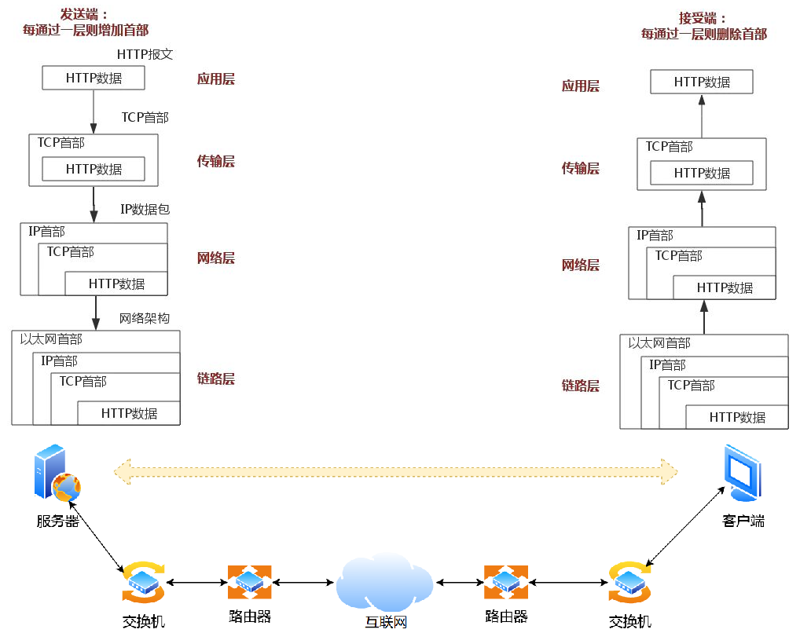
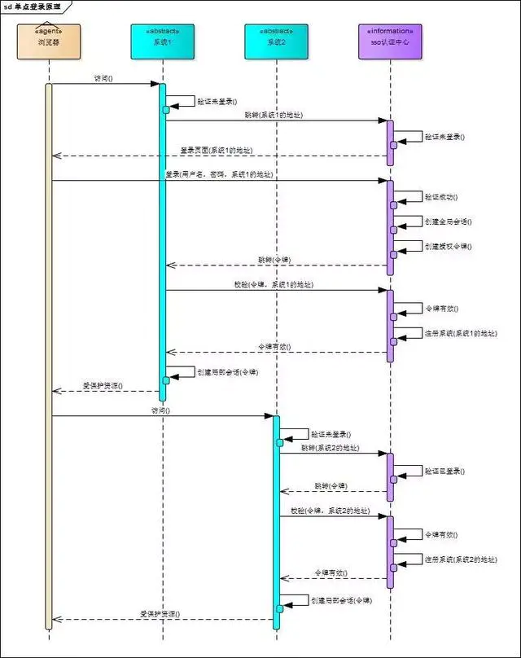

# SYS201 - Computer Networks - HTTP协议

返回[Bulletin](./bulletin.md)

返回[SYS301 - Distributed Systems](./SYS301.md)

[TOC]

## 基本概念

超文本传输协议（HTTP，HyperText Transfer Protocol）是一个基于TCP/IP通信协议，从WEB服务器传输超文本标记语言(HTML)到本地浏览器的传送协议。传输的数据类型为HTML文件、图片文件、查询结果等。设计HTTP最初的目的是为了提供一种发布和接收HTML页面的方法。

HTTP传输具有以下特征：

- **支持客户端/服务端模式**

- **简单快速**：报文的主要组成就是 header + body，头部信息也是简单的文本格式。客户向服务器请求服务时，只需传送请求方法和路径。请求方法常用的有 GET、HEAD、POST，每种方法规定了客户与服务器联系的类型不同。由于 HTTP 协议简单，使得 HTTP 服务器的程序规模小，因而通信速度很快。

- **灵活**：HTTP 允许传输任意类型的数据对象。正在传输的类型由 Content-Type 加以标记。

- **无连接**：无连接的含义是限制每次连接只处理一个请求。服务器处理完客户的请求，并收到客户的应答后，即断开连接。采用这种方式可以节省传输时间。

- **无状态**：HTTP 协议是无状态协议。**无状态协议**(Stateless Protocol) 就是指浏览器对于事务的处理没有记忆能力。举个例子来说就是比如客户请求获得网页之后关闭浏览器，然后再次启动浏览器，登录该网站，但是服务器并不知道客户关闭了一次浏览器。缺少状态意味着如果后续处理需要前面的信息，则它必须重传，这样可能导致每次连接传送的数据量增大。另一方面，在服务器不需要先前信息时它的应答就较快。

### URI

**URI**的全称是（Uniform Resource Identifier），中文名称是统一资源标识符。URI 是用来标示 一个具体的资源的，我们可以通过 URI 知道一个资源是什么。

URI包含了URL和URN.

#### URL

URL(Uniform Resource Locator)统一资源定位符，也就是我们俗称的网址，它实际上是 URI 的一个子集。URL 则是用来定位具体的资源的，标示了一个具体的资源位置。互联网上的每个文件都有一个唯一的URL。

```
protocol://host:port/resourceName
```

#### URN

URN(Uniform Resource Name)统一资源名称，它只是用来定义一个资源的名称，并不具备定位该资源的能力。例如：

```
urn:isbn:0451450523
```

用来定义一个书籍名称，但是却没有表示怎么找到这本书。

## HTTP请求&响应过程



输入网址http://www.someSchool.edu/someDepartment/home.index并点击回车后，浏览器内部会进行如下操作：

### 解析URL

首先浏览器做的第一步工作就是要对URL进行解析，得到：

- 协议名：http

- 主机名：www.someSchool.edu

- 端口：80（默认端口）

- 对象路径：/someDepartment/home.index

于是访问的就是Web服务器www.someSchool.edu上的/someDepartment/home.index 如果网址后没有更多内容，就会访问根目录下事先设置的默认文件，例如/index.html或者/default.html

### 生成请求

确定了Web服务器和文件名后，根据这些信息生成HTTP请求消息。

#### 格式


```
GET http://www.example.com/ HTTP/1.1
Accept: text/html,application/xhtml+xml,application/xml;q=0.9,image/webp,image/apng,*/*;q=0.8,application/signed-exchange;v=b3;q=0.9
Accept-Encoding: gzip, deflate
Accept-Language: zh-CN,zh;q=0.9,en;q=0.8
Cache-Control: max-age=0
Host: www.example.com
If-Modified-Since: Thu, 17 Oct 2019 07:18:26 GMT
If-None-Match: "3147526947+gzip"
Proxy-Connection: keep-alive
Upgrade-Insecure-Requests: 1
User-Agent: Mozilla/5.0 xxx

param1=1&param2=2
```

#### 方法

| 方法    | 说明                   | 支持的HTTP协议版本 |
| ------- | ---------------------- | ------------------ |
| GET     | 获取资源               | 1.0, 1.1           |
| POST    | 传输实体主体           | 1.0, 1.1           |
| PUT     | 传输文件               | 1.0, 1.1           |
| HEAD    | 获得报文首部           | 1.0, 1.1           |
| DELETE  | 删除文件               | 1.0, 1.1           |
| OPTIONS | 询问支持的方法         | 1.1                |
| TRACE   | 追踪路径               | 1.1                |
| CONNECT | 要求用隧道协议连接代理 | 1.1                |
| LINK    | 建立和资源之间的联系   | 1.0                |
| UNLINE  | 断开连接关系           | 1.0                |

##### GET VS POST

|                      | GET                                                          | POST                                                         |
| -------------------- | ------------------------------------------------------------ | ------------------------------------------------------------ |
| **可见性**           | 数据在URL中对所有人都是可见的。  以“?”把URL和传输数据分割，用“&”连接多个参数。 | 数据不会显示在URL中。                                        |
| **对数据长度的限制** | URL长度有限所以数据有限（URL的最大长度是 2048 个字符）。     | 无限制。                                                     |
| **安全性**           | 安全性较差。  所发送的数据是URL可见的一部分，所以在发送密码或其他敏感信息时绝不要使用GET! | 更安全。  参数不会被保存在浏览器历史或 web 服务器日志中。    |
| 数据传输过程         | GET请求在发送过程中会产生一个TCP数据包。  对于GET方式的请求，浏览器会把http header和data一并发送出去，服务器响应 200（返回数据）。 | POST在发送过程中会产生两个TCP数据包。  对于POST，浏览器先发送http header, 服务器响应100 continue, 浏览器再发送data, 服务器响应200 ok（返回数据）。 |
| 对数据类型的限制     | 只允许 ASCII 字符。                                          | 没有限制。也允许二进制数据。                                 |
| 编码类型             | application/x-www-form-urlencoded                            | application/x-www-form-urlencoded  或 multipart/form-data。  因为有二进制数据所以使用多重编码。 |
| 后退按钮/刷新        | 无害                                                         | 数据会被重新提交（浏览器应该告知用户数据会被重新提交）。     |
| 历史                 | 参数保留在浏览器历史中。                                     | 参数不会保存在浏览器历史中。                                 |
| 书签                 | 可收藏为书签                                                 | 不可收藏为书签                                               |
| 缓存                 | 能被浏览器主动缓存                                           | 可通过手动设置被浏览器缓存                                   |

#### 头部key

**User-Agent**

统计使用的浏览器、操作系统等

**Content-Type**

告知数据的媒体类(MediaType/MIME Type)

**Origin**

描述请求来源地址

**Accept**

建议服务端返回何种媒体类型(MediaType/MIME Type)，是HTTP协议协商能力的体现，默认*/*代表所有类型

**Referer**

上一张页面的URL

**Connection**

决定HTTP连接是否在当前事务完成后关闭

### 解析域名

#### 定义

DNS（Domain Name System，域名系统），因特网上作为域名和IP地址相互映射的一个分布式数据库，能够使用户更方便的访问互联网，而不用去记住能够被机器直接读取的IP数串。

DNS协议运行在UDP协议之上，使用端口号53。

通过主机名，最终得到该主机名对应的IP地址的过程叫做域名解析（或主机名解析）。

#### 分级缓存策略

域名的层级关系类似一个树状结构：

- 根 DNS 服务器

- 顶级域 DNS 服务器（com）

- 权威 DNS 服务器（server.com）

真正的网址末尾都多一个.，这个.对应的就是根域名服务器，通常都会省略。浏览器在请求DNS的时候会自动加上，真正的解析过程为: . -> edu. -> someSchool.edu. -> www.someSchool.edu.


#### 查询过程

- 先查询浏览器的本地缓存（通常在内存中）。

- 如果本地没缓存，查找操作系统的hosts文件，该文件Linux系统下位于/etc/hosts里。

- 如果还没有找到，DNS会查询本地服务提供商ISP.

- 如果ISP也没有找到，请求指向根域名服务器，返回顶级域名服务器地址；浏览器发送请求到顶级域名服务器，返回权威域名服务器地址；浏览器发送Lookup请求到权威域名服务器，找到具体DNS记录，返回给浏览器。

#### DNS记录

DNS的数据以记录形式存储，有30多种，每个DNS记录描述了网址(URL)的一种关系。

##### A记录

定义主机的IP地址。IPv4用一个A, IPv6用四个A：

```
http://www.example.com. IN A 139.18.28.5;
1251625956.s2txipv6.cdntip.com IN AAAA 240e:940:401:1:1a::
```

##### CNAME记录 (Canonical Name Record)

定义域名的别名：

```
www.example.com. IN CNAME example.com.
```

##### MX记录 (Mail Exchanger Record)

定义邮件服务器所在的位置：

```
{happy.example.com作为邮件服务域名} IN MX happy.example.com.
```

A记录描述邮件服务器IP：

```
happy.example.com. IN A 123.123.123.123
```

##### NS记录 (Name Server Record)

定义DNS信息服务器所在的位置：

```
zhihu.com. 52908 IN NS ns4dnsv5.com.
```

##### SOA记录 (Start of Authority Record)

定义多个ns服务器中哪个是主服务器：

```
IN SOA {主服务器在第一行，下面是从服务器}
```

##### TXT记录

提供一个文本信息

### 发送请求


#### 协议栈

应用程序（浏览器）通过调用 Socket 库，来委托**协议栈**工作。

##### TCP/UDP协议

协议栈的上半部分有两块，分别是负责收发数据的TCP和UDP协议，会接受应用层的委托执行收发数据的操作。

- TCP在准备好源端口号、目标端口号、包序号、确认号、状态位、窗口大小、拥塞控制等信息后，通过三次握手建立连接。
- 在请求消息过长、超过MSS时，进行数据分割。
- 组装报文。

##### IP协议

协议栈的下面一半是用IP协议控制网络包收发操作，在互联网上传数据时，数据会被切分成一块块的网络包，而将网络包发送给对方的操作就是由IP负责的。

- IP协议需要有源地址IP和DNS解析出的目标地址IP. 如果存在多个网卡，就根据路由表的规则来判断哪一个网卡作为源地址IP.
- 组装好包以后，然后将包交给路由器。

##### ICMP协议

ICMP用于告知网络包传送过程中产生的错误以及各种控制信息。

##### ARP协议

ARP用于根据IP地址查询相应的以太网MAC地址，在IP头部外加上MAC头部，用来将包送达路由器。

#### 网卡驱动程序&网卡

IP下面的**网卡驱动程序**负责控制网卡硬件，而最下面的**网卡**则负责完成实际的收发操作，也就是对网线中的信号执行发送和接收操作。

- 网卡驱动从IP模块获取到包之后，会将其复制到网卡内的缓存区中，接着会其开头加上报头和起始帧分界符，在末尾加上用于检测错误的帧校验序列FCS.
- 网卡将包转为电信号，通过网线发送出去。


### 交换机

交换机根据MAC地址表查找MAC地址，然后将信号发送到相应的端口。

### 路由器

网络包经过交换机之后到达了路由器，并在此被转发到下一个路由器或目标设备，也是通过查表判断包转发的目标。

### 接收请求

数据包抵达服务器后，服务器会依次扒开数据包进行检查：

- MAC头部，查看是否和服务器自己的MAC地址符合，符合就将包收起来。
- IP头部，查看IP地址是否符合，并根据IP头中协议项获取上层协议类型（以TCP协议为例）。
- TCP头部，查看序列号判断这个序列包是不是想要的，如果是就放入缓存中，返回一个ACK, 然后根据TCP头部里面的端口号，将包发给监听这个端口号的HTTP进程。

### 生成响应

服务器的HTTP进程看到这个请求是要访问一个页面，于是进行请求的解析工作，并从其存储器(RAM或磁盘)中检索出对象www.someSchool.edu/someDepartment/home.index和**响应码**封装在HTTP响应报文里。

#### 格式


```xml
HTTP/1.1 200 OK
Age: 529651
Cache-Control: max-age=604800
Connection: keep-alive
Content-Encoding: gzip
Content-Length: 648
Content-Type: text/html; charset=UTF-8
Date: Mon, 02 Nov 2020 17:53:39 GMT
Etag: "3147526947+ident+gzip"
Expires: Mon, 09 Nov 2020 17:53:39 GMT
Keep-Alive: timeout=4
Last-Modified: Thu, 17 Oct 2019 07:18:26 GMT
Proxy-Connection: keep-alive
Server: ECS (sjc/16DF)
Vary: Accept-Encoding
X-Cache: HIT

<!doctype html>
<html>
    <head>
        <title>Example Domain</title>
        <!-- -->
    </body>
</html>
```

### 状态码

- 1xx Informational（信息性状态码）接收的请求正在处理
- 2xx Success（成功状态码）请求正常处理完毕
  - 200 （成功） 服务器已成功处理了请求。通常，这表示服务器提供了请求的网页。
  - 204 （无内容） 服务器成功处理了请求，但没有返回任何内容。
  - 206 （部分内容） 服务器成功处理了部分 GET 请求。
- 3xx Redirection（重定向状态码）需要进行附加操作以完成需求
  - 301 （永久移动） 请求的网页已永久移动到新位置。服务器返回此响应（对 GET 或 HEAD 请求的响应）时，会自动将请求者转到新位置。
  - 302 （临时移动） 服务器目前从不同位置的网页响应请求，但请求者应继续使用原有位置来进行以后的请求。301 对搜索引擎优化（SEO）更加有利；302 有被提示为网络拦截的风险。
  - 303 （查看其他位置） 请求者应当对不同的位置使用单独的 GET 请求来检索响应时，服务器返回此代码。
  - 304 （未修改） 自从上次请求后，请求的网页未修改过。服务器返回此响应时，不会返回网页内容。
  - 307 （临时重定向） 服务器目前从不同位置的网页响应请求，但请求者应继续使用原有位置来进行以后的请求。
- 4xx Client Error（客户端错误状态码）服务器无法处理请求
  - 400 （错误请求） 服务器不理解请求的语法。
  - 401 （未授权） 请求要求身份验证。 对于需要登录的网页，服务器可能返回此响应。
  - 403 （禁止） 服务器拒绝请求。
  - 404 （未找到） 服务器找不到请求的网页。
- 5xx Server Error（服务器错误状态码）服务器处理请求出错
  - 500 （服务器内部错误） 服务器遇到错误，无法完成请求。
  - 503 （服务不可用） 服务器目前无法使用（由于超载或停机维护）。通常，这只是暂时状态。

### 发送响应

HTTP响应报文也需要穿上TCP, IP, MAC头部，不过这次是源地址是服务器IP地址，目的地址是客户端IP地址。

组装完成后从网卡出去，交由交换机，转发到路由器之间传输，终点路由器收到包以后检查IP头部确认后把包发给了对应的交换机，然后转发到客户端。

### 接收响应

客户端收到了服务器的响应数据包后，首先会根据返回的响应报文里的状态码做判断。

- 200开头的表示请求成功，直接进入渲染流程。
- 300开头的就要去相应头里面找location域，根据这个location的指引，进行跳转。

客户端接受完响应报文后，TCP连接会关闭。浏览器加载/渲染页面，打印绘制输出，把对应的资源通过显示器呈现给用户。

## HTTP 0.9

已过时。组成极其简单，只允许客户端发送GET这一种请求，且不支持请求头。HTTP 0.9具有典型的无状态性，每个事务独立进行处理，事务结束时就释放这个连接。即使请求的页面不存在也不会返回任何错误码。

网页使用HTML语言格式化，内容为纯文字，无法插入图片。

协议文档：http://www.w3.org/Protocols/HTTP/AsImplemented.html

## HTTP 1.0

HTTP协议的第二个版本，第一个在通讯中指定版本号的HTTP协议版本，至今仍被广泛采用。相对于HTTP 0.9 增加了如下主要特性：

### 修改请求和响应的格式

- 请求与响应支持头域
- 响应对象以一个响应状态行开始
- 响应对象不只限于超文本

### 增加新的请求方法

开始支持客户端通过POST方法向Web服务器提交数据，支持GET、HEAD、POST方法。

### 支持长连接

支持长连接，但默认还是使用短连接。

#### 五元组

在基于socket进行开发的时候，包含的具体资源主要就是这5个：

- 源 IP

- 源端口

- 目的 IP

- 目的端口

- 协议

有个专业的叫法称之为“五元组”，在一台计算机上只要这五元组的值不重复，那么连接就可以被建立。

#### 短连接

短连接意味着每一次的数据传输都需要建立一个新的连接，用完再马上关闭它。下次再用的时候重新建立一个新的连接，如此反复。

**优势**

由于每次使用的连接都是新建的，所以基本上只要能够建立连接，数据就大概率能送达到对方。并且哪怕这次传输出现异常也不用担心影响后续新的数据传输，因为届时又是一个新的连接。

**缺点**

每个连接都需要经过一回三次握手+四次握手的过程，耗时大大增加。

一旦使用不当，在很短的时间内建立了大量连接，端口很容易被占用完。一旦连接被创建过多，不但会导致自身无法正常工作，还会影响到同一台计算机上的其它进程。


#### 长连接

长连接意味着进行一次数据传输后，不关闭连接，长期保持连通状态。如果两个应用程序之间有新的数据需要传输，则直接复用这个连接，无需再建立一个新的连接。

**Keep-Alive**

HTTP 1.0默认是短连接，需要使用Keep-Alive参数来告知服务器端要建立一个长连接，让多个请求复用同一个TCP连接。

```
Keep-Alive,time=5,max=1000
```

单个请求：请求完成后，在timeout时间内没下一个请求近来则会关闭。

多个请求：在一个请求响应之后，在timeout时间内如果有另一个请求进来，就会利用同一个TCP连接继续响应这个请求，知道没有更多请求进来。可以使用max设定最多响应的请求数。

HTTP 1.0非多路复用，一个请求阻塞，其他请求也全部都阻塞。

**优势**

多次通信可以省去连接建立和关闭连接的开销，总耗时更少。

**缺点**

需要花费额外的精力来保持这个连接一直可用：

- 利用 TCP 自身的保活（Keep-alive）机制来实现，保活机制会定时发送探测报文来识别对方是否可达，一般的默认定时间隔是2小时。

- 上层应用主动的定时发送一个小数据包作为“心跳”，探测是否能成功送达到另外一端。 保活功能大多数情况下用于服务端探测客户端的场景，一旦识别客户端不可达，则断开连接，缓解服务端压力。

如果在做了高可用的分布式系统场景中运用长连接会更麻烦一些，因为高可用必然包含自动故障转移、故障隔离等机制。这恰恰导致了一旦发生故障，客户端需要及时发现哪些连接已处于不可用状态，并进行相应的重连，包括重新做负载均衡等工作。


### 缓存机制

HTTP缓存最重要的配置项为Cache-Control HTTP返回头。不仅浏览器可以缓存，浏览器和服务器之间的HTTP代理服务器也可以缓存。

#### 强制缓存

在缓存到期前，强制使用浏览器的缓存。

浏览器请求接口/api/region, 如果存在缓存且缓存过期，则向服务器请求数据，如果存在缓存且未过期，则从缓存读取。最后呈现页面。

用例：

```
Cache-Control:public,max-age:10000s
```

- 允许所有中间方缓存

- 缓存10000s, 超过时间就再次去服务器拿数据

```
Cache-Control:public
Expires: Fri, 16 Oct 2020 02:31:07 GMT
```

- 基于确定时间的强制缓存

- max-age的出现会使Expires失效

#### 协商缓存

需要发送请求给服务端验数据版本，如果有新版本的数据就需要重新下发数据，如果没有就返回304 Not Modified. 拥有以下两种方式：

- Etag

- Last-Modified

## HTTP 1.1

第三个版本，是目前使用最广泛的协议版本 。

### 身份验证

HTTP1.1使用了摘要算法来进行身份验证。

#### 加密

将明文信息变成不可读的密文内容，只有拥有解密方法的对象才能够还原内容。

##### 对称加密

加密和解密用**相同**的密钥，且加密方和解密方都知道秘钥。


高级加密标准AES (Advanced Encryption Standard)是最常见的对称加密算法，微信小程序加密传输就是用这个加密算法。除此以外还有DES, 3DES等。

##### 非对称加密

加密和解密用**不同**的密钥，通过两个密钥（公钥-私钥）来实现对数据的加密和解密。**公钥**用于**加密**，**私钥**用于**解密**。

非对称加密安全性高、速度慢。


RSA加密算法是应用最广泛的非对称加密算法。


#### 摘要算法

将原文和摘要同时传输给接收方，摘要用于验证数据不被篡改。

摘要的三个特点：

- 算法公开，没有秘钥。

- 原文不变，算法结果唯一。

- 摘要有极小的几率碰撞。

$$
非对称加密的效率 << 对称加密的效率 << 加密摘要的效率
$$

CRC一般用作通信数据的校验；MD5和SHA1用于安全领域，比如文件校验、数字签名等。

##### 密码保存

摘要算法可以用于网站敏感信息加密，包括用户密码、支付签名等等。随着HTTPS技术的普及，现在的网站广泛采用前台明文传输到后台，MD5加密（使用偏移量）的方式保护敏感数据保护站点和数据安全。

- 用户设定密码："123456"

- MD5加密：md5("123456" + "mashibing2020") = 43D1651D7AD114169E846F4150A3F5BB

- 最终存储的密码：43D1651D7AD114169E846F4150A3F5BB

##### 数据传输

我们在下载文件的时候，常常会看到文件页面上附带一个扩展名为.MD5的文本或者一行字符，这行字符就是就是把整个文件当作原数据通过MD5计算后的值.

我们下载文件后，可以用检查文件MD5信息的软件对下载到的文件在进行一次计算。两次结果对比就可以确保下载到文件的准确性。

### 长连接

默认使用长连接。HTTP 1.0 仅仅提供了最基本的认证，这时候用户名和密码还未经加密，因此很容易收到窥探。实现长连接需要客户端和服务端都支持长连接。


### 请求流水线

允许客户端不用等待上一次请求结果返回，就可以发出下一次请求，但服务器端必须按照接收到客户端请求的先后顺序依次回送响应结果，以保证客户端能够区分出每次请求的响应内容。


### 节约带宽

HTTP1.1支持只发送header信息(不带任何body信息)，如果服务器认为客户端有权限请求服务器，则返回100，否则返回401。客户端如果接受到100，才开始把请求body发送到服务器。当服务器返回401的时候，客户端就可以不用发送请求body了，节约了带宽。

### 控制缓存失效

HTTP 1.1中新增加了E-tag，If-Unmodified-Since, If-Match, If-None-Match等缓存控制标头来控制缓存失效。

### 断点续传

HTTP 1.1支持断点续传。该功能通过在请求消息中引入了range头域来实现，允许只请求资源的某个部分。在响应消息中Content-Range头域声明了返回的这部分对象的偏移值和长度。如果服务器相应地返回了对象所请求范围的内容，则响应码206（Partial Content）。这样当客户端已经有一部分的资源后，只需要跟服务器请求另外的部分资源即可。

### HOST域

在HTTP1.0中，每台服务器认为都绑定一个唯一的IP地址，因此，请求消息中的URL并没有传递主机名（hostname）。但随着虚拟主机技术的发展，在一台物理服务器上可以存在多个虚拟主机（Multi-homed Web Servers）并且它们共享一个IP地址。因此Host头的引入就很有必要了。

### 新增部分请求方法

增加了OPTIONS, TRACE, CONNECT方法。

### chunked编码传输

该编码将实体分块传送并逐块标明长度，直到长度为0块表示传输结束。这在实体长度未知时特别有用，比如由数据库动态产生的数据。

### 字节范围请求

HTTP1.1支持传送内容的一部分。比方说，当客户端已经有内容的一部分，为了节省带宽，可以只向服务器请求一部分。该功能通过在请求消息中引入了range头域来实现，它允许只请求资源的某个部分。在响应消息中Content-Range头域声明了返回的这部分对象的偏移值和长度。如果服务器相应地返回了对象所请求范围的内容，则响应码206（Partial Content）

### HTTPS

HTTPS（全称：Hypertext Transfer Protocol over Secure Socket Layer），是由SSL+HTTP构建的通过 SSL证书来验证服务器的身份，并为浏览器和服务器之间的通信进行加密的网络协议。

SSL（Secure Socket Layer，安全套接字层）位于 TCP/IP 协议与各种应用层协议之间，为数据通讯提供安全支持。正在逐步被TLS替代。

| 层级关系 |
| -------- |
| HTTP     |
| **SSL**  |
| TCP      |
| IP       |

#### 数据传输流程


##### 建立连接

客户端和服务端的443端口建立TCP连接，过程中请求证书并发出包含了自己可实现的算法列表等信息。

##### 获取证书

服务端收到请求后会向客户端返回证书，里面包含了：域名、申请证书的公司，公共秘钥。

##### 验证证书

客户端在收到服务端返回的证书后，先确保证书中列出的域名就是它正在连接的域名。然后验证SSL证书的有效性，会一层层寻找颁发者的证书，直到自签名的根证书，然后通过相应的公钥再反过来验证下一级的数字签名的正确性。

浏览器显示绿色的HTTPS表示网站有证书，并且与网站服务器进行通信时数据是加密的；浏览器显示红色的HTTPS表示通信依然加密并且网站有证书，但是证书可能过期或者没有验证过。


##### 协商对称加密算法和密码

如果确认证书有效，那么客户端生成对称算法和密码，并使用服务器提供的公钥对会话秘钥进行加密，然后发送给服务器进行协商。

##### 会话建立

服务器响应，确定对称加密算法和密码。这样两台计算机可以开始对称加密进行通信。

#### TTFB

如果网络延迟是Xms, 请求一个HTTPS协议的网站TTFB(Time to first bit)至少为6Xms

- 三次握手 3Xms
- 服务端传证书 Xms
- 客户端协商秘钥 Xms
- 服务端确认协商 Xms
- 然后开始传输数据

#### 缺点

##### 成本

HTTPS协议多次握手，导致页面的加载时间延长近50%；

HTTPS连接缓存不如HTTP高效，会增加数据开销和功耗；

申请SSL证书需要钱，功能越强大的证书费用越高；

SSL涉及到的安全算法会消耗CPU资源，对服务器资源消耗较大。

##### 安全性

HTTPS并不能保证网站本身是安全的。使用HTTPS的网页能够保证数据传输不被干扰或盗取，但是，但仍有可能被正在访问的这个网页盗用。

HTTPS也能解决运营商的DNS劫持。HTTPS只能防止内容被窃听，但如果DNS解析域名时就被返回了一个假的IP，后面建立的HTTPS连接就是跟这个假IP所建立的被劫持的连接。

#### HTTP VS HTTPS

- HTTP在地址栏上的协议是以http://开头，而HTTPS在地址栏上的协议是以https://开头。

- HTTP协议的数据传输是**明文**的，是不安全的；HTTPS是HTTP协议的安全版本，使用了SSL/TLS协议对称加密传输数据、对称加密秘钥、非对称加密进行协商。

- HTTP和HTTPS使用连接方式不同，默认端口也不一样，HTTP是80，HTTPS是443。

## HTTP 2.0

HTTPS协议的目标是解决HTTP协议的安全问题。HTTP 2.0则是为了解决**性能**问题。

### 多路复用

HTTP 2.0使用了多路复用的技术，数据被打散成小块，本质是并行。一个请求阻塞，其他请求依旧可以响应。同一个连接并发处理多个请求时，并发请求的数量比HTTP1.1的Keep-Alive（本质还是串行）大了好几个数量级。

### 头部压缩

由于HTTP 1.1经常会出现User-Agent, Cookie, Accept, Server, Range等字段可能会占用几百甚至几千字节，且不支持压缩，而Body却经常只有几十字节，所以导致头部偏重。

HTTP 2.0使用HPACK算法对header的数据进行压缩，体积小了，传输更快。HPACK中有2个索引表，分别是静态索引表和动态索引表。静态索引表是RFC 预先定义好的，只有固定的几十个值，如下图所示：

| Index | Header Name     | Header Value  |
| ----- | --------------- | ------------- |
| 1     | :authority      |               |
| 2     | :method         | GET           |
| 3     | :method         | POST          |
| 4     | :path           | /             |
| 5     | :path           | /index.html   |
| 6     | :scheme         | http          |
| 7     | :scheme         | https         |
| 8     | :status         | 200           |
| 9     | :status         | 204           |
| 10    | :status         | 206           |
| 11    | :status         | 304           |
| 12    | :status         | 400           |
| 13    | :status         | 404           |
| 14    | :status         | 500           |
| 15    | accept-charset  |               |
| 16    | accept-encoding | gzip, deflate |
| ...   | ...             | ...           |

### 二进制格式

HTTP 2.0使用了更加靠近TCP/IP的二进制格式，而抛弃了ASCII码，提升了解析效率。

### 强化安全

由于安全已经成为重中之重，所以HTTP 2.0一般都跑在HTTPS上。

### 服务器推送

意思是说，当我们对支持HTTP2.0的web server请求数据的时候，服务器会顺便把一些客户端需要的资源一起推送到客户端，免得客户端再次创建连接发送请求到服务器端获取。这种方式非常合适加载静态资源。

## 会话机制

HTTP作为通信协议是无状态的，每次请求/响应对之间没有任何联系，这意味着任何用户都能通过浏览器访问服务器资源。

如果想保护服务器的某些资源，必须鉴别、限制浏览器请求，响应合法请求、忽略非法请求。要鉴别浏览器请求，必须清楚浏览器请求状态。既然http协议无状态，那就让服务器和浏览器共同维护一个状态吧！这就是**会话机制**。


### Cookie会话机制

Cookie是浏览器用来存储少量数据的一种机制，数据以key/value形式存储在客户端。客户端可以选择禁用Cookie，浏览器发送http请求时自动附带cookie信息。可以使用Cookie类来设置Cookie, 通过向Reponse类调用addCookie而加载Cookie信息。

Cookie并不是很安全，存放在本地浏览器，可以被人分析进行cookie欺骗。

Cookie的生命周期是累计生命周期，默认会话结束后Cookie失效，可以通过setMaxAge方法设置Cookie有效期。

单个Cookie保存的数据不能超过4K, 很多浏览器都限制一个站点最多保存20个cookie.

### Session会话机制

HttpSession保存在服务端，状态保持。安全性比Cookie要高。

Session的实现依赖于cookie. SessionId（session的唯一标识）需要放在客户端。客户端无法禁用服务端的Session.

Session的生命周期是间隔计算的，即从最后一次访问开始计时，默认有效期30分钟，可以通过调用setMaxInactiveInterval方法设置有效期。可以通过调用invalidate方法使session失效，还可以部署描述符配置有效期，注意时间单位是**分钟**。

Session随着访问增多会占用较多服务器性能，为了减轻服务负担尽量避免存放过多过大的对象，或者可以改使用cookie.

### 全局会话&局部会话

用户登录成功之后，会与sso认证中心和各个子系统建立会话。用户与sso认证中心建立的会话称为**全局会话**，用户与各个子系统建立的会话称为**局部会话**。用户与子系统之间的局部会话建立之后，用户访问子系统受保护资源将不再通过sso认证中心。

全局会话与局部会话有如下约束关系：

- 局部会话存在，全局会话一定存在；

- 全局会话存在，局部会话不一定存在；

- 全局会话销毁，局部会话必须销毁。

### 单系统的登录解决方案

单系统登录解决方案的核心是cookie，但cookie是有限制的，这个限制就是cookie的域（通常对应网站的域名），浏览器发送http请求时会自动携带与该域匹配的cookie，而不是所有cookie.


早期很多多系统登录采用同域名共享cookie的方式，将web应用群中所有子系统的域名统一在一个顶级域名下，例如“*.baidu.com”，然后将它们的cookie域设置为“baidu.com”。共享cookie的方式存在众多局限：

- 应用群**域名得统一**；
- 应用群各系统使用的**技术**（至少是web服务器）**要相同**，不然cookie的key值（tomcat为JSESSIONID）不同，无法维持会话，共享cookie的方式是无法实现跨语言技术平台登录的，比如java、php、.net系统之间；
- cookie本身**不安全**。因此，我们需要一种全新的登录方式来实现多系统应用群的登录，这就是单点登录。

### 单点登录

单点登录SSO（Single Sign On）是指在多系统应用群中登录一个系统，便可在其他所有系统中得到授权而无需再次登录，包括单点登录与单点注销两部分。

相比于单系统登录，SSO需要一个独立的**认证中心**，只有认证中心能接受用户的用户名密码等安全信息，其他系统不提供登录入口，只接受认证中心的间接授权。

间接授权通过**令牌**实现，sso认证中心验证用户的用户名密码没问题后便创建授权令牌，在接下来的跳转过程中，授权令牌作为参数发送给各个子系统。子系统拿到令牌，校验后可以借此创建局部会话，局部会话登录方式与单系统的登录方式相同。



### 单点注销

sso认证中心一直监听全局会话的状态，一旦全局会话销毁，监听器将通知所有注册系统执行注销操作。


## 前端技术

### 发展阶段

#### 第一阶段

使用HTML、CSS、JS原生开发，后期出现了jQuery等工具库简化开发流程；

前后端代码**完全耦合**在一起。

- 工行（jsp）
- 招行（aspx）

#### 第二阶段

以Backbone为代表的前端MVC框架的出现，标志前端进入了分层开发的新模式，Ajax技术的出现，带来了局部刷新等特性；

前后端代码开始**逐步分离**。

- 建行（H5+Ajax）
- 浦发（H5+Ajax）

#### 第三阶段

HTML5、CSS3，ES6等新标准落地以及前端模块化概念的引入，前端技术已可以开发大型应用；

前后端代码已**完全分离**，后端只提供接口服务。

- 中行（Vue）
- 民生（React）

#### 第四阶段

Vue、Angular、React等框架成为主流，给前端开发带来了低开销、易维护、可重用等特性，配合webpack等构建工具，前端进入了**企业级开发**时代。

- 阿里（Weex）
- 腾讯（Hippy）
- 京东（Taro）

### 前端开发框架

#### Augular

特点：All In One, 功能全面，面向对象编程。

学习曲线：中等

依赖标准：TypeScript 

底层技术：模板

数据绑定：双向绑定

相关框架：

- 微众ionic

#### Vue

特点：简单、高效、灵活，轻量级。

学习曲线：简单

组件开发：擅长

依赖标准：ES5或ES6

底层技术：单文件模板

数据绑定：单/双向绑定

相关框架：

- 阿里Weex: Weex是阿里推出的前端框架，主要使用Vue语法来实现App与Web的移劢多端开发，具有原生级别的性能体验。
- 百度San: San是百度基于Vue思想研发出的前端框架，可使用Vue的语法风格进行开发，主要用于解决PC端低版本浏览器（IE8）兼容性等痛点。 
- 美团mpvue
- 饿了么ElementUI
- 滴滴CubeUI

#### React

特点：高性能，良好的组件化设计。

学习曲线：复杂

组件开发：擅长

依赖标准：ES6

底层技术：JSX

数据绑定：单向绑定

相关框架：

- 腾讯Hippy: Hippy是腾讯手Q推出的类React，高性能，跨平台移劢端解决方案。具备更小的包体积，更高效的性能。
- 京东Taro: Taro是京东推出的秱劢多端开发框架，它使用React风栺来编写同时在微信小程序、Web、App等多平台上运行的应用，降低多端研发成本。

### 同源策略

禁止不同源（origin）的脚本和文档交互。

两个URL同源指的是protocol, port, host相同。

- 允许不同源的js修改dom, 否则会影响到CDN的js加载进来操作。

- 不允许不同源的js获取远程图片内容，因为某些敏感信息可能因此被以获取图片内容为理由获取到，比如在文件名后加?等字符串后缀。

- 不允许网站提交数据、cookie到不同源的服务器，防止敏感信息泄露。

跨域资源共用(Cross-Origin Resource Sharing)使用额外HTTP头允许指定的源和另一个源进行交互。

