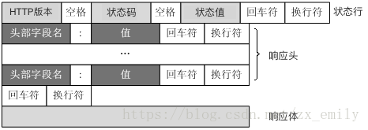

# SYS201 - Computer Networks - HTTP协议

返回[Bulletin](./bulletin.md)

返回[SYS301 - Distributed Systems](./SYS301.md)

[TOC]

## 基本概念

超文本传输协议（HTTP，HyperText Transfer Protocol）是一个基于TCP/IP通信协议，从WEB服务器传输超文本标记语言(HTML)到本地浏览器的传送协议。传输的数据类型为HTML文件、图片文件、查询结果等。设计HTTP最初的目的是为了提供一种发布和接收HTML页面的方法。

HTTP有多个版本，目前广泛使用的是HTTP/1.1版本。

HTTP传输具有以下特征：

- **支持客户端/服务端模式**

- **简单快速**：报文的主要组成就是 header + body，头部信息也是简单的文本格式。客户向服务器请求服务时，只需传送请求方法和路径。请求方法常用的有 GET、HEAD、POST，每种方法规定了客户与服务器联系的类型不同。由于 HTTP 协议简单，使得 HTTP 服务器的程序规模小，因而通信速度很快。

- **灵活**：HTTP 允许传输任意类型的数据对象。正在传输的类型由 Content-Type 加以标记。

- **无连接**：无连接的含义是限制每次连接只处理一个请求。服务器处理完客户的请求，并收到客户的应答后，即断开连接。采用这种方式可以节省传输时间。

- **无状态**：HTTP 协议是无状态协议。**无状态协议**(Stateless Protocol) 就是指浏览器对于事务的处理没有记忆能力。举个例子来说就是比如客户请求获得网页之后关闭浏览器，然后再次启动浏览器，登录该网站，但是服务器并不知道客户关闭了一次浏览器。缺少状态意味着如果后续处理需要前面的信息，则它必须重传，这样可能导致每次连接传送的数据量增大。另一方面，在服务器不需要先前信息时它的应答就较快。

## HTTP请求

### 格式


```
GET http://www.example.com/ HTTP/1.1
Accept: text/html,application/xhtml+xml,application/xml;q=0.9,image/webp,image/apng,*/*;q=0.8,application/signed-exchange;v=b3;q=0.9
Accept-Encoding: gzip, deflate
Accept-Language: zh-CN,zh;q=0.9,en;q=0.8
Cache-Control: max-age=0
Host: www.example.com
If-Modified-Since: Thu, 17 Oct 2019 07:18:26 GMT
If-None-Match: "3147526947+gzip"
Proxy-Connection: keep-alive
Upgrade-Insecure-Requests: 1
User-Agent: Mozilla/5.0 xxx

param1=1&param2=2
```

### 方法

| 方法    | 说明                   | 支持的HTTP协议版本 |
| ------- | ---------------------- | ------------------ |
| GET     | 获取资源               | 1.0, 1.1           |
| POST    | 传输实体主体           | 1.0, 1.1           |
| PUT     | 传输文件               | 1.0, 1.1           |
| HEAD    | 获得报文首部           | 1.0, 1.1           |
| DELETE  | 删除文件               | 1.0, 1.1           |
| OPTIONS | 询问支持的方法         | 1.1                |
| TRACE   | 追踪路径               | 1.1                |
| CONNECT | 要求用隧道协议连接代理 | 1.1                |
| LINK    | 建立和资源之间的联系   | 1.0                |
| UNLINE  | 断开连接关系           | 1.0                |

#### GET VS POST

|                      | GET                                                          | POST                                                         |
| -------------------- | ------------------------------------------------------------ | ------------------------------------------------------------ |
| **可见性**           | 数据在URL中对所有人都是可见的。  以“?”把URL和传输数据分割，用“&”连接多个参数。 | 数据不会显示在URL中。                                        |
| **对数据长度的限制** | URL长度有限所以数据有限（URL的最大长度是 2048 个字符）。     | 无限制。                                                     |
| **安全性**           | 安全性较差。  所发送的数据是URL可见的一部分，所以在发送密码或其他敏感信息时绝不要使用GET! | 更安全。  参数不会被保存在浏览器历史或 web 服务器日志中。    |
| 数据传输过程         | GET请求在发送过程中会产生一个TCP数据包。  对于GET方式的请求，浏览器会把http header和data一并发送出去，服务器响应 200（返回数据）。 | POST在发送过程中会产生两个TCP数据包。  对于POST，浏览器先发送http header, 服务器响应100 continue, 浏览器再发送data, 服务器响应200 ok（返回数据）。 |
| 对数据类型的限制     | 只允许 ASCII 字符。                                          | 没有限制。也允许二进制数据。                                 |
| 编码类型             | application/x-www-form-urlencoded                            | application/x-www-form-urlencoded  或 multipart/form-data。  因为有二进制数据所以使用多重编码。 |
| 后退按钮/刷新        | 无害                                                         | 数据会被重新提交（浏览器应该告知用户数据会被重新提交）。     |
| 历史                 | 参数保留在浏览器历史中。                                     | 参数不会保存在浏览器历史中。                                 |
| 书签                 | 可收藏为书签                                                 | 不可收藏为书签                                               |
| 缓存                 | 能被浏览器主动缓存                                           | 可通过手动设置被浏览器缓存                                   |

### URI

**URI**的全称是（Uniform Resource Identifier），中文名称是统一资源标识符。URI 是用来标示 一个具体的资源的，我们可以通过 URI 知道一个资源是什么。

URI包含了URL和URN.

#### URL

URL(Uniform Resource Locator)统一资源定位符，也就是我们俗称的网址，它实际上是 URI 的一个子集。URL 则是用来定位具体的资源的，标示了一个具体的资源位置。互联网上的每个文件都有一个唯一的URL。

```
protocol://host:port/resourceName
```

#### URN

URN(Uniform Resource Name)统一资源名称，它只是用来定义一个资源的名称，并不具备定位该资源的能力。例如：

```
urn:isbn:0451450523
```

用来定义一个书籍名称，但是却没有表示怎么找到这本书。

### 头部key

**User-Agent**

统计使用的浏览器、操作系统等

**Content-Type**

告知数据的媒体类(MediaType/MIME Type)

**Origin**

描述请求来源地址

**Accept**

建议服务端返回何种媒体类型(MediaType/MIME Type)，是HTTP协议协商能力的体现，默认*/*代表所有类型

**Referer**

上一张页面的URL

**Connection**

决定HTTP连接是否在当前事务完成后关闭

## HTTP响应

### 格式



```xml
HTTP/1.1 200 OK
Age: 529651
Cache-Control: max-age=604800
Connection: keep-alive
Content-Encoding: gzip
Content-Length: 648
Content-Type: text/html; charset=UTF-8
Date: Mon, 02 Nov 2020 17:53:39 GMT
Etag: "3147526947+ident+gzip"
Expires: Mon, 09 Nov 2020 17:53:39 GMT
Keep-Alive: timeout=4
Last-Modified: Thu, 17 Oct 2019 07:18:26 GMT
Proxy-Connection: keep-alive
Server: ECS (sjc/16DF)
Vary: Accept-Encoding
X-Cache: HIT

<!doctype html>
<html>
    <head>
        <title>Example Domain</title>
        <!-- -->
    </body>
</html>
```

### 状态码

- 1xx Informational（信息性状态码）接收的请求正在处理
- 2xx Success（成功状态码）请求正常处理完毕
  - 200 （成功） 服务器已成功处理了请求。通常，这表示服务器提供了请求的网页。
  - 204 （无内容） 服务器成功处理了请求，但没有返回任何内容。
  - 206 （部分内容） 服务器成功处理了部分 GET 请求。
- 3xx Redirection（重定向状态码）需要进行附加操作以完成需求
  - 301 （永久移动） 请求的网页已永久移动到新位置。服务器返回此响应（对 GET 或 HEAD 请求的响应）时，会自动将请求者转到新位置。
  - 302 （临时移动） 服务器目前从不同位置的网页响应请求，但请求者应继续使用原有位置来进行以后的请求。301 对搜索引擎优化（SEO）更加有利；302 有被提示为网络拦截的风险。
  - 303 （查看其他位置） 请求者应当对不同的位置使用单独的 GET 请求来检索响应时，服务器返回此代码。
  - 304 （未修改） 自从上次请求后，请求的网页未修改过。服务器返回此响应时，不会返回网页内容。
  - 307 （临时重定向） 服务器目前从不同位置的网页响应请求，但请求者应继续使用原有位置来进行以后的请求。
- 4xx Client Error（客户端错误状态码）服务器无法处理请求
  - 400 （错误请求） 服务器不理解请求的语法。
  - 401 （未授权） 请求要求身份验证。 对于需要登录的网页，服务器可能返回此响应。
  - 403 （禁止） 服务器拒绝请求。
  - 404 （未找到） 服务器找不到请求的网页。
- 5xx Server Error（服务器错误状态码）服务器处理请求出错
  - 500 （服务器内部错误） 服务器遇到错误，无法完成请求。
  - 503 （服务不可用） 服务器目前无法使用（由于超载或停机维护）。通常，这只是暂时状态。

