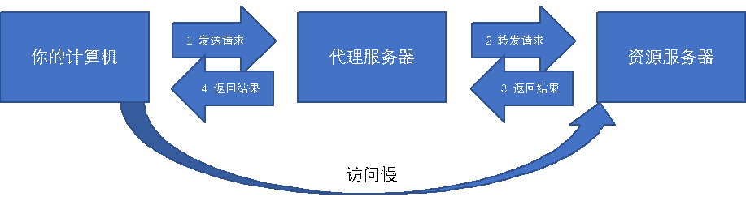

# SYS201 - Computer Networks - Nginx

返回[Bulletin](./bulletin.md)

返回[SYS301 - Distributed Systems](./SYS301.md)

[TOC]

### Web Server

Web服务器一般指的是网站服务器，上面说到浏览器是 HTTP 请求的发起方，那么 Web 服务器就是 HTTP 请求的应答方，Web 服务器可以向浏览器等 Web 客户端提供文档，也可以放置网站文件，让全世界浏览；可以放置数据文件，让全世界下载。

目前最主流的三个Web服务器是Apache, Nginx, IIS.

## 代理服务器

代理服务器接受一个请求，然后把请求转发给另一个服务器，接收到来自这个服务器的结果后再返回给请求方。

### 正向代理

把要请求的网址（资源）发送给代理服务器，由代理服务器向目标发送请求后获取资源再返回给请求方。

### 反向代理

当请求方向一个网址发送一个请求的时候，请求方意识不到，请求的其实是一个反向代理服务器，这个代理服务器将请求代理给了内部的网络。

## Nignx

Nginx是一个轻量级/高性能的反向代理Web服务器，他实现非常高效的反向代理、负载平衡，他可以处理2-3万并发连接数，官方监测能支持5万并发，现在中国使用nginx网站用户有很多，例如：新浪、网易、 腾讯等。

### 优点

- 跨平台、配置简单

- 内存消耗小：开启10个nginx才占150M内存，Nginx采取了分阶段资源分配技术

- 非阻塞、高并发连接：处理2-3万并发连接数，官方监测能支持5万并发

- 内置的健康检查功能：如果有一个服务器宕机，会做一个健康检查，再发送的请求就不会发送到宕机的服务器了。重新将请求提交到其他的节点上。

- 节省宽带：支持GZIP压缩，可以添加浏览器本地缓存

- 稳定性高：宕机的概率非常小

- master/worker结构：一个master进程，生成一个或者多个worker进程

- 接收用户请求是异步的：浏览器将请求发送到nginx服务器，它先将用户请求全部接收下来，再一次性发送给后端web服务器，极大减轻了web服务器的压力。一边接收web服务器的返回数据，一边发送给浏览器客户端。

- 网络依赖性比较低，只要ping通就可以负载均衡

- 可以有多台nginx服务器

- 事件驱动：通信机制采用epoll模型，提供了一个队列，从而提高性能。

### 处理请求的过程

首先Nginx在启动时会解析配置文件，得到需要监听的端口与ip地址，然后在nginx的master进程里面先初始化好这个监控的socket，再进行listen.

然后再fork出多个子进程出来，子进程会竞争accept新的连接。此时，客户端就可以向nginx发起连接了。

当客户端与nginx进行三次握手，与nginx建立好一个连接后。此时，某一个子进程会accept成功，然后创建nginx对连接的封装，即ngx_connection_t结构体。

接着，根据事件调用相应的事件处理模块，如http模块与客户端进行数据的交换。

最后，nginx或客户端来主动关掉连接，到此，一个连接就寿终正寝了

### Apache VS Nginx

Apache创建多个进程或线程，而每个进程或线程都会为其分配cpu和内存（线程要比进程小的多，所以worker支持比perfork高的并发），并发过大会榨干服务器资源。

Nginx采用单线程来异步非阻塞处理请求（管理员可以配置Nginx主进程的工作进程的数量）(epoll)，不会为每个请求分配cpu和内存资源，节省了大量资源，同时也减少了大量的CPU的上下文切换。所以才使得Nginx支持更高的并发。
