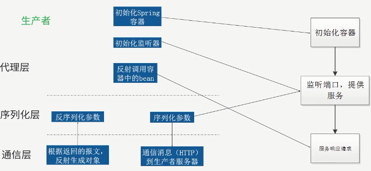
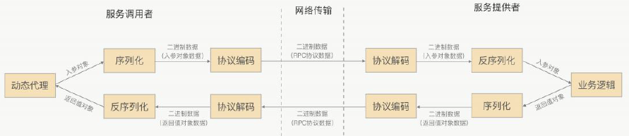

# SYS301 - Distributed Systems - 应用架构演进

返回[Bulletin](./bulletin.md)

返回[SYS301 - Distributed Systems](./SYS301.md)

[TOC]


随着互联网的发展，网站应用的规模不断扩大，常规的垂直应用架构已无法应对，分布式服务架构以及流动计算架构势在必行，亟需一个治理系统确保架构有条不紊的演进。

## 单一应用架构

当网站流量很小时，只需一个应用，将所有功能都部署在一起，以减少部署节点和成本。

### ORM

此时，用于简化增删改查工作量的 数据访问框架(ORM) 是关键。

ORM(Object Relation Mapping)对象关系映射框架，即通过类与数据库表的映射关系，将对象持久化到数据库中。

操作实体类就相当于操作数据库表，可以不再重点关注 SQL 语句。

- 关系型数据库的每一行映射为每一个对象。

- 关系型数据库的每一列映射为对象的每一个属性。

常用的有: Hibernate(Nhibernate)，iBATIS，mybatis，EclipseLink，JFinal等。

| **id** | **Name** |
| ------ | -------- |
| **1**  | 韩美美   |
| **2**  | 李磊     |

```java
public class User {
    private long id;
    private String name;
    public long getId() {
        return id;
    }
    public String getName() {
        return name;
    }
}
```

## 垂直应用架构

当访问量逐渐增大，单一应用增加机器带来的加速度越来越小，将应用拆成互不相干的几个应用，以提升效率。

### MVC

此时，用于加速前端页面开发的 Web框架(MVC) 是关键。详见：[MVC模式](./CSE2723.md)

## 分布式服务架构

当垂直应用越来越多，应用之间交互不可避免，将核心业务抽取出来，作为独立的服务，逐渐形成稳定的服务中心，使前端应用能更快速的响应多变的市场需求。

分布式系统是由一组通过网络进行通信、为了完成共同的任务而协调工作的计算机节点组成的系统。分布式系统的出现是为了用廉价的、普通的机器完成单个计算机无法完成的计算、存储任务。其目的是利用更多的机器，处理更多的数据。

### 两个要素

- 整个系统的功能分布在不同的计算机上。

- 每一个节点之间通过远程通信进行数据交换。

### 组成示例

- 负载均衡
- 应用
- 缓存(Redis)
- 数据库(主&备, 双活, MySQL, MongoDB, …)
- 消息总线

### CAP理论

在理论计算机科学中，CAP理论（CAP theorem），又被称作布鲁尔定理（Brewer's theorem），它指出了一个分布式计算系统不可能同时满足的CAP三点。


#### C 一致性（Consistence）

所有节点上的数据时刻保持同步。

#### A 可用性（Availability）

每次请求都能获取到响应，无论响应成功还是失败。

#### P 分区容错性（Partition tolerance）

分布式系统在遇到某节点或网络分区故障的时候，仍然能够对外提供满足一致性和可用性的服务。

#### C+A

舍弃分布式系统，成为一个高性能的单机系统。

#### C+P

一旦发生网络故障或者消息丢失等情况，就要牺牲用户的体验，等待所有数据全部一致之后再让用户访问系统。

例如Redis, HBase, ZooKeeper等。

#### A+P

一旦发生网络问题，节点之间可能会失去联系。为了保证高可用，在用户访问时可以马上得到返回，每个节点只能用本地数据提供服务，而这样会导致全局数据的不一致性。

#### C+A+P

当一个分布式系统内部网络出现了问题后，这个分布式系统还能保证系统可用以及数据一致。目前为止，因为网络的条件限制，CAP是不能同时满足的。

### BASE理论

BASE是Basically Available（基本可用）、Soft-state（软状态）和Eventually Consistent（最终一致性）三个短语的缩写。

BASE理论的核心思想： 即使无法做到强一致性，但每个应用都可以根据自身业务特点，采用适当的方式来使系统达到最终一致性。也就是牺牲数据的一致性来满足系统的高可用性，系统中一部分数据不可用或者不一致时，仍需要保持系统整体“主要可用”。


#### 基本可用（Basically Available）

基本可用是指分布式系统在出现故障的时候，允许损失部分可用性，即保证核⼼心可用。电商大促时，为了应对访问量量激增，部分用户可能会被引导到降级页面，服务层也可能只提供降级服务。这就是损失部分可⽤用性的体现。

#### 软状态（Soft State）

软状态是指允许系统存在中间状态，而该中间状态不会影响系统整体可用性。分布式存储中⼀般⼀份数据至少会有三个副本，允许不不同节点间副本同步的延时就是软状态的体现。mysql replication的异步复制也是一种体现。

#### 最终⼀致性（Eventual Consistency）

最终⼀致性是指系统中的所有数据副本经过一定时间后，最终能够达到一致的状态的一种特殊情况。

### 集群

就是用多个服务器来处理同一个功能或存储数据（这个有点像分布式(数据备份)），来提高对多用户请求的处理，防止一个服务器处理不过来。一般会通过反向代理(分发请求)来实现集群的功能。

⼀个集群需要对外部提供强⼀致性，所以只要集群内部某⼀台服务器器的数据发生了改变，那么就需要等待集群内其他服务器的数据同步完成后才能正常的对外提供服务。所以保证强⼀致性，通常需要损耗可用性。

### 负载均衡

负载均衡即是代理服务器将接收的请求均衡的分发到各服务器中，主要解决网络拥塞问题，提高服务器响应速度，服务就近提供，达到更好的访问质量，减少后台服务器大并发压力。

负载均衡，英文名称为Load Balance，指由多台服务器以对称的方式组成一个服务器集合，每台服务器都具有等价的地位，都可以单独对外提供服务而无须其他服务器的辅助。

通过某种负载分担技术，将外部发送来的请求均匀分配到对称结构中的某一台服务器上，而接收到请求的服务器独立地回应客户的请求。

负载均衡能够平均分配客户请求到服务器阵列，借此提供快速获取重要数据，解决**大量并发访问服务**问题，这种集群技术可以用最少的投资获得接近于大型主机的性能。

负载均衡分为**软件负载均衡**和**硬件负载均衡**，前者的代表是阿里章文嵩博士研发的LVS，后者则是均衡服务器比如F5。

### 负载均衡算法

模拟IP列表，用于配合以下六种负载均衡算法

```java
public class IpMap {
    // 待路由的Ip列表，Key代表Ip，Value代表该Ip的权重
    public static HashMap serverWeightMap = new HashMap();
    static {
        serverWeightMap.put("192.168.1.100", 1);
        serverWeightMap.put("192.168.1.101", 1);
        // 权重为4
        serverWeightMap.put("192.168.1.102", 4);
        serverWeightMap.put("192.168.1.103", 1);
        serverWeightMap.put("192.168.1.104", 1);
        // 权重为3
        serverWeightMap.put("192.168.1.105", 3);
        serverWeightMap.put("192.168.1.106", 1);
        // 权重为2
        serverWeightMap.put("192.168.1.107", 2);
        serverWeightMap.put("192.168.1.108", 1);
        serverWeightMap.put("192.168.1.109", 1);
        serverWeightMap.put("192.168.1.110", 1);
    }
}
```

#### 轮询法Round Robin

```java
public class RoundRobin {
    private static Integer pos = 0;
    public static String getServer() {
        // 重建一个Map，避免服务器的上下线导致的并发问题
        Map<String, Integer> serverMap = new HashMap<String, Integer>();
        serverMap.putAll(IpMap.serverWeightMap);
        // 取得Ip地址List
        Set<String> keySet = serverMap.keySet();
        ArrayList<String> keyList = new ArrayList<String>();
        keyList.addAll(keySet);
        String server = null;
        synchronized (pos) {
            if (pos > keySet.size()) {
                pos = 0;
            }
            server = keyList.get(pos);
            pos ++;
        }
        return server;
    }
}
```

##### 优点

试图做到请求转移的绝对均衡。

##### 缺点

为了做到请求转移的绝对均衡，必须付出相当大的代价，因为为了保证pos变量修改的互斥性，需要引入重量级的悲观锁synchronized，这将会导致该段轮询代码的并发吞吐量发生明显的下降。

#### 随机法Random

```java
public class Random {
    public static String getServer() {
        // 重建一个Map，避免服务器的上下线导致的并发问题
        Map<String, Integer> serverMap = new HashMap<String, Integer>();
        serverMap.putAll(IpMap.serverWeightMap);
        // 取得Ip地址List
        Set<String> keySet = serverMap.keySet();
        ArrayList<String> keyList = new ArrayList<String>();
        keyList.addAll(keySet);
        java.util.Random random = new java.util.Random();
        int randomPos = random.nextInt(keyList.size());
        return keyList.get(randomPos);
    }
}
```

基于概率统计的理论，吞吐量越大，随机算法的效果越接近于轮询算法的效果。

#### 源地址哈希法Hash

源地址哈希的思想是获取客户端访问的IP地址值，通过哈希函数计算得到一个数值，用该数值对服务器列表的大小进行取模运算，得到的结果便是要访问的服务器的序号。

```java
public class Hash {
    public static String getServer() {
        // 重建一个Map，避免服务器的上下线导致的并发问题
        Map<String, Integer> serverMap = new HashMap<String, Integer>();
        serverMap.putAll(IpMap.serverWeightMap);
        // 取得Ip地址List
        Set<String> keySet = serverMap.keySet();
        ArrayList<String> keyList = new ArrayList<String>();
        keyList.addAll(keySet);
        // 在Web应用中可通过HttpServlet的getRemoteIp方法获取
        String remoteIp = "127.0.0.1";
        int hashCode = remoteIp.hashCode();
        int serverListSize = keyList.size();
        int serverPos = hashCode % serverListSize;
        return keyList.get(serverPos);
    }
}
```

##### 优点

保证了相同客户端IP地址将会被哈希到同一台后端服务器，直到后端服务器列表变更。根据此特性可以在服务消费者与服务提供者之间建立有状态的session会话。

##### 缺点

除非集群中服务器非常稳定，基本不会上下线。否则一旦有服务器上线、下线，那么通过源地址哈希算法路由到的服务器是服务器上线、下线前路由到的服务器的概率非常低。如果是session则取不到session，如果是缓存则可能引发"雪崩"。

#### 加权轮询法Weight Round Robin

不同的服务器可能机器配置和当前系统的负载并不相同，因此它们的抗压能力也不尽相同。

给配置高、负载低的机器配置更高的权重，让其处理更多的请求，而低配置、高负载的机器，则给其分配较低的权重，降低其系统负载。

加权轮询法可以很好地处理这一问题，并将请求顺序按照权重分配到后端。

```java
public class WeightRoundRobin {
    private static Integer pos;
    public static String getServer() {
        // 重建一个Map，避免服务器的上下线导致的并发问题
        Map<String, Integer> serverMap = new HashMap<String, Integer>();
        serverMap.putAll(IpMap.serverWeightMap);
        // 取得Ip地址List
        Set<String> keySet = serverMap.keySet();
        Iterator<String> iterator = keySet.iterator();
        List<String> serverList = new ArrayList<String>();
        while (iterator.hasNext()) {
            String server = iterator.next();
            int weight = serverMap.get(server);
            for (int i = 0; i < weight; i++) {
                serverList.add(server);
            }
            String server = null;
            synchronized (pos) {
                if (pos > keySet.size()) {
                    pos = 0;
                }
                server = serverList.get(pos);
                pos ++;
            }
            return server; 
        }
    }
}
```

与轮询法类似，只是在获取服务器地址之前增加了一段权重计算的代码。根据权重的大小，将地址重复地增加到服务器地址列表中，权重越大，该服务器每轮所获得的请求数量越多。

#### 加权随机法Weight Random

与加权轮询法类似，加权随机法也是根据后端服务器不同的配置和负载情况来配置不同的权重。

不同的是，它是按照权重来随机选择服务器的，而不是顺序。

```java
public class WeightRandom {
    public static String getServer() {
        // 重建一个Map，避免服务器的上下线导致的并发问题
        Map<String, Integer> serverMap = new HashMap<String, Integer>();
        serverMap.putAll(IpMap.serverWeightMap);
        // 取得Ip地址List
        Set<String> keySet = serverMap.keySet();
        Iterator<String> iterator = keySet.iterator();
        List<String> serverList = new ArrayList<String>();
        while (iterator.hasNext()) {
        String server = iterator.next();
        int weight = serverMap.get(server);
        for (int i = 0; i < weight; i++) {
            serverList.add(server);
        }
        java.util.Random random = new java.util.Random();
        int randomPos = random.nextInt(serverList.size());
        return serverList.get(randomPos);
    }
}
```

#### 最小连接数法Least Connections

这种方法以后端服务器的视角来观察系统的负载，而非请求发起方来观察。

最小连接数算法比较灵活和智能，由于后端服务器的配置不尽相同，对于请求的处理有快有慢，它正是根据后端服务器当前的连接情况，动态地选取其中当前积压连接数最少的一台服务器来处理当前请求，尽可能地提高后端服务器的利用效率，将负载合理地分流到每一台机器。

### RPC

此时，用于提高业务复用及整合的 分布式服务框架(RPC) 是关键。

RPC是远程调用过程（Remote Procedure Call）的简写，是一个协议，处于网络通信协议的第五层：会话层，其下就是TCP/IP协议，在建立在其基础上的通信会话协议。RPC定义了交互的模式，它允许程序调用另一个地址空间（通常是共享网络的另一台机器上）的过程或函数，而不用程序员显式编码这个远程调用的细节。即无论是调用本地接口/服务的还是远程接口/服务，本质上编写的调用代码基本相同。

- RPC会**隐藏**底层的通讯细节（不需要直接处理Socket通讯或Http通讯）

- RPC是一个**请求-响应**模型。客户端发起请求，服务器返回响应（类似于Http的工作方式）

- RPC在使用形式上像调用**本地**函数（或方法）一样去调用**远程**的函数（或方法）。

#### 五个组件


一个基本的RPC架构里面应该至少包含以下5个组件：

- **客户端Client** 服务调用方、消费者。
- **客户端存根Client Stub** 存放服务端地址信息，将客户端的请求参数数据信息通过约定的协议规范进行编码打包成网络消息，再通过网络传输发送给服务端。
- **Network Service** 底层传输，可以是TCP或HTTP. 
- **服务端存根 Server Skeleton** 接受客户端发送过来的请求消息并进行解包，然后再调用本地服务进行处理。
- **服务端** Server 服务的真正提供者。 

#### 消费者


1. **代理层**： 消费者将对应的接口，通过RPC框架的代理来生成一个对象到Spring容器中。代理层将代理接口生成该接口的对象，该对象处理调用时传过来的对象、方法、参数，通过序列化层封装好，调用网络层。
2. **序列化层**： 将请求的参数序列化成报文；将返回的报文反序列化成对象；
3. **网络层**： 将报文与服务端通信；接收返回结果。

#### 生产者



1. **代理层**： 一个应用提供服务，必须由一个网络监听的模块，这个模块大多有开源的容器来处理网络上的监听；服务需要注册，只有注册了的服务才可以被调用；注册的服务需要被我们发射调用到，来进行相应的处理。
2. **序列化层**： 就是相应的做请求的反序列化和结果的序列化。
3. **网络层**： 接收客户端报文；将序列化的结果返回给客户端。

#### 通信流程



#### 使用到的相关技术

**动态代理**

生成 client stub和server stub需要用到 Java 动态代理技术，我们可以使用JDK原生的动态代理机制，也可以使用一些开源字节码工具框架 如：CGLib、Javassist等。

Stub（存根）负责将方法名、参数等信息打包编码成用于网络传输的消息体，或者将网络接收到的消息体按照格式进行拆包解码获得方法名和参数。

**序列化**

为了能在网络上传输和接收 Java对象，我们需要对它进行 序列化和反序列化操作。

- 序列化：将Java对象转换成byte[]的过程，也就是编码的过程；

- 反序列化：将byte[]转换成Java对象的过程；

 可以使用Java原生的序列化机制，但是效率非常低，推荐使用一些开源的、成熟的序列化技术，例如：protobuf、Thrift、hessian、Kryo、Msgpack

**NIO**

当前很多RPC框架都直接基于netty这一IO通信框架，比如阿里巴巴的HSF、dubbo，Hadoop Avro，推荐使用Netty 作为底层通信框架。

### Dubbo

Dubbo是一个分布式RPC服务框架，致力于提供**高性能**和**透明化**的远程服务调用方案，这容易和负载均衡弄混，负载均衡是对外提供一个公共地址，请求过来时通过轮询、随机等，路由到不同server.


#### 节点角色

- Provider: 暴露服务的服务提供方。
- Consumer: 调用远程服务的服务消费方。
- Registry: 服务注册与发现的注册中心，一般依赖于Zookeeper。
- Monitor: 统计服务的调用次调和调用时间的监控中心。
- Container: 服务运行容器。

#### 负载均衡策略

##### Random

随机，按权重设置随机概率。

在一个截面上碰撞的概率高，但调用量越大分布越均匀，而且按概率使用权重后也比较均匀，有利于动态调整提供者权重。

##### RoundRobin

轮循，按公约后的权重设置轮循比率。

存在慢的提供者累积请求的问题，比如：第二台机器很慢，但没挂，当请求调到第二台时就卡在那，久而久之，所有请求都卡在调到第二台上。

##### LeastActive

最少活跃调用数，相同活跃数的随机，活跃数指调用前后计数差。

使慢的提供者收到更少请求，因为越慢的提供者的调用前后计数差会越大。

##### ConsistentHash

一致性 Hash，相同参数的请求总是发到同一提供者。

当某一台提供者挂时，原本发往该提供者的请求，基于虚拟节点，平摊到其它提供者，不会引起剧烈变动。

缺省只对第一个参数 Hash，如果要修改，请配置 

```xml
<dubbo:parameter key="hash.arguments" value="0,1" />
```

缺省用 160 份虚拟节点，如果要修改，请配置 

```xml
<dubbo:parameter key="hash.nodes" value="320" />
```

#### 容错策略

- Failover - 失败自动切换，当出现失败，重试其它服务器。通常用于读操作，但重试会带来更长延迟。可通过 retries="2" 来设置重试次数(不含第一次)。
- Failfast - 快速失败，只发起一次调用，失败立即报错。通常用于非幂等性的写操作，比如新增记录。
- Failsafe - 失败安全，出现异常时，直接忽略。通常用于写入审计日志等操作。
- Failback - 失败自动恢复，后台记录失败请求，定时重发。通常用于消息通知操作。
- Forking - 并行调用多个服务器，只要一个成功即返回。通常用于实时性要求较高的读操作，但需要浪费更多服务资源。可通过 forks="2" 来设置最大并行数。
- Broadcast - 播调用所有提供者，逐个调用，任意一台报错则报错。通常用于通知所有提供者更新缓存或日志等本地资源信息。

## 流动计算架构

当服务越来越多，容量的评估，小服务资源的浪费等问题逐渐显现，此时需增加一个调度中心基于访问压力实时管理集群容量，提高集群利用率。

### 面向服务的架构SOA(Service-Oriented Architecture) 

此时，用于提高机器利用率的 资源调度和治理中心(SOA) 是关键。SOA是一种思想，一种方法论，一种分布式的服务架构。

用途：SOA解决多服务凌乱问题，SOA架构解决数据服务的复杂程度，同时SOA又有一个名字，叫做**服务治理**。

各个系统分别根据统一标准向数据总线ESB(EnterpriseService Bus)进行注册，各子系统调用其他子系统时，我们并不关心如果找到其他子系统，我们只招数据总线，数据总线再根据统一标准找其他子系统，所以数据总线在这里充当一个只路人的作用。

#### 优点

- 降低用户成本，用户不需要关心各服务之间是什么语言的、不需要知道如果调用他们，只要通过统一标准找数据总线就可以了。

- 程序之间关系服务简单

- 识别哪些程序有问题（挂掉）

#### 缺点

提示了系统的复杂程度，性能有相应影响。


#### SOAP

SOAP是简单对象访问协议的缩写。SOAP webService有严格的规范和标准，包括安全，事务等各个方面的内容，主要核心是面向活动。同时SOAP强调操作方法和操作对象的分离，有WSDL文件规范和XSD文件分别对其定义。使用门槛较高。

### 微服务架构模式(Microservices Architecture Pattern)

微服务架构（Microservice Architecture）本身就是分布式架构，旨在通过将功能分解到各个离散的服务中，以实现对解决方案的解耦，提供更加灵活的服务支持。

微服务提供的接口方式更加通用化，例如HTTP RESTful方式，各种终端都可以调用，无关语言和平台限制。


#### 架构扩展


**X轴：** 运行多个负载均衡器之后的运行实例

**Y轴：** 将应用进一步分解为微服务（分库）

**Z轴：** 大数据量时，将服务分区（分表）

#### 关键问题

- API Gateway
- 服务间调用
- 服务发现
- 服务容错
- 服务部署
- 数据调用


#### 常见架构设计模式

##### 聚合器微服务设计模式

聚合器调用多个服务实现应用程序所需的功能。


##### 代理微服务设计模式

客户端并不聚合数据，但会根据业务需求的差别调用不同的微服务。代理可以仅仅委派请求，也可以进行数据转换工作。


##### 链式微服务设计模式

所有服务都使用同步消息传递。

在整个链式调用完成之前，客户端会一直阻塞。因此服务调用链不宜过长，以免客户端长时间等待。


##### 分支微服务设计模式

允许同时调用两个微服务链。


##### 数据共享微服务设计模式

部分强耦合的微服务可能会共享缓存和数据库存储。


##### 异步消息传递微服务设计模式

使用非阻塞的消息队列，代替非阻塞的REST接口。


#### 优点

\-   每个服务足够内聚，足够小，代码容易理解、开发效率提高；

\-   服务之间可以独立部署，让持续部署成为可能；

\-   每个服务可以各自进行x扩展和z扩展；

\-   每个服务可以根据自己的需要部署到合适的硬件服务器上；

\-   容易扩大开发团队，可以针对每个服务(service)组件开发团队；

\-   提高容错性(fault isolation)，一个服务的内存泄漏并不会让整个系统瘫痪;

\-   系统不会被长期限制在某个技术栈上。

#### 缺点

\-   开发人员要处理分布式系统的复杂性；

\-   开发人员要设计服务之间的通信机制，对于需要多个后端服务的user case，要在没有分布式事务的情况下实现代码非常困难；

\-   涉及多个服务直接的自动化测试也具备相当的挑战性；

\-   服务管理的复杂性，在生产环境中要管理多个不同的服务的实例，这意味着开发团队需要全局统筹(PS：现在docker的出现适合解决这个问题)

#### RESTful

REST其实不是一种协议，REST是一种架构风格，其核心是面向资源。它对http协议的根本对了诠释。专门针对网络应用设计和开发方式，以降低开发的复杂性，提高系统的可伸缩性。

REST提出设计概念和准则为：

**网络上的所有事物都可以被抽象为资源(resource)**

REST简化开发，其架构遵循CRUD原则，该原则告诉我们对于资源(包括网络资源)只需要四种行为：创建，获取，更新和删除就可以完成相关的操作和处理。

**每一个资源都有唯一的资源标识(resource identifier)，对资源的操作不会改变这些标识**

我们可以通过统一资源标识符（Universal Resource Identifier，URI）来识别和定位资源，并且针对这些资源而执行的操作是通过 HTTP 规范定义的。其核心操作只有GET,PUT,POST,DELETE。

**所有的操作都是无状态的（stateless)**

由于REST强制所有的操作都必须是stateless的，这就没有上下文的约束，如果做分布式，集群都不需要考虑上下文和会话保持的问题。极大的提高系统的可伸缩性。

#### WebService

WebService 是一种 Web 应用程序，是一种跨编程语言和跨操作系统平台的远程调用技术。

Web Service 由 W3C 定义的应用服务开发规范，使用 client-server 主从架构，通常使用 WSDL 定义服务接口，它使用 HTTP 协议传输 XML 或 SOAP 消息，既可以运行在内网，也可以在适当保护后运行在外网。

## 服务隔离

### 种类隔离

#### 服务提供方

服务提供方和它的数据库单独部署在一个服务器上，与其他服务进行物理隔离，这样技术出了故障也不会影响到其他服务。

#### 服务调用方

可以采用一种线程池隔离方式，给每个微服务都初始化出一个线程池。不使用Tomcat线程池中的线程直接调用，而是用相应线程池中的线程去调用。当被调用服务发生故障，其线程池会迅速塞满，于是调用这个服务时就会直接返回。

如果不进行隔离，一旦调用的服务出现故障，卡住的线程数上升，会影响到自身服务的可用性。

### 用户隔离

用户：一个环境/系统的一个使用者。

租户：将用户按照某种粒度和特征分组，每个组成为一个租户（tenant）。

所谓的用户隔离就是按照不同的分组形成不同的服务实例。这样某个服务实例挂了，只影响对应分组的用户，而不是全部用户。

- 方式一：每个租户有独立的服务和独立的数据库
- 方式二：每个租户有共享的服务和独立的数据库
- 方式三：每个租户有共享的服务和共享的数据库

## 会话管理

一个用户的Session信息如果存储在一个服务器上，那么当负载均衡器把用户的下一个请求转发到另一个服务器时，由于服务器没有用户的Session信息，那么该用户就需要重新进行登录等操作。

### Sticky Session

需要配置负载均衡器，使得一个用户的所有请求都路由到同一个服务器，这样就可以把用户的 Session 存放在该服务器中。

#### 缺点

当服务器宕机时，将丢失该服务器上的所有 Session。


### Session Replication

在服务器之间进行 Session 同步操作，每个服务器都有所有用户的 Session 信息，因此用户可以向任何一个服务器进行请求。

#### 缺点

占用过多内存；

同步过程占用网络带宽以及服务器处理器时间。


### Session Server

使用一个单独的服务器存储Session数据，可以使用传统的MySQL，也使用Redis或者Memcached这种内存型数据库。

#### 优点

为了使得大型网站具有伸缩性，集群中的应用服务器通常需要保持无状态，那么应用服务器不能存储用户的会话信息。Session Server 将用户的会话信息单独进行存储，从而保证了应用服务器的无状态。

#### 缺点

需要去实现存取 Session 的代码。


## 存储的发展历史

- NAS: 以太网
- SAN: 光纤交换机 磁盘规模大 带宽大

两者缺点明显：单独硬件 成本大 不方便做冗余

- 分布式存储
  - 块存储
  - 对象存储（也是储存文件）
  - 文件储存

## 云计算

### IaaS: Infrastructure-as-a-Service(基础设施即服务)

有了IaaS，你可以将硬件外包到别的地方去。IaaS公司会提供场外服务器，存储和网络硬件，你可以租用。节省了维护成本和办公场地，公司可以在任何时候利用这些硬件来运行其应用。

一些大的IaaS公司包括Amazon, Microsoft, VMWare, Rackspace和Red Hat等。

### PaaS: Platform-as-a-Service(平台即服务)

第二层就是所谓的PaaS，某些时候也叫做中间件。你公司所有的开发都可以在这一层进行，节省了时间和资源。PaaS公司在网上提供各种开发和分发应用的解决方案，比如虚拟服务器和操作系统。这节省了你在硬件上的费用，也让分散的工作室之间的合作变得更加容易。网页应用管理，应用设计，应用虚拟主机，存储，安全以及应用开发协作工具等。

一些大的PaaS提供者有Google App Engine, Microsoft Azure, Force.com, Heroku，Engine Yard。最近兴起的公司有AppFog,Mendix和Standing Cloud等。

### SaaS: Software-as-a-Service(软件即服务)

第三层也就是所谓SaaS。这一层是和你的生活每天接触的一层，大多是通过网页浏览器来接入。任何一个远程服务器上的应用都可以通过网络来运行，就是SaaS了。

你消费的服务完全是从网页如Netflix, MOG, Google Apps, Box.net, Dropbox或者苹果的iCloud那里进入这些分类。尽管这些网页服务是用作商务和娱乐或者两者都有，但这也算是云技术的一部分。


