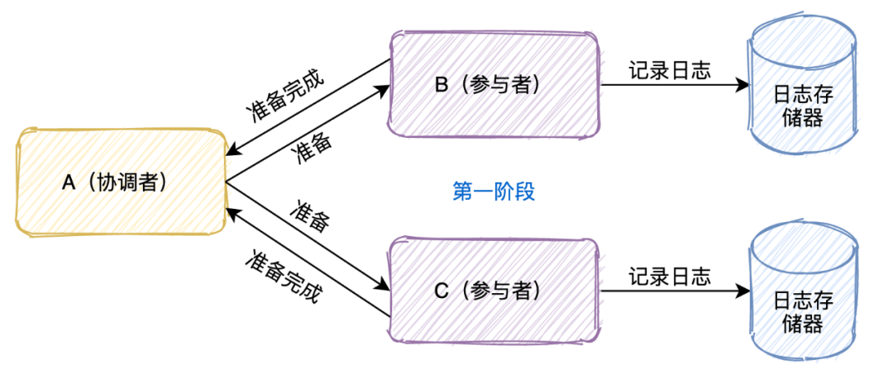
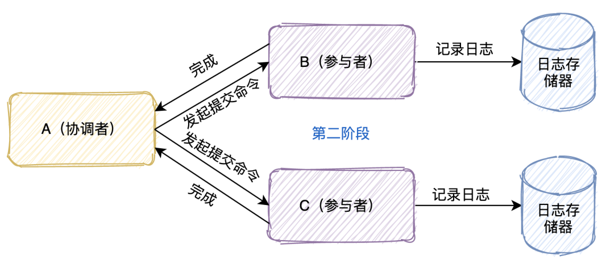
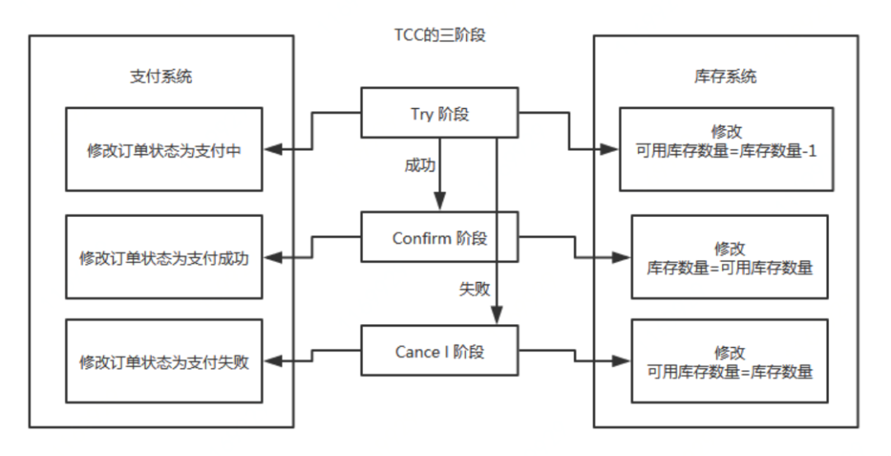
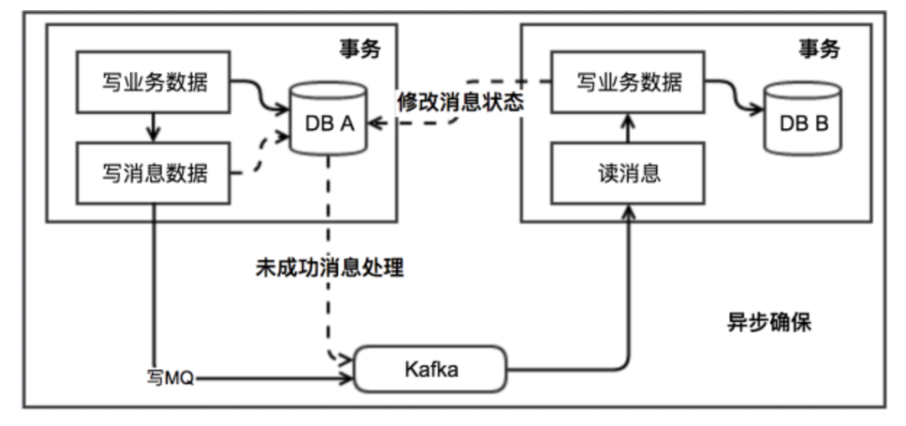
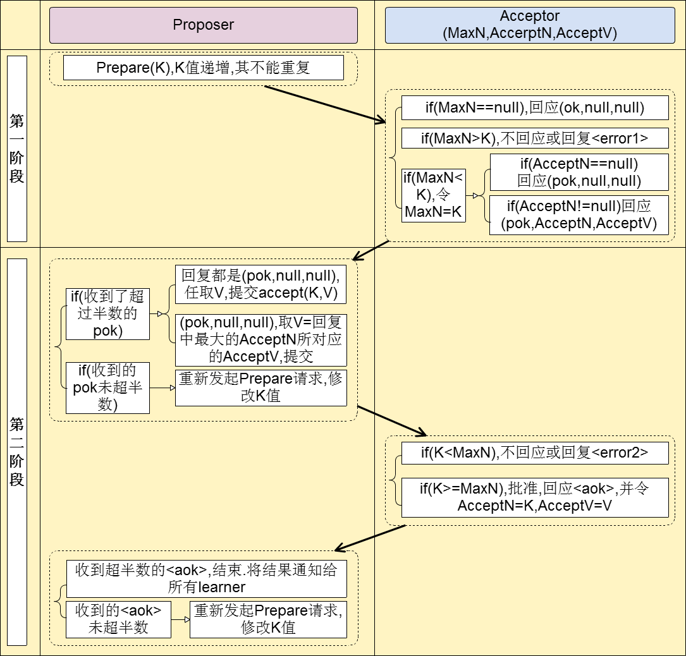
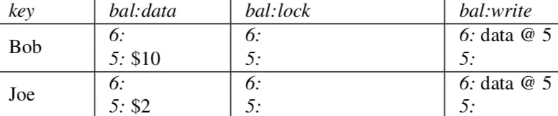

# SYS3012 — Distributed Transactions & Consensus

返回[Bulletin](./bulletin.md)

返回[SYS301 — Distributed Systems](./SYS301.md)

[TOC]

## 1. Why Distributed Transactions Exist

分布式事务是指服务器位于分布式系统不同节点之上的事务，用于保证分布式系统不同节点之间的数据一致性。其实就是将对单个库的事务的概念扩大到了对多个库的事务。

分布式事务处理的关键是必须有一种方法可以知道事务在任何地方所做的所有动作，提交或回滚事务的决定必须产生统一的结果（全部提交或全部回滚）。

### 从本地事务说起

单库场景下，一个事务就是：

```
BEGIN
→ DB Operations
→ COMMIT
```

数据库（如 MySQL / InnoDB）靠 undo log、redo log 和锁，把 ACID 封装在这几行之间。

### 本地事务为什么不够了

业务一旦拆成：

```
Service A / DB A
      +
Service B / DB B
      +
MQ / RPC
```

任何一个普通本地 ACID 事务都无法覆盖全部资源：A 库提交成功、B 库提交失败时，没有一个天然的“整体回滚”。本章所有方案——2PC、TCC、Saga、本地消息表、Outbox、事务消息——本质上都是在**用不同代价把多个本地事务的结果统一起来**。

（一致性模型本身的分类：线性 / 顺序 / 弱 / 最终，见 SYS3011 第 4 节。）

## 2. XA / 2PC（P0）

### XA规范

分布式事务的实现有很多种，最具有代表性的是由Oracle Tuxedo系统提出的XA分布式事务协议。在XA协议中包含着两个角色：事务协调者和事务参与者。

XA协议包含两阶段提交(2PC)和三阶段提交(3PC)两种实现（3PC 已降级到 Appendix）。

### 两阶段提交（2PC）

#### 为什么需要2PC

在分布式的情况下，1PC没有办法一次性地使得分布式系统中牵涉的不同实例之间达到原子的状态。而2PC(两阶段提交)保证原子性的方式是参与者将操作成败通知协调者，再由协调者根据所有参与者的反馈情报决定各参与者是否要提交操作还是中止操作。

#### Phase 1：投票阶段（Prepare / Vote）

协调者首先将命令写入日志，然后给参与者发prepare命令。

参与者收到prepare命令后，根据自己的实际情况判断是否可以提交，将结果记录到日志系统，然后将结果返回给协调者。



#### Phase 2：决定阶段（Commit / Abort）

当协调者收到所有参与者的确认消息后，判断所有协调者是否都可以提交。

- 如果可以，写入日志，发起commit命令。

- 如果有任意一个不可以，写入日志，发起abort命令。

参与者收到协调者发起的命令后执行，将执行命令及结果写入日志，返回结果给协调者。



#### 存在的问题

##### 性能问题

整个消息链路是串行的，要等待响应结果，响应时间长，不适合高并发的场景。

##### 单点故障

事务协调者是整个XA模型的核心，协调者挂掉可以重新选举，但是无法解决因此处于阻塞状态的参与者的问题。

##### 丢失消息导致数据不一致

在XA协议的第二个阶段，如果发生局部网络问题，一部分事务参与者收到了提交消息，另一部分事务参与者没收到提交消息，那么就导致了节点之间数据的不一致。

##### 事务状态不确定

协调者在发出commit消息之后宕机，而唯一接收到这条消息的参与者同时也宕机了。那么即使协调者通过选举协议产生了新的协调者，这条事务的状态也是不确定的，没人知道事务是否被已经提交。

##### 工程视角补充

- **blocking 阻塞**：Prepare 之后、最终指令到达之前，参与者必须持有资源等待，期间既不能提交也不能回滚。

- **resource locking 资源锁定**：锁的持有时间横跨两次网络往返，并发能力被锁死——这是 XA 在高并发场景少用的根本原因。

- **network partition**：分区期间参与者互相失联，正是“丢失消息导致数据不一致”的根源（Failure Model 见 SYS3011 第 2 节）。

## 3. TCC（Try-Confirm-Cancel）

定位纠错：TCC **不是“2PC 的一种实现”**（原文表述已修正），而是**业务层的显式事务模型**——2PC / XA 在资源层（数据库）协调，TCC 把“提交 / 回滚”直接写成业务代码，由业务自己决定预留什么、确认什么、补偿什么。

TCC事务是Try、Confirm、Cancel三种指令的缩写，核心思想是“针对每个操作，都要注册一个与其对应的确认和补偿（撤销）操作”，设计上讲究的是让业务做更多、业务可以做决策。不同的业务场景所写的代码都不一样，并且很大程度的增加了业务代码的复杂度，因此，这种模式并不能很好地被复用。

#### Try阶段

主要是对「业务系统做检测及资源预留」：检查额度、冻结库存、预扣款——而不是真正完成业务。

#### Confirm阶段

主要是对「业务系统做确认提交」，Try阶段执行成功并开始执行Confirm阶段时，默认Confirm阶段是不会出错的。即：只要Try成功，Confirm一定成功。

#### Cancel阶段

主要是在业务执行错误，需要回滚的状态下执行的业务取消，「预留资源释放」。



#### 对比2PC

##### 解决了协调者单点

引入多点的业务活动管理器，由主业务方发起并完成这个业务活动。

##### 同步阻塞

引入超时机制，超时后进行补偿，并且不会锁定整个资源。

##### 数据一致性

引入补偿机制，由业务活动管理器控制一致性。

#### 工程上必须处理的坑

- **Idempotency 幂等**：Confirm / Cancel 都可能被重试多次，必须幂等。

- **Empty Rollback 空回滚**：Try 没有到达（超时 / 丢失），Cancel 却先被触发——Cancel 必须能识别“从未 Try 过”并直接返回成功。

- **Hanging 悬挂**：Cancel 已经执行完，迟到的 Try 才到达——Try 必须能识别“已经 Cancel 过”并拒绝预留，否则资源被白白占住。

- **Retry 重试**：Confirm / Cancel 失败要可靠重试，通常靠本地消息表 / 任务表驱动。

- **Compensation Failure 补偿失败**：Cancel 本身失败到重试上限后，需要对账 + 人工介入兜底。

## 4. Saga

适合**长流程、跨多个服务、且不能长时间锁资源**的场景（典型的如旅行预订：机票 + 酒店 + 租车）。Saga 不锁资源，把一个大事务拆成一串本地事务：

```
正向执行：T1 → T2 → T3
失败补偿：C3 → C2 → C1
```

每个 Ti 是一个独立的本地事务；某一步失败时，反向执行已完成步骤的补偿 Ci。

- 补偿操作必须幂等、必须可重试；

- 有的步骤可以没有补偿（比如“发送通知”），没有补偿的步骤失败后无法撤销，需要业务明确接受这个后果。

### Choreography（协同式）

没有中央协调者。每个服务完成本地事务后发布事件，下一个服务监听事件继续执行。去中心化、耦合低，但链路长了以后“现在走到哪一步”不直观，排障难。

### Orchestration（编排式）

一个 orchestrator（通常是状态机）显式驱动每一步并决定补偿路径。流程集中、可观测，但协调器自身要做到高可用。

> 注：做过 Workflow / State Machine 类项目对理解长流程补偿非常有帮助；但在简历 / 面试里声称某项目“使用了 Saga”，必须以真实项目资料为准，不要凭感觉归类。

## 5. Local Message Table（本地消息表）

消息生产方建一个消息表记录消息发送状态。消息表和业务数据要在一个事务里提交，然后消息会经过MQ发送到消息的消费方，如果发送失败会进行重试。

消息消费方接收这个消息并完成自己的业务逻辑。

如果是业务的失败，可以给生产方发送一个业务补偿消息，通知生产方进行回滚等操作。

此时如果本地事务处理成功，表明已经处理成功了；如果处理失败，那么就会重试执行。

生产方和消费方定时扫描本地消息表，把还没处理完成的消息或者失败的消息再发送一遍。



核心是**解决 DB Commit 与 MQ Publish 的 Dual Write（双写）问题**：

```
Business Table + Message Table
        │  同一个本地事务提交（要么都在、要么都不在）
        ▼
Background Worker ──scan──> 未发送消息 ──retry──> Publish MQ
                                                        │
Consumer ◄──────────────────────────────────────────────┘
        幂等消费：消息至少会到达一次，可能到达多次
```

## 6. Transactional Outbox

与本地消息表同一思想的通用命名（两个名字常混用）。要点：

- 业务表 + **Outbox 表**在**同一个 local transaction** 中写入；

- 之后由 **Publisher 轮询 Outbox**，或由 **CDC（Change Data Capture）** 监听数据库变更日志，把事件发布到 MQ。

**Outbox ≠ Exactly Once**。它保证的是“业务提交了，事件最终一定发得出去”（at-least-once）；Consumer 仍可能收到重复消息，仍然要处理 Duplicate / Idempotency。

## 7. Transactional Message（事务消息）

消息事务的原理是将两个事务通过消息中间件进行异步解耦实现系统的最终一致性。和本地消息表有点类似，但是是通过消息中间件的机制去做的，其本质就是将本地消息表封装到了消息中间件中。

这个方式避免了像XA协议那样的性能问题。该机制最著名的实现是 **Apache RocketMQ 的事务消息（半消息 Half Message）**；其他消息中间件大多不提供原生的半消息机制，需要用本地消息表或 Outbox 补齐。（原文“目前市面上实现该方案的只有阿里的 RocketMQ”的绝对化说法已修正。）

#### 执行流程

发送prepare消息到消息中间件，成功后执行本地事务。

- 如果事务执行成功，则commit，消息中间件将消息下发至消费端。

- 如果事务执行失败，则回滚，消息中间件将这条prepare消息删除。

消费端接收到消息进行消费，如果消费失败，则不断重试。

## 8. Best-Effort Notification（最大努力通知）

最大努力通知的方案实现比较简单，适用于一些最终一致性要求较低的业务。

#### 执行流程

系统A本地事务执行完之后，发送消息到MQ；

这里会有个专门消费 MQ 的服务，这个服务会消费MQ并调用系统B的接口；

要是系统B执行成功就ok了；要是系统B执行失败了，那么最大努力通知服务就定时尝试重新调用系统B, 反复N次，最后还是不行就放弃。

典型连接场景：**Payment Notification 支付结果通知、Callback 回调、Retry 重试、Reconciliation 对账**——发起方尽力重试，接收方提供查询接口兜底。

## 9. Paxos

Paxos算法是一种基于消息传递且具有高度容错特性的一致性算法。Paxos 算法解决的问题是一个分布式系统如何就某个值（决议）达成一致。

一个典型的场景是，在一个分布式数据库系统中，如果各节点的初始状态一致，每个节点执行相同的操作序列，那么他们最后能得到一个一致的状态。为保证每个节点执行相同的命令序列，需要在每一条指令上执行一个“一致性算法”以保证每个节点看到的指令一致。（原文此处提到“zookeeper使用的ZAB算法是该算法的一个实现”——ZAB 与 Paxos 是两种不同的协议，ZAB 也不是 Paxos 的简单实现，详见 SYS3013。）

### 三种角色

- **Proposer** 只要Proposer发的提案被半数以上Acceptor接受，Proposer就认为该提案里的value被选定了。
- **Acceptor** 只要Acceptor接受了某个提案，Acceptor就认为该提案里的value被选定了。
- **Learner** Acceptor 告诉Learner哪个value被选定，Learner就认为那个value被选定。

### 两个阶段

- 阶段一 准leader确定
  - Proposer选择一个提案编号N，然后向半数以上的Acceptor发送编号为N的Prepare请求。
  - 如果一个Acceptor收到一个编号为N的Prepare请求，且N大于该Acceptor已经响应过的所有Prepare请求的编号，那么它就会将它已经接受过的编号最大的提案（如果有的话）作为响应反馈给Proposer，同时该Acceptor承诺不再接受任何编号小于N的提案。

- 阶段二 leader确认
  - 如果Proposer收到半数以上Acceptor对其发出的编号为N的Prepare请求的响应，那么它就会发送一个针对[N,V]提案的Accept请求给半数以上的Acceptor。注意：V就是收到的响应中编号最大的提案的value，如果响应中不包含任何提案，那么V就由Proposer自己决定。
  - 如果Acceptor收到一个针对编号为N的提案的Accept请求，只要该Acceptor没有对编号大于N的Prepare请求做出过响应，它就接受该提案。



### 约束条件

#### 正确性

指只有一个提议值会生效。

因为 Paxos 协议要求每个生效的提议被多数 Acceptor 接收，并且 Acceptor 不会接受两个不同的提议，因此可以保证正确性。

#### 可终止性

指最后总会有一个提议生效。

Paxos 协议能够让 Proposer 发送的提议朝着能被大多数 Acceptor 接受的那个提议靠拢，因此能够保证可终止性。

（数学证明不在本课程展开；Senior Java 面试讲清 Problem / Proposal / Proposer / Acceptor / Learner / Majority 即可。）

## 10. Raft

Raft算法是一种简单易懂的共识算法。它依靠状态机和主从同步的方式，在各个节点之间实现数据的一致性。

### 角色

有三种节点：

- Leader 主节点

- Follower 从节点

- Candidate 参与投票竞争的节点

### Term（任期）

Raft 的时间是逻辑时钟，被切成一个个单调递增的 Term：

- 每个 Term 至多一个 Leader；

- Candidate 拉票、Leader 发心跳都携带自己的 Term；节点看到更大的 Term 会立刻更新自己，过期 Term 的消息一律拒绝。

### Leader Election（竞选主节点）

Leader会周期性的发送心跳包给Follower. 每个Follower都设置了一个随机的竞选超时时间，一般为150ms~300ms，如果在这个时间内没有收到Leader的心跳包，就会变成Candidate，进入竞选阶段。

Candidate会发送投票请求给其他所有节点，如果收到超过一半节点的回复，Candidate就会晋升为Leader然后周期性地发送心跳包给Follower. Follower收到心跳包重新开始计时。

如果有多个Candidate票数打平，就需要重新开始投票。由于每个节点设置的随机竞选超时时间不同，因此下一次再次出现多个Candidate并获得同样票数的概率很低。

### Log Replication（数据同步）

来自客户端的修改都会被传入Leader写入日志，然后Leader会把修改复制到所有Follower, 等待半数以上Follower反馈成功写入日志以后，先自己提交修改，再通知所有Follower提交修改。

- 每条日志携带 (term, index)，用于一致性检查与冲突覆盖；

- **Commit Index**：Leader 维护的“已被多数派持久化的最大日志位置”。日志只有 commit 之后才会应用到状态机、才对客户端可见；

- Follower 落后时由 Leader 通过 AppendEntries 补齐。

### 两个必须分清的概念

- **Consensus ≠ Distributed Transaction**：共识解决“多个节点对同一个值达成一致”（谁是 Leader、某条日志有没有提交），不解决“跨服务的业务要么全做要么全不做”。

- **Replication ≠ Distributed Transaction**：把数据复制到多数派只保证不丢、不脑裂，不保证业务一致性。跨服务一致性仍然要靠 2PC / TCC / Saga / Outbox。

## Appendix

### 3PC（三阶段提交）

2PC中只有协调者可以超时，参与者没有超时机制。3PC增加了CanCommit阶段，引入了参与者超时机制，一旦迟迟没有接到协调者的commit请求，会自动进行本地commit。这样有效解决了协调者**单点故障**和**事务状态不确定**的问题，但是不能从根本上解决**性能问题**和**数据不一致**问题。

（理解到位即可：为什么从 2PC 演进——增加了什么阶段、参与者超时解决了什么；仍有什么限制——网络分区下 PreCommit 后各自超时仍可能不一致。）

#### CanCommit阶段

协调者询问事务参与者，你是否有能力完成此次事务。

- 如果都返回yes，则进入第二阶段。

- 有一个返回no或等待响应超时，则中断事务，并向所有参与者发送abort请求。

#### PreCommit阶段

协调者向所有的参与者发送PreCommit请求。

参与者收到后开始执行事务操作，并将Undo和Redo信息记录到事务日志中。执行完事务操作后反馈“Ack”并等待下一步指令。

#### DoCommit阶段

如果所有的参与者节点都可以进行PreCommit提交，那么协调者就会从“预提交状态”转变为“提交状态”，然后向所有的参与者节点发送"doCommit"请求。

参与者节点在收到提交请求后就会各自执行事务提交操作，并向协调者节点反馈“Ack”消息。

协调者收到所有参与者的Ack消息后完成事务。

相反，如果有一个参与者节点未完成PreCommit的反馈或者反馈超时，那么协调者都会向所有的参与者节点发送abort请求，从而中断事务。

### Percolator

Percolator是一个2PC的事务模型，主要通过lock保证事务的原子性，通过MVCC保证隔离性。通过对事务涉及的数据扩展两个列来实现lock和MVCC。通过下面Percolator paper中的数据模型图可以有一个直观的印象：



其中data列是数据列；lock列为事务状态列；write列为commit标志列，其value有一个指向data列的时间戳来表达对应提交的版本。

Percolator是没有传统上的TransactionManager来管理事务的，将原本2PC中TransactionManager管理的集中化的事务状态信息分散在每一行的数据中（每个事务的primary row里），对于未决的情况通过lock的信息就能找到 primary row，进而就能确定这个事务的状态。

#### 准备阶段

Client先进入prepare阶段，先选出任意一个write作为primary执行prewrite动作，就是在data列写入数据，且在lock列写入状态信息。如果没有版本和状态冲突，则prewrite成功。

如果primary成功了则开始对secondaries(其他的)进行prewrite(可并行)，如果都prewrite成功了，则进入commit阶段，否则任何一个失败则回滚。这里需要注意的是secondary row的lock的value记录了primary row的信息，也就是说通过其lock能找到primary来进行状态决议。

#### 提交阶段

先对primary进行commit, 即去掉lock, 在write列写入一条记录，如果成功了则异步对secondaries进行commit, 如果primary commit失败了则回滚。

### Paxos 的进一步材料

正文“两个阶段”的规则即 Basic Paxos 的核心。Multi-Paxos、正确性 / 可终止性的数学证明、以及 Paxos 与 Raft 的工程化关系，不在本课程展开。
