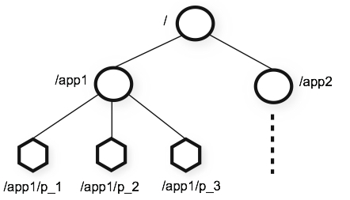
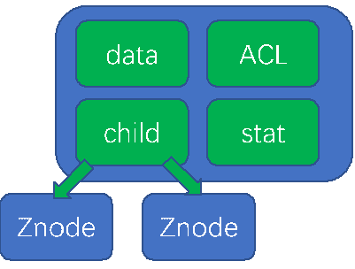
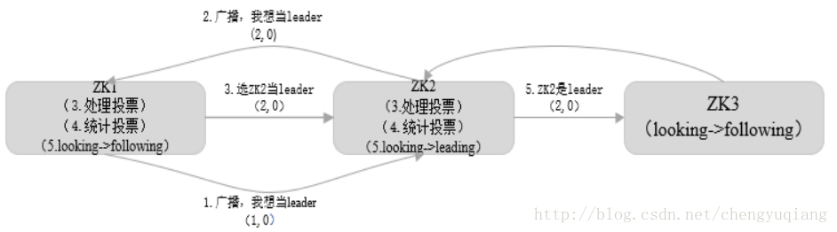
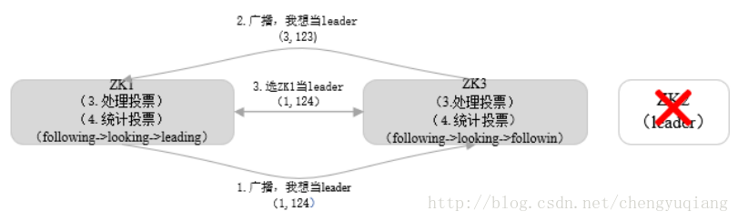
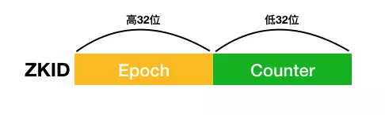
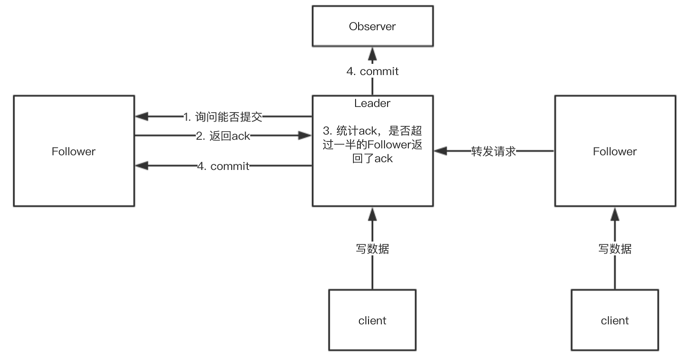
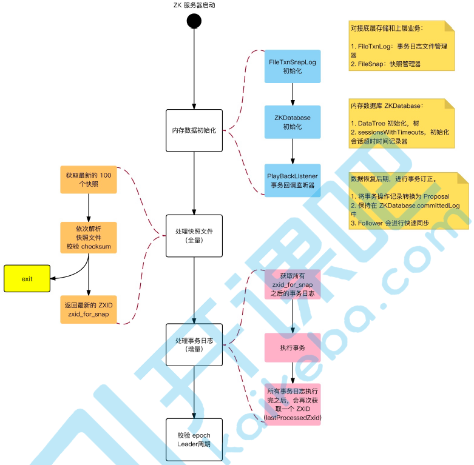

# SYS301 - Distributed Systems - ZooKeeper

返回[Bulletin](./bulletin.md)

返回[SYS301 - Distributed Systems](./SYS301.md)

[TOC]

## 基本概念

分布式协调服务ZooKeeper是⼀个解决了数据⼀致性问题的分布式数据库。

### 文件系统

Zookeeper提供一个多层级的节点命名空间。

#### Znode

ZooKeeper的节点被称为Znode，为了保证高吞吐和低延迟，每个节点的存放数据上限为1M。

Znode可以设置的数据如下：

| **节点属性**   | **注解**                                                     |
| -------------- | ------------------------------------------------------------ |
| cZxid          | 该数据节点被创建时的事务Id                                   |
| mZxid          | 该数据节点被修改时最新的事物Id                               |
| pZxid          | 当前节点的父级节点事务Id                                     |
| ctime          | 该数据节点创建时间                                           |
| mtime          | 该数据节点最后修改时间                                       |
| dataVersion    | 当前节点版本号（每修改一次值+1递增）                         |
| cversion       | 子节点版本号（子节点修改次数，每修改一次值+1递增）           |
| aclVersion     | 当前节点acl版本号（节点被修改acl权限，每修改一次值+1递增）   |
| ephemeralOwner | 临时节点标示，当前节点如果是临时节点，则存储的创建者的会话id（sessionId），如果不是，那么值=0 |
| dataLength     | 当前节点所存储的数据长度                                     |
| numChildren    | 当前节点下子节点的个数                                       |

#### 常用的API 

- create创建节点

- delete删除节点

- exists判断节点是否存在

- getData获得一个节点的数据

- setData设置一个节点的数据

- getChildren获取节点下的所有子节点

- sync 等待数据被传播

#### Znode的类型

##### PERSISTENT 持久化目录节点

客户端与zookeeper断开连接后，该节点依旧存在。

##### PERSISTENT_SEQUENTIAL 持久化顺序编号目录节点

客户端与zookeeper断开连接后，该节点依旧存在，只是Zookeeper给该节点名称进行顺序编号

##### EPHEMERAL 临时目录节点

客户端与zookeeper断开连接后，该节点被删除

##### EPHEMERAL_SEQUENTIAL 临时顺序编号目录节点

客户端与zookeeper断开连接后，该节点被删除，只是Zookeeper给该节点名称进行顺序编号

### 通知机制

客户端可以对某个Znode建立一个**Watcher**监听器事件。当Znode发生改变，也就是调用了create，delete，setData方法的时候，将会触发Znode上注册的对应事件，请求Watch的客户端会接收到异步通知。

常见的监听场景有以下两项：

- 监听Znode节点的数据变化

- 监听子节点的增减变化

服务端在生成WatchedEvent事件之后，会调用getWrapper方法将自己包装成一个可序列化的Watch**er**Event事件，以便通过网络传输到客户端。客户端在接收到服务端的这个事件对象后，首先会将Watch**er**Event还原成一个Watch**ed**Event事件，并传递给process(Watch**ed**Event event)方法处理，回调方法process根据三个入参：通知状态（Enum keeperState）、事件类型（Enum EventType）和节点路径（String path）就能够解析出完整的服务端事件了。

无论是WatchedEvent还是WatcherEvent，都是对ZooKeeper服务端事件的简单封装。不同的是，WatchedEvent是一个逻辑事件，用于服务端和客户端程序执行过程中所需的逻辑对象，而WatcherEvent因为实现了序列化接口，可以用于网络传输。

### 使用场景

#### 命名服务

（文件系统）

命名服务是指通过指定的名字来获取资源或者服务的地址，利用zk创建一个全局的路径，即是唯一的路径，这个路径就可以作为一个名字，指向集群中的集群，提供的服务的地址，或者一个远程的对象等等。

#### 配置管理

（文件系统、通知机制）

程序分布式的部署在不同的机器上，将程序的配置信息放在zk的znode下，当有配置发生改变时，也就是znode发生变化时，可以通过改变zk中某个目录节点的内容，利用watcher通知给各个客户端，从而更改配置。

#### 集群管理

（文件系统、通知机制）

所谓集群管理无在乎两点：

- 是否有机器退出和加入

- 选举master

对于第一点，所有机器约定在父目录下创建临时目录节点，然后监听父目录节点的子节点变化消息。一旦有机器加入/挂掉，该机器与 zookeeper的连接建立/断开，其所创建的临时目录节点被添加/删除，所有其他机器都收到通知。

对于第二点，我们稍微改变一下，所有机器创建临时顺序编号目录节点，每次选取编号最小的机器作为master就好。

#### 队列管理

（通知机制）

两种类型的队列：

- 同步队列，当一个队列的成员都聚齐时，这个队列才可用，否则一直等待所有成员到达。

- 队列按照 FIFO 方式进行入队和出队操作。

第一类，在约定目录下创建临时目录节点，监听节点数目是否是我们要求的数目。

第二类，和分布式锁服务中的控制时序场景基本原理一致，入列有编号，出列按编号。在特定的目录下创建持久化顺序节点，创建成功时Watcher通知等待的队列，队列删除序列号最小的节点用以消费。此场景下Zookeeper的znode用于消息存储，znode存储的数据就是消息队列中的消息内容，SEQUENTIAL序列号就是消息的编号，按序取出即可。由于创建的节点是持久化的，所以不必担心队列消息的丢失问题。

## ZAB协议

ZAB协议（ZooKeeper Atomic Broadcast protocol）是ZooKeeper专门设计的支持崩溃恢复的原子广播协议。这个机制保证了各个Server之间的同步以及各个节点之间的数据一致性。

### ZAB VS Paxos

ZAB协议非常类似于一致性算法Paxos和Raft. 很多人会误以为ZAB协议是Paxos的一种特殊实现，事实上他们是两种不同的协议。

- ZAB主要是为分布式主备系统设计的，提交事务并不像2PC一样需要全部follower都ACK，只需要得到超过半数的节点的ACK就可以通过。

- Paxos的实现是一致性状态机(state machine replication)。

### 恢复模式

当服务启动或者在领导者崩溃后，ZAB就进入了恢复模式，当领导者被选举出来，且大多数Server完成了和 leader的状态同步以后，恢复模式就结束了。

#### 节点的选举状态

- LOOKING：寻找Leader状态，处于该状态需要进入选举流程
- LEADING：领导者状态，处于该状态的节点说明是角色已经是**leader**
- FOLLOWING：跟随者状态，表示Leader已经选举出来，当前节点角色是**follower**
- OBSERVER：观察者状态，表明当前节点角色是**observer**

#### Leader election 选举阶段

触发条件1：在集群初始化阶段，当有一台服务器Server1启动时，该Server1处于Looking状态，其单独无法进行和完成Leader选举；当第二台服务器Server2启动时，此时两台机器可以相互通信，每台机器都试图找到Leader，于是进入Leader选举过程。

触发条件2：在Zookeeper运行期间，Leader与Follower服务器各司其职，即便有Follower服务器宕机或新Follower加入，此时也不会影响Leader，但是一旦发生以下情况之一就会再度引发选举：

- Leader服务器挂了；

- Leader发现follower挂得只剩不过半的follower存活并跟随自己。

 

每个服务器发出一个投票。初始情况Server1和Server2都会将自己作为Leader服务器来进行投票，每次投票会包含所推举的服务器的myid和ZXID，使用(myid, ZXID)来表示。

- myid: 集群中服务器的唯一标识。例如：有三个zk 服务器，那么编号分别是1,2,3。

- ZXID: 是一个64位的数字，由Leader统一分配，全局唯一，不断递增，所以数字越大代表操作越新、越接近现在。因为递增，ZXID可以保证事务的顺序一致性。ZXID由两部分组成：
  - 高32位的纪元号(epoch) 在当前leader当选的时候生成，递增。也被称为逻辑时钟(Logicalclock)。
  - 低32位表示计数器(counter) 在当前ZK节点执行事务性请求的时候生成，递增。

此时Server1的投票为(1, 0)，Server2的投票为(2, 0)，然后各自将这个投票发给集群中其他机器。

每个服务器接收来自各个服务器的投票。首先判断该投票的有效性，如检查是否是本轮投票、是否来自LOOKING状态的服务器。

每个服务器处理投票。针对每一个投票，服务器都需要将别人的投票和自己的投票进行PK，PK规则如下：

- ZXID比较大（数据比较新），服务器优先作为Leader服务器。

- ZXID一致，myid较大的服务器优先作为Leader服务器。

对于Server1而言，它的投票是(1, 0)，接收Server2的投票为(2, 0)，首先会比较两者的ZXID，均为0，再比较myid，此时Server2的myid最大，于是更新自己的投票为(2, 0)，然后重新投票，对于Server2而言无须更新自己的投票，只是再次向集群中所有机器发出上一次投票信息即可。

每次投票后服务器都会统计投票信息，判断是否已经有过半机器接受到相同的投票信息，对于Server1、Server2而言，都统计出集群中已经有两台机器接受了(2, 0)的投票信息，此时便认为server2是Leader.

一旦确定了Leader，每个服务器就会更新自己的状态，如果是Follower就变更为FOLLOWING, 如果是Leader就变更为LEADING.

#### Discovery 发现阶段

Follower跟准Leader进行通信，如果认错准Leader，连接会被拒绝，ZooKeeper会进入重新选举阶段。连接建立后，Follower将最大的zxid发送给准Leader.

#### Synchronization 同步阶段

准Leader根据Follower的zxid确定同步点，同步集群中所有的副本。Follower只会接收zxid比自己的lastZxid大的提议。全部完成后，准Leader才会成为正式Leader, 成为uptodate状态。

Follower收到uptodate消息后，可以开始接受client的请求进行服务。

#### ZooKeeper集群为何选择奇数台机器？

Zookeeper集群一大特性是只要**大于一半**的节点存活，集群就可以正常提供服务：

- 2台服务器，至少2台正常运行才行（2的半数为1，半数以上最少为2），所以1台服务器都不允许挂掉。

- 3台服务器，至少2台正常运行才行（3的半数为1.5，半数以上最少为2），可以允许1台服务器挂掉。

- 4台服务器，至少3台正常运行才行（4的半数为2，半数以上最少为3），可以允许1台服务器挂掉。

- 5台服务器，至少3台正常运行才行（5的半数为2.5，半数以上最少为3），可以允许2台服务器挂掉。

- 6台服务器，至少3台正常运行才行（6的半数为3，半数以上最少为4），可以允许2台服务器挂掉。

通过以上可以发现，3台服务器和4台服务器都最多允许1台服务器挂掉，5台服务器和6台服务器都最多允许2台服务器挂掉。但是明显4台服务器成本高于3台服务器成本，6台服务器成本高于5服务器成本。这是由于半数以上投票通过决定的。

鉴于2n+1台和2n+2台机器的容灾能力相同，都是允许n台机器宕机。本着节约的宗旨，一般选择部署2n+1台机器，可以解决容错问题。

#### 脑裂

脑裂出现的原因是一部分服务器和领导失去了连接，而这一部分服务器之间是可以相互连通的，所以这一部分服务器会重新选举，如果重新选举出来了一个Leader，那么整个集群就出现了两个Leader，这就是脑裂。脑裂后数据的修复合并非常困难。

过半机制的验证可以避免脑裂发生。Zookeeper中的领导者选举需要收到超过一半的服务器的选票，所以服务器的节点数量是不足以达成脑裂的。

### 广播模式

广播模式进行状态同步保证了leader和Server具有相同的系统状态。

ZAB协议既不是强一致性，也不是弱一致性，而是处于两者之间的**单调一致性**。它依靠事务ID和版本号，保证了数据的更新和读取是有序的。

0. leader从客户端或者从Follower收到一个转发自客户端的写请求，生成一个新的事务并为这个事务生成一个唯一的ZXID.

1. leader将这个事务发送给所有的follows节点（预提交）

2. follower节点将收到的事务请求加入到**历史队列**(history queue)中，写下事务日志，然后发送ack给leader

3. Leader统计收到的ack是否过半。当leader收到过半follower返回的ack消息后，会写下事务日志，然后向Follower和Obeserver发送commit请求。

4. 当follower收到commit请求时，会判断该事务的ZXID是不是比历史队列中的任何事务的ZXID都小，如果是则提交，如果不是则等待比它更小的事务的commit.

#### 事务日志和快照

每个ZooKeeper服务器执行事务性操作时，都会记录事务日志。

当事务日志记录的次数达到一定数量后(默认10W次)，就会将内存数据库序列化一次，使其持久化保存到磁盘上，序列化后的文件称为"快照文件"。每次拍快照都会生成新的事务日志。

快照写入是异步的。

快照生成时新提交的事务有可能会写入快照，快照的界限不是某一个时间段，是模糊的。

## ZooKeeper启动流程

## Zookeeper实战

### 安装部署

解压Zookeeper压缩包，将./conf/zoo_sample.cfg复制为./conf/zoo.cfg, 修改dataDir为指定的存放ZK数据的地址。

端口配置可以修改，对应的作用如下：

2181：对clinet端提供服务

3888：选举leader使用

2888：集群内机器通讯使用（Leader监听此端口）

### 启动

使用./bin/zkServer.sh {start/stop/status} zoo.cfg控制ZK.

可以使用jps验证QuorumPeerMain是否正在运行，可以代表ZK是否正在正常运行。

### zkCli.sh客户端使用

./zkCli.sh -timeout 5000 -server {主机名}:2181 启动客户端，然后输入h显示所有命令。

