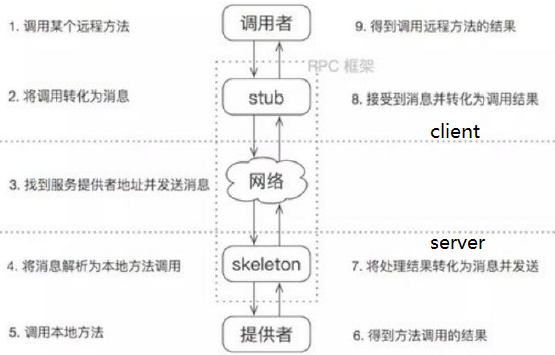
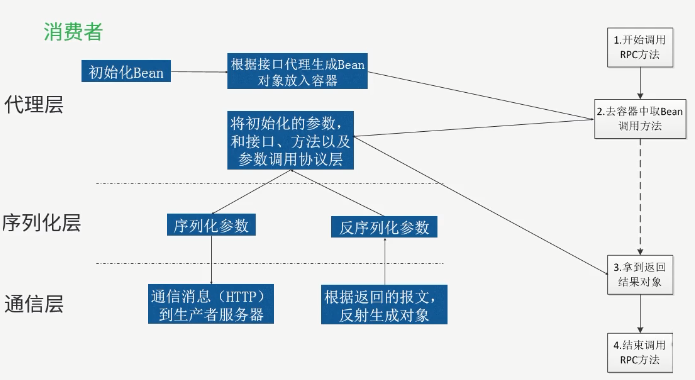
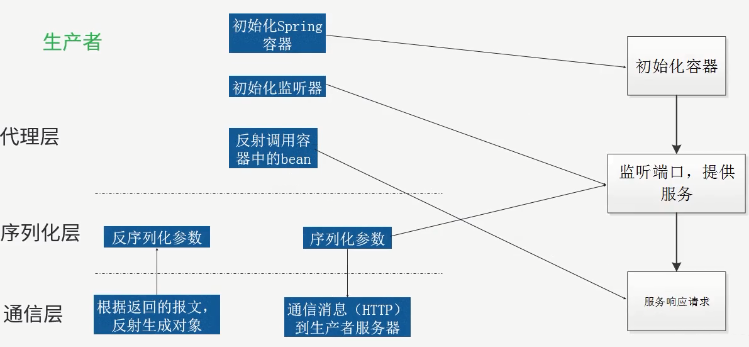
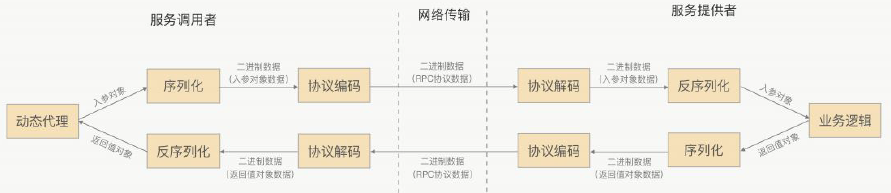
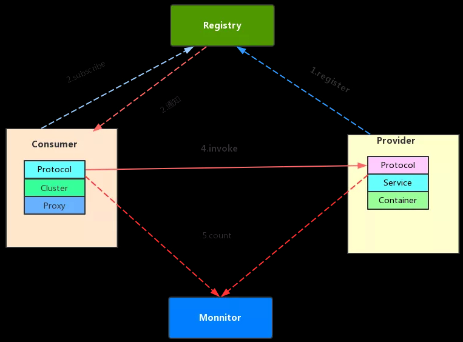

# SYS3014 — RPC

返回[Bulletin](./bulletin.md)

返回[SYS301 — Distributed Systems](./SYS301.md)

[TOC]

> **来源说明**：本章由原 SYS3011 Appendix 的「通信方式」「Dubbo」两节整理迁入，并汇集《BigPipe / MQ / Kafka / RPC / 分布式系统 · SeniorJava 通用面试主战手册（V4 新版）》的 RPC 模块内容（#22–24、#39–42、#54–61）。手册中偏 BigPipe 项目与个人表述的内容未并入；网络 IO 基础（BIO / NIO / Selector / epoll、粘包拆包）保留在 [CSE351 - Java I/O](./CSE351.md) 与 [SYS2013 - TCP协议](./SYS2013.md)，Netty 保留在 [CSE3513 - Netty](./CSE3513.md)，本章只做交叉引用。

## 1. RPC 是什么

RPC = Remote Procedure Call（远程过程调用）。

它解决的问题：

> **我的程序怎么调用另一台机器上的程序，并尽量让开发体验像调用本地方法？**

本地调用：

```java
User u = userService.getUser(123);
```

如果 UserService 运行在另一台机器上：

```text
Order Service                     User Service
     │                                 │
     │ getUser(123)                    │
     ▼                                 │
 RPC Client                            │
     │ serialize                       │
     │ request                         │
     ├──────── network ───────────────►│
                                       │ invoke
                                       │ getUser(123)
                                       │
     │◄──────── response ──────────────┤
     │ deserialize
     ▼
    User
```

RPC 框架帮你隐藏：

```text
寻址
连接
序列化
网络传输
服务端分发
超时
错误
返回值反序列化
```

### 经典定义（保留）

RPC是远程调用过程（Remote Procedure Call）的简写，是一个协议，处于网络通信协议的第五层：会话层，其下就是TCP/IP协议，在建立在其基础上的通信会话协议。RPC定义了交互的模式，它允许程序调用另一个地址空间（通常是共享网络的另一台机器上）的过程或函数，而不用程序员显式编码这个远程调用的细节。即无论是调用本地接口/服务的还是远程接口/服务的，本质上编写的调用代码基本相同。

- RPC会**隐藏**底层的通讯细节（不需要直接处理Socket通讯或Http通讯）

- RPC是一个**请求-响应**模型。客户端发起请求，服务器返回响应（类似于Http的工作方式）

- RPC在使用形式上像调用**本地**函数（或方法）一样去调用**远程**的函数（或方法）。

> 修正说明：旧材料把 RPC 描述为"位于网络通信协议第五层（会话层）的协议"。更准确的口径是：**RPC 是一种远程调用模型**，由框架（代理 + 序列化 + 传输）共同实现，可以构建在 TCP、HTTP/1.1、HTTP/2 等不同传输之上（见第 2 节"RPC + HTTP/2"）。

### 五个组件



一个基本的RPC架构里面应该至少包含以下5个组件：

- **客户端Client** 服务调用方、消费者。
- **客户端存根Client Stub** 存放服务端地址信息，将客户端的请求参数数据信息通过约定的协议规范进行编码打包成网络消息，再通过网络传输发送给服务端。
- **Network Service** 底层传输，可以是TCP或HTTP. 
- **服务端存根 Server Skeleton** 接受客户端发送过来的请求消息并进行解包，然后再调用本地服务进行处理。
- **服务端** Server 服务的真正提供者。 

### 调用链视角：消费者与生产者



消费者（调用方）视角：

1. **代理层**： 消费者将对应的接口，通过RPC框架的代理来生成一个对象到Spring容器中。代理层将代理接口生成该接口的对象，该对象处理调用时传过来的对象、方法、参数，通过序列化层封装好，调用网络层。
2. **序列化层**： 将请求的参数序列化成报文；将返回的报文反序列化成对象；
3. **网络层**： 将报文与服务端通信；接收返回结果。



生产者（提供方）视角：

1. **代理层**： 一个应用提供服务，必须由一个网络监听的模块，这个模块大多有开源的容器来处理网络上的监听；服务需要注册，只有注册了的服务才可以被调用；注册的服务需要被我们发射调用到，来进行相应的处理。
2. **序列化层**： 就是相应的做请求的反序列化和结果的序列化。
3. **网络层**： 接收客户端报文；将序列化的结果返回给客户端。

### 一次 RPC 的通信流程



### 实现相关技术：动态代理 / 序列化 / NIO

**动态代理**

生成 client stub和server stub需要用到 Java 动态代理技术，我们可以使用JDK原生的动态代理机制，也可以使用一些开源字节码工具框架 如：CGLib、Javassist等。

Stub（存根）负责将方法名、参数等信息打包编码成用于网络传输的消息体，或者将网络接收到的消息体按照格式进行拆包解码获得方法名和参数。

**序列化**

为了能在网络上传输和接收 Java对象，我们需要对它进行 序列化和反序列化操作。

- 序列化：将Java对象转换成byte[]的过程，也就是编码的过程；

- 反序列化：将byte[]转换成Java对象的过程，也就是解码的过程。

 可以使用Java原生的序列化机制，但是效率非常低，推荐使用一些开源的、成熟的序列化技术，例如：protobuf、Thrift、hessian、Kryo、Msgpack

**NIO**

当前很多RPC框架都直接基于netty这一IO通信框架，比如阿里巴巴的HSF、dubbo，Hadoop Avro，推荐使用Netty 作为底层通信框架。Netty 本身见 [CSE3513 - Netty](./CSE3513.md)；BIO / NIO / Selector / epoll 的底层原理见 [CSE3511 - I/O模型](./CSE3511.md)。

## 2. RPC 和 HTTP 什么关系

这是最容易混的。先记：

```text
RPC
→ "我要远程调用一个方法"

HTTP
→ "网络双方可以按什么应用层协议通信"
```

它们不完全是同一层。RPC 可以：

```text
RPC + HTTP/2
RPC + HTTP
RPC + 自定义 TCP 协议
```

所以：

> **RPC 和 HTTP 不是简单二选一。**

更像与 RPC 对比的是 API 风格：

```text
RPC 风格
UserService.getUser(123)

REST 风格
GET /users/123
```

REST 更强调 Resource（资源）；RPC 更强调 Procedure / Method（过程 / 方法）。

HTTP 协议本身见 [SYS2012 - HTTP协议](./SYS2012.md)。

## 3. 服务通信方式谱系：WebService / SOAP / WSDL / RESTful

服务之间的通信方式经历了一条演进路线：从最早的企业级 WebService，到轻量的 RESTful，再到性能导向的 RPC 框架（第 4 节）。

### WebService

WebService 是一种 Web 应用程序、跨编程语言和跨操作系统平台的远程调用技术，是最早的微服务系统的网络通信方式。

WebService 由 W3C 定义的应用服务开发规范，使用 client-server 主从架构，通常使用 WSDL 定义服务接口，它使用 HTTP 协议传输 XML 或 SOAP 消息，既可以运行在内网，也可以在适当保护后运行在外网。

#### SOAP

SOAP是简单对象访问协议的缩写。SOAP webService有严格的规范和标准，包括安全，事务等各个方面的内容，主要核心是面向活动。同时SOAP强调操作方法和操作对象的分离，有WSDL文件规范和XSD文件分别对其定义。使用门槛较高。

#### WSDL

WSDL（Web服务描述语言，Web Services Description Language）是为描述Web服务发布的XML格式。

#### RESTful

REST其实不是一种协议，REST是一种架构风格，其核心是面向资源。它对http协议做了根本的诠释。专门针对网络应用设计和开发方式，以降低开发的复杂性，提高系统的可伸缩性。

（原文此处写作"它对http协议的根本对了诠释"，系笔误，已按语义修正。）

REST提出设计概念和准则为：

**网络上的所有事物都可以被抽象为资源(resource)**

REST简化开发，其架构遵循CRUD原则，该原则告诉我们对于资源(包括网络资源)只需要四种行为：创建，获取，更新和删除就可以完成相关的操作和处理。

**每一个资源都有唯一的资源标识(resource identifier)，对资源的操作不会改变这些标识**

我们可以通过统一资源标识符（Universal Resource Identifier，URI）来识别和定位资源，并且针对这些资源而执行的操作是通过 HTTP 规范定义的。其核心操作只有GET,PUT,POST,DELETE。

**所有的操作都是无状态的（stateless)**

由于REST强制所有的操作都必须是stateless的，这就没有上下文的约束，如果做分布式，集群都不需要考虑上下文和会话保持的问题。极大的提高系统的可伸缩性。

## 4. 主流 RPC 框架：gRPC / Protobuf / brpc / Dubbo

### gRPC

> Google 开源的 RPC 框架。

典型调用链：

```text
service definition
↓
generated Stub
↓
Protobuf
↓
HTTP/2
↓
network
↓
gRPC Server
```

接口用 IDL 定义：

```protobuf
service UserService {
  rpc GetUser(GetUserRequest) returns (GetUserResponse);
}
```

业务使用生成的 Stub 做远程调用。

### Protobuf

Protobuf 主要解决：

> **结构化对象怎么编码成 bytes，再在另一端恢复。**

```text
Object
↓ serialize
bytes
↓ network
bytes
↓ deserialize
Object
```

它不是 RPC 本身。几个概念的关系：

```text
RPC      = 远程调用模型
Protobuf = 常用序列化 / IDL 体系
HTTP/2   = gRPC 常用传输基础
gRPC     = 把这些组合成成熟 RPC 框架
```

### brpc

> 起源于百度并开源的工业级 RPC 框架。

brpc 属于 RPC 世界，解决同样一组问题：

```text
远程调用
连接
协议
序列化
超时
并发
服务端处理
```

### Dubbo

Dubbo是一个分布式RPC服务框架，致力于提供**高性能**和**透明化**的远程服务调用方案，这容易和负载均衡弄混，负载均衡是对外提供一个公共地址，请求过来时通过轮询、随机等，路由到不同server.



除"远程调用"之外，Dubbo 常见能力还有：

```text
注册发现
负载均衡
路由
容错
服务治理
```

#### 节点角色

- Provider: 暴露服务的服务提供方。
- Consumer: 调用远程服务的服务消费方。
- Registry: 服务注册与发现的注册中心，一般依赖于Zookeeper。
- Monitor: 统计服务的调用次调和调用时间的监控中心。
- Container: 服务运行容器。

#### 负载均衡策略

##### Random

随机，按权重设置随机概率。

在一个截面上碰撞的概率高，但调用量越大分布越均匀，而且按概率使用权重后也比较均匀，有利于动态调整提供者权重。

##### RoundRobin

轮循，按公约后的权重设置轮循比率。

存在慢的提供者累积请求的问题，比如：第二台机器很慢，但没挂，当请求调到第二台时就卡在那，久而久之，所有请求都卡在调到第二台上。

##### LeastActive

最少活跃调用数，相同活跃数的随机，活跃数指调用前后计数差。

使慢的提供者收到更少请求，因为越慢的提供者的调用前后计数差会越大。

##### ConsistentHash

一致性 Hash，相同参数的请求总是发到同一提供者。

当某一台提供者挂时，原本发往该提供者的请求，基于虚拟节点，平摊到其它提供者，不会引起剧烈变动。

缺省只对第一个参数 Hash，如果要修改，请配置 

```xml
<dubbo:parameter key="hash.arguments" value="0,1" />
```

缺省用 160 份虚拟节点，如果要修改，请配置 

```xml
<dubbo:parameter key="hash.nodes" value="320" />
```

（一致性哈希算法本身见 [SYS3011 §9](./SYS3011.md)。）

#### 容错策略

- Failover - 失败自动切换，当出现失败，重试其它服务器。通常用于读操作，但重试会带来更长延迟。可通过 retries="2" 来设置重试次数(不含第一次)。
- Failfast - 快速失败，只发起一次调用，失败立即报错。通常用于非幂等性的写操作，比如新增记录。
- Failsafe - 失败安全，出现异常时，直接忽略。通常用于写入审计日志等操作。
- Failback - 失败自动恢复，后台记录失败请求，定时重发。通常用于消息通知操作。
- Forking - 并行调用多个服务器，只要一个成功即返回。通常用于实时性要求较高的读操作，但需要浪费更多服务资源。可通过 forks="2" 来设置最大并行数。
- Broadcast - 播调用所有提供者，逐个调用，任意一台报错则报错。通常用于通知所有提供者更新缓存或日志等本地资源信息。

## 5. 服务注册与发现

微服务实例会不断：

```text
扩容
缩容
重启
IP 变化
```

所以 Consumer 不能把 Provider 的 IP 永久写死。需要注册中心：

```text
Provider
→ Registry

Consumer
← Registry
```

Consumer 从注册中心拿到服务实例列表后：

```text
load balance
→ choose provider
→ RPC
```

这就是"服务发现"。Dubbo 的 Registry 一般依赖 ZooKeeper（见第 4 节节点角色），ZooKeeper 本身见 [SYS3013 - ZooKeeper](./SYS3013.md)。

### 排查视角：Control Plane vs Data Plane

- **Control Plane**：告诉系统"谁在哪、谁负责、怎么路由"（注册中心、元数据属于这层）。

- **Data Plane**：真正承载业务的调用请求和数据流。

组件故障时不要只问"挂了没？"，而要问：**它挂了影响的是新路由、故障切换，还是现有数据流？**

## 6. 调用可靠性：Timeout / Retry / Idempotency

完整失败链路（Timeout → 结果未知 → Retry → Duplicate → Idempotency）以及幂等的通用实现手段（Idempotency Key、唯一约束、去重表、状态机），已在本课程的 [SYS3011 §8](./SYS3011.md) 完整展开。这里是 RPC 语境下的两个补充。

### Timeout 是资源边界

没有 Timeout：

```text
Client waits forever
↓
thread / connection occupied
↓
request piles up
↓
cascading failure
```

所以 RPC / MQ / DB 都要有 timeout。但：

> **Timeout 只表示"我在规定时间内没拿到结果"，不表示对方一定失败。**

### 能不能重试：先过一遍检查表

```text
操作是否幂等？
是否有稳定 requestId？
服务端能否 dedup？
错误是否 transient（临时、可恢复）？
剩余 latency budget 够吗？
```

更安全的默认：

```text
read-only query      → 通常更容易 retry
write side effect    → 必须先考虑 idempotency
```

重试上限 / backoff / jitter / retry budget 与 retry storm 见 [SYS3011 §8](./SYS3011.md)。

## 7. RPC Server 生产实践（P0）

### 一次请求到底经过哪些层

```text
Client → serialize/encode → TCP → Server Socket
→ Selector/EventLoop → read → frame decode → deserialize
→ dispatch → Business Thread Pool → Provider Method
→ DB/Cache/downstream RPC → serialize response → write → Client
```

高性能题的核心：

> 逐层找成本，不要只背 epoll。

### 从 Selector 到 Reactor：事件如何被调度

```text
Selector → 哪些 Channel ready？
Reactor  → ready 后交给哪个 Handler？

Selector → Reactor → Accept/Read/Write Handler
```

一次 Read 不是"读一次就完事"：

```text
OP_READ → read bytes → 协议解码
→ 完整 Request？
  ├─ No：保存状态，等下次 read
  └─ Yes：dispatch
```

一次 non-blocking write() 也不保证全写完：

```text
100KB Buffer → 本次只写20KB
→ 保存剩余80KB → 下次 writable 继续
```

这叫 **partial write**。所以 NIO 更省线程，但状态机和异常恢复更复杂。

> Netty 的 EventLoop / 主从线程模型就是这个思路的应用，见 [CSE3513 - Netty](./CSE3513.md)。BIO / NIO / Selector / Buffer / epoll 的完整基础见 [CSE3511](./CSE3511.md) 与 [CSE3512](./CSE3512.md)，粘包拆包见 [SYS2013](./SYS2013.md)。

#### 【错题本·真实追问】epoll_wait() 是什么

> epoll_wait 是 Linux epoll 中等待就绪事件的系统调用。没有关注的 fd ready 时线程等待；出现可读、可写或错误事件后返回 ready events。

它和 Java `Object.wait()` 不是一回事：`Object.wait()` 是锁等待——释放 monitor 进入 WAITING，被 notify / interrupt 唤醒后重新竞争 monitor。

（epoll 机制本身见 [CSE3511](./CSE3511.md)。）

### 为什么 IO Thread 和 Business Thread 要分开

一个 Reactor / EventLoop 往往管理很多连接。如果它直接执行慢 SQL、慢 RPC 或大计算，它管理的其他连接的网络事件也得不到及时处理。

```text
IO Thread → 收包 / decode / 快速 dispatch
→ Business Thread Pool → SQL / RPC / business
→ result → IO layer → write
```

> EventLoop / Reactor 线程不要做长时间阻塞业务。

### RPC Server 高性能 SOP：按 8 层回答【P0｜错题本】

不要只说 epoll。

#### Step 1｜连接模型

大量频繁 RPC 尽量复用长连接；同时处理 heartbeat、idle timeout、断线、重连、半开连接、连接数上限。

#### Step 2｜IO 模型

```text
大量连接 → NIO + Selector + Reactor → 少量 IO 线程管理大量连接
```

#### Step 3｜线程模型

```text
IO Thread → network / codec / dispatch
Business Pool → business / DB / downstream RPC
```

#### Step 4｜协议 / 序列化

关注 payload size / serialization CPU / copy / compatibility。Protobuf 可提供结构化、跨语言、较紧凑编码，但用了 Protobuf 不等于自动高性能。

#### Step 5｜业务处理

查 CPU hotspot / lock contention / slow SQL / blocking call。网络再快，Provider Method 自己卡 3 秒也没用。

#### Step 6｜下游依赖

RPC Server → DB / Redis / other RPC，要有 timeout、connection pool、隔离。慢下游可能把 Worker 全卡住。

#### Step 7｜过载保护 / Backpressure

```text
incoming > service
→ queue grows → latency grows → timeout → retry → incoming 更高
```

所以要有 bounded queue / rate limit / fast reject / circuit breaker / retry budget。

> 宁可明确拒绝一部分请求，也不要让所有请求一起超时。

#### Step 8｜Observability

至少看 QPS / P50/P95/P99 / error / timeout / connection / IO thread / active threads / queue / CPU / GC / downstream latency。

#### 60 秒标准答案

> 高并发 RPC Server 我会按连接、IO、线程、协议、业务和过载保护分层看。大量长连接场景下用 NIO/Reactor，让少量 IO 线程管理很多连接；IO 线程只做收包、解码和派发，慢 SQL、下游 RPC 和业务计算进入独立业务线程池。连接尽量复用，序列化要控制 payload 和 CPU；所有下游要有 timeout，线程池和队列要有边界，并配合限流、快速失败和 retry budget 防止过载。最后用 QPS、P99、连接数、active threads、queue、GC 和下游 latency 判断瓶颈在哪一层。

### 线程池满了：不要第一反应"加线程"

```text
activeThreads=max → queue↑ → P99↑ → timeout↑
```

SOP：

```text
① arrival rate 是否突然增加
② worker 在干什么
③ Thread Dump
④ CPU-bound 还是 waiting/blocking
⑤ DB/RPC/connection pool/lock
⑥ 先保护系统
⑦ 再决定优化还是扩容
```

CPU 已经很高，再加线程可能只增加 context switch；大量线程在等慢 RPC，再加线程可能把下游打得更死。只有下游正常、CPU 有余量且确实容量不足时，再扩实例 / 合理增并发。

止血手段：限流 / fast reject / 降级 / 摘异常实例 / 隔离线程池。

### 接口突然变慢：排查 SOP

先确定范围：

```text
单请求？单接口？单实例？单机房？全服务？
```

再按序看：

```text
① QPS
② P50/P95/P99
③ error/timeout
④ Client connection/pool
⑤ Server IO Thread
⑥ Business Thread Pool
⑦ CPU/GC/Memory
⑧ DB/Redis/downstream RPC
⑨ 有证据再查 network
```

P50 正常而 P99 巨高，优先想少数慢实例、偶发 GC、慢 SQL、锁竞争、hot key 等尾延迟；所有分位都涨，更像整体过载或统一下游变慢。

怀疑 IO Thread 卡住时：Thread Dump → EventLoop stack → 是否误做 blocking call，再把慢业务移出 IO Thread。

### 最容易答错的 8 个点

```text
NIO = 一定更快                 ×
Selector = Reactor             ×
epoll = RPC 高性能全部          ×
TCP read 一次 = 一条消息        ×
write 一次 = 全写完             ×
IO Thread 可以顺手查 DB         ×
Pool 满了就扩线程               ×
Timeout = Server 没成功         ×
```

正确抓手：

```text
NIO → 大量连接的线程资源模型
Selector → readiness discovery（谁 ready）
Reactor → event dispatch（ready 后交给谁）
TCP → byte stream
NIO → partial read/write
IO Thread → 不做慢业务
Pool 满 → 先找瓶颈
Timeout → outcome unknown
```

### 统一知识地图（RPC 视角）

```text
TCP Connection
      ↓
bytes / stream
      ↓
framing / protocol
      ↓
RPC(Request/Response)
      ↓
network may fail
      ↓
timeout → outcome unknown → retry → duplicate
      ↓
identity + idempotency
```

性能层：

```text
many connections → NIO/Selector → Reactor → few IO threads
```

RPC 常见重点：`requestId / timeout / business pool / discovery / load balance`。

> 网络 IO 效率解决"怎么高效通信"；分布式可靠性解决"通信失败以后怎么保持正确"。

## 8. 面试秒答（30-60 秒）

### Q：RPC 是什么？

> RPC 是 Remote Procedure Call，目标是让一个进程调用另一台机器上的服务时，开发体验尽量像本地方法调用。框架会帮忙处理寻址、序列化、网络传输、服务端分发、超时和返回值反序列化。

### Q：RPC 和 HTTP 什么关系？

> 它们不是完全同一层。RPC 描述的是远程方法调用模型，HTTP 是可以承载通信的应用层协议。比如 gRPC 是 RPC 框架，它典型使用 Protobuf 定义消息和接口，并基于 HTTP/2 传输。REST 和 RPC 才更像两种 API 风格的对比。

### Q：gRPC / Protobuf 是什么？

> gRPC 是 Google 开源的 RPC 框架；Protobuf 是常用的 IDL 和二进制序列化体系，用来把结构化对象编码成网络字节并在另一端恢复。gRPC 常见组合是 Protobuf + HTTP/2 + 生成的 Client/Server Stub。

### Q：brpc 是什么？

> brpc 是起源于百度并开源的工业级 RPC 框架，同样覆盖远程调用、连接、协议、序列化、超时、并发和服务端处理这一整套问题。

### Q：Dubbo 是什么？

> Dubbo 是 Java 生态常见的 RPC 和服务治理框架。Consumer 通过代理调用 Provider，Registry 提供服务发现，框架还会处理负载均衡、路由、容错等能力。

### Q：为什么 Timeout 不能直接认为失败？

> 因为 timeout 只说明客户端没有在规定时间内收到结果，服务端可能没执行，也可能已经执行成功但响应丢了。这就是 outcome unknown，所以写请求重试前必须考虑幂等和去重。

### Q：Reactor 是什么？

> Reactor 是事件驱动的网络 IO 调度模型。Selector 负责发现哪些 Channel ready，Reactor 再把 connect、read、write 等事件分发给 Handler。Netty 的 EventLoop 线程模型就可以用这个模型理解（见 [CSE3513](./CSE3513.md)）。

### Q：为什么 Reactor 不能直接做业务？

> 一个 Reactor/EventLoop 往往管理很多连接。如果它直接执行慢 SQL、慢 RPC 或大计算，这段时间其他连接的网络事件也得不到及时处理，所以 IO Thread 应快速收包、解码和派发，阻塞业务交给独立业务线程池。

### Q：RPC Server 怎么做高性能？

> 我会分层回答：连接层复用长连接；网络层用 NIO/Reactor；IO 和业务线程隔离；协议和序列化控制 payload 和 CPU；业务层避免锁和慢 SQL；下游设置 timeout；线程池和队列有界，并配合限流、快速失败和 retry budget；最后通过 QPS、P99、connection、active threads、queue、GC 和下游 latency 做观测。epoll 只是底层事件通知的一环。（SOP 展开见第 7 节。）

---

网络 IO 类秒答（BIO vs NIO、Selector、epoll_wait、粘包拆包）见 [CSE3511 - I/O模型](./CSE3511.md)、[CSE3512 - Java I/O](./CSE3512.md) 与 [SYS2013 - TCP协议](./SYS2013.md)。
