# SYS301 - Distributed Systems - 消息队列

返回[Bulletin](./bulletin.md)

返回[SYS301 - Distributed Systems](./SYS301.md)

[TOC]

## 基本概念

消息队列是在消息的传输过程中保存消息的容器。是构建分布式应用的基础，通过消息实现的松耦合架构设计，极大的提高了整体系统的可用性、扩展性、稳定性。

### 性能参数

- 不丢/可靠性

- 不重/幂等

- 顺序性

- 可用性/主从选举

- 延时

- 吞吐量

- 可伸缩性/扩容

### Broker

消息服务器，作为server提供消息核心服务。

### Producer

消息生产者，业务的发起方，负责生产消息传输给broker.

### Consumer

消息消费者，业务的处理方，负责从broker获取消息并进行业务逻辑处理。

### Topic

主题，发布订阅模式下的消息统一汇集地，不同生产者吐topic发送消息，由MQ服务器分发到不同的订阅者，实现消息的广播。

### Queue

队列，P2P模式下，特定生产者吐特定queue发送消息，消费者订阅特定的queue完成指定消息的接收。

### Message

消息体，根据不同通信协议定义的固定格式迚行编码的数据包，来封装业务数据，实现消息的传输。

### 模型

#### Pub/Sub 发布订阅（广播）

使用topic作为通信载体。

#### P2P 点对点

使用queue作为通信载体。

### 数据传输/MQTT的事务定义

- 最多一次: 消息不会被重复发送，最多被传输一次，但也有可能一次不传输。
- 最少一次: 消息不会被漏发送，最少被传输一次，但也有可能被重复传输。
- 精确的一次（Exactly once）: 不会漏传输也不会重复传输,每个消息都传输被一次而且仅仅被传输一次，这是大家所期望的。

### 使用场景

#### 应用解耦

以订单系统+库存系统为例。

##### 引入消息队列前

用户下单后，订单系统直接调用库存系统接口发起通知，缺点是订单系统与库存系统耦合。假如库存系统无法访问，则可能导致订单减库存失败引发的订单下单失败。


##### 引入消息队列后

用户下单后订单系统完成持久化处理，将消息写入消息队列，返回用户订单下单成功。然后

库存系统订阅消息队列中的下单消息，然后进行库存操作。实现上下游系统松耦合设计，可以在下游系统出现异常或宕机的时候不影响更多系统，降低工程间的强依赖程度。

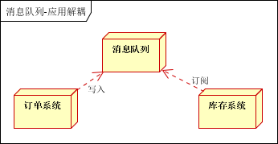

#### 异步通信

以注册用户为例。

##### 引入消息队列前

用户注册后，需要发注册邮件和注册短信。传统的做法有两种：

串行方式：将注册信息写入数据库成功后，发送注册邮件，再发送注册短信。以上三个任务全部完成后，返回给客户端。

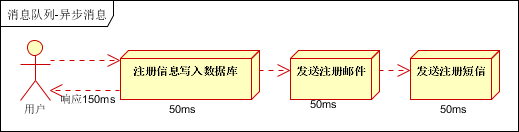

并行方式：将注册信息写入数据库成功后，发送注册邮件的同时，发送注册短信。以上三个任务完成后，返回给客户端。与串行的差别是，并行的方式可以提高处理的时间。

 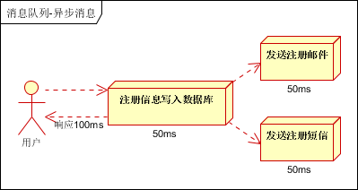

假设三个业务节点每个使用50毫秒钟，不考虑网络等其他开销，则串行方式的时间是150毫秒，并行的时间可能是100毫秒。因为CPU在单位时间内处理的请求数是一定的，假设CPU1秒内吞吐量是100次，则串行方式1秒内CPU可处理的请求量是7次（1000/150），并行方式处理的请求量是10次（1000/100）。

##### 引入消息队列后

注册信息放入队列，并不立即处理它，需要的时候再去处理。用户的响应时间相当于是注册邮件、发送短信写入消息队列后直接返回的时间，也就是50毫秒。因此架构改变后系统的吞吐量提高到每秒20QPS。比串行提高了3倍，比并行提高了2倍。

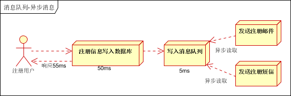

#### 流量错峰

流量削锋也是消息队列中的常用场景，一般在秒杀或团抢活动中使用广泛。

##### 引入消息队列前

秒杀活动存在因为流量暴增导致应用挂掉的隐患。

##### 引入消息队列后

在应用前端加入消息队列，控制活动的人数，可以缓解短时间内高流量防止压垮应用。

用户的请求，由服务器接收后，首先写入消息队列。假如消息队列长度超过最大数量，则直接抛弃用户请求或跳转到错误页面。

秒杀业务拉取消息队列中的请求信息，再做后续处理。


#### 日志处理

日志采集客户端负责日志数据采集，定时写受写入Kafka队列。Kafka消息队列负责日志数据的接收，存储和转发。日志处理应用订阅并消费kafka队列中的日志数据。

##### 新浪kafka日志处理应用案例


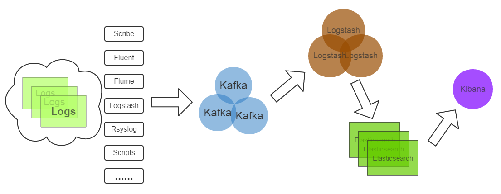

- Kafka：接收用户日志的消息队列
- Logstash：做日志解析，统一成JSON输出给Elasticsearch
- Elasticsearch：实时日志分析服务的核心技术，一个schemaless，实时的数据存储服务，通过index组织数据，兼具强大的搜索和统计功能
- Kibana：基于Elasticsearch的数据可视化组件，超强的数据可视化能力是众多公司选择ELK stack的重要原因。

#### 消息通讯

消息队列一般都内置了高效的通信机制，因此也可以用在纯的消息通讯。

##### 点对点通讯

客户端A和客户端B使用同一队列，进行消息通讯。

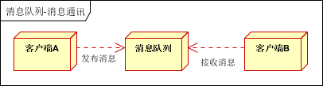

##### 聊天室通讯

客户端A，客户端B，客户端N订阅同一主题，进行消息发布和接收。实现类似聊天室效果。

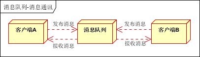

### 缺点

#### 系统可用性降低

系统引入的外部依赖越多，越容易挂掉。

#### 系统复杂性提高

怎么保证消息没有重复消费？怎么处理消息丢失的情况？怎么保证消息传递的顺序性？

## 常用协议

### AMQP协议(二进制)

AMQP（Advanced Message Queue Protocol, 高级消息队列协议）是一个提供统一消息服务的应用层标准高级消息队列协议, 是应用层协议的一个开放标准，为面向消息的中间件设计。

协议本身包括三层：

#### Module Layer

位于协议最⾼层，主要定义了⼀些供客户端调⽤的命令，客户端可以利⽤这些命令实现⾃⼰的业务逻辑，例如，客户端可以通过queue.declare声明⼀个队列，利⽤consume命令获取⼀个队列中的消息。

#### Session Layer

主要负责将客户端的命令发送给服务器，在将服务器端的应答返回给客户端，主要为客户端与服务器之间通信提供可靠性、同步机制和错误处理。

#### Transport Layer

主要传输⼆进制数据流，提供帧的处理、信道复⽤、错误检测和数据表示。

### MQTT协议（二进制）

MQTT（Message Queuing Telemetry Transport, 消息队列遥测传输）是IBM开发的一个即时通讯协议，有可能成为物联网的重要组成部分。

### STOMP协议（文本）

STOMP（Streaming Text Orientated Message Protocol, 流文本定吐消息协议），面吐消息的中间件设计的简单文本协议。

### XMPP协议

XMPP（可扩展消息处理现场协议, Extensible Messaging and Presence Protocol）是基于可扩展标记语言（XML）的协议，多用于即时消息（IM）以及在线现场探测。适用于服务器之间的准即时操作。

### 其他协议

其他基于TCP/IP自定义的协议有些特殊框架（如：redis、kafka、zeroMq等）根据自身需要未严格遵循MQ规范，而是基于TCP\IP自行封装了一套协议，通过网络socket接口进行传输，实现了MQ的功能。

## 常用消息中间件

目前常见的消息中间件有ActiveMQ、RabbitMQ、ZeroMQ、Kafka、MetaMQ、RocketMQ等，部分数据库如Redis、MySQL也可实现消息队列的功能。

| 特性                    | ActiveMQ                                      | RabbitMQ                                               | RocketMQ                                                     | Kafka                                                        |
| ----------------------- | --------------------------------------------- | ------------------------------------------------------ | ------------------------------------------------------------ | ------------------------------------------------------------ |
| 单机吞吐量              | 万级，吞吐量比RocketMQ和Kafka要低了一个数量级 | 万级，吞吐量比RocketMQ和Kafka要低了一个数量级          | **10万级**，RocketMQ也是可以支撑高吞吐的一种MQ               | **10万级别**，这是kafka最大的优点，就是吞吐量高。            |
| topic数量对吞吐量的影响 |                                               |                                                        | topic可以达到几百，**几千个**的级别，吞吐量会有较小幅度的下降。  这是RocketMQ的一大优势，在同等机器下，可以支撑大量的topic | topic从几十个到几百个的时候，吞吐量会大幅度下降。  所以在同等机器下，kafka尽量保证topic数量不要过多。如果要支撑大规模topic，需要增加更多的机器资源 |
| 时效性                  | ms级                                          | **微秒级**，这是rabbitmq的一大特点，延迟是最低的       | ms级                                                         | 延迟在ms级以内                                               |
| 可用性                  | 高，基于主从架构实现高可用性                  | 高，基于主从架构实现高可用性                           | **非常高**，分布式架构                                       | **非常高**，kafka是分布式的，一个数据多个副本，少数机器宕机，不会丢失数据，不会导致不可用 |
| 消息可靠性              | 有较低的概率丢失数据                          |                                                        | 经过参数优化配置，可以做到**0丢失**                          | 经过参数优化配置，消息可以做到**0丢失**                      |
| 功能支持                | MQ领域的功能极其完备                          | 基于erlang开发，所以并发能力很强，性能极其好，延时很低 | MQ功能较为完善，还是分布式的，扩展性好                       | 功能较为简单，主要支持简单的MQ功能，在大数据领域的实时计算以及日志采集被大规模使用，是事实上的标准 |

## Disruptor

由交易所开发的单机最快MQ. 由于内部全是CAS, 单机支持很高的并发。可以理解为在内存里用于存放元素的一个高效率的队列。

## ActiveMQ

非常成熟，功能强大，在业内大量的公司以及项目中都有应用。

偶尔会有较低概率丢失消息。而且现在社区以及国内应用都越来越少，官方社区现在对ActiveMQ 5.x维护越来越少，几个月才发布一个版本。

主要是基于解耦和异步来用的，较少在大规模吞吐的场景中使用。

## RabbitMQ

erlang语言开发，性能极其好，延时很低，吞吐量到万级。MQ功能比较完备，而且开源提供的管理界面很好用。社区相对比较活跃，几乎每个月都发布几个版本。

RabbitMQ确实吞吐量会低一些，这是因为他做的实现机制比较重。而且国内很少有公司有实力去做erlang的源码级别的研究和定制，所以很难去看懂源码，基本只能依赖于开源社区的快速维护和修复bug. 而且由于erlang语言本身难懂的问题，rabbitmq集群动态扩展会很麻烦。

### Publisher

消息的生产者，也是一个向交换器发布消息的客户端应用程序。

### Consumer

消息的消费者，表示一个从消息队列中取得消息的客户端应用程序。

### Broker/Server（协商器/服务器）

表示消息队列服务器实体。

### Virtual host（虚拟主机）

虚拟主机是共享相同的身份认证和加密环境的独立服务器域。出于多租户和安全因素设计的⼀个虚拟概念，类似于权限控制组。当多个不同的⽤户使⽤同⼀个RabbitMQ server提供的服务时，可以划分出多个vhost（权限控制的最⼩粒度），每个⽤户在⾃⼰的vhost创建exchange／queue等。

### Connection（连接）

publisher／consumer和broker之间的TCP连接。断开连接的操作只会在client端进⾏，Broker不会断开连接，除⾮出现⽹络故障或broker服务出现问题。

Connection是RabbitMQ的socket链接，它封装了socket协议相关部分逻辑。

Connection Factory则是Connection的制造⼯⼚。

### Channel（信道）

信道，多路复用连接中的一条独立的双向数据流通道。Channel是在connection内部建⽴的逻辑连接。AMQP协议规定只有通过Channel才能执⾏AMQP的命令，所以AMQP命令都是通过信道发出去的，不管是发布消息、订阅队列还是接收消息。

如果每⼀次访问RabbitMQ都建⽴⼀个Connection，在消息量⼤的时候建⽴TCP Connection的开销将是巨⼤的，效率也较低。Channel作为轻量级的Connection可以复用一条TCP连接，极⼤减少了操作系统建⽴TCP connection的开销。可能对⽤户隐藏。

RabbitMQ建议客户端线程之间不要共⽤Channel，⾄少要保证共⽤Channel的线程发送消息必须是串⾏的，但是建议尽量共⽤Connection。

AMQP method包含了channel id帮助client和broker识别channel，所以channel之间是完全隔离的。

### Exchange（交换机）

交换器，message到达broker的第⼀站，接受到⽣产者发送的消息后，根据分发规则，匹配查询表中的routing key，分发消息到queue中去。

#### 性质

- 持久性：如果启⽤，Broker（协商器）只要不重启就⼀直有效。

- ⾃动删除：如果启⽤，那么交换机将会在其绑定的队列都被删除掉之后⾃动删除掉⾃身。

- 惰性：如果没有声明交换机，那么在执⾏导致异常的时候，并不会主动声明。

#### 类型

**fanout** (multicast)

⽆视routing key都通过。

**direct** (point-to-point)

精准匹配routing key通过。

**topic** (publish-subscribe)

模糊匹配routing key通过。“#”通配任何零个或多个word, “*”通配任何单个word.

**header**

headers类型的Exchange不依赖于Routing Key与Binding Key的匹配规则来路由消息，⽽是根据发送的消息内容中的headers属性（也是⼀个键值对的形式）进⾏匹配。如果完全匹配则消息会路由到该Queue，否则不会路由到该Queue。

**failover**和**system**

（⽬前在当前 RabbitMQ 版本中均未实现。）

### Binding（绑定器）

绑定，用于消息队列和交换器之间的关联。一个绑定就是基于路由键将交换器和消息队列连接起来的路由规则，所以可以将交换器理解成一个由绑定构成的路由表，路由表中存储着Message Queue所需消息的限制条件，即Binding Key.

Binding Key由Consumer在绑定Exchange与Message Queue时指定，⽽Routing Key由Producer发送Message时指定，两者的匹配⽅式由Exchange Type决定。

当Exchange收到Message时会解析其Header得到Routing Key，Exchange根据Routing Key与Exchange Type将Message路由到Message Queue。

### Queue（队列）

消息队列，用于存储消息等待consumer取⾛。一个消息可投入一个或多个队列。

#### 性质

- 持久性：如启用，Broker（协商器）只要不重启就⼀直有效。

- ⾃动删除：如果启⽤，那么队列将会在所有的消费者停⽌使⽤之后⾃动删除掉⾃身。

- 惰性：如果没有声明队列，那么在执⾏导致异常的时候，并不会主动声明。

- 排他性：如果启⽤，队列只能被声明它的消费者使⽤。

### Message（消息）

消息由消息头和消息体组成。

- 消息头由一系列的可选属性组成，这些属性包括routing-key（路由键）、priority（相对于其他消息的优先权）、delivery-mode（指出该消息可能需要持久性存储）等。

- 消息体是不透明的。

### Command（命令）

AMQP的命令，客户端通过Command完成与AMQP服务器的交互来实现⾃身的逻辑。例如在RabbitMQ中，客户端可以通过publish命令发送消息，txSelect开启⼀个事务，txCommit提交⼀个事务。

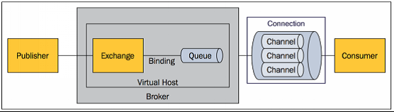

### 事务

RabbitMQ提供了**事务**的功能。事务的实现主要是对信道（Channel）的设置，主要的方法有三个：

- channel.txSelect()声明启动事务模式；

- channel.txComment()提交事务；

- channel.txRollback()回滚事务；

通过将channel设置为**confirm模式**。一旦信道进入confirm模式，所有在该信道上面发布的消息都将会被指派一个唯一的ID(从1开始)，一旦消息被投递到所有匹配的队列之后，broker就会发送一个确认给生产者(包含消息的唯一ID)，这就使得生产者知道消息已经正确到达目的队列了。

### 持久化

把消息**持久化**磁盘可以保证服务器重启消息不丢失。缺点就是降低了服务器的吞吐量，因为使用的是磁盘而非内存存储，从而降低了吞吐量。可尽量使用 ssd 硬盘来缓解吞吐量的问题。

消息持久化需要满足以下四个条件：

- 声明队列必须设置持久化durable设置为true.

- 消息推送投递模式必须设置持久化，deliveryMode设置为2（持久）。

- 消息已经到达持久化交换器。

- 消息已经到达持久化队列。

### 节点类型

每个集群中至少有一个**物理磁盘**，保证消息落入磁盘。

RabbitMQ中有两种节点：

- 磁盘节点：消息会存储到磁盘。

- 内存节点：消息都存储在内存中，重启服务器消息丢失，性能高于磁盘类型。

如果唯一磁盘的磁盘节点崩溃了，集群是可以保持运行的，但不能进行以下修改操作：

- 不能创建队列

- 不能创建交换器

- 不能创建绑定

- 不能添加用户

- 不能更改权限

- 不能添加和删除集群节点

RabbitMQ对集群的停止的顺序是有要求的，应该先关闭内存节点，最后再关闭磁盘节点。如果顺序恰好相反的话，可能会造成消息的丢失。

#### 每个节点是其他节点的完整拷贝吗？为什么？

不是，原因有以下两个：

**存储空间**

如果每个节点都拥有所有队列的完全拷贝，这样新增节点不但没有新增存储空间，反而增加了更多的冗余数据。

**性能**

如果每条消息都需要完整拷贝到每一个集群节点，那新增节点并没有提升处理消息的能力，最多是保持和单节点相同的性能甚至是更糟。

### 延迟队列

延迟队列的实现有两种方式：

- 通过消息过期后进入死信交换器，再由交换器转发到延迟消费队列，实现延迟功能；

- 使用RabbitMQ-delayed-message-exchange插件实现延迟功能。

## RocketMQ

接口简单易用，而且毕竟在阿里大规模应用过，有阿里品牌保障     日处理消息上百亿之多，可以做到大规模吞吐，性能也非常好，分布式扩展也很方便，社区维护还可以，可靠性和可用性都是ok的，还可以支撑大规模的topic数量，支持复杂MQ业务场景     而且一个很大的优势在于，阿里出品都是java系的，我们可以自己阅读源码，定制自己公司的MQ，可以掌控     社区活跃度相对较为一般，不过也还可以，文档相对来说简单一些，然后接口这块不是按照标准JMS规范走的有些系统要迁移需要修改大量代码     还有就是阿里出台的技术，你得做好这个技术万一被抛弃，社区黄掉的风险，那如果你们公司有技术实力我觉得用RocketMQ挺好的。

### NameServer

RocketMQ是参考Kafka设计的消息队列，但是不依赖Zookeeper, 而是自己的Name Server模块。

这个模块是RocketMQ的注册中心，存储关联信息，且都是无状态节点，可集群部署，节点之间无信息同步。

即使整个Namersrv集群宕机，已经正常工作的Producer, Consumer和Broker依然能正常工作，但是新起的Producer, Consumer, Broker就无法工作。

节省了Zookeeper的选举过程造成的服务效率的损失。


## Kafka

kafka的特点其实很明显，就是仅仅提供较少的核心功能，但是提供超高的吞吐量，ms级的延迟，极高的可用性以及可靠性，而且分布式可以任意扩展。同时kafka最好是支撑较少的topic数量即可，保证其超高吞吐量。

kafka唯一的一点劣势是有可能消息重复消费，那么对数据准确性会造成极其轻微的影响，在大数据领域中以及日志采集中，这点轻微影响可以忽略。

这个特性天然适合大数据实时计算以及日志收集。

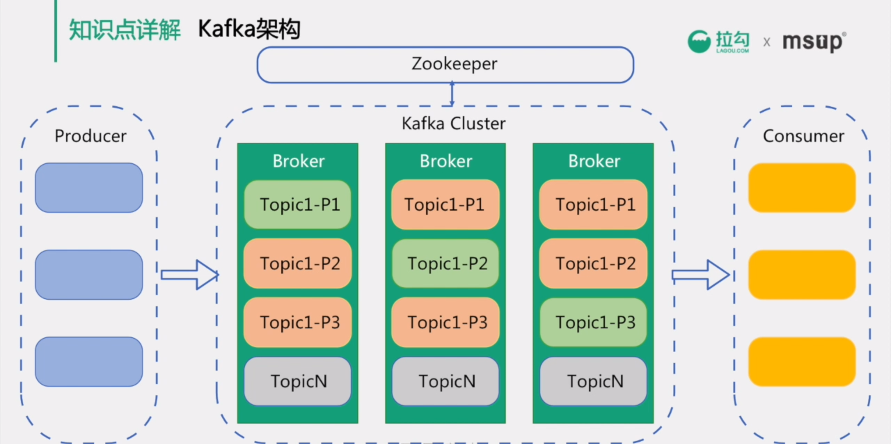

### Broker

Kafka服务器，负责消息存储和转发。

#### 网络模型

Kafka自己实现了网络模型做RPC。底层基于Java NIO, 采用和Netty一样的Reactor线程模型，实现了多路复用和处理线程池。

##### 传统阻塞IO模型存在的问题

一个线程负责一个连接，并发数大时创建线程数多占用资源。

- Reactor模型基于池化思想，避免为每个连接创建线程，连接完成后将业务处理交给线程池处理。

连接建立后，若当前线程没有数据可读，线程会阻塞在读操作上，造成资源浪费。

- 基于IO复用模型，多个连接共用同一个阻塞对象，不用等待所有的连接。遍历到有新数据可以处理时，操作系统会通知程序，线程跳出阻塞状态，进行业务逻辑处理。

其中包含了一个Acceptor线程，用于处理新的连接。Acceptor有N个Processor线程select和read socket请求，N个Handler线程处理请求并相应，即处理业务逻辑。

- 首先客户端发送请求全部会先发送给一个Acceptor. Acceptor不会对客户端的请求做任何的处理，直接封装成socketChannel, 以轮询方式发送给Broker里面的默认3个processor线程，形成socketChannel的队列。

- 消费者线程去消费这些socketChannel时会获取request请求，如果是发布请求则会伴随着数据。

- 线程池里面默认有8个handler线程，这些线程是用来处理request的。handler线程解析请求后，将写请求写到磁盘里，把结果返回给读请求。

- processor会从response中读取响应数据，然后再返回给客户端。

如果需要对kafka进行增强调优，增加processor线程个数和线程池里的处理线程个数，就可以达到效果。request和response那一块部分其实就是起到了一个缓存的效果，作用是防止processor生成请求太快导致线程池处理线程数不够不能及时处理。

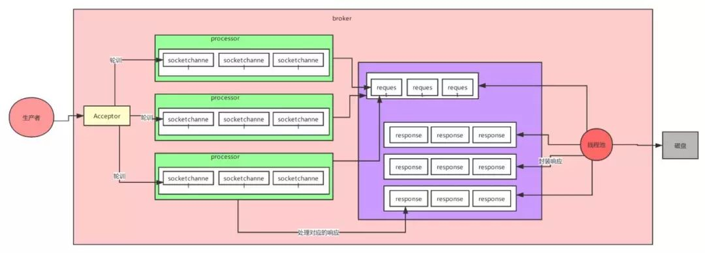

#### 数据自动清除条件

如果同时设定了自动清除数据的时间条件和数据大小条件，那么只要满足任意一个条件，Kafka就会执行数据清除操作。

#### 判断一个Broker节点还存活的两个条件

- 节点必须可以维护和ZooKeeper的连接，Zookeeper通过心跳机制检查每个节点的连接。
- 如果节点是个follower, 他必须能及时的同步leader的写操作，延时不能太久。

#### Broker选举

集群中第一个启动的broker会通过在zookeeper中创建临时节点/controller来让自己成为控制器，其他broker启动时也会在zookeeper中创建临时节点，但是发现节点已经存在，所以它们会收到一个异常，意识到控制器已经存在，那么就会在zookeeper中创建watch对象，便于它们收到控制器变更的通知。

- 如果控制器由于网络原因与zookeeper断开连接或者异常退出，那么其他broker通过watch收到控制器变更的通知，就会去尝试创建临时节点/controller，如果有一个broker创建成功，那么其他broker就会收到创建异常通知，也就意味着集群中已经有了控制器，其他broker只需创建watch对象即可。

- 如果集群中有一个broker发生异常退出了，那么控制器就会检查这个broker是否有分区的副本leader，如果有那么这个分区就需要一个新的leader，此时控制器就会去遍历其他副本，决定哪一个成为新的leader，同时更新分区的ISR集合。

- 如果有一个broker加入集群中，那么控制器就会通过Broker ID去判断新加入的broker中是否含有现有分区的副本，如果有，就会从分区副本中去同步数据。

集群中每选举一次控制器，就会通过zookeeper创建一个controller epoch，每一个选举都会创建一个更大，包含最新信息的epoch，如果有broker收到比这个epoch旧的数据，就会忽略它们，kafka也通过这个epoch来防止集群产生“脑裂”。

#### ISR机制

Kafka采取全部follower同步完成后leader发送ack的方案。为了预防个别follower宕机阻塞发送ack, leader维护了一个动态的ISR(In-sync-replicas)列表（同步副本的作用）。当ISR中的follower完成数据的同步之后，leader就会给生产者发送ack.

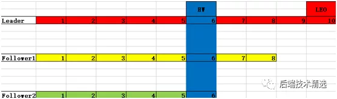

这种设计是为了避免主从数据不一致引发消费者报错的情况，如上图所示，假如消费者消费了8条数据后，leader挂了，Follower2成为leader，上面并没有7、8两条数据，那么消费者就会报错。

- Follower如果在`replica.lag.time.max.ms`时间内没有开始发送fetch请求主从消息同步就被踢出ISR列表，默认10秒。

- 在Kafka-0.9.0版本取消了`replica.lag.max.messages`消息个数限定，默认10000条，之所以被移除是因为kafka发送消息是批量发送的，leader接受消息的一瞬间follower可能还没有拉取，所以会频繁的踢出加入ISR，导致频繁更新zk和内存。

#### 主从同步

##### High Watermarker机制

0.11版本之前Kafka使用high watermarker机制保证数据同步。

高水位线HW(high watermarker), 指消费者能见到的最大的offset，LSR队列中最小的LEO，在它之前的的数据都被视作已经备份，后面的数据消费者看不到也消费不了。当所有节点都备份成功后，Leader会更新水位线。

###### HW机制存在的问题

High Watermarker Truncation followed by Immediate Leader Election（数据丢失）


Replica Divergence on Restart after Multiple Hard Failures（数据不一致）


##### Leader Epoch

Kafka-0.11版本引入了Leader Epoch取代HW作为数据截断的依据。Leader持有一个Leader Epoch, 一个由Controller管理的4字节数字，存储在Zookeeper的分区状态信息中，并作为LeaderAndIsrRequest的一部分传递给继任Leader.

Leader接受Producer请求数据上使用LeaderEpoch标记每个Message。然后，该LeaderEpoch编号将通过复制协议传播，作为消息截断的参考点。


**Follower成为Leader时**

将新的Leader Epoch和对应的LEO添加到Leader Epoch Sequence序列文件的末尾，标记新消息。

**Leader成为Follower时**

向Leader发送包含最新的EpochID和StartOffset信息的epoch请求。Leader接收到以后返回该EpochID所对应的LastOffset信息。

返回的LastOffset更大：Follower需要同步缺少的数据，然后更新Leader Epoch.

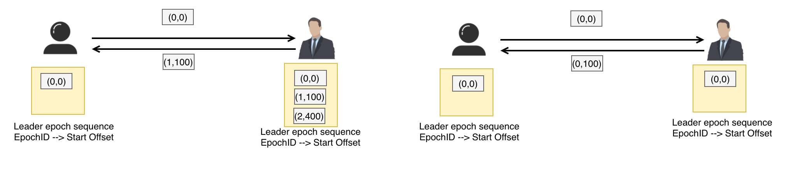

返回的LastOffset更小：Follower需要重置自己的Leader Epoch文件，将Offset修改为Leader返回的LastOffset信息，并且截断自己的日志信息。更新后的Epoch有可能和Leader返回的Epoch存在差异。

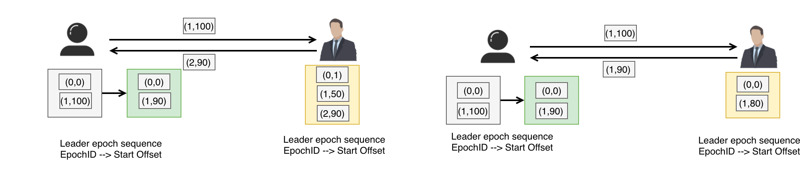

##### HW机制存在的问题

High Watermarker Truncation followed by Immediate Leader Election（数据丢失）

Epoch保证了从其他Broker获取最大LastOffset, 使得消息不会被错误标号，从而避免此问题。

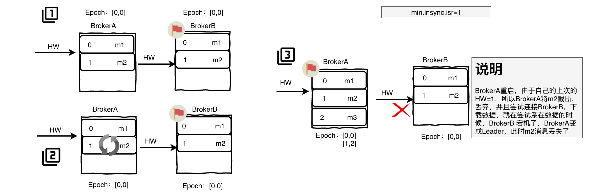

Replica Divergence on Restart after Multiple Hard Failures（数据不一致）

根据其他Broker返回的Epoch, 同步到Leader的数据，从而保证了数据一致性。


### Topic

Topic是一个存储消息的逻辑概念，可以认为是一个queue/消息集合。每个Topic可以有多个生产者向它发送消息，也可以有多个消费者去消费其中的消息。


### Partition

Topic 可以划分多个partition（至少有一个），序号从0开始递增，同一Topic下的不同partition包含的消息是不同的。

每个消息在被添加到分区时，都会被分配一个offset，它是消息在此分区中的唯一编号，Kafka通过offset保证消息在分区内的顺序，offset的顺序不跨分区，即 Kafka只保证在同一个分区内的消息是有序的，消息是每次追加到对应的 Partition的后面，以时间复杂度O(1)方式提供消息持久化能力。


#### 分区策略

由于消息topic由多个partition组成，Kafka可以根据以下不同的分区策略决定消息发送到哪一个partition:

- 第一种分区策略：给定了分区号，直接将数据发送到指定的分区里面去
- 第二种分区策略：没有给定分区号，给定数据的key值，通过key取上hashCode进行分区
- 第三种分区策略：既没有给定分区号，也没有给定key值，直接轮循进行分区
- 第四种分区策略：自定义分区

#### 存储分布

如果Kafka集群只有一个broker，配置server.properties文件中的数据文件存储根目录的参数log.dirs=xxx/message-folder，然后创建2个topic名称分别为report_push、launch_info, partitions数量都为partitions=4，此时存储路径和目录规则为：

xxx/message-folder

|--report_push-0

|--report_push-1

|--report_push-2

|--report_push-3

|--launch_info-0

|--launch_info-1

|--launch_info-2

|--launch_info-3

如果Kafka集群有多个broker，则每个partition会replication-factor个broker上创建副本。创建topic时，replication-factor不可以超过所有broker的个数。

#### 负载均衡

其实是消息在写入kafka的时候就已经被随机写入到一个partiton中，然后不同的partiton对应不同的service, 就实现了负载均衡。

但是不同的group却可以消费相同的partiton的消息。

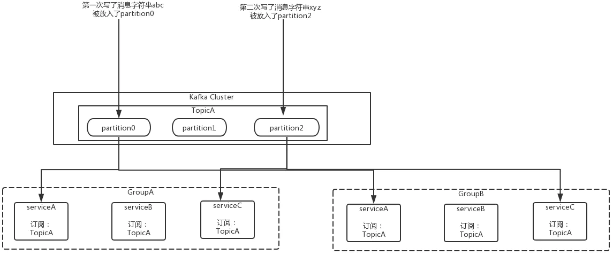

#### Partition选举

为了防止数据不丢失，每一个partition有多个副本，在整个集群中总共有三种副本角色：

- **首领副本**（leader）：也就是leader主副本，每个分区都有一个首领副本，为了保证数据一致性，所有的生产者与消费者的请求都会经过该副本来处理。

- **跟随者副本**（follower）：除了首领副本外的其他所有副本都是跟随者副本，跟随者副本不处理来自客户端的任何请求，只负责从首领副本同步数据，保证与首领保持一致。如果首领副本发生崩溃，就会从这其中选举出一个leader。

- **首选首领副本**：创建分区时指定的首选首领。如果不指定，则为分区的第一个副本。

为了避免数据同步时遇到阻塞造成问题，follower向leader发送的同步请求中包含了follower需要数据的偏移量offset，而且这些offset是有序的。

leader通过跟踪每一个follower的offset来判断它们的复制进度。默认的，如果follower与leader之间超过10s没有发送请求，或者说没有收到请求数据，此时该follower就会被认为**不同步副本**，而持续请求的副本就是**同步副本**。当leader发生故障时，只有**同步副本**才可以被选举为leader. 其中的请求超时时间。可以通过参数replica.lag.time.max.ms参数来配置超时时间。

我们希望每个分区的leader可以分布到不同的broker中，尽可能的达到负载均衡，所以会有一个首选首领，如果我们设置参数**auto.leader.rebalance.enable**为true，那么它会检查首选首领是否是真正的首领，如果不是，则会触发选举，让首选首领成为首领。

#### segment

segment file由.index索引文件和.log数据文件成对组成。两个文件名的设置是从0开始的长度为19的64位long类型变量，没有数字用0填充，后续生成的文件的文件名则是所在partion已发布的最大offset(偏移message数)，如下所示：

- 0000000000000000000.index
- 0000000000000000000.log
- 0000000000000368769.index
- 0000000000000368769.log
- 0000000000000737337.index
- 0000000000000737337.log
- 0000000000001105814.index
- 0000000000001105814.log
- …  

索引文件存储大量元数据，数据文件存储大量消息，索引文件中元数据指向对应数据文件中message的物理偏移地址。索引文件和数据文件的对应关系如下：

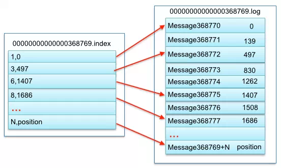

其中以索引文件中元数据3,497为例，依次在数据文件中表示第3个message(在全局partiton表示第368772个message)、以及该消息的物理偏移地址为497。

#### Message

| **关键字**   | **长度（字节）** | **解释说明**                                           |
| ------------ | ---------------- | ------------------------------------------------------ |
| offset       | 8                | 消息编号，偏移量，确定每条消息在parition(分区)内的位置 |
| message size | 4                | message大小                                            |
| CRC32        | 4                | 用crc32校验message                                     |
| “magic"      | 1                | 表示本次发布Kafka服务程序协议版本号                    |
| “attributes" | 1                | 表示为独立版本、或标识压缩类型、或编码类型。           |
| key length   | 4                | 表示key的长度，当key为-1时，K byte key字段不填         |
| key          | 同key length     | 可选                                                   |
| payload      |                  | 表示实际消息数据。                                     |

### Offset

消息在日志中的位置，可以理解是消息在partition上的偏移量，代表该消息的唯一序号。

#### LogStartOffset

表示一个Partition的起始位移，初始为0，虽然消息的增加以及日志清除策略的影响，这个值会阶段性的增大。

#### ConsumerOffset

消费位移，表示Partition的某个消费者消费到的位移位置。

#### HighWatermark

简称HW，代表消费端所能“观察”到的Partition的最高日志位移，HW大于等于ConsumerOffset的值。

#### LogEndOffset

简称LEO, 标识的是每个分区中最后一条消息的下一个位置，其值对消费者不可见。

由于主从需要同步，HW必然不会一直与Leader的LEO相等，即HW<=LEO。


### Producer

消息生产者。

### Consumer

消息消费者，通过pull 方式消费消息。

### Consumer Group

同一Consumer Group中的多个Consumer实例，不同时竞争消费同一个partition.

### Zookeeper

保存着集群broker、topic、partition 等meta 数据；另外，还负责broker故障发现，partition leader选举，负载均衡等功能。

Kafka不能脱离Zookeeper单独使用，因为Kafka使用Zookeeper管理和协调Kafka的节点服务器。

### Kafka是如何实现高吞吐率的？

虽然Kafka的消息是保存或缓存在硬盘上，但是即使是普通服务器也能轻松支持每秒百万级的写入请求。主要利用了以下技术：

#### 顺序读写

硬盘是机械结构，每次读写都会进行寻址+写入操作，而寻址是一个“机械动作”最为耗时。顺序读写不需要硬盘磁头的寻道时间（圆盘上的针来回移动），只需很少的扇区旋转时间，速度远快于随机读写。

Kafka的消息是不断追加到文件中的，可以充分利用磁盘的顺序读写性能。

Kafka官方给出了测试数据(Raid-5，7200rpm)：

顺序I/O: 600MB/s

随机I/O: 100KB/s

但是Kafka归根结底还是机械式的写入，性能跟内存还是没法比，因此Kafka的数据不是实时地写入硬盘中。

#### 零拷贝

传统IO操作的整个过程为：

- 读取磁盘文件到操作系统内核缓冲区；

- 将内核缓冲区的数据，copy 到应用程序的 buffer；

- 将应用程序 buffer 中的数据，copy 到 socket 网络发送缓冲区；

- 将 socket buffer 的数据，copy 到网卡，由网卡进行网络传输。

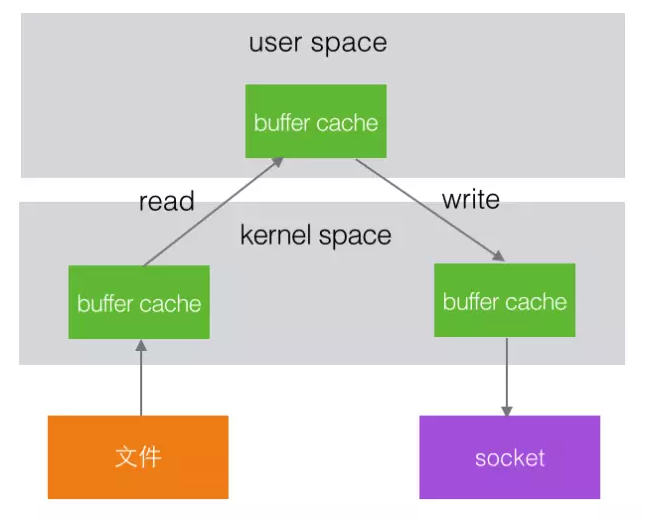


在Linux kernel 2.2之后出现了一种叫做"零拷贝(zero-copy)"系统调用机制，就是跳过“用户缓冲区”的拷贝，建立一个磁盘空间和内存的直接映射，数据不再复制到“用户态缓冲区”，系统上下文切换减少为2次，可以提升一倍的性能。


Kafka使用到了mmap和sendfile的方式来实现零拷贝，分别对应Java的MappedByteBuffer和FileChannel.transferTo

在此模型下，上下文切换的数量减少到一个。transferTo()方法指示块设备通过DMA直接内存控制引擎，将数据读取到读取缓冲区中。然后，将该缓冲区复制到另一个内核缓冲区以暂存到套接字。最后，套接字缓冲区通过 DMA 复制到 NIC 缓冲区。CPU绝对不参与复制缓冲区。


#### PageCache

##### 写数据

Server端的I/O线程统一将请求中的数据写入到操作系统的PageCache后立即返回，利用操作系统的PageCache实现文件到物理内存的直接映射，当消息条数到达一定阈值后，Kafka应用本身或操作系统内核会触发强制刷盘操作，极大降低了IO使用率。

而且只要应用数据写入了内核空间的内存，即使应用宕机，写入的数据也不会再丢失。


使用PageCache虽然提升性能，但是也降低了稳定性：如果操作系统不稳定，例如断电，PageCache丢失就会导致丢数据。所以也可以停用PageCache, 以阻塞的形式直接写入磁盘，等待刷新，刷新后视作写入成功，性能低但是安全。

##### 读数据

当Kafka Broker接收到读数据请求时，会向操作系统发送sendfile系统调用，操作系统接收后，首先试图从PageCache中获取数据。


如果数据不存在，会触发缺页异常中断，将数据从磁盘读入到临时缓冲区中，随后通过DMA操作直接将数据拷贝到网卡缓冲区中等待后续的TCP传输。


#### 文件分段

Kafka的队列topic被分为了多个区partition，每个partition又分为多个段segment，所以一个队列中的消息实际上是保存在N多个片段文件中，通过分段的方式，每次文件操作都是对一个小文件的操作，非常轻便，同时也增加了并行处理能力。


#### 批量发送

Kafka允许进行批量发送消息，是提高消息吞吐量重要的方式。

Producer端可以先将消息缓存在内存中，合并多条消息后，以一次请求的方式发送了批量的消息给broker. 可以指定缓存的消息达到某个量的时候就发出去，或者缓存了固定的时间后就发送出去，如100条消息就发送，或者每5秒发送一次。

这种策略将大大减少broker存储消息的IO操作次数，但也一定程度上影响了消息的实时性。相当于以时延代价，换取更好的吞吐量。

#### 数据压缩

Kafka还支持对消息集合进行压缩，Producer可以通过GZIP或Snappy格式对消息集合进行压缩。

压缩的好处就是减少传输的数据量，减轻对网络传输的压力。

Producer压缩之后，在Consumer需进行解压，虽然增加了CPU的工作，但在对大数据处理上，瓶颈在网络上而不是CPU，所以这个成本很值得。

### Kafka实战

#### 部署

将压缩包解压，修改./config/server.properties

在Socket Server Settings下定义listerners=PLAINTEXT://{主机名}:9092, 注意务必填写主机名而不是IP.

在Log Basics下定义自己需要的log.dirs

在Zookeeper下定义zookeeper.connect={主机名}:2181

#### 启动

确保Zookeeper正常运行后，通过./bin/kafka-server-start.sh {-daemon} config/server.properties启动Kafka, 如果希望Kafka在后台执行不随着窗口关闭而退出就加上参数-daemon. 执行jps可以看到Kafka进程、/usr/下成功创建kafka-logs目录，即代表Kafka启动成功。

如果报以下错误，请将配置文件的位置与配置保持一致

```bash
INFO Registered kafka:type=kafka.Log4jController MBean (kafka.utils.Log4jControllerRegistration$)
[2019-10-30 15:16:57,057] ERROR Exiting Kafka due to fatal exception (kafka.Kafka$)
java.nio.file.NoSuchFileException: config.server.properties
```

#### 关闭

通过./bin/kafka-server-stop.sh关闭Kafka, 优雅的关闭过程需要等待几秒钟的时间，执行jps看不到Kafka进程就代表已经关闭。

