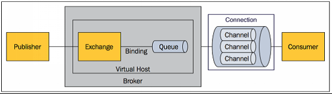

# SYS301 - Distributed Systems - 消息队列 - RabbitMQ

返回[Bulletin](./bulletin.md)

返回[SYS301 - Distributed Systems](./SYS301.md)

返回[SYS301 - Distributed Systems - 消息队列](./SYS3014.md)

[TOC]

## 整体架构

erlang语言开发，性能极其好，延时很低，吞吐量到万级。MQ功能比较完备，而且开源提供的管理界面很好用。社区相对比较活跃，几乎每个月都发布几个版本。

RabbitMQ确实吞吐量会低一些，这是因为他做的实现机制比较重。而且国内很少有公司有实力去做erlang的源码级别的研究和定制，所以很难去看懂源码，基本只能依赖于开源社区的快速维护和修复bug. 而且由于erlang语言本身难懂的问题，rabbitmq集群动态扩展会很麻烦。

### Publisher

消息的生产者，也是一个向交换器发布消息的客户端应用程序。

### Consumer

消息的消费者，表示一个从消息队列中取得消息的客户端应用程序。

### Broker/Server（协商器/服务器）

表示消息队列服务器实体。

### Virtual host（虚拟主机）

虚拟主机是共享相同的身份认证和加密环境的独立服务器域。出于多租户和安全因素设计的⼀个虚拟概念，类似于权限控制组。当多个不同的⽤户使⽤同⼀个RabbitMQ server提供的服务时，可以划分出多个vhost（权限控制的最⼩粒度），每个⽤户在⾃⼰的vhost创建exchange／queue等。

### Connection（连接）

publisher／consumer和broker之间的TCP连接。断开连接的操作只会在client端进⾏，Broker不会断开连接，除⾮出现⽹络故障或broker服务出现问题。

Connection是RabbitMQ的socket链接，它封装了socket协议相关部分逻辑。

Connection Factory则是Connection的制造⼯⼚。

### Channel（信道）

信道，多路复用连接中的一条独立的双向数据流通道。Channel是在connection内部建⽴的逻辑连接。AMQP协议规定只有通过Channel才能执⾏AMQP的命令，所以AMQP命令都是通过信道发出去的，不管是发布消息、订阅队列还是接收消息。

如果每⼀次访问RabbitMQ都建⽴⼀个Connection，在消息量⼤的时候建⽴TCP Connection的开销将是巨⼤的，效率也较低。Channel作为轻量级的Connection可以复用一条TCP连接，极⼤减少了操作系统建⽴TCP connection的开销。可能对⽤户隐藏。

RabbitMQ建议客户端线程之间不要共⽤Channel，⾄少要保证共⽤Channel的线程发送消息必须是串⾏的，但是建议尽量共⽤Connection。

AMQP method包含了channel id帮助client和broker识别channel，所以channel之间是完全隔离的。

### Exchange（交换机）

交换器，message到达broker的第⼀站，接受到⽣产者发送的消息后，根据分发规则，匹配查询表中的routing key，分发消息到queue中去。

#### 性质

- 持久性：如果启⽤，Broker（协商器）只要不重启就⼀直有效。

- ⾃动删除：如果启⽤，那么交换机将会在其绑定的队列都被删除掉之后⾃动删除掉⾃身。

- 惰性：如果没有声明交换机，那么在执⾏导致异常的时候，并不会主动声明。

#### 类型

**fanout** (multicast)

⽆视routing key都通过。

**direct** (point-to-point)

精准匹配routing key通过。

**topic** (publish-subscribe)

模糊匹配routing key通过。“#”通配任何零个或多个word, “*”通配任何单个word.

**header**

headers类型的Exchange不依赖于Routing Key与Binding Key的匹配规则来路由消息，⽽是根据发送的消息内容中的headers属性（也是⼀个键值对的形式）进⾏匹配。如果完全匹配则消息会路由到该Queue，否则不会路由到该Queue。

**failover**和**system**

（⽬前在当前 RabbitMQ 版本中均未实现。）

### Binding（绑定器）

绑定，用于消息队列和交换器之间的关联。一个绑定就是基于路由键将交换器和消息队列连接起来的路由规则，所以可以将交换器理解成一个由绑定构成的路由表，路由表中存储着Message Queue所需消息的限制条件，即Binding Key.

Binding Key由Consumer在绑定Exchange与Message Queue时指定，⽽Routing Key由Producer发送Message时指定，两者的匹配⽅式由Exchange Type决定。

当Exchange收到Message时会解析其Header得到Routing Key，Exchange根据Routing Key与Exchange Type将Message路由到Message Queue。

### Queue（队列）

消息队列，用于存储消息等待consumer取⾛。一个消息可投入一个或多个队列。

#### 性质

- 持久性：如启用，Broker（协商器）只要不重启就⼀直有效。

- ⾃动删除：如果启⽤，那么队列将会在所有的消费者停⽌使⽤之后⾃动删除掉⾃身。

- 惰性：如果没有声明队列，那么在执⾏导致异常的时候，并不会主动声明。

- 排他性：如果启⽤，队列只能被声明它的消费者使⽤。

### Message（消息）

消息由消息头和消息体组成。

- 消息头由一系列的可选属性组成，这些属性包括routing-key（路由键）、priority（相对于其他消息的优先权）、delivery-mode（指出该消息可能需要持久性存储）等。

- 消息体是不透明的。

### Command（命令）

AMQP的命令，客户端通过Command完成与AMQP服务器的交互来实现⾃身的逻辑。例如在RabbitMQ中，客户端可以通过publish命令发送消息，txSelect开启⼀个事务，txCommit提交⼀个事务。

## 事务

RabbitMQ提供了**事务**的功能。事务的实现主要是对信道（Channel）的设置，主要的方法有三个：

- channel.txSelect()声明启动事务模式；

- channel.txComment()提交事务；

- channel.txRollback()回滚事务；

通过将channel设置为**confirm模式**。一旦信道进入confirm模式，所有在该信道上面发布的消息都将会被指派一个唯一的ID(从1开始)，一旦消息被投递到所有匹配的队列之后，broker就会发送一个确认给生产者(包含消息的唯一ID)，这就使得生产者知道消息已经正确到达目的队列了。

## 持久化

把消息**持久化**磁盘可以保证服务器重启消息不丢失。缺点就是降低了服务器的吞吐量，因为使用的是磁盘而非内存存储，从而降低了吞吐量。可尽量使用 ssd 硬盘来缓解吞吐量的问题。

消息持久化需要满足以下四个条件：

- 声明队列必须设置持久化durable设置为true.

- 消息推送投递模式必须设置持久化，deliveryMode设置为2（持久）。

- 消息已经到达持久化交换器。

- 消息已经到达持久化队列。

## 节点类型

每个集群中至少有一个**物理磁盘**，保证消息落入磁盘。

RabbitMQ中有两种节点：

- 磁盘节点：消息会存储到磁盘。

- 内存节点：消息都存储在内存中，重启服务器消息丢失，性能高于磁盘类型。

如果唯一磁盘的磁盘节点崩溃了，集群是可以保持运行的，但不能进行以下修改操作：

- 不能创建队列

- 不能创建交换器

- 不能创建绑定

- 不能添加用户

- 不能更改权限

- 不能添加和删除集群节点

RabbitMQ对集群的停止的顺序是有要求的，应该先关闭内存节点，最后再关闭磁盘节点。如果顺序恰好相反的话，可能会造成消息的丢失。

### 每个节点是其他节点的完整拷贝吗？为什么？

不是，原因有以下两个：

**存储空间**

如果每个节点都拥有所有队列的完全拷贝，这样新增节点不但没有新增存储空间，反而增加了更多的冗余数据。

**性能**

如果每条消息都需要完整拷贝到每一个集群节点，那新增节点并没有提升处理消息的能力，最多是保持和单节点相同的性能甚至是更糟。

## 延迟队列

延迟队列的实现有两种方式：

- 通过消息过期后进入死信交换器，再由交换器转发到延迟消费队列，实现延迟功能；

- 使用RabbitMQ-delayed-message-exchange插件实现延迟功能。

