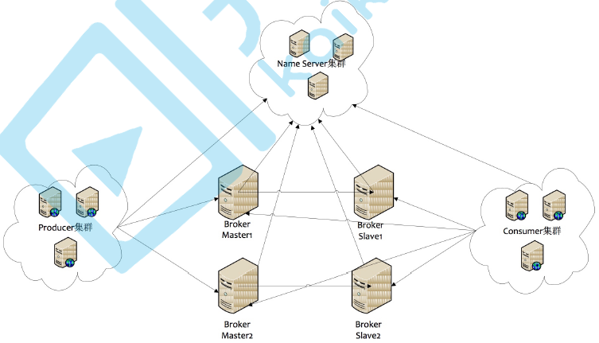

# SYS301 - Distributed Systems - 消息队列 - RocketMQ

返回[Bulletin](./bulletin.md)

返回[SYS301 - Distributed Systems](./SYS301.md)

返回[SYS301 - Distributed Systems - 消息队列](./SYS3014.md)

[TOC]

## 特点

在阿里大规模应用过，有阿里品牌保障，社区维护较好。

日处理消息上百亿之多，可以做到大规模吞吐，性能也非常好，分布式扩展也很方便，可靠性和可用性都是ok的，还可以支撑大规模的topic数量，支持复杂MQ业务场景。

基于Java，便于自行阅读源码进行学习。

## NameServer

RocketMQ是参考Kafka设计的消息队列，但是不依赖Zookeeper, 而是自己的Name Server模块。

这个模块是RocketMQ的注册中心，存储关联信息，且都是无状态节点，可集群部署，节点之间无信息同步。

即使整个Namersrv集群宕机，已经正常工作的Producer, Consumer和Broker依然能正常工作，但是新起的Producer, Consumer, Broker就无法工作。

节省了Zookeeper的选举过程造成的服务效率的损失。

