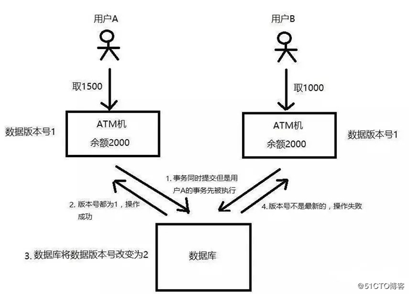
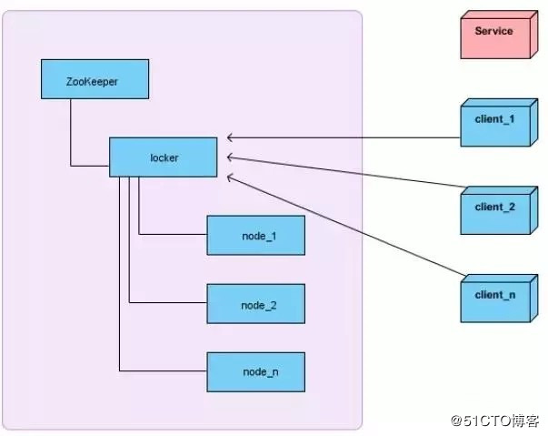

# SYS301 - Distributed Systems - 分布式锁

返回[Bulletin](./bulletin.md)

返回[SYS301 - Distributed Systems](./SYS301.md)

[TOC]

## 基本概念

分布式协调服务ZooKeeper是⼀个解决了数据⼀致性问题的分布式数据库。

在单机场景下，可以使用语言的内置锁来实现进程同步。但是在分布式场景下，需要同步的进程可能位于不同的节点上，那么就需要使用分布式锁。

**要求**

- 排他性：在同一时间只会有一个客户端能获取到锁，其它客户端无法同时获取；

- 避免死锁：这把锁在一段有限的时间之后，一定会被释放（正常释放或异常释放）；

- 高可用：获取或释放锁的机制必须高可用且性能佳。

## 基于数据库唯一索引

要实现分布式锁，最简单的方式可能就是直接创建一张锁表，然后通过操作该表中的数据来实现了。

当我们要锁住某个方法或资源时，我们就在该表中增加一条记录，想要释放锁的时候就删除这条记录。

创建这样一张数据库表：

```sql
CREATE TABLE `methodLock` (
 `id` int(11) NOT NULL AUTO_INCREMENT COMMENT '主键',
 `method_name` varchar(64) NOT NULL DEFAULT '' COMMENT '锁定的方法名',
 `desc` varchar(1024) NOT NULL DEFAULT '备注信息',
 `update_time` timestamp NOT NULL DEFAULT CURRENT_TIMESTAMP ON UPDATE CURRENT_TIMESTAMP  COMMENT '保存数据时间，自动生成',
 PRIMARY KEY (`id`),
 UNIQUE KEY `uidx_method_name` (`method_name `) USING BTREE
) ENGINE=InnoDB DEFAULT CHARSET=utf8 COMMENT='锁定中的方法';
```

当我们想要锁住某个方法时，执行以下SQL：

```sql
insert into methodLock(method_name,desc) values ('method_name','desc');
```

因为我们对method_name做了**唯一性约束**，这里如果有多个请求同时提交到数据库的话，数据库会保证只有一个操作可以成功，那么我们就可以认为操作成功的那个线程获得了该方法的锁，可以执行方法体内容。

当方法执行完毕之后，想要释放锁的话，需要执行以下Sql:

```sql
delete from methodLock where **method_name** ='method_name'
```

**存在的问题与解决方案**

- 这把锁强依赖数据库的可用性，数据库是一个单点，一旦数据库挂掉，会导致业务系统不可用。
  - 数据库是单点？搞两个数据库，数据之前双向同步。一旦挂掉快速切换到备库上。

- 这把锁没有失效时间，一旦解锁操作失败，就会导致锁记录一直在数据库中，其他线程无法再获得到锁。
  - 没有失效时间？只要做一个定时任务，每隔一定时间把数据库中的超时数据清理一遍。

- 这把锁只能是非阻塞的，因为数据的insert操作，一旦插入失败就会直接报错。没有获得锁的线程并不会进入排队队列，要想再次获得锁就要再次触发获得锁操作。
  - 非阻塞的？搞一个while循环，直到insert成功再返回成功。

- 这把锁是非重入的，同一个线程在没有释放锁之前无法再次获得该锁。因为数据中数据已经存在了。
  - 非重入的？在数据库表中加个字段，记录当前获得锁的机器的主机信息和线程信息，那么下次再获取锁的时候先查询数据库，如果当前机器的主机信息和线程信息在数据库可以查到的话，直接把锁分配给他就可以了。

## 基于数据库乐观锁

乐观锁机制其实就是在数据库表中引入一个版本号（version）字段来实现的。

当我们要从数据库中读取数据的时候，同时把这个version字段也读出来，如果要对读出来的数据进行更新后写回数据库，则需要将version加1，同时将新的数据与新的version更新到数据表中，且必须在更新的时候同时检查目前数据库里version值是不是之前的那个version，如果是，则正常更新。如果不是，则更新失败，说明在这个过程中有其它的进程去更新过数据了。



使用乐观锁机制，必须得满足：

- 锁服务要有递增的版本号version

- 每次更新数据的时候都必须先判断版本号对不对，然后再写入新的版本号

## 基于数据库悲观锁

悲观锁也叫作排他锁，在MySQL中是基于 for update 来实现加锁的，可以使用以下方法来实现加锁操作：

```java
public boolean lock() {
   connection.setAutoCommit(false);
   while (true) {
       try {
           result = select * from methodLock where method_name=xxx for update;
           if (result==null) {
               return true;
           }
       } catch(Exception e) {

       }
       sleep(1000);
   }
   return false;
}
```

上面的示例中，user表中，id是主键，通过 for update 操作，数据库在查询的时候就会给这条记录加上排它锁。（需要注意的是，在InnoDB中只有字段加了索引的，才会是行级锁，否者是表级锁，所以这个id字段要加索引）当这条记录加上排它锁之后，其它线程是无法操作这条记录的。

我们可以认为获得排它锁的线程即可获得分布式锁，当获取到锁之后，可以执行方法的业务逻辑，执行完方法之后，再通过以下方法解锁：

```java
public void unlock(){
    connection.commit();
}
```

通过connection.commit()操作来释放锁。

**可以直接解决的问题**

- 阻塞锁？ for update语句会在执行成功后立即返回，在执行失败时一直处于阻塞状态，直到成功。

- 锁定之后服务宕机，无法释放？使用这种方式，服务宕机之后数据库会自己把锁释放掉。

**无法直接解决的问题**

- 数据库单点问题。

- 可重入问题。

- MySQL有时可能会认为全表搜索效率更高，从而不使用索引，比如在处理一些小表的时候。这会导致InnoDB 将使用表锁，而不是行锁。这相当于整个表上所有方法的锁被一个线程占有。

- 一个排他锁长时间不提交，就会占用数据库连接。一旦类似的连接变得多了，就可能把数据库连接池撑爆。

**优点**

- 直接借助数据库，容易理解。

**缺点**

- 会有各种各样的问题，在解决问题的过程中会使整个方案变得越来越复杂。

- 操作数据库需要一定的开销，性能问题需要考虑。

- 用数据库的行级锁并不一定靠谱，尤其是当我们的锁表并不大的时候。

## Redis分布式锁

### 原则

互斥性：在任意时刻，只有一个客户端能持有锁。

不会发生死锁：即使有一个客户端在持有锁的期间崩溃而没有主动解锁，也能保证后续其他客户端能加锁。

解铃还须系铃人：加锁和解锁必须是同一个客户端，客户端自己不能把别人加的锁给解了。

### 配置

通过Maven引入Jedis开源组件，在pom.xml文件加入下面的代码：

```xml
<dependency>
    <groupId>redis.clients</groupId>
    <artifactId>jedis</artifactId>
    <version>2.9.0</version>
</dependency>
```

### 加锁

set()方法一共有五个形参：

- 第一个为key，使用key来当锁，因为key是唯一的。

- 第二个为value，传的是requestId，这样就知道这把锁是哪个请求加的了，在解锁的时候就可以有依据。requestId可以使用UUID.randomUUID().toString()方法生成。

- 第三个为nxxx，这个参数我们填的是NX，意思是SET IF NOT EXIST，即当key不存在时，我们进行set操作；若key已经存在，则不做任何操作。

- 第四个为expx，这个参数我们传的是PX，意思是我们要给这个key加一个过期的设置，具体时间由第五个参数决定。

- 第五个为time，与第四个参数相呼应，代表key的过期时间。

执行上面的set()方法就只会导致两种结果：

- 如果当前没有锁（key不存在），那么就进行加锁操作，并对锁设置有效期，同时value表示加锁的客户端。

- 如果已有锁存在，不做任何操作。

```java
    private static final String LOCK_SUCCESS = "OK";
    private static final String SET_IF_NOT_EXIST = "NX";
    private static final String SET_WITH_EXPIRE_TIME = "PX";
    /**
     * 尝试获取分布式锁
     * @param jedis Redis客户端
     * @param lockKey 锁
     * @param requestId 请求标识
     * @param expireTime 超期时间
     * @return 是否获取成功
     */
    public static boolean tryGetDistributedLock(Jedis jedis, String lockKey, String requestId, int expireTime) {
        String result = jedis.set(lockKey, requestId, SET_IF_NOT_EXIST, SET_WITH_EXPIRE_TIME, expireTime);
        if (LOCK_SUCCESS.equals(result)) {
            return true;
        }
        return false;
    }
```

### 解锁

第一行代码是一个简单的Lua脚本代码。首先获取锁对应的value值，检查是否与requestId相等，如果相等则删除锁（解锁）。

第二行代码将Lua代码传到jedis.eval()方法里交给Redis服务端执行，使参数KEYS[1]赋值为lockKey，ARGV[1]赋值为requestId。在eval命令执行Lua代码的时候，Lua代码将被当成一个命令去执行，并且直到eval命令执行完成，Redis才会执行其他命令，因此保证了原子性。

```java
    private static final Long RELEASE_SUCCESS = 1L;
    /**
     * 释放分布式锁
     * @param jedis Redis客户端
     * @param lockKey 锁
     * @param requestId 请求标识
     * @return 是否释放成功
     */
    public static boolean releaseDistributedLock(Jedis jedis, String lockKey, String requestId) {
        String script = "if redis.call('get', KEYS[1]) == ARGV[1] then return redis.call('del', KEYS[1]) else return 0 end";
        Object result = jedis.eval(script, Collections.singletonList(lockKey), Collections.singletonList(requestId));
        if (RELEASE_SUCCESS.equals(result)) {
            return true;
        }
        return false;
    }
```

### RedLock算法

使用了多个 Redis 实例来实现分布式锁，这是为了保证在发生单点故障时仍然可用。

- 尝试从 N 个互相独立 Redis 实例获取锁；

- 计算获取锁消耗的时间，只有时间小于锁的过期时间，并且从大多数(N/2+1)实例上获取了锁，才认为获取锁成功；

- 如果获取锁失败，就到每个实例上释放锁。

#### 优点

性能很高，可以支撑高并发的获取、释放锁操作。

#### 缺点

- 它获取锁的方式简单粗暴，获取不到锁会一直不断尝试获取锁，比较消耗性能。

- 锁的模型不够健壮，数据并不是强一致性的，在某些极端情况下可能会出现问题，即便使用redlock算法。比如有1~5号五个节点，并且没有开启持久化，客户端A在1，2，3号节点加锁成功，此时3号节点崩溃宕机后发生重启，就丢失了加锁信息，客户端B在3，4，5号节点加锁成功。解决方法是宕机节点延时重启，或者启动持久化。

### Redission

加锁和解锁都是通过lua脚本去实现的，这样做的好处是为了兼容老版本的redis同时保证原子性。

KEYS[1]为锁的key，ARGV[1]为过期时间，ARGV[2]为锁的value，格式为uuid+线程ID。

#### 加锁

如果key不存在，通过hash的方式保存，同时设置过期时间；反之如果存在就是+1。

#### 解锁

如果key都不存在了，那么就直接返回；

如果key、field不匹配，那么说明不是自己的锁，不能释放，返回空。

释放锁，重入次数-1，如果还大于0就刷新过期时间；反之删除锁。

#### watchdog

看门狗是一个后台线程，默认每隔10秒自动延长锁的过期时间，解决了锁超时导致的问题。当业务机器宕机时，定时任务不会执行。

默认的时间就是internalLockLeaseTime / 3，internalLockLeaseTime默认为30秒。

## ZooKeeper分布式锁

### 保持独占

我们将ZooKeeper上的一个Znode看作是一把锁，通过createznode的方式来实现。所有客户端都去创建 /distribute_lock 节点，最终成功创建的那个客户端也即拥有了这把锁。用完删除掉自己创建的distribute_lock节点就释放出锁。

### 控制时序

对于第二类，/distribute_lock 已经预先存在，所有客户端在它下面创建临时顺序编号目录节点，和选master一样，编号最小的获得锁，用完删除，依次方便。



首先所有客户端调用createNode方法在locker节点下创建临时顺序节点。

当客户端想获取锁的时候，调用getChildren ("locker")来获取locker下面的所有子节点。

- 如果客户端发现自己创建的节点在所有创建的子节点序号最小，那么就认为自己获取到了锁，记得在释放锁的时候删除该节点并重新创建。

- 如果不是最小，说明自己还没有获取到锁，此时客户端需要找到比自己小的那个节点，然后对其调用exist()方法，同时对其注册**Watcher事件监听器**。一旦客户端关注的节点被删除，Watcher会收到相应通知，客户端再重复以上流程重新判断是否获得锁。

### 优点

- ZooKeeper天生设计定位就是分布式协调，强一致性。锁的模型健壮、简单易用、适合做分布式锁。

- 如果获取不到锁，只需要添加一个监听器就可以了，不用一直轮询，性能消耗较小。

### 缺点

- 如果有较多的客户端频繁的申请加锁、释放锁，对于ZK集群的压力会比较大。

