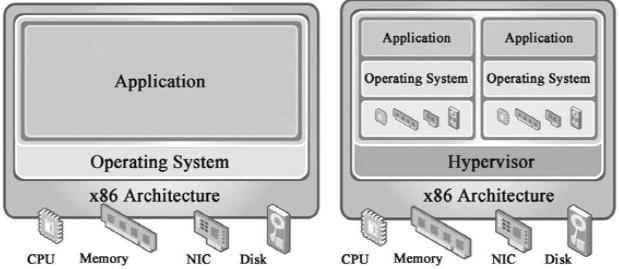
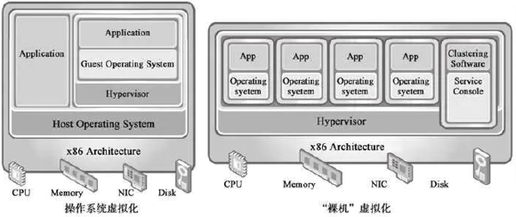

# SYS301 - Distributed Systems - 虚拟化技术

返回[Bulletin](./bulletin.md)

返回[SYS301 - Distributed Systems](./SYS301.md)

[TOC]

## 基本概念

虚拟化技术属于于计算技术的基础架构即服务层（ IAAS），是一种将计算机物理资源进行抽象、转换为虚拟的计算机资源，提供给程序使用的技术。

在计算机中创建虚拟机时，需要将实体机的部分硬盘和内存容量作为虚拟机的硬盘和内存容量。

每个虚拟机都有独立的 CMOS、硬盘和操作系统，可以像使用实体机一样对虚拟机进行操作。在容器技术之前，业界的网红是虚拟机。

虚拟机技术的代表，是VMWare和OpenStack. 

### Hypervisor

虚拟化技术会在本地操作系统之上加多一层Hypervisor层。Hypervisor是一种运行在物理服务器和操作系统之间的中间软件层，可以虚拟化硬件资源，例如cpu、硬盘、内存资源等。然后我们可以基于通过虚拟化出来的资源之上安装操作系统，这也就是所谓的虚拟机。

根据Hypervisor层所处层次和GuestOS对硬件资源使用方式的不同，Hypervisor虚拟化被分为两种类型：

- Bare-metal虚拟化方式（“裸机”虚拟化）

- HostOS虚拟化方式(基于操作系统的虚拟化， 宿主型虚拟化) 

### 优点

**资源池**

一个物理机的资源分配到了不同的虚拟机里，提高了物理资源的利用率。

**很容易扩展**

增加物理机或者虚拟机即可，因为虚拟机是可以通过镜像方式复制的、

**很容易云化**

### 缺点

**重**

hypervisor资源占用太多。

**慢**

虚拟机启动速度慢。

**操作复杂**

Hypervisor管理操作复杂。

**迁移过程复杂**

不同的虚拟机技术，镜像格式不同。

## Linux容器技术

Linux Container（简称LXC）是一种内核轻量级的操作系统层虚拟化技术，由cgroup+namespace+rootfs+容器引擎组成。核心技术是 Cgroup + Namespace.

### Cgroup（资源管理和控制）

Cgroup是Control group的简称，是Linux内核提供的一个特性，用于限制和隔离一组进程对系统资源的使用。

在Cgroup出现之前，只能对一个进程做资源限制，如ulimit限制一个进程的打开文件上限、栈大小。而Cgroup可以对进程进行任意分组，如何分组由用户自定义。

对不同资源的具体管理是由各个子系统分工完成的。

### Namespace（资源隔离）

Namespace是将内核的全局资源做封装，使得每个namespace都有一份独立的资源，因此不同的进程在各自的namespace内对同一种资源的使用互不干扰。

### rootfs

rootfs代表一个Docker容器在启动时(而非运行后)其内部进程可见的文件系统视角，或者叫Docker容器的根目录。

## Docker

Docker 项目的目标是实现轻量级的操作系统虚拟化解决方案。 Docker 的基础是Linux容器（LXC）等技术。在 LXC 的基础上 Docker 进行了进一步的封装，让用户不需要去关心容器的管理，使得操作更为简便。用户操作 Docker 的容器就像操作一个快速轻量级的虚拟机一样简单。

容器是在操作系统层面上实现虚拟化，直接复用本地主机的操作系统，而传统方式则是在硬件层面实现。

### Docker VS KVM

作为一种新兴的虚拟化方式，Docker 跟传统的虚拟化方式相比具有众多的优势。

更快速的交付和部署

更高效的虚拟化

更轻松的迁移和扩展

更简单的管理 

| 特性       | Docker容器         | KVM虚拟机  |
| ---------- | ------------------ | ---------- |
| 启动       | 秒级               | 分钟级     |
| 硬盘使用   | 一般为 MB          | 一般为 GB  |
| 性能       | 接近原生           | 弱于       |
| 系统支持量 | 单机支持上千个容器 | 一般几十个 |

### Docker在实际应用中的一些问题和局限性

LXC是基于cgroup等linux kernel功能的，因此container的guest系统只能是linux base的

隔离性相比KVM之类的虚拟化方案还是有些欠缺。

container随着用户进程的停止而销毁，container中的log等用户数据不便收集。

另外，Docker是面向应用的，其终极目标是构建PAAS平台，而现有虚拟机主要目的是提供一个灵活的计算资源池，是面向架构的，其终极目标是构建一个IAAS平台，所以它不能替代传统虚拟化解决方案。

