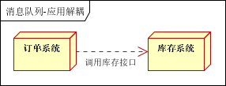
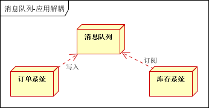
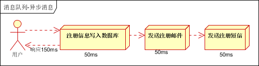
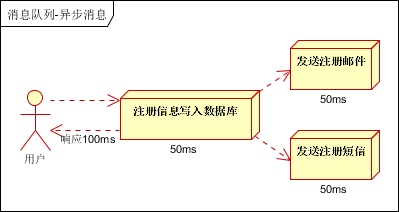
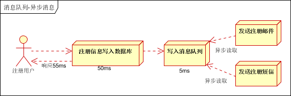
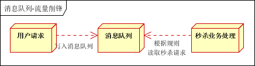
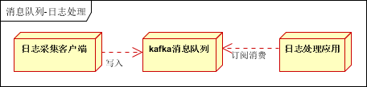
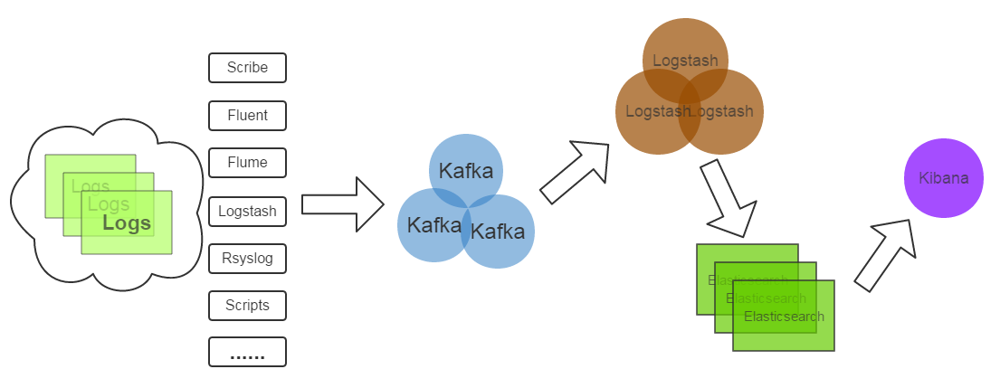
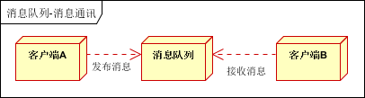
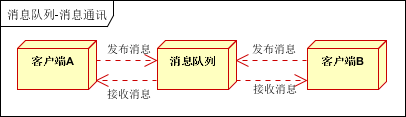

# SYS311 - Message Queue - 基本概念

返回[Bulletin](./bulletin.md)

返回[SYS311 - Message Queue](./SYS311.md)

[TOC]

## 基本概念

消息队列是在消息的传输过程中保存消息的容器。是构建分布式应用的基础，通过消息实现的松耦合架构设计，极大的提高了整体系统的可用性、扩展性、稳定性。

### Broker

消息服务器，作为server提供消息核心服务。

### Producer

消息生产者，业务的发起方，负责生产消息传输给broker.

### Consumer

消息消费者，业务的处理方，负责从broker获取消息并进行业务逻辑处理。

### Topic

主题，发布订阅模式下的消息统一汇集地，不同生产者吐topic发送消息，由MQ服务器分发到不同的订阅者，实现消息的广播。

### Queue

队列，P2P模式下，特定生产者吐特定queue发送消息，消费者订阅特定的queue完成指定消息的接收。

### Message

消息体，根据不同通信协议定义的固定格式迚行编码的数据包，来封装业务数据，实现消息的传输。

## 模型

### Pub/Sub 发布订阅（广播）

使用topic作为通信载体。

### P2P 点对点

使用queue作为通信载体。

## 性能参数

- 不丢/可靠性

- 不重/幂等

- 顺序性

- 可用性/主从选举

- 延时

- 吞吐量

- 可伸缩性/扩容

## 数据传输/MQTT的事务定义

- 最多一次: 消息不会被重复发送，最多被传输一次，但也有可能一次不传输。
- 最少一次: 消息不会被漏发送，最少被传输一次，但也有可能被重复传输。
- 精确的一次（Exactly once）: 不会漏传输也不会重复传输,每个消息都传输被一次而且仅仅被传输一次，这是大家所期望的。

## 使用场景

### 应用解耦

以订单系统+库存系统为例。

#### 引入消息队列前

用户下单后，订单系统直接调用库存系统接口发起通知，缺点是订单系统与库存系统耦合。假如库存系统无法访问，则可能导致订单减库存失败引发的订单下单失败。

#### 引入消息队列后

用户下单后订单系统完成持久化处理，将消息写入消息队列，返回用户订单下单成功。然后

库存系统订阅消息队列中的下单消息，然后进行库存操作。实现上下游系统松耦合设计，可以在下游系统出现异常或宕机的时候不影响更多系统，降低工程间的强依赖程度。

### 异步通信

以注册用户为例。

#### 引入消息队列前

用户注册后，需要发注册邮件和注册短信。传统的做法有两种：

串行方式：将注册信息写入数据库成功后，发送注册邮件，再发送注册短信。以上三个任务全部完成后，返回给客户端。

并行方式：将注册信息写入数据库成功后，发送注册邮件的同时，发送注册短信。以上三个任务完成后，返回给客户端。与串行的差别是，并行的方式可以提高处理的时间。

 

假设三个业务节点每个使用50毫秒钟，不考虑网络等其他开销，则串行方式的时间是150毫秒，并行的时间可能是100毫秒。因为CPU在单位时间内处理的请求数是一定的，假设CPU1秒内吞吐量是100次，则串行方式1秒内CPU可处理的请求量是7次（1000/150），并行方式处理的请求量是10次（1000/100）。

#### 引入消息队列后

注册信息放入队列，并不立即处理它，需要的时候再去处理。用户的响应时间相当于是注册邮件、发送短信写入消息队列后直接返回的时间，也就是50毫秒。因此架构改变后系统的吞吐量提高到每秒20QPS。比串行提高了3倍，比并行提高了2倍。

### 流量错峰

流量削锋也是消息队列中的常用场景，一般在秒杀或团抢活动中使用广泛。

#### 引入消息队列前

秒杀活动存在因为流量暴增导致应用挂掉的隐患。

#### 引入消息队列后

在应用前端加入消息队列，控制活动的人数，可以缓解短时间内高流量防止压垮应用。

用户的请求，由服务器接收后，首先写入消息队列。假如消息队列长度超过最大数量，则直接抛弃用户请求或跳转到错误页面。

秒杀业务拉取消息队列中的请求信息，再做后续处理。

### 日志处理

日志采集客户端负责日志数据采集，定时写受写入Kafka队列。Kafka消息队列负责日志数据的接收，存储和转发。日志处理应用订阅并消费kafka队列中的日志数据。

#### 新浪kafka日志处理应用案例

- Kafka：接收用户日志的消息队列
- Logstash：做日志解析，统一成JSON输出给Elasticsearch
- Elasticsearch：实时日志分析服务的核心技术，一个schemaless，实时的数据存储服务，通过index组织数据，兼具强大的搜索和统计功能
- Kibana：基于Elasticsearch的数据可视化组件，超强的数据可视化能力是众多公司选择ELK stack的重要原因。

### 消息通讯

消息队列一般都内置了高效的通信机制，因此也可以用在纯的消息通讯。

#### 点对点通讯

客户端A和客户端B使用同一队列，进行消息通讯。

#### 聊天室通讯

客户端A，客户端B，客户端N订阅同一主题，进行消息发布和接收。实现类似聊天室效果。

## 缺点

- 系统可用性降低：系统引入的外部依赖越多，越容易挂掉。
- 系统复杂性提高：怎么保证消息没有重复消费？怎么处理消息丢失的情况？怎么保证消息传递的顺序性？

## 常用协议

### AMQP协议(二进制)

AMQP（Advanced Message Queue Protocol, 高级消息队列协议）是一个提供统一消息服务的应用层标准高级消息队列协议, 是应用层协议的一个开放标准，为面向消息的中间件设计。

协议本身包括三层：

#### Module Layer

位于协议最⾼层，主要定义了⼀些供客户端调⽤的命令，客户端可以利⽤这些命令实现⾃⼰的业务逻辑，例如，客户端可以通过queue.declare声明⼀个队列，利⽤consume命令获取⼀个队列中的消息。

#### Session Layer

主要负责将客户端的命令发送给服务器，在将服务器端的应答返回给客户端，主要为客户端与服务器之间通信提供可靠性、同步机制和错误处理。

#### Transport Layer

主要传输⼆进制数据流，提供帧的处理、信道复⽤、错误检测和数据表示。

### MQTT协议（二进制）

MQTT（Message Queuing Telemetry Transport, 消息队列遥测传输）是IBM开发的一个即时通讯协议，有可能成为物联网的重要组成部分。

### STOMP协议（文本）

STOMP（Streaming Text Orientated Message Protocol, 流文本定吐消息协议），面吐消息的中间件设计的简单文本协议。

### XMPP协议

XMPP（可扩展消息处理现场协议, Extensible Messaging and Presence Protocol）是基于可扩展标记语言（XML）的协议，多用于即时消息（IM）以及在线现场探测。适用于服务器之间的准即时操作。

### 其他协议

其他基于TCP/IP自定义的协议有些特殊框架（如：redis、kafka、zeroMq等）根据自身需要未严格遵循MQ规范，而是基于TCP\IP自行封装了一套协议，通过网络socket接口进行传输，实现了MQ的功能。

## 常用消息中间件

目前常见的消息中间件有ActiveMQ、RabbitMQ、ZeroMQ、Kafka、MetaMQ、RocketMQ等，部分数据库如Redis、MySQL也可实现消息队列的功能。

| 特性                    | ActiveMQ                                      | RabbitMQ                                               | RocketMQ                                                     | Kafka                                                        |
| ----------------------- | --------------------------------------------- | ------------------------------------------------------ | ------------------------------------------------------------ | ------------------------------------------------------------ |
| 单机吞吐量              | 万级，吞吐量比RocketMQ和Kafka要低了一个数量级 | 万级，吞吐量比RocketMQ和Kafka要低了一个数量级          | **10万级**，RocketMQ也是可以支撑高吞吐的一种MQ               | **10万级别**，这是kafka最大的优点，就是吞吐量高。            |
| topic数量对吞吐量的影响 |                                               |                                                        | topic可以达到几百，**几千个**的级别，吞吐量会有较小幅度的下降。  这是RocketMQ的一大优势，在同等机器下，可以支撑大量的topic | topic从几十个到几百个的时候，吞吐量会大幅度下降。  所以在同等机器下，kafka尽量保证topic数量不要过多。如果要支撑大规模topic，需要增加更多的机器资源 |
| 时效性                  | ms级                                          | **微秒级**，这是rabbitmq的一大特点，延迟是最低的       | ms级                                                         | 延迟在ms级以内                                               |
| 可用性                  | 高，基于主从架构实现高可用性                  | 高，基于主从架构实现高可用性                           | **非常高**，分布式架构                                       | **非常高**，kafka是分布式的，一个数据多个副本，少数机器宕机，不会丢失数据，不会导致不可用 |
| 消息可靠性              | 有较低的概率丢失数据                          |                                                        | 经过参数优化配置，可以做到**0丢失**                          | 经过参数优化配置，消息可以做到**0丢失**                      |
| 功能支持                | MQ领域的功能极其完备                          | 基于erlang开发，所以并发能力很强，性能极其好，延时很低 | MQ功能较为完善，还是分布式的，扩展性好                       | 功能较为简单，主要支持简单的MQ功能，在大数据领域的实时计算以及日志采集被大规模使用，是事实上的标准 |

### Disruptor

由交易所开发的单机最快MQ. 由于内部全是CAS, 单机支持很高的并发。可以理解为在内存里用于存放元素的一个高效率的队列。

