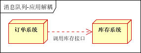
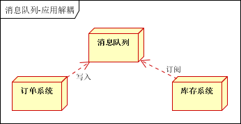
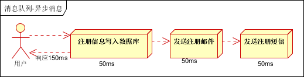
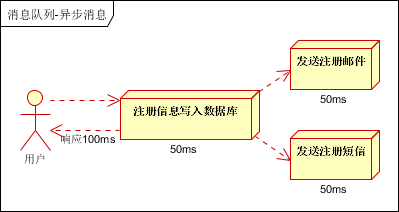
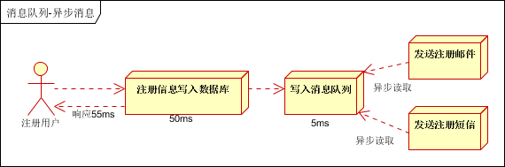
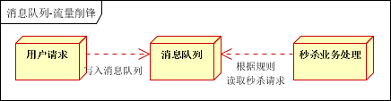
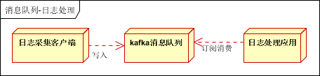
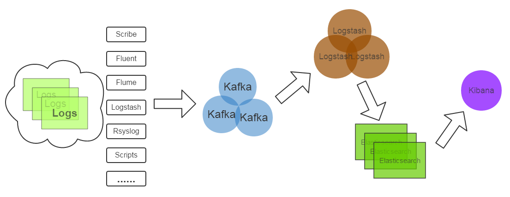
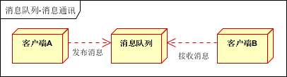
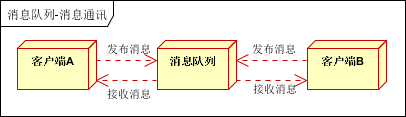

# SYS311 - Message Queue - 基本概念

返回[Bulletin](./bulletin.md)

返回[SYS311 - Message Queue](./SYS311.md)

[TOC]

> **本章定位：**Message Queue Fundamentals。正文建立 Senior Java 必须能随口讲清的机制主线——消息模型、Delivery Semantics、ACK / Retry / 幂等、顺序性、消息积压；协议结构细节与历史产品横向对比完整存档在 Appendix。
>
> 协议名词不是本章重点。**"消息为什么会丢、为什么会重、丢了重了怎么办"**才是。

## 基本概念【P0】

消息队列是在消息的传输过程中保存消息的容器。是构建分布式应用的基础，通过消息实现的松耦合架构设计，极大的提高了整体系统的可用性、扩展性、稳定性。

### Broker

消息服务器，作为server提供消息核心服务：接收 Producer 的消息、持久化、按订阅关系投递给 Consumer。

Broker 在生产环境几乎不会是单点，而是集群 + 多副本。这也是所有"消息不丢"讨论的物理基础——脱离副本和持久化条件谈可靠性没有意义。

### Producer

消息生产者，业务的发起方，负责生产消息传输给broker.

### Consumer

消息消费者，业务的处理方，负责从broker获取消息并进行业务逻辑处理。

### Message

消息体，根据不同通信协议定义的固定格式进行编码的数据包，来封装业务数据，实现消息的传输。

除了业务 payload，工程上一条消息通常还需要携带：

- **Message ID / Business Key**：用于去重、幂等、路由和链路追踪。
- **Header / Timestamp**：追踪、过滤、过期判断。
- **消费位置所需的元信息**：offset / msgid / sequence 等。

> **Senior Java Focus：**被问到"消息里应该有什么"，除了 payload 要主动说出 **identity（消息身份）**。没有稳定的消息身份，后续的 retry、dedup、幂等全部无从谈起。这是理解本章 ACK 与重复消费部分的前置概念。

### Topic

主题，发布订阅模式下的消息统一汇集地，不同生产者向topic发送消息，由MQ服务器分发到不同的订阅者，实现消息的广播。

### Queue

队列，P2P模式下，特定生产者向特定queue发送消息，消费者订阅特定的queue完成指定消息的接收。

### 一条消息的完整链路

后续所有"丢消息 / 重复消息 / 消息积压"的排查，都先回到这张图，定位问题发生在哪一段：

```text
Producer
   ↓ ① 业务是否真的调用了 publish？返回值是成功还是异常？
Client SDK
   ↓ ② 是否收到 ACK？是否 reconnect / replay？消息身份是否保持？
Broker
   ↓ ③ 是否持久化？是否复制到副本？ACK 的成功条件是什么？
Replica / Disk
   ↓ ④ retention / GC 是否已经把消息删掉了？
Consumer
   ↓ ⑤ 消费位置是否推进？是否重复投递？是否落后超过 retention？
Business（DB / RPC / Email / Payment）
   ↓ ⑥ 业务副作用真的成功了吗？业务是否幂等？
```

排查时的第一句话永远是：

> **先定义问题发生在哪一层，而不是先问"为什么 MQ 出问题了"。**

## 消息模型【P0】

### Pub/Sub 发布订阅（广播）

使用topic作为通信载体。

一条消息可以被多个互不知情的订阅方各自独立消费一次。典型用途：一个"订单已支付"事件同时驱动库存、短信、积分、BI。

### P2P 点对点

使用queue作为通信载体。

一条消息只被一个消费者取走并处理，即**竞争消费**。典型用途：把一批同质任务分给一组 worker 并行处理。

### 现实产品的模型差异

不要把两种模型理解成互斥的"产品阵营"。真实产品往往是同一套存储之上提供两种消费语义：

| 产品 | 广播语义 | 竞争消费语义 |
| ---- | -------- | ------------ |
| Kafka | 不同 Consumer Group 各自独立消费同一 Topic | 同一 Consumer Group 内 Partition 分配给单个 Consumer |
| RabbitMQ | 一个 Exchange 绑定多个 Queue，各 Queue 独立消费 | 多个 Consumer 订阅同一 Queue 竞争消费 |
| RocketMQ | 广播模式（BROADCASTING） | 集群模式（CLUSTERING） |
| BigPipe | Pub/Sub 订阅（多个 Subscriber 各读各的 Startpoint） | QueueServer 的 Queue 模式（锁定 + ACK + 重投） |

> **Senior Java Focus：**回答"Pub/Sub 和 P2P 的区别"时，落点不要停在定义，而要落在**消费位置由谁维护**：广播语义下每个订阅方各自维护位置；竞争消费下位置是消费组共享的。这一点直接决定了扩容、重启和重复投递的行为。

## 为什么使用 MQ【P0】

三个最核心的价值：**解耦、异步、削峰**。

### 应用解耦

以订单系统+库存系统为例。

#### 引入消息队列前

用户下单后，订单系统直接调用库存系统接口发起通知，缺点是订单系统与库存系统耦合。假如库存系统无法访问，则可能导致订单减库存失败引发的订单下单失败。



#### 引入消息队列后

用户下单后订单系统完成持久化处理，将消息写入消息队列，返回用户订单下单成功。然后

库存系统订阅消息队列中的下单消息，然后进行库存操作。实现上下游系统松耦合设计，可以在下游系统出现异常或宕机的时候不影响更多系统，降低工程间的强依赖程度。



解耦的实质：**Producer 不需要知道有哪些 Consumer，也不需要在请求路径上等它们完成。**上游的职责收敛为"把事件可靠地交给 MQ"。

```text
没有 MQ：                        有 MQ：
订单服务                          订单服务
├─ 调库存                            │ "订单已支付"
├─ 调短信                            ▼
├─ 调积分                           MQ
└─ 调 BI                         ├─ 库存 Consumer
                                 ├─ 短信 Consumer
下游越多 → 上游依赖越多            ├─ 积分 Consumer
一个下游慢 → 拖慢主链路            └─ BI Consumer
瞬时高峰 → 直接打到所有下游
```

### 异步通信

以注册用户为例。

#### 引入消息队列前

用户注册后，需要发注册邮件和注册短信。传统的做法有两种：

串行方式：将注册信息写入数据库成功后，发送注册邮件，再发送注册短信。以上三个任务全部完成后，返回给客户端。



并行方式：将注册信息写入数据库成功后，发送注册邮件的同时，发送注册短信。以上三个任务完成后，返回给客户端。与串行的差别是，并行的方式可以提高处理的时间。

 

假设三个业务节点每个使用50毫秒钟，不考虑网络等其他开销，则串行方式的时间是150毫秒，并行的时间可能是100毫秒。因为CPU在单位时间内处理的请求数是一定的，假设CPU1秒内吞吐量是100次，则串行方式1秒内CPU可处理的请求量是7次（1000/150），并行方式处理的请求量是10次（1000/100）。

#### 引入消息队列后

注册信息放入队列，并不立即处理它，需要的时候再去处理。用户的响应时间相当于是注册邮件、发送短信写入消息队列后直接返回的时间，也就是50毫秒。因此架构改变后系统的吞吐量提高到每秒20QPS。比串行提高了3倍，比并行提高了2倍。



异步的实质：**把非核心动作从主请求路径上摘下来。**主链路只保留"必须此刻成功"的部分。

### 流量错峰 / 削峰填谷

流量削峰也是消息队列中的常用场景，一般在秒杀或团抢活动中使用广泛。

#### 引入消息队列前

秒杀活动存在因为流量暴增导致应用挂掉的隐患。

#### 引入消息队列后

在应用前端加入消息队列，控制活动的人数，可以缓解短时间内高流量防止压垮应用。

用户的请求，由服务器接收后，首先写入消息队列。假如消息队列长度超过最大数量，则直接抛弃用户请求或跳转到错误页面。

秒杀业务拉取消息队列中的请求信息，再做后续处理。



削峰的实质：**MQ 把瞬时流量变成可以逐步消化的 backlog。**

```text
瞬间 10 万条
     ↓
     MQ（磁盘 backlog）
     ↓
Consumer 每秒稳定处理 1 万条
```

> **Interview Note：**削峰能成立的前提是 **backlog 是有界的**。队列必须有容量上限、有 retention、有监控。"无限排队"不是可靠，而是把雪崩延后——见下文「MQ 的代价」。

### 日志处理

日志采集客户端负责日志数据采集，定时写入Kafka队列。Kafka消息队列负责日志数据的接收，存储和转发。日志处理应用订阅并消费kafka队列中的日志数据。

#### 新浪kafka日志处理应用案例





- Kafka：接收用户日志的消息队列
- Logstash：做日志解析，统一成JSON输出给Elasticsearch
- Elasticsearch：实时日志分析服务的核心技术，一个schemaless，实时的数据存储服务，通过index组织数据，兼具强大的搜索和统计功能
- Kibana：基于Elasticsearch的数据可视化组件，超强的数据可视化能力是众多公司选择ELK stack的重要原因。

### 消息通讯

消息队列一般都内置了高效的通信机制，因此也可以用在纯的消息通讯。

#### 点对点通讯

客户端A和客户端B使用同一队列，进行消息通讯。



#### 聊天室通讯

客户端A，客户端B，客户端N订阅同一主题，进行消息发布和接收。实现类似聊天室效果。



### MQ 并没有消灭复杂度

这是从"会用 MQ"到"能扛线上"的分水岭。

引入 MQ 之后，业务系统之间不再直接互相等待，但系统整体新增了一整套必须回答的问题：

```text
消息会不会丢？
消息会不会重复？
顺序怎么办？
Consumer 慢怎么办？
Broker 挂了怎么办？
消息积压怎么办？
ACK 丢了怎么办？
怎么知道现在到底正常不正常？
```

对应到工程上就是这些机制必须被显式设计：

| 新增问题 | 必须引入的机制 |
| -------- | -------------- |
| 消息丢失 | 持久化、副本、ACK 条件、Retry |
| 重复消息 | 消息身份、去重、业务幂等 |
| 顺序 | 顺序保证范围的划分、路由 key |
| 投递确认 | Producer ACK / Delivery ACK / Business Commit 分层 |
| 消费失败 | Retry、退避、死信队列 |
| 消费积压 | Consumer Lag 监控、Backpressure、容量规划 |
| Broker 故障 | 副本、选主、故障迁移、客户端重新寻址 |
| Consumer 故障 | 消费位置持久化、Rebalance |
| 可观测性 | QPS、延迟、Lag、错误率、副本延迟、磁盘 |

> **Senior Java Focus：**一句话结论——
>
> **MQ 不是把复杂度消灭了，而是用"异步消息系统的复杂度"换掉"业务系统之间强耦合的复杂度"。**
>
> 面试中主动说出这句话，比背三个使用场景更能体现层级。因为它意味着你知道引入 MQ 之后自己要为哪些新问题负责。

## Delivery Semantics 投递语义【P0】

也叫消息传输语义。术语源自 MQTT 的 QoS 定义，但已成为所有消息系统的通用语言。

- **最多一次（At-most-once）**: 消息不会被重复发送，最多被传输一次，但也有可能一次不传输。
- **最少一次（At-least-once）**: 消息不会被漏发送，最少被传输一次，但也有可能被重复传输。
- **精确的一次（Exactly-once）**: 不会漏传输也不会重复传输，每个消息都传输被一次而且仅仅被传输一次，这是大家所期望的。

三者的工程含义：

| 语义 | 典型实现 | 代价 |
| ---- | -------- | ---- |
| At-most-once | 发出即忘、先推进消费位置再处理 | 可能丢，不可恢复 |
| At-least-once | 确认后才推进位置 + 失败重试 | 可能重，需要幂等 |
| Exactly-once | 事务 / 幂等写入 / 去重表 | 延迟与复杂度显著上升，且**有边界** |

绝大多数生产系统的现实选择是：

> **At-least-once + 业务幂等**

而不是去追求消息系统层面的 exactly-once。

### Exactly-once 的边界

这是最容易吹过头、也最容易被追问穿的地方。

**消息系统内部的 exactly-once ≠ 整个业务系统的 exactly-once。**

```text
Consumer 收到消息 M
        ↓
   写数据库
   调用支付
   发邮件
   调用 RPC
        ↓
已经跨出 MQ 自身的事务边界
```

MQ 只能控制"消息在 Broker 与 Consumer 之间被交付几次"。它无法控制 Consumer 拿到消息之后对外部世界产生的副作用。

典型翻车链路：

```text
Consumer 收到 M
↓
银行扣款成功
↓
Consumer 在提交消费进度之前宕机
↓
M 被再次投递
↓
如果业务不幂等 → 再扣一次
```

所以业务侧仍然必须自己准备：

- **unique key**：payment_id / order_id / event_id + 数据库 UNIQUE 约束
- **idempotency key**：跨系统调用携带稳定请求标识，服务端去重
- **状态机**：`INIT → PROCESSING → SUCCESS`，已终态的事件不再执行副作用
- **去重记录 / 幂等表**：显式记录"这个事件我处理过了"
- **transaction / compensation**：本地事务或补偿，处理部分成功

> **Interview Note：**被问"你们怎么保证 exactly-once"，正确回答不是"我们用了 Kafka 事务"，而是：
>
> **把 exactly-once 限定在消息系统自身能控制的发布、传输和恢复范围内；一旦 Consumer 离开 MQ 去写库或调外部系统，就跨了事务边界，业务侧必须用唯一键、状态机或幂等记录来避免重复副作用。**

## ACK / Retry / Idempotency【P0】

### Outcome Unknown：结果未知

分布式消息里最重要、也最常被忽略的一个状态。

```text
Producer
   │
   │ send M
   ▼
Broker
   │
   │ 处理成功、已持久化
   ▼
  ACK
   ✗  ← 网络丢失
   
Producer：timeout
```

此刻 Producer 面对的不是"失败"，而是**不知道**：

```text
A. Broker 根本没收到 / 没成功
B. Broker 成功了，只是 ACK 在回来的路上丢了
```

两种情况在 Producer 侧看起来完全一样。

于是：

```text
如果是 A → 不重试就可能丢消息
如果是 B → 重试就会产生重复消息
```

结论只有一条：

```text
为了不丢  →  Retry / Replay
为了不重  →  Identity + Dedup / Idempotency
```

**Retry 和 Dedup 必须成对设计。**只讲重试不讲去重，等于把丢消息问题换成重复消息问题。

> Timeout 只表示"我没在规定时间内拿到结果"，**不表示对方一定失败**。这句话是后面理解 Kafka `acks`、BigPipe Session 重放、以及 RPC 幂等的共同基础。

### ACK 不是一个统一概念

面试常见问法："ACK 应该在业务处理之前还是之后？"

不要机械回答先后。先判断**这个 ACK 的语义是什么**：

```text
Publish ACK / Producer ACK
→ MQ 告诉 Producer：消息系统已按约定的持久化/复制条件确认收下

Delivery ACK / Consumer ACK
→ Consumer 告诉 MQ：这次投递我收到了 / 我处理到某个语义点了

Business Commit
→ 数据库 / 外部系统的业务副作用真的成功了
```

三者是三个不同的承诺，混为一谈就会出现"MQ 说成功了但业务没做"或"业务做了但 MQ 认为没做"。

在 Delivery ACK 语义下再讨论先后：

```text
先 ACK 后做业务
→ ACK 之后宕机
→ MQ 认为完成，业务可能永远没做（丢）

先做业务后 ACK
→ 业务成功后宕机
→ MQ 认为未完成，会重新投递（重）
→ 所以业务必须幂等
```

工程上的常见取舍是**先业务后 ACK**，接受可能重复，用幂等兜住。但它是取舍，不是唯一正确答案——对可安全重放且副作用可补偿的场景，先 ACK 也成立。

### 幂等的实现手段

| 手段 | 做法 | 注意点 |
| ---- | ---- | ------ |
| 业务唯一键 | `UNIQUE(event_id)`，第二次插入触发 duplicate key | 需要把 duplicate key 识别为"已处理"而不是异常 |
| 状态机 | `INIT → PROCESSING → SUCCESS`，终态不再执行副作用 | 状态转移必须是原子/CAS 的 |
| 幂等记录表 | `event_id → processed` | `SELECT not exists` 再 `INSERT` 之间有并发窗口，仍需唯一约束或事务 |
| 条件更新 | `UPDATE ... WHERE status = 'INIT'` | 用受影响行数判断是否抢到 |

> **Interview Note：**幂等不是"catch 一下 duplicate exception 就完事"，而是必须保证**并发情况下也只有一个合法的状态转移**。

## 顺序性【P0】

讨论消息顺序之前，先明确一件事：

> **顺序保证的范围是什么？**

不要笼统地说"MQ 保证顺序"或"MQ 不保证顺序"，两种说法都是错的。顺序永远是有范围的：

| 范围 | 含义 | 代价 |
| ---- | ---- | ---- |
| Global Ordering | 整个系统所有消息一个全序 | 只能单分区/单队列，并行度极差 |
| Topic Ordering | 一个 Topic 内全序 | Topic 只能有一个分区，等于放弃水平扩展 |
| Partition / Queue Ordering | 单个分区或队列内有序 | 最常见的现实边界 |
| Key Ordering | 同一业务 key 的消息有序 | 需要稳定路由：same key → same partition |

绝大多数业务真正需要的是最后一种：

```text
"同一个 account 的事件必须有序"
        ↓
accountId → hash / stable routing → same partition
        ↓
同 account 有序，不同 account 并行
```

由此得到一条贯穿全章的 trade-off：

> **顺序范围越大，并行度通常越低。**

同时要清楚，以下操作都可能破坏业务顺序语义：

- 增加 partition 数量（repartition 后同一 key 落到不同分区）
- Producer retry 导致乱序（`max.in.flight.requests.per.connection > 1` 且未开幂等）
- Consumer 内部把消息丢进线程池并发处理
- 消息体很大或分区倾斜造成 hot partition

设计时的正确问法是：**业务真正需要的最小顺序范围是什么？**不要为了"有序"把整个系统做成单线程。

具体到产品：Kafka 的顺序边界是 Partition（见 [Kafka](./SYS3115.md)），BigPipe 的顺序边界是 Pipelet（见 [BigPipe](./SYS3116.md)）。

## Message Backlog / Consumer Lag【P0】

### 积压的本质

```text
Producer rate  >  Consumer rate
        ↓
   Lag / Backlog 持续增长
```

原因只有两大类：

```text
A. Producer 突然变快（流量突增、重复 publish、retry storm、大促、批处理任务）
B. Consumer / 下游突然变慢
```

B 类在真实故障里更常见：

- Consumer 处理逻辑变慢
- 下游 DB / Redis / RPC 变慢、连接池耗尽
- 锁竞争、线程池打满
- Consumer 实例异常退出、实例数减少
- 分区数不足，并行度上不去
- 热点 Key / Hot Partition
- 频繁 Rebalance，消费反复中断
- 单条消息过大
- 下游主动限流
- Consumer 自身 GC / CPU / 网络 / 磁盘瓶颈

### 通用排查思路

```text
① Lag / Backlog 是否真的在持续增长？（短 spike 后回落可能只是正常削峰）
② input rate 变大了，还是 output rate 变小了？
③ 按 Partition / Queue 看：是整体积压还是单个分区积压？
④ Consumer 实例数、线程池活跃度、队列长度、单条处理耗时
⑤ 沿下游继续查：DB / RPC / 锁 / 连接池
⑥ 查 Broker 自身：CPU、磁盘延迟、网络、副本延迟
⑦ 再决定：扩 Consumer / 扩 Partition / 优化业务 / 限流保护下游
```

两个反直觉但常考的点：

> **看到 Lag 就直接加 Consumer 是错的。**
>
> 一、并行度受分区数限制——一个分区在同一时刻通常只能由消费组内一个消费者处理，Consumer 多于分区数不会更快。
>
> 二、如果真正的瓶颈是数据库，扩 Consumer 只会把下游打得更死。

### 与线程池堆积是同一个数学问题

```text
线程池： Task arrival rate  >  Worker service rate  →  Queue grows
MQ：     Producer rate      >  Consumer rate        →  Lag grows
```

统一排障框架：

```text
1. arrival 变快了吗？
2. service 变慢了吗？
3. 并行度够吗？
4. 下游卡住了吗？
5. queue 是否 bounded？
6. 扩容会不会只是把瓶颈推到下一层？
```

### Backpressure：为什么"无限排队"不是可靠

```text
Consumer 慢 → Producer 继续无限写 → backlog↑ → 内存/磁盘↑
→ 延迟↑ → timeout↑ → retry↑ → 流量更大 → 雪崩
```

常见 backpressure 手段：bounded queue、in-flight window、pause / resume、rate limit、producer blocking、reject / fail fast。

> 宁可明确拒绝一部分请求，也不要让所有请求一起超时。

Kafka 的 Lag 计算与积压处理 SOP 见 [Kafka](./SYS3115.md)；BigPipe 的 Startpoint 与 Queue 窗口机制见 [BigPipe](./SYS3116.md)。

## 评估一个消息中间件的维度

选型和面试对比题都应该按这些维度展开，而不是背结论：

- **不丢 / 可靠性**：持久化方式、副本数、ACK 条件、刷盘策略
- **不重 / 幂等**：是否提供消息身份、生产端去重、消费端语义
- **顺序性**：顺序保证的范围（全局 / Topic / 分区 / Key）
- **可用性 / 主从选举**：故障检测、选主机制、故障迁移速度
- **延时**：端到端 P50 / P99，而不是最好情况
- **吞吐量**：在什么消息大小、什么副本配置下测出来的
- **可伸缩性 / 扩容**：分区能否在线扩、扩容是否影响路由和顺序

补充两个现代必须看的维度：

- **可观测性**：Lag、副本延迟、请求延迟分位、磁盘水位是否可采集
- **运维成本与生态**：客户端语言支持、监控生态、团队能力

## MQ 的代价

- **系统可用性降低**：系统引入的外部依赖越多，越容易挂掉。MQ 集群本身成为关键路径上的单点集合，需要有独立的高可用与容量规划。
- **系统复杂性提高**：怎么保证消息没有重复消费？怎么处理消息丢失的情况？怎么保证消息传递的顺序性？

除以上两条之外，工程上还要为这些买单：

- **Eventual Consistency 最终一致性**：异步化之后，上下游不再是同一事务内的强一致。业务必须能接受"下游晚一点才生效"，并且要能回答"晚多久算异常"。
- **Observability 可观测性**：链路被 MQ 切开之后，一次业务请求跨了多个进程。没有 trace id、Lag 指标和错误率监控，故障定位成本会急剧上升。
- **Operational Complexity 运维复杂度**：集群部署、版本升级、分区再均衡、磁盘容量、副本修复、客户端版本兼容，都是长期成本。
- **Capacity Planning 容量规划**：backlog 是靠磁盘扛的。retention 多久、消息多大、峰值多少、磁盘什么时候满，必须提前算。
- **Failure Recovery 故障恢复**：Broker 故障、Consumer 故障、控制面故障、磁盘慢/满、网络分区，每一类都要有明确的检测方、接管方和恢复路径，而不是一句"做高可用"。

> **Senior Java Focus：**"引入 MQ 有什么缺点"这道题，答"可用性降低 + 复杂度提高"只是及格。把**最终一致性、可观测性、容量规划、故障恢复**说出来，才说明你真的运维过消息系统。

---

## Appendix — Legacy & Reference Knowledge

> 以下为完整存档：消息协议结构细节、历史产品横向对比、Disruptor。这些内容本身正确，且在存量项目和部分面试中仍会被问到，但不构成 Senior Java 的 MQ 主线，因此不占正文篇幅。

### Appendix A — Messaging Protocols

协议层只需要知道"存在这些标准、各自面向什么场景"，不需要背协议分层结构。

#### AMQP协议(二进制)

AMQP（Advanced Message Queue Protocol, 高级消息队列协议）是一个提供统一消息服务的应用层标准高级消息队列协议, 是应用层协议的一个开放标准，为面向消息的中间件设计。

协议本身包括三层：

##### Module Layer

位于协议最⾼层，主要定义了⼀些供客户端调⽤的命令，客户端可以利⽤这些命令实现⾃⼰的业务逻辑，例如，客户端可以通过queue.declare声明⼀个队列，利⽤consume命令获取⼀个队列中的消息。

##### Session Layer

主要负责将客户端的命令发送给服务器，在将服务器端的应答返回给客户端，主要为客户端与服务器之间通信提供可靠性、同步机制和错误处理。

##### Transport Layer

主要传输⼆进制数据流，提供帧的处理、信道复⽤、错误检测和数据表示。

#### MQTT协议（二进制）

MQTT（Message Queuing Telemetry Transport, 消息队列遥测传输）是IBM开发的一个即时通讯协议，有可能成为物联网的重要组成部分。

MQTT 的 QoS 0 / 1 / 2 三级正是正文 Delivery Semantics 中 at-most-once / at-least-once / exactly-once 术语的来源。

#### STOMP协议（文本）

STOMP（Streaming Text Orientated Message Protocol, 流文本定向消息协议），面向消息的中间件设计的简单文本协议。

#### XMPP协议

XMPP（可扩展消息处理现场协议, Extensible Messaging and Presence Protocol）是基于可扩展标记语言（XML）的协议，多用于即时消息（IM）以及在线现场探测。适用于服务器之间的准即时操作。

#### 其他协议

其他基于TCP/IP自定义的协议有些特殊框架（如：redis、kafka、zeroMq等）根据自身需要未严格遵循MQ规范，而是基于TCP\IP自行封装了一套协议，通过网络socket接口进行传输，实现了MQ的功能。

> **Legacy Note：**Kafka 现代客户端使用的是 Kafka 自有的二进制协议（早期基于自定义 TCP，后续版本引入 ApiVersions / 灵活编码等），并不遵循 AMQP。BigPipe 同样是自定义 TCP + protobuf 报文。自定义协议换来的是吞吐和实现自由度，代价是生态与跨语言客户端要自己维护。

### Appendix B — Historical MQ Product Comparison

目前常见的消息中间件有ActiveMQ、RabbitMQ、ZeroMQ、Kafka、MetaMQ、RocketMQ等，部分数据库如Redis、MySQL也可实现消息队列的功能。

下表为历史积累的资料，**保留作为对比框架**，但其中的绝对数字必须按下方说明理解：

| 特性                    | ActiveMQ                                      | RabbitMQ                                               | RocketMQ                                                     | Kafka                                                        |
| ----------------------- | --------------------------------------------- | ------------------------------------------------------ | ------------------------------------------------------------ | ------------------------------------------------------------ |
| 单机吞吐量              | 万级，吞吐量比RocketMQ和Kafka要低了一个数量级 | 万级，吞吐量比RocketMQ和Kafka要低了一个数量级          | **10万级**，RocketMQ也是可以支撑高吞吐的一种MQ               | **10万级别**，这是kafka最大的优点，就是吞吐量高。            |
| topic数量对吞吐量的影响 |                                               |                                                        | topic可以达到几百，**几千个**的级别，吞吐量会有较小幅度的下降。  这是RocketMQ的一大优势，在同等机器下，可以支撑大量的topic | topic从几十个到几百个的时候，吞吐量会大幅度下降。  所以在同等机器下，kafka尽量保证topic数量不要过多。如果要支撑大规模topic，需要增加更多的机器资源 |
| 时效性                  | ms级                                          | **微秒级**，这是rabbitmq的一大特点，延迟是最低的       | ms级                                                         | 延迟在ms级以内                                               |
| 可用性                  | 高，基于主从架构实现高可用性                  | 高，基于主从架构实现高可用性                           | **非常高**，分布式架构                                       | **非常高**，kafka是分布式的，一个数据多个副本，少数机器宕机，不会丢失数据，不会导致不可用 |
| 消息可靠性              | 有较低的概率丢失数据                          |                                                        | 经过参数优化配置，可以做到**0丢失**                          | 经过参数优化配置，消息可以做到**0丢失**                      |
| 功能支持                | MQ领域的功能极其完备                          | 基于erlang开发，所以并发能力很强，性能极其好，延时很低 | MQ功能较为完善，还是分布式的，扩展性好                       | 功能较为简单，主要支持简单的MQ功能，在大数据领域的实时计算以及日志采集被大规模使用，是事实上的标准 |

> **Historical Benchmark Warning：**上表中的"RabbitMQ 微秒级""Kafka / RocketMQ 10万级""0丢失"等是历史资料在特定条件下的结论，**不应作为 2026 年的正文结论，更不能当作产品固有常数。**
>
> 吞吐和延迟高度依赖：软件版本、硬件配置（磁盘类型、网卡、CPU）、消息大小、批量与压缩策略、副本数与 ACK 条件、刷盘策略、Topic / 分区数量、以及测试模型（同步发送还是批量异步、单生产者还是多生产者）。
>
> 同样，"0丢失"只在明确的 `acks` / `min.insync.replicas` / `replication.factor` 组合与故障假设下成立，不存在无条件不丢消息的配置。
>
> 面试中引用这张表的正确方式：**用它说明各产品的定位差异与设计取舍**（RabbitMQ 重路由与低延迟、RocketMQ 重多 Topic 与金融级可靠、Kafka 重吞吐与日志流），而不是报数字。

#### 表格中需要修正的表述

- "Kafka 一个数据多个副本，少数机器宕机，不会丢失数据，不会导致不可用"——成立的前提是副本同步在 ISR 内、`acks=all` 且 `min.insync.replicas` 配置合理。ISR 收缩到只剩 Leader 时，`acks=all` 退化为 `acks=1`。详见 [Kafka](./SYS3115.md)。
- "经过参数优化配置，可以做到0丢失"——应理解为"在给定配置与故障模型下可做到不丢已确认消息"，不是绝对保证。
- "Kafka 功能较为简单"——这是 Kafka 早期的定位描述。现代 Kafka 已包含事务、Exactly-Once 语义、Kafka Streams、Connect、KRaft 去 ZooKeeper 等能力。

### Appendix C — Disruptor

由交易所（LMAX）开发的单机最快MQ. 由于内部全是CAS, 单机支持很高的并发。可以理解为在内存里用于存放元素的一个高效率的队列。

> **Legacy Note：**Disruptor 是**进程内**的无锁环形队列，不解决跨机器的持久化、副本和故障恢复问题，因此不能与 Kafka / RocketMQ 这类分布式消息系统直接对比。它的价值在于单机内高并发生产者-消费者的低延迟投递，RocketMQ 的 CommitLog 写入等实现借鉴过类似思路。今天面试出现频率已明显下降，了解定位即可。
