# SYS311 - Message Queue - Kafka

返回[Bulletin](./bulletin.md)

返回[SYS311 - Message Queue](./SYS311.md)

[TOC]

## 架构

kafka的特点其实很明显，就是仅仅提供较少的核心功能，但是提供超高的吞吐量，ms级的延迟，极高的可用性以及可靠性，而且分布式可以任意扩展。同时kafka最好是支撑较少的topic数量即可，保证其超高吞吐量。

kafka唯一的一点劣势是有可能消息重复消费，那么对数据准确性会造成极其轻微的影响，在大数据领域中以及日志采集中，这点轻微影响可以忽略。

这个特性天然适合大数据实时计算以及日志收集。

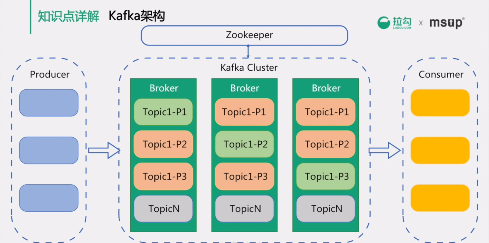

### Broker

Kafka服务器，负责消息存储和转发。

#### 网络模型

Kafka自己实现了网络模型做RPC。底层基于Java NIO, 采用和Netty一样的Reactor线程模型，实现了多路复用和处理线程池。

##### 传统阻塞IO模型存在的问题

一个线程负责一个连接，并发数大时创建线程数多占用资源。

- Reactor模型基于池化思想，避免为每个连接创建线程，连接完成后将业务处理交给线程池处理。

连接建立后，若当前线程没有数据可读，线程会阻塞在读操作上，造成资源浪费。

- 基于IO复用模型，多个连接共用同一个阻塞对象，不用等待所有的连接。遍历到有新数据可以处理时，操作系统会通知程序，线程跳出阻塞状态，进行业务逻辑处理。

其中包含了一个Acceptor线程，用于处理新的连接。Acceptor有N个Processor线程select和read socket请求，N个Handler线程处理请求并相应，即处理业务逻辑。

- 首先客户端发送请求全部会先发送给一个Acceptor. Acceptor不会对客户端的请求做任何的处理，直接封装成socketChannel, 以轮询方式发送给Broker里面的默认3个processor线程，形成socketChannel的队列。

- 消费者线程去消费这些socketChannel时会获取request请求，如果是发布请求则会伴随着数据。

- 线程池里面默认有8个handler线程，这些线程是用来处理request的。handler线程解析请求后，将写请求写到磁盘里，把结果返回给读请求。

- processor会从response中读取响应数据，然后再返回给客户端。

如果需要对kafka进行增强调优，增加processor线程个数和线程池里的处理线程个数，就可以达到效果。request和response那一块部分其实就是起到了一个缓存的效果，作用是防止processor生成请求太快导致线程池处理线程数不够不能及时处理。

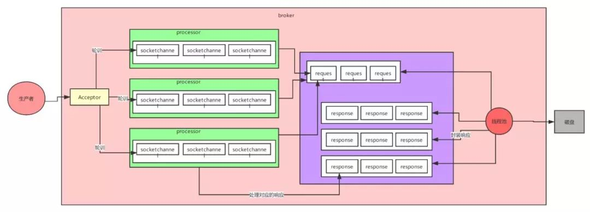

#### 数据自动清除条件

如果同时设定了自动清除数据的时间条件和数据大小条件，那么只要满足任意一个条件，Kafka就会执行数据清除操作。

#### 判断一个Broker节点还存活的两个条件

- 节点必须可以维护和ZooKeeper的连接，Zookeeper通过心跳机制检查每个节点的连接。
- 如果节点是个follower, 他必须能及时的同步leader的写操作，延时不能太久。

#### Broker选举

集群中第一个启动的broker会通过在zookeeper中创建临时节点/controller来让自己成为控制器，其他broker启动时也会在zookeeper中创建临时节点，但是发现节点已经存在，所以它们会收到一个异常，意识到控制器已经存在，那么就会在zookeeper中创建watch对象，便于它们收到控制器变更的通知。

- 如果控制器由于网络原因与zookeeper断开连接或者异常退出，那么其他broker通过watch收到控制器变更的通知，就会去尝试创建临时节点/controller，如果有一个broker创建成功，那么其他broker就会收到创建异常通知，也就意味着集群中已经有了控制器，其他broker只需创建watch对象即可。

- 如果集群中有一个broker发生异常退出了，那么控制器就会检查这个broker是否有分区的副本leader，如果有那么这个分区就需要一个新的leader，此时控制器就会去遍历其他副本，决定哪一个成为新的leader，同时更新分区的ISR集合。

- 如果有一个broker加入集群中，那么控制器就会通过Broker ID去判断新加入的broker中是否含有现有分区的副本，如果有，就会从分区副本中去同步数据。

集群中每选举一次控制器，就会通过zookeeper创建一个controller epoch，每一个选举都会创建一个更大，包含最新信息的epoch，如果有broker收到比这个epoch旧的数据，就会忽略它们，kafka也通过这个epoch来防止集群产生“脑裂”。

#### ISR机制

Kafka采取全部follower同步完成后leader发送ack的方案。为了预防个别follower宕机阻塞发送ack, leader维护了一个动态的ISR(In-sync-replicas)列表（同步副本的作用）。当ISR中的follower完成数据的同步之后，leader就会给生产者发送ack.

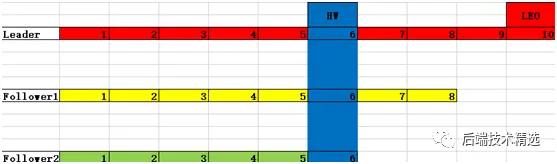

这种设计是为了避免主从数据不一致引发消费者报错的情况，如上图所示，假如消费者消费了8条数据后，leader挂了，Follower2成为leader，上面并没有7、8两条数据，那么消费者就会报错。

- Follower如果在`replica.lag.time.max.ms`时间内没有开始发送fetch请求主从消息同步就被踢出ISR列表，默认10秒。

- 在Kafka-0.9.0版本取消了`replica.lag.max.messages`消息个数限定，默认10000条，之所以被移除是因为kafka发送消息是批量发送的，leader接受消息的一瞬间follower可能还没有拉取，所以会频繁的踢出加入ISR，导致频繁更新zk和内存。

#### 主从同步

##### High Watermarker机制

0.11版本之前Kafka使用high watermarker机制保证数据同步。

高水位线HW(high watermarker), 指消费者能见到的最大的offset，LSR队列中最小的LEO，在它之前的的数据都被视作已经备份，后面的数据消费者看不到也消费不了。当所有节点都备份成功后，Leader会更新水位线。

###### HW机制存在的问题

High Watermarker Truncation followed by Immediate Leader Election（数据丢失）

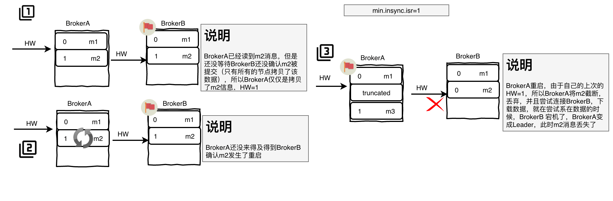

Replica Divergence on Restart after Multiple Hard Failures（数据不一致）

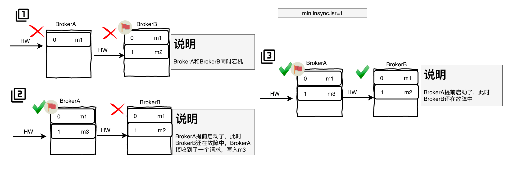

##### Leader Epoch

Kafka-0.11版本引入了Leader Epoch取代HW作为数据截断的依据。Leader持有一个Leader Epoch, 一个由Controller管理的4字节数字，存储在Zookeeper的分区状态信息中，并作为LeaderAndIsrRequest的一部分传递给继任Leader.

Leader接受Producer请求数据上使用LeaderEpoch标记每个Message。然后，该LeaderEpoch编号将通过复制协议传播，作为消息截断的参考点。

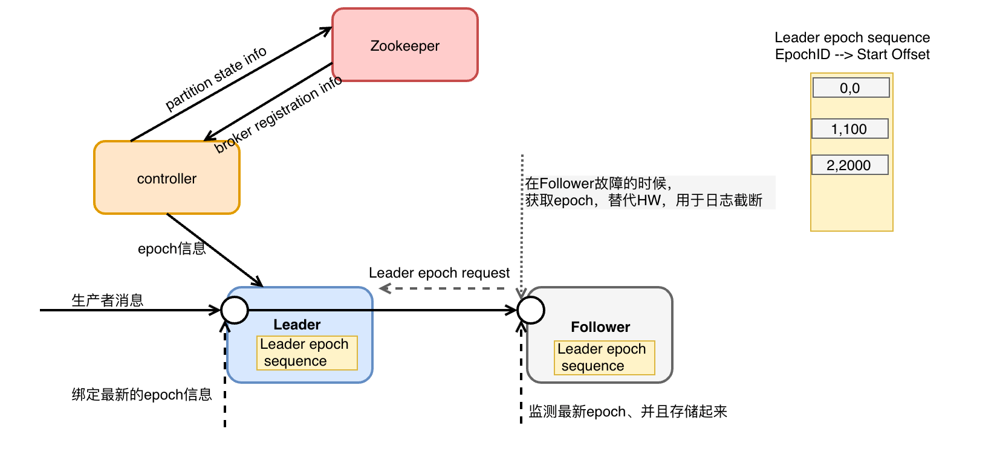

**Follower成为Leader时**

将新的Leader Epoch和对应的LEO添加到Leader Epoch Sequence序列文件的末尾，标记新消息。

**Leader成为Follower时**

向Leader发送包含最新的EpochID和StartOffset信息的epoch请求。Leader接收到以后返回该EpochID所对应的LastOffset信息。

返回的LastOffset更大：Follower需要同步缺少的数据，然后更新Leader Epoch.

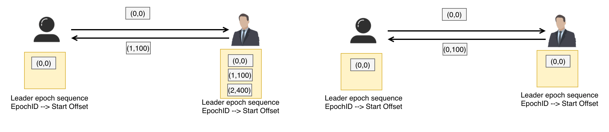

返回的LastOffset更小：Follower需要重置自己的Leader Epoch文件，将Offset修改为Leader返回的LastOffset信息，并且截断自己的日志信息。更新后的Epoch有可能和Leader返回的Epoch存在差异。

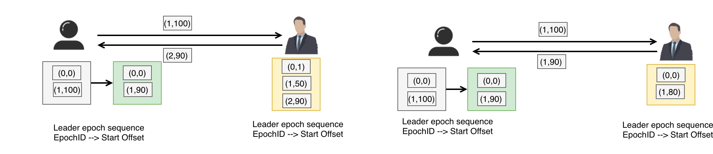

##### HW机制存在的问题

High Watermarker Truncation followed by Immediate Leader Election（数据丢失）

Epoch保证了从其他Broker获取最大LastOffset, 使得消息不会被错误标号，从而避免此问题。

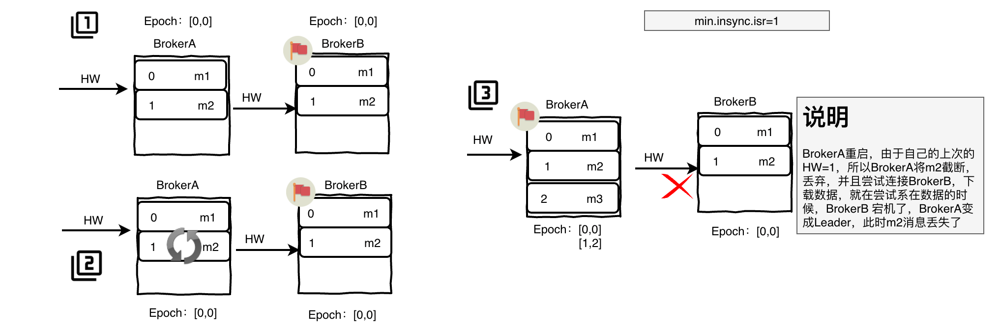

Replica Divergence on Restart after Multiple Hard Failures（数据不一致）

根据其他Broker返回的Epoch, 同步到Leader的数据，从而保证了数据一致性。

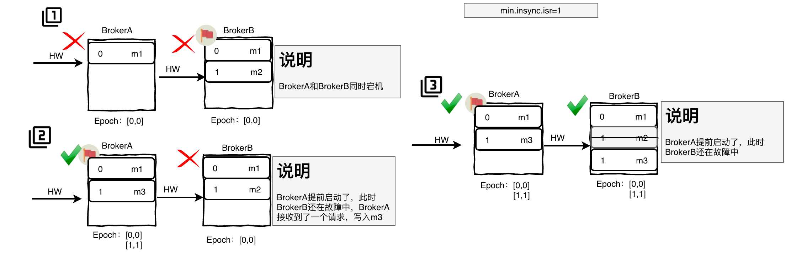

### Topic

Topic是一个存储消息的逻辑概念，可以认为是一个queue/消息集合。每个Topic可以有多个生产者向它发送消息，也可以有多个消费者去消费其中的消息。

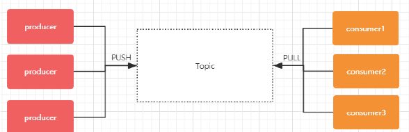

### Partition

Topic 可以划分多个partition（至少有一个），序号从0开始递增，同一Topic下的不同partition包含的消息是不同的。

每个消息在被添加到分区时，都会被分配一个offset，它是消息在此分区中的唯一编号，Kafka通过offset保证消息在分区内的顺序，offset的顺序不跨分区，即 Kafka只保证在同一个分区内的消息是有序的，消息是每次追加到对应的 Partition的后面，以时间复杂度O(1)方式提供消息持久化能力。

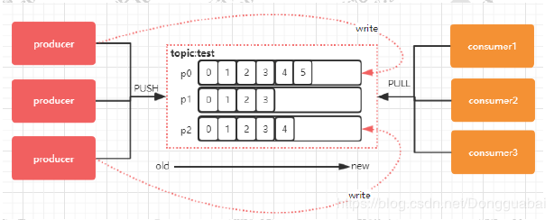

#### 分区策略

由于消息topic由多个partition组成，Kafka可以根据以下不同的分区策略决定消息发送到哪一个partition:

- 第一种分区策略：给定了分区号，直接将数据发送到指定的分区里面去
- 第二种分区策略：没有给定分区号，给定数据的key值，通过key取上hashCode进行分区
- 第三种分区策略：既没有给定分区号，也没有给定key值，直接轮循进行分区
- 第四种分区策略：自定义分区

#### 存储分布

如果Kafka集群只有一个broker，配置server.properties文件中的数据文件存储根目录的参数log.dirs=xxx/message-folder，然后创建2个topic名称分别为report_push、launch_info, partitions数量都为partitions=4，此时存储路径和目录规则为：

xxx/message-folder

|--report_push-0

|--report_push-1

|--report_push-2

|--report_push-3

|--launch_info-0

|--launch_info-1

|--launch_info-2

|--launch_info-3

如果Kafka集群有多个broker，则每个partition会replication-factor个broker上创建副本。创建topic时，replication-factor不可以超过所有broker的个数。

#### 负载均衡

其实是消息在写入kafka的时候就已经被随机写入到一个partiton中，然后不同的partiton对应不同的service, 就实现了负载均衡。

但是不同的group却可以消费相同的partiton的消息。

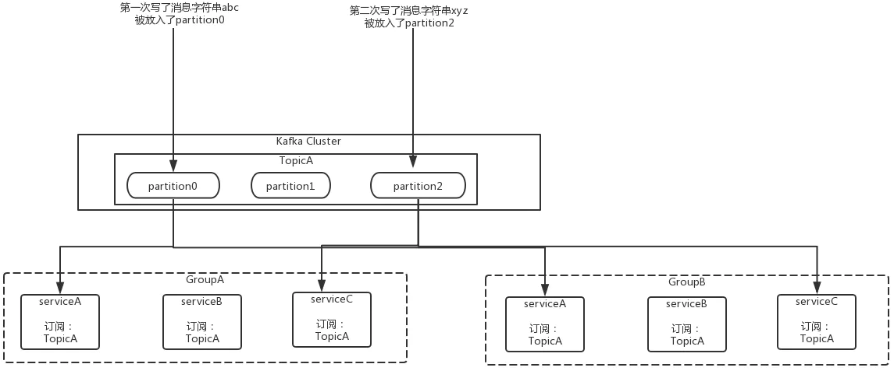

#### Partition选举

为了防止数据不丢失，每一个partition有多个副本，在整个集群中总共有三种副本角色：

- **首领副本**（leader）：也就是leader主副本，每个分区都有一个首领副本，为了保证数据一致性，所有的生产者与消费者的请求都会经过该副本来处理。

- **跟随者副本**（follower）：除了首领副本外的其他所有副本都是跟随者副本，跟随者副本不处理来自客户端的任何请求，只负责从首领副本同步数据，保证与首领保持一致。如果首领副本发生崩溃，就会从这其中选举出一个leader。

- **首选首领副本**：创建分区时指定的首选首领。如果不指定，则为分区的第一个副本。

为了避免数据同步时遇到阻塞造成问题，follower向leader发送的同步请求中包含了follower需要数据的偏移量offset，而且这些offset是有序的。

leader通过跟踪每一个follower的offset来判断它们的复制进度。默认的，如果follower与leader之间超过10s没有发送请求，或者说没有收到请求数据，此时该follower就会被认为**不同步副本**，而持续请求的副本就是**同步副本**。当leader发生故障时，只有**同步副本**才可以被选举为leader. 其中的请求超时时间。可以通过参数replica.lag.time.max.ms参数来配置超时时间。

我们希望每个分区的leader可以分布到不同的broker中，尽可能的达到负载均衡，所以会有一个首选首领，如果我们设置参数**auto.leader.rebalance.enable**为true，那么它会检查首选首领是否是真正的首领，如果不是，则会触发选举，让首选首领成为首领。

#### segment

segment file由.index索引文件和.log数据文件成对组成。两个文件名的设置是从0开始的长度为19的64位long类型变量，没有数字用0填充，后续生成的文件的文件名则是所在partion已发布的最大offset(偏移message数)，如下所示：

- 0000000000000000000.index
- 0000000000000000000.log
- 0000000000000368769.index
- 0000000000000368769.log
- 0000000000000737337.index
- 0000000000000737337.log
- 0000000000001105814.index
- 0000000000001105814.log
- …  

索引文件存储大量元数据，数据文件存储大量消息，索引文件中元数据指向对应数据文件中message的物理偏移地址。索引文件和数据文件的对应关系如下：

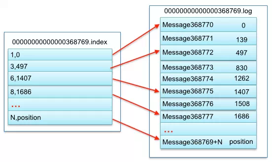

其中以索引文件中元数据3,497为例，依次在数据文件中表示第3个message(在全局partiton表示第368772个message)、以及该消息的物理偏移地址为497。

#### Message

| **关键字**   | **长度（字节）** | **解释说明**                                           |
| ------------ | ---------------- | ------------------------------------------------------ |
| offset       | 8                | 消息编号，偏移量，确定每条消息在parition(分区)内的位置 |
| message size | 4                | message大小                                            |
| CRC32        | 4                | 用crc32校验message                                     |
| “magic"      | 1                | 表示本次发布Kafka服务程序协议版本号                    |
| “attributes" | 1                | 表示为独立版本、或标识压缩类型、或编码类型。           |
| key length   | 4                | 表示key的长度，当key为-1时，K byte key字段不填         |
| key          | 同key length     | 可选                                                   |
| payload      |                  | 表示实际消息数据。                                     |

### Offset

消息在日志中的位置，可以理解是消息在partition上的偏移量，代表该消息的唯一序号。

#### LogStartOffset

表示一个Partition的起始位移，初始为0，虽然消息的增加以及日志清除策略的影响，这个值会阶段性的增大。

#### ConsumerOffset

消费位移，表示Partition的某个消费者消费到的位移位置。

#### HighWatermark

简称HW，代表消费端所能“观察”到的Partition的最高日志位移，HW大于等于ConsumerOffset的值。

#### LogEndOffset

简称LEO, 标识的是每个分区中最后一条消息的下一个位置，其值对消费者不可见。

由于主从需要同步，HW必然不会一直与Leader的LEO相等，即HW<=LEO。

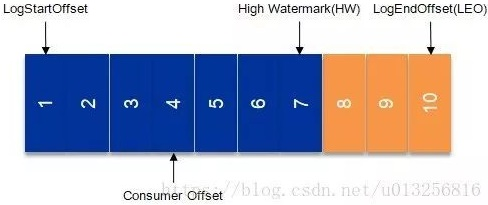

### Producer

消息生产者。

### Consumer

消息消费者，通过pull 方式消费消息。

### Consumer Group

同一Consumer Group中的多个Consumer实例，不同时竞争消费同一个partition.

#### 消费组选主

在kafka的消费端，会有一个消费者协调器以及消费组，组协调器GroupCoordinator需要为消费组内的消费者选举出一个消费组的leader.

如果消费组内还没有leader，那么第一个加入消费组的消费者即为消费组的leader，如果某一个时刻leader消费者由于某些原因退出了消费组，Kafka就会从存放<消费者ID,元数据信息>的HashMap中选出第一项作为新的leader.

```scala
private val members = new mutable.HashMap[String, MemberMetadata]
leaderId = members.keys.headOption
```

### Zookeeper

保存着集群broker、topic、partition 等meta 数据；另外，还负责broker故障发现，partition leader选举，负载均衡等功能。

Kafka不能脱离Zookeeper单独使用，因为Kafka使用Zookeeper管理和协调Kafka的节点服务器。

## Kafka是如何实现高吞吐率的？

虽然Kafka的消息是保存或缓存在硬盘上，但是即使是普通服务器也能轻松支持每秒百万级的写入请求。主要利用了以下技术：

### 顺序读写

硬盘是机械结构，每次读写都会进行寻址+写入操作，而寻址是一个“机械动作”最为耗时。顺序读写不需要硬盘磁头的寻道时间（圆盘上的针来回移动），只需很少的扇区旋转时间，速度远快于随机读写。

Kafka的消息是不断追加到文件中的，可以充分利用磁盘的顺序读写性能。

Kafka官方给出了测试数据(Raid-5，7200rpm)：

顺序I/O: 600MB/s

随机I/O: 100KB/s

但是Kafka归根结底还是机械式的写入，性能跟内存还是没法比，因此Kafka的数据不是实时地写入硬盘中。

### 零拷贝

传统IO操作的整个过程为：

- 读取磁盘文件到操作系统内核缓冲区；

- 将内核缓冲区的数据，copy 到应用程序的 buffer；

- 将应用程序 buffer 中的数据，copy 到 socket 网络发送缓冲区；

- 将 socket buffer 的数据，copy 到网卡，由网卡进行网络传输。

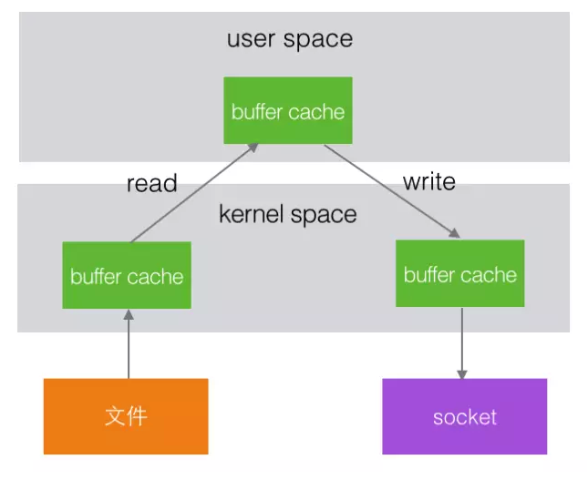

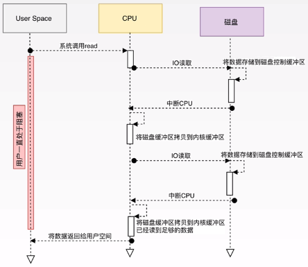

在Linux kernel 2.2之后出现了一种叫做"零拷贝(zero-copy)"系统调用机制，就是跳过“用户缓冲区”的拷贝，建立一个磁盘空间和内存的直接映射，数据不再复制到“用户态缓冲区”，系统上下文切换减少为2次，可以提升一倍的性能。

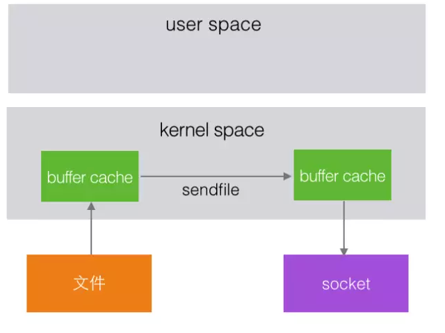

Kafka使用到了mmap和sendfile的方式来实现零拷贝，分别对应Java的MappedByteBuffer和FileChannel.transferTo

在此模型下，上下文切换的数量减少到一个。transferTo()方法指示块设备通过DMA直接内存控制引擎，将数据读取到读取缓冲区中。然后，将该缓冲区复制到另一个内核缓冲区以暂存到套接字。最后，套接字缓冲区通过 DMA 复制到 NIC 缓冲区。CPU绝对不参与复制缓冲区。

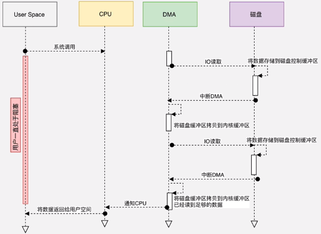

### PageCache

#### 写数据

Server端的I/O线程统一将请求中的数据写入到操作系统的PageCache后立即返回，利用操作系统的PageCache实现文件到物理内存的直接映射，当消息条数到达一定阈值后，Kafka应用本身或操作系统内核会触发强制刷盘操作，极大降低了IO使用率。

而且只要应用数据写入了内核空间的内存，即使应用宕机，写入的数据也不会再丢失。

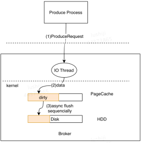

使用PageCache虽然提升性能，但是也降低了稳定性：如果操作系统不稳定，例如断电，PageCache丢失就会导致丢数据。所以也可以停用PageCache, 以阻塞的形式直接写入磁盘，等待刷新，刷新后视作写入成功，性能低但是安全。

#### 读数据

当Kafka Broker接收到读数据请求时，会向操作系统发送sendfile系统调用，操作系统接收后，首先试图从PageCache中获取数据。

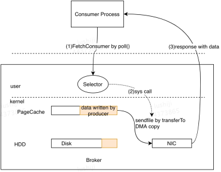

如果数据不存在，会触发缺页异常中断，将数据从磁盘读入到临时缓冲区中，随后通过DMA操作直接将数据拷贝到网卡缓冲区中等待后续的TCP传输。

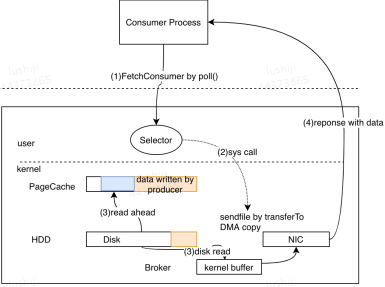

### 文件分段

Kafka的队列topic被分为了多个区partition，每个partition又分为多个段segment，所以一个队列中的消息实际上是保存在N多个片段文件中，通过分段的方式，每次文件操作都是对一个小文件的操作，非常轻便，同时也增加了并行处理能力。

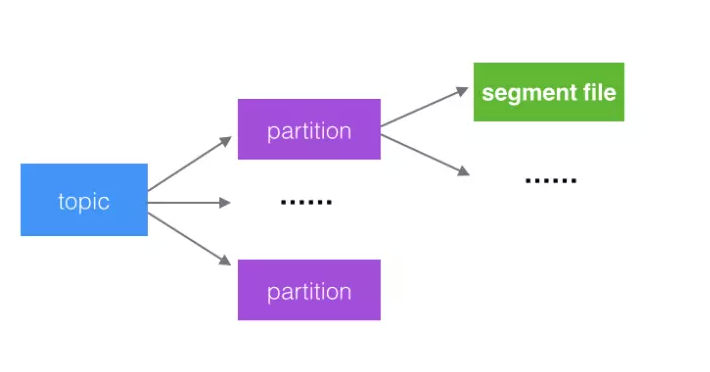

### 批量发送

Kafka允许进行批量发送消息，是提高消息吞吐量重要的方式。

Producer端可以先将消息缓存在内存中，合并多条消息后，以一次请求的方式发送了批量的消息给broker. 可以指定缓存的消息达到某个量的时候就发出去，或者缓存了固定的时间后就发送出去，如100条消息就发送，或者每5秒发送一次。

这种策略将大大减少broker存储消息的IO操作次数，但也一定程度上影响了消息的实时性。相当于以时延代价，换取更好的吞吐量。

### 数据压缩

Kafka还支持对消息集合进行压缩，Producer可以通过GZIP或Snappy格式对消息集合进行压缩。

压缩的好处就是减少传输的数据量，减轻对网络传输的压力。

Producer压缩之后，在Consumer需进行解压，虽然增加了CPU的工作，但在对大数据处理上，瓶颈在网络上而不是CPU，所以这个成本很值得。

## 保证不漏

### ACK机制

为保证生产者能**可靠**地发送数据到指定的topic，topic的每个partition收到生产者发送的数据后，都需要向生产者发送ack（确认收到）。生产者收到ack才会进行下一轮的发送，否则需要重新发送数据。

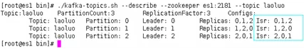

Kafka为用户提供了三种可靠性级别，用户可以根据可靠性和延迟进行权衡，这个设置在kafka的acks参数：

**acks=0**

生产者不等ack，只管往topic丢数据就可以了。这个丢数据的概率非常高。

**acks=1**

Leader落盘后就会返回ack，不等follower同步结果。如果leader在同步完成后出现故障，则会出现数据丢失。

**acks=-1/all**

Leader和ISR中的follower落盘才会返回ack. 可能会出现数据重复现象，比如leader已经写完成且follower同步完成，但是返回ack时出现故障。极限情况下也可能会出现数据丢失的情况，比如所有follower和leader通信都很慢，所以ISR中只有一个leader节点，这个时候，leader完成落盘，就会返回ack，如果此时leader故障后，就会导致丢失数据。

### Retry机制

如果没有在规定时间内收到ACK, Kafka生产者会尝试若干次重新发送消息，然后丢弃。

request.timeout.ms = 30000 默认

```java
props.put(ProducerConfig.RETRIES_CONFIG, 3);
```

retries = 2147483647 默认，这个次数不包含第一次发送

```java
props.put(ProducerConfig.REQUEST_TIMEOUT_MS_CONFIG, 100);
```

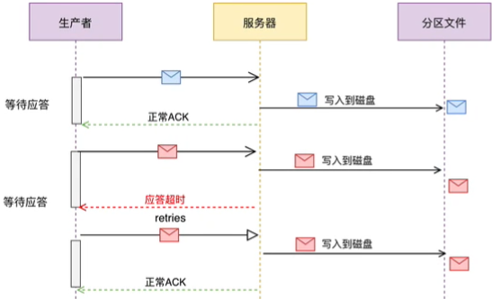

## 保证不重

### 幂等

HTTP/1.1中对幂等性的定义是：一次和多次请求某一个资源对于资源本身应该具有同样的结果（网络超时等问题除外）。也就是说，其任意多次执行对资源本身所产生的影响均与一次执行的影响相同。

Kafka在0.11.0.0版本增加了针对生产者角度的对幂等的支持。

要想区分请求是否重复，请求中就得有唯一标识Producer ID或PID，还需要记录下哪些请求是已经处理过的。这样当收到新的请求时，用新请求中的标识和处理记录进行比较，仅当消息的序列号比该PID / TopicPartition对中最后提交的消息正好大1时，Broker才会接受该消息。否则说明是重复记录，拒绝掉。

enable.idempotence=false 默认

max.in.flight.requests.per.connection阻塞客户端的请求个数，大于1时将不保证有序，幂等写要求这个值不超过5，默认=5。除此以外，幂等写还要求retries=true和acks=all

```java
props.put(ProducerConfig.ENABLE_IDEMPOTENCE_CONFIG, true);
props.put(ProducerConfig.MAX_IN_FLIGHT_REQUESTS_PER_CONNECTION, 1);
```

 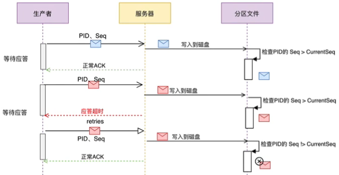

### 事务

Kafka0.11.0.0引入的幂等性只能保证一条记录在单分区发送的原子性，如果要保证多条记录、多个分区之间的完整性就需要开启Kafka0.11.0.0引入的事务操作。

#### 生产者事务

生产者需要配置transaction.id属性

生产者不需要再配置enable.idempotence，因为如果配置了transaction.id，则此时enable.idempotence会被设置为true

```java
//配置事务ID
props.put(ProducerConfig.TRANSACTIONAL_ID_CONFIG, "transaction-id" + UUID.randomUUID().toString());
//配置Kafka批处理大小
props.put(ProducerConfig.BATCH_SIZE_CONFIG, 1024);
//配置大小不满足批处理大小时的自动发送等待时间
props.put(ProducerConfig.LINGER_MS_CONFIG, 5);
```

#### 消费者事务

消费者需要设置自动模式为false, 并且不能再手动执行consumer#commitSync或者consumer#commitAsyc

```java
props.put(ConsumerConfig.ENABLE_AUTO_COMMIT_CONFIG, false);
```

消费者需要配置Isolation.level, 默认为READ_UNCOMMITTED. 在consume-transform-produce模式下使用事务时，必须设置为READ_COMMITTED.

```java
props.put(ConsumerConfig.ISOLATION_LEVEL_CONFIG, "read_committed");
```

### 流式EOS

EOS保证整个操作是原子性，仅限Kafka Streams.

在Kafka Streams程序中设置processing.guarantee=exactly_once

## 延迟队列

### 方案设计

在发送延时消息的时候并不是先投递到要发送的真实主题（real_topic）中，而是先按照不同的延时等级投递到一些对外不可见的Kafka内部的主题（delay_topic）中，然后通过一个自定义的服务拉取这些内部主题中的消息，并将满足条件的消息再投递到要发送的真实的主题中，消费者所订阅的还是真实的主题。

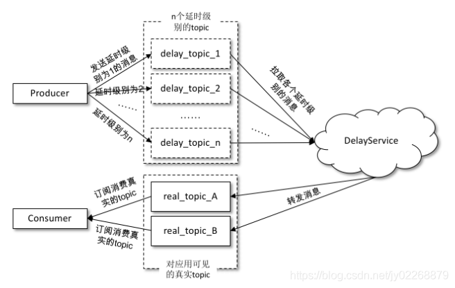

发送到内部主题（delaytopic*）中的消息会被一个独立的DelayService进程消费，这个DelayService进程和Kafka broker进程可以以一对一的配比进行同机部署以保证服务的可用性。

针对不同延时级别的主题，在DelayService的内部都会有单独的线程来进行消息的拉取，以及单独的DelayQueue（这里用的是JUC中DelayQueue）进行消息的暂存。与此同时，在DelayService内部还会有专门的消息发送线程来获取 DelayQueue 的消息并转发到真实的主题中。从消费、暂存再到转发，线程之间都是一一对应的关系。

DelayService 的设计应当尽量保持简单，避免锁机制产生的隐患。

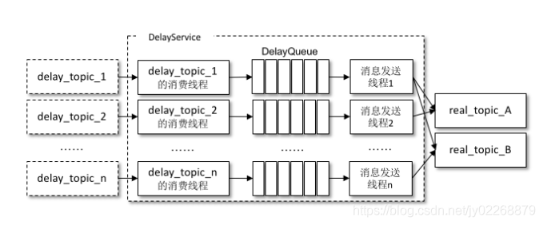

为了保障内部DelayQueue不会因为未处理的消息过多而导致内存的占用过大，DelayService会对主题中的每个分区进行计数，当达到一定的阈值之后，就会暂停拉取该分区中的消息。

因为一个主题中一般不止一个分区，分区之间的消息并不会按照投递时间进行排序，DelayQueue的作用是将消息按照再次投递时间进行有序排序，这样下游的消息发送线程就能够按照先后顺序获取最先满足投递条件的消息。

### 重试队列和死信队列

死信可以看作消费者不能处理收到的消息，也可以看作消费者不想处理收到的消息，还可以看作不符合处理要求的消息。

**重试队列**在消息消费失败时将消息回滚到broker中，一般分成多个重试等级、设置对应的重新投递延时，重试次数越多投递延时就越大。

当投递次数超过设置的上限，消息进入**死信队列**。

重试队列与延时队列有相同的地方，都需要设置延时级别。

## Kafka实战

### 部署

将压缩包解压，修改./config/server.properties

在Socket Server Settings下定义listerners=PLAINTEXT://{主机名}:9092, 注意务必填写主机名而不是IP.

在Log Basics下定义自己需要的log.dirs

在Zookeeper下定义zookeeper.connect={主机名}:2181

### 启动

确保Zookeeper正常运行后，通过./bin/kafka-server-start.sh {-daemon} config/server.properties启动Kafka, 如果希望Kafka在后台执行不随着窗口关闭而退出就加上参数-daemon. 执行jps可以看到Kafka进程、/usr/下成功创建kafka-logs目录，即代表Kafka启动成功。

如果报以下错误，请将配置文件的位置与配置保持一致

```bash
INFO Registered kafka:type=kafka.Log4jController MBean (kafka.utils.Log4jControllerRegistration$)
[2019-10-30 15:16:57,057] ERROR Exiting Kafka due to fatal exception (kafka.Kafka$)
java.nio.file.NoSuchFileException: config.server.properties
```

### 关闭

通过./bin/kafka-server-stop.sh关闭Kafka, 优雅的关闭过程需要等待几秒钟的时间，执行jps看不到Kafka进程就代表已经关闭。

### Topic指令

Kafka 2.0起，./bin/kafka-topics.sh的--zookeeper参数已被废弃，统一使用--bootstrap-server参数。

#### 创建topic

```bash
./bin/kafka-topics.sh --bootstrap-server {主机名}:9092 --create --topic {topic名} --partitions {分区数} --replication-factor {副本因子，不能超过broker个数}
```

##### 查看topic列表

```bash
./bin/kafka-topics.sh --bootstrap-server {主机名}:9092 --list
topic01
topic1
```

#### 查看topic详情

```bash
./bin/kafka-topics.sh --bootstrap-server ltprcCentOS:9092 --describe

Topic:topic01 PartitionCount:3    ReplicationFactor:1   Configs:segment.bytes=1073741824
Topic: topic01 Partition: 0  Leader: 0    Replicas: 0   Isr: 0
Topic: topic01 Partition: 1  Leader: 0    Replicas: 0   Isr: 0
Topic: topic01 Partition: 2  Leader: 0    Replicas: 0   Isr: 0
Topic:topic1  PartitionCount:1    ReplicationFactor:1   Configs:segment.bytes=1073741824        
Topic: topic1  Partition:  0  Leader: 0    Replicas: 0   Isr: 0
```

#### 修改topic的partition个数

```bash
./bin/kafka-topics.sh --bootstrap-server {主机名}:9092 --alter --topic {topic名} --partitions {新的分区数，只能更高不能更低}
```

#### 删除topic

```bash
./bin/kafka-topics.sh --bootstrap-server {主机名}:9092 --delete --topic {topic名}
```

#### 查看group列表

```bash
./bin/kafka-consumer-groups.sh --bootstrap-server {主机名}:9092 --list
```

#### 查看group详情

```bash
./bin/kafka-consumer-groups.sh --bootstrap-server {主机名}:9092 --group {group名} --describe
```

### 收发消息指令

#### 发送topic

```bas
./bin/kafka-console-producer.sh --broker-list {主机名}:9092 --topic {topic名}
```

#### 订阅topic

```bash
./bin/kafka-console-consumer.sh --bootstrap-server {主机名}:9092 --topic {topic名} --group {group名}
```

如果多个group名相同的订阅者订阅同一个topic, 会进行竞争消费，每条消息只有一个接受者。

如果多个group名不同的订阅者订阅同一个topic, 会进行组间广播，每条消息都全会被收到。

```bash
--property print.key=true #消费时是否打印key
--property print.value=true #消费时是否打印value即消息内容
--property key.seperator=, #消费时key和value的打印间隔
```

### Java API

#### 初始化客户端连接

```java
public static void init() {
    Properties props = new Properties();
    props.put(AdminClientConfig.BOOTSTRAP_SERVERS_CONFIG, KAFKA_IP + ":" + KAFKA_PORT);
    adminClient = (KafkaAdminClient) KafkaAdminClient.create(props);
}
```

```bash
INFO 2021-01-23 08:57:43 org.apache.kafka.clients.admin.AdminClientConfig - AdminClientConfig values: 
	bootstrap.servers = [192.168.137.128:9092]
	client.dns.lookup = use_all_dns_ips
	client.id = 
	connections.max.idle.ms = 300000
	default.api.timeout.ms = 60000
	metadata.max.age.ms = 300000
	metric.reporters = []
	metrics.num.samples = 2
	metrics.recording.level = INFO
	metrics.sample.window.ms = 30000
	receive.buffer.bytes = 65536
	reconnect.backoff.max.ms = 1000
	reconnect.backoff.ms = 50
	request.timeout.ms = 30000
	retries = 2147483647
	retry.backoff.ms = 100
	sasl.client.callback.handler.class = null
	sasl.jaas.config = null
	sasl.kerberos.kinit.cmd = /usr/bin/kinit
	sasl.kerberos.min.time.before.relogin = 60000
	sasl.kerberos.service.name = null
	sasl.kerberos.ticket.renew.jitter = 0.05
	sasl.kerberos.ticket.renew.window.factor = 0.8
	sasl.login.callback.handler.class = null
	sasl.login.class = null
	sasl.login.refresh.buffer.seconds = 300
	sasl.login.refresh.min.period.seconds = 60
	sasl.login.refresh.window.factor = 0.8
	sasl.login.refresh.window.jitter = 0.05
	sasl.mechanism = GSSAPI
	security.protocol = PLAINTEXT
	security.providers = null
	send.buffer.bytes = 131072
	ssl.cipher.suites = null
	ssl.enabled.protocols = [TLSv1.2, TLSv1.3]
	ssl.endpoint.identification.algorithm = https
	ssl.engine.factory.class = null
	ssl.key.password = null
	ssl.keymanager.algorithm = SunX509
	ssl.keystore.location = null
	ssl.keystore.password = null
	ssl.keystore.type = JKS
	ssl.protocol = TLSv1.3
	ssl.provider = null
	ssl.secure.random.implementation = null
	ssl.trustmanager.algorithm = PKIX
	ssl.truststore.location = null
	ssl.truststore.password = null
	ssl.truststore.type = JKS

INFO 2021-01-23 08:57:44 org.apache.kafka.common.utils.AppInfoParser - Kafka version: 2.6.0
INFO 2021-01-23 08:57:44 org.apache.kafka.common.utils.AppInfoParser - Kafka commitId: 62abe01bee039651
INFO 2021-01-23 08:57:44 org.apache.kafka.common.utils.AppInfoParser - Kafka startTimeMs: 1611363464344
```

#### 关闭客户端连接

```java
public static void close() {
    adminClient.close();
}
```

#### 查看topic列表

```java
public static void listTopic() throws InterruptedException, ExecutionException {
    ListTopicsResult topicsResult =  adminClient.listTopics();
    Set<String> names = topicsResult.names().get();
    for (String name : names) {
        System.out.println(name);
    }
}
```

#### 查看topic详情

```java
public static void describeTopic(List<String> names) throws InterruptedException, ExecutionException {
    DescribeTopicsResult dtr =  adminClient.describeTopics(names);
    Map<String, TopicDescription> topicDescriptionMap = dtr.all().get();
    for (Entry<String, TopicDescription> entry : topicDescriptionMap.entrySet()) {
        System.out.println(entry.getKey() + ":" + entry.getValue());
    }
}
```

#### 创建topic

三个参数分别为topic名称、partition个数、副本因子。

可以同步执行，也可以异步执行（不会立即返回结果）。

```java
public static void createTopic(boolean isAsync) throws InterruptedException, ExecutionException {
    if (isAsync) {
        //异步，不会立即看到结果
        adminClient.createTopics(Arrays.asList(new NewTopic("topic101", 3, (short)3)));
    } else {
        //同步
        CreateTopicsResult createTopicsResult = adminClient.createTopics(Arrays.asList(new NewTopic("topic101", 3, (short)3)));
        createTopicsResult.all().get();
    }
}
```

#### 删除topic

```java
public static void deleteTopic(List<String> names) throws InterruptedException, ExecutionException {
    deleteTopic(names, false);
}
public static void deleteTopic(List<String> names, boolean isAsync) throws InterruptedException, ExecutionException {
    DeleteTopicsResult deleteTopicsResult = adminClient.deleteTopics(names);
    //如果是同步处理，会立即看到结果
    if (!isAsync) {
        deleteTopicsResult.all().get();
    }
}
```

#### 管理生产者

```java
public class Producer {
    private static KafkaProducer<String, String> producer;
    public static void init() {
        Properties props = new Properties();
        props.put(ProducerConfig.BOOTSTRAP_SERVERS_CONFIG, KafkaConfig.KAFKA_HOST + ":" + KafkaConfig.KAFKA_PORT);
        props.put(ProducerConfig.KEY_SERIALIZER_CLASS_CONFIG, StringSerializer.class.getName());
        props.put(ProducerConfig.VALUE_SERIALIZER_CLASS_CONFIG, StringSerializer.class.getName());
        producer = new KafkaProducer<String, String>(props);
    }
    public static void close() {
        producer.close();
    }
    public static void main(String[] args) {
        init();
        for (int i = 0; i < 10; i++) {
            ProducerRecord<String, String> record = new ProducerRecord<>("topic01", "KEY", "VALUE");
            producer.send(record);
            System.out.println("Send: " + i);
        }
        close();
    }
}
```

##### 指定发布分区策略

```java
//指定用户自定义的发布分区策略
    props.put(ProducerConfig.PARTITIONER_CLASS_CONFIG, UserDefinePartitioner.class.getName());
//…
public class UserDefinePartitioner implements Partitioner {
    private AtomicInteger atomicInteger = new AtomicInteger(0);
    @Override
    public int partition(String topic, Object key, byte[] keyBytes, Object value, byte[] valueBytes, Cluster cluster) {
        int numPartitions = cluster.partitionsForTopic(topic).size();
        if (keyBytes == null || keyBytes.length == 0) {
            return atomicInteger.addAndGet(1) & Integer.MAX_VALUE % numPartitions;
        } else {
            return Utils.toPositive(Utils.murmur2(keyBytes)) % numPartitions;
        }
    }
    //…
```

##### 自定义发布者序列化策略

```java
    props.put(ProducerConfig.VALUE_SERIALIZER_CLASS_CONFIG, UserDefineSerializer.class.getName());
//…
public class UserDefineSerializer implements Serializer<Object>{
    @Override
    public void configure(Map<String, ?> configs, boolean isKey) {
        System.out.println("configure");
    }
    @Override
    public byte[] serialize(String topic, Object data) {
        return SerializationUtils.serialize((Serializable) data);
    }
    @Override
    public void close() {
        System.out.println("close");
    }
}
```

##### 自定义拦截器

以发布者拦截器为例。

```java
    //配置自定义拦截器
    props.put(ProducerConfig.INTERCEPTOR_CLASSES_CONFIG, UserDefineProducerInterceptor.class.getName());
//…
public class UserDefineProducerInterceptor implements ProducerInterceptor {
    @Override
    public ProducerRecord onSend(ProducerRecord record) {
        ProducerRecord wrapRecord = new ProducerRecord(record.topic(), record.key(), record.value());
        wrapRecord.headers().add("user","mashibing".getBytes());
        return wrapRecord;
    }
    @Override
    public void onAcknowledgement(RecordMetadata metadata, Exception exception) {
        System.out.println("metadata:"+metadata+",exception:"+exception);
    }
    @Override
    public void close() {
        System.out.println("close");
    }
    @Override
    public void configure(Map<String, ?> configs) {
        System.out.println("configure");
    }
}
```

#### 管理消费者

```java
public class Consumer {
    private static KafkaConsumer<String, String> consumer;
    public static void init(String groupId) {
        Properties props = new Properties();
        props.put(ConsumerConfig.BOOTSTRAP_SERVERS_CONFIG, KafkaConfig.KAFKA_HOST + ":" + KafkaConfig.KAFKA_PORT);
        props.put(ConsumerConfig.KEY_DESERIALIZER_CLASS_CONFIG, StringDeserializer.class.getName());
        props.put(ConsumerConfig.VALUE_DESERIALIZER_CLASS_CONFIG, StringDeserializer.class.getName());
        props.put(ConsumerConfig.GROUP_ID_CONFIG, groupId);
        consumer = new KafkaConsumer<String, String>(props);
    }
    public static void close() {
        consumer.close();
    }
    public static void main(String[] args) {
        init("group1");
        consumer.subscribe(Pattern.compile("^topic.*"));
//        consumer.subscribe(Arrays.asList("topic01"));
        while (true) {
            ConsumerRecords consumerRecords = consumer.poll(Duration.ofSeconds(1));
            if (!consumerRecords.isEmpty()) {
                Iterator<ConsumerRecord<String, String>> recordIterator = consumerRecords.iterator();
                while (recordIterator.hasNext()) {
                    ConsumerRecord<String, String> record = recordIterator.next();
                    System.out.println("Receive: topic-" + record.topic() + " partition-" + record.partition() + " offset-" + record.offset() 
                    + " key-" + record.key() + " value-" + record.value());
                }
            }
        }
//        close();
    }
}
```

##### 指定订阅分区策略

```java
//指定消费partition
List<TopicPartition> partitions = Arrays.asList(new TopicPartition("topic01", 0));
consumer.assign(partitions);
//指定offset
//consumer.seekToBeginning(partitions);
consumer.seek(new TopicPartition("topic01", 0), 1);
```

##### 自定义消费者反序列化策略

```java
    props.put(ConsumerConfig.VALUE_DESERIALIZER_CLASS_CONFIG, UserDefineDeserializer.class.getName());
//…
public class UserDefineDeserializer implements Deserializer<Object>{
    @Override
    public void configure(Map<String, ?> configs, boolean isKey) {
        System.out.println("configure");
    }
    @Override
    public Object deserialize(String topic, byte[] data) {
        return SerializationUtils.deserialize(data);
    }
    @Override
    public void close() {
        System.out.println("close");
    }
}
```

##### 自定义订阅点

Kafka消费者默认对于未订阅的topic的offset的时候，也就是系统并没有存储该消费者的消费分区的记录信息，默认Kafka消费者的默认首次消费策略：auto.offset.reset=latest

```java
//自动将偏移量重置为最早的偏移量
props.put(ConsumerConfig.AUTO_OFFSET_RESET_CONFIG, "latest");
//自动将偏移量重置为最新早的偏移量
//如果系统中没有消费者的偏移量，依然会读取最早的
props.put(ConsumerConfig.AUTO_OFFSET_RESET_CONFIG, "earliest");
//如果未找到消费者组的先前偏移量，则向消费者抛出异常
props.put(ConsumerConfig.AUTO_OFFSET_RESET_CONFIG, "none");
```

Kafka消费者在消费数据的时候默认会定期的提交消费的偏移量，这样就可以保证所有的消息至少可以被消费者消费1次,用户可以通过以下两个参数配置：

```java
props.put(ConsumerConfig.ENABLE_AUTO_COMMIT_CONFIG, true);
props.put(ConsumerConfig.AUTO_COMMIT_INTERVAL_MS_CONFIG, 5000);
```

以上为默认值。如果用户需要自己管理offset的自动提交，可以关闭offset的自动提交，手动管理offset提交的偏移量，注意用户提交的offset偏移量永远都要比本次消费的偏移量+1，因为提交的offset是kafka消费者下一次抓取数据的位置。

##### 异步提交订阅位置

避免重复消费。

```java
//记录分区的消费元数据信息
Map<TopicPartition, OffsetAndMetadata> offsets = new HashMap<>();
//…
offsets.put(new TopicPartition(record.topic(), record.partition()), new OffsetAndMetadata(record.offset()));
//异步提交
consumer.commitAsync(offsets, new OffsetCommitCallback() {
    @Override
    public void onComplete(Map<TopicPartition, OffsetAndMetadata> offsets, Exception exception) {
        System.out.println("offsets:" + offsets + "\texceptions:" + exception);
    }
});
```

### 监控指标

#### 操作系统监控项

| **objectName**                                              | **指标项**             | **说明**      |
| ----------------------------------------------------------- | ---------------------- | ------------- |
| java.lang:type=OperatingSystem                              | FreePhysicalMemorySize | 空闲物理内存  |
| java.lang:type=OperatingSystem                              | SystemCpuLoad          | 系统CPU利用率 |
| java.lang:type=OperatingSystem                              | ProcessCpuLoad         | 进程CPU利用率 |
| java.lang:type=GarbageCollector,   name=G1 Young Generation | CollectionCount        | GC次数        |

#### Broker指标

| **objectName**                                               | **指标项** | **说明**                            |
| ------------------------------------------------------------ | ---------- | ----------------------------------- |
| kafka.server:type=BrokerTopicMetrics,   name=BytesInPerSec   | Count      | 每秒输入的流量                      |
| kafka.server:type=BrokerTopicMetrics,   name=BytesOutPerSec  | Count      | 每秒输出的流量                      |
| kafka.server:type=BrokerTopicMetrics,   name=BytesRejectedPerSec | Count      | 每秒扔掉的流量                      |
| kafka.server:type=BrokerTopicMetrics,   name=MessagesInPerSec | Count      | 每秒的消息写入总量                  |
| kafka.server:type=BrokerTopicMetrics,   name=FailedFetchRequestsPerSec | Count      | 当前机器每秒fetch请求失败的数量     |
| kafka.server:type=BrokerTopicMetrics,   name=FailedProduceRequestsPerSec | Count      | 当前机器每秒produce请求失败的数量   |
| kafka.server:type=ReplicaManager,   name=PartitionCount      | Value      | 该broker上的partition的数量         |
| kafka.server:type=ReplicaManager,   name=LeaderCount         | Value      | Leader的replica的数量               |
| kafka.network:type=RequestMetrics,   name=TotalTimeMs,request=FetchConsumer | Count      | 一个请求FetchConsumer耗费的所有时间 |
| kafka.network:type=RequestMetrics,   name=TotalTimeMs,request=FetchFollower | Count      | 一个请求FetchFollower耗费的所有时间 |
| kafka.network:type=RequestMetrics,   name=TotalTimeMs,request=Produce | Count      | 一个请求Produce耗费的所有时间       |

#### Producer以及topic指标

| **objectName**                                               | **指标项**          | **官网说明**                                                 | **译文说明**                             |
| ------------------------------------------------------------ | ------------------- | ------------------------------------------------------------ | ---------------------------------------- |
| kafka.producer:type=producer-metrics,client-id=console-producer(client-id会变化) | incoming-byte-rate  | The average number of incoming bytes received per second from all  servers. | producer每秒的平均写入流量               |
| kafka.producer:type=producer-metrics,client-id=console-producer(client-id会变化) | outgoing-byte-rate  | The average number of outgoing bytes sent per second to all servers. | producer每秒的输出流量                   |
| kafka.producer:type=producer-metrics,client-id=console-producer(client-id会变化) | request-rate        | The average number of requests sent per second to the broker. | producer每秒发给broker的平均request次数  |
| kafka.producer:type=producer-metrics,client-id=console-producer(client-id会变化) | response-rate       | The average number of responses received per second from the broker. | producer每秒发给broker的平均response次数 |
| kafka.producer:type=producer-metrics,client-id=console-producer(client-id会变化) | request-latency-avg | The average time taken for a fetch request.                  | 一个fetch请求的平均时间                  |
| kafka.producer:type=producer-topic-metrics,client-id=console-producer,topic=testjmx(client-id和topic名称会变化) | record-send-rate    | The average number of records sent per second for a topic.   | 每秒从topic发送的平均记录数              |
| kafka.producer:type=producer-topic-metrics,client-id=console-producer,topic=testjmx(client-id和topic名称会变化) | record-retry-total  | The total number of retried record sends                     | 重试发送的消息总数量                     |
| kafka.producer:type=producer-topic-metrics,client-id=console-producer,topic=testjmx(client-id和topic名称会变化) | record-error-total  | The total number of record sends that resulted in errors     | 发送错误的消息总数量                     |

#### Consumer指标

| **objectName**                                               | **指标项**            | **官网说明**                                                 | **说明**                    |
| ------------------------------------------------------------ | --------------------- | ------------------------------------------------------------ | --------------------------- |
| kafka.consumer:type=consumer-fetch-manager-metrics,client-id=consumer-1(client-id会变化) | records-lag-max       | Number of messages the consumer lags behind the producer by. Published  by the consumer, not broker. | 由consumer提交的消息消费lag |
| kafka.consumer:type=consumer-fetch-manager-metrics,client-id=consumer-1(client-id会变化) | records-consumed-rate | The average number of records consumed per second            | 每秒平均消费的消息数量      |

