# SYS311 - Message Queue - Kafka

返回[Bulletin](./bulletin.md)

返回[SYS311 - Message Queue](./SYS311.md)

[TOC]

> **本章定位：**2026 Senior Java 的 Kafka 主线。正文按「心智模型 → 生产 → 存储 → 副本与高可用 → 消费组 / Offset / Rebalance / Lag → 可靠性与顺序 → 排障」组织，以**现代 Kafka（KRaft 架构、幂等生产者默认开启）**为准。
>
> 本章保留了大量 ZooKeeper-era Kafka 的历史机制、旧版本演进细节、CLI 操作和 Java API 示例。它们本身正确，且在存量集群维护中仍会用到，但不再是面试主线，已完整存档在 **Appendix — Legacy Knowledge**，未做删减。
>
> 消息队列的通用概念（投递语义、Outcome Unknown、ACK 分层、顺序范围、积压）见 [基本概念](./SYS3111.md)，本章不重复展开，只讲 Kafka 的具体实现。

## Kafka Mental Model【P0】

kafka的特点其实很明显，就是仅仅提供较少的核心功能，但是提供超高的吞吐量，ms级的延迟，极高的可用性以及可靠性，而且分布式可以任意扩展。同时kafka最好是支撑较少的topic数量即可，保证其超高吞吐量。

kafka唯一的一点劣势是有可能消息重复消费，那么对数据准确性会造成极其轻微的影响，在大数据领域中以及日志采集中，这点轻微影响可以忽略。

这个特性天然适合大数据实时计算以及日志收集。

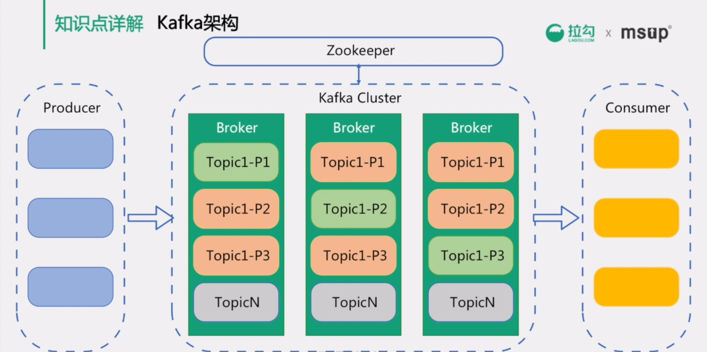

> **修正说明（以上为原始积累的判断，需要按现代场景限定）：**
>
> 1. **"重复消费的影响可以忽略"只在日志采集、指标统计、可重放的流式计算场景成立。**在订单、支付、库存、账务场景，重复消费会直接变成重复副作用，必须靠消费端幂等兜住。这是本章「重复消费」与「Consumer 幂等」两节要解决的问题。
> 2. **"最好支撑较少的 topic"** 描述的是早期 Kafka 的行为：瓶颈实际在 **Partition 总数**（每个分区都要维护文件句柄、副本、内存结构和 Controller 元数据），不在 Topic 名字本身。现代 Kafka 单集群可支撑的分区规模已大幅提升，但"分区数越多、Controller / Rebalance / 文件管理开销越大"这条规律没有变。
> 3. **"仅仅提供较少的核心功能"** 是早期定位。现代 Kafka 已包含事务与 Exactly-Once 语义、Kafka Streams、Kafka Connect、KRaft 自治元数据、分层存储（Tiered Storage）等能力。

### 最小模型

先把这条链记住，后面所有概念都挂在上面：

```text
Producer
   │ send(topic, key, value)
   ▼
Topic（逻辑消息流）
   ├─ Partition 0 ─┐
   ├─ Partition 1  ├─ 分布在各 Broker 上，每个 Partition 有多个 Replica
   └─ Partition 2 ─┘
   ▼
Broker（存储 + 服务进程）
   ▼
Consumer Group（group.id）
   ├─ Consumer A  ← 负责 P0、P1
   └─ Consumer B  ← 负责 P2
```

### 核心概念速查

| 概念 | 是什么 | 关键点 |
| ---- | ------ | ------ |
| **Broker** | Kafka 服务进程 / 节点 | 负责消息存储与转发；集群由多个 Broker 组成 |
| **Topic** | 消息的**逻辑**分类 | 只是名字，不直接对应磁盘上的一个文件 |
| **Partition** | Topic 的物理分片 | **存储、并行、顺序**三件事的共同边界 |
| **Record** | 一条消息 | 含 key、value、timestamp、headers |
| **Offset** | Record 在 **Partition 内**的单调递增序号 | 只在分区内有意义，不跨分区 |
| **Replica** | Partition 的副本 | 分 Leader 与 Follower |
| **Producer** | 消息生产者 | 决定消息落到哪个 Partition |
| **Consumer** | 消息消费者 | **pull** 模式拉取 |
| **Consumer Group** | 逻辑消费组（`group.id`） | 组内分摊分区，组间各自独立消费 |

### Topic 是逻辑的，Partition 才是边界

这是理解 Kafka 最重要的一步。

```text
Topic = 逻辑消息流（一个名字）
Partition = 真正的存储单元、并行单元、顺序单元、副本单元
```

因此：

- **存储**在 Partition 上，不在 Topic 上。
- **并行度**由 Partition 数决定，不由 Topic 数决定。
- **顺序**只在 Partition 内保证。

> **Interview Note：**不能笼统说"Kafka 保证 Topic 有序"。正确表述是：
>
> **Kafka 只保证单个 Partition 内的消息有序。**要在业务维度上有序，必须让同一业务 key 稳定路由到同一 Partition。

### Modern Kafka 与 ZooKeeper-era Kafka

本章原始资料积累于 ZooKeeper-era Kafka，很多机制在版本演进后已经改变。**正文按现代 Kafka 讲，历史机制在 Appendix A 完整保留。**

| 维度 | ZooKeeper-era Kafka（≤ 3.x 传统部署） | Modern Kafka（KRaft） |
| ---- | ------------------------------------ | --------------------- |
| 元数据存储 | ZooKeeper | Kafka 自身的内部 Topic `__cluster_metadata` |
| Controller | 某个 Broker 抢占 ZK 临时节点 `/controller` 成为 Controller | 独立的 Controller Quorum，基于 Raft 选举 |
| 外部依赖 | 必须先部署并维护 ZooKeeper 集群 | 无 ZooKeeper 依赖 |
| 元数据传播 | Controller 通过 ZK watch + RPC 推送 | 元数据日志复制，Broker 主动拉取 |
| 分区规模上限 | 受 ZK 写入与 Controller 全量推送限制 | 显著提升，故障切换更快 |

版本节点（了解即可，不必背）：

```text
Kafka 2.8   KRaft 首次引入（early access）
Kafka 3.3   KRaft 生产可用
Kafka 4.0   移除 ZooKeeper 支持
```

> **Senior Java Focus：**如果面试官问"Kafka 依赖 ZooKeeper 吗"，正确回答是：
>
> **现代 Kafka 使用 KRaft，不再依赖 ZooKeeper。ZooKeeper 是 3.x 及以前的传统部署方式，存量集群仍在大量运行，所以两者都要了解。**
>
> 只答"Kafka 离不开 ZooKeeper"在今天会被判定为知识过时。

ZooKeeper-era 的 Broker 存活判断、Controller 选举、`/controller` 临时节点、watch、controller epoch 等机制见 **Appendix A**。

## Topic 与 Partition【P0】

### Topic

*Topic is a category or feed name to which messages are published by the message producers.*

Topic是一个存储消息的逻辑概念，可以认为是一个queue/消息集合。每个Topic可以有多个生产者向它发送消息，也可以有多个消费者去消费其中的消息。

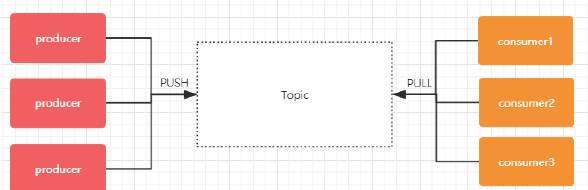

### Partition

*Topic may have many partitions, so it can handle an arbitary amount of data.*

Topic 可以划分多个partition（至少有一个），序号从0开始递增，同一Topic下的不同partition包含的消息是不同的。

每个消息在被添加到分区时，都会被分配一个offset，它是消息在此分区中的唯一编号，Kafka通过offset保证消息在分区内的顺序，offset的顺序不跨分区，即 Kafka只保证在同一个分区内的消息是有序的，消息是每次追加到对应的 Partition的后面，以时间复杂度O(1)方式提供消息持久化能力。

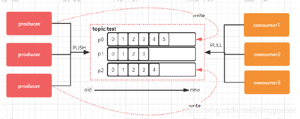

### 分区策略【P0】

由于消息topic由多个partition组成，Kafka可以根据以下不同的分区策略决定消息发送到哪一个partition:

- 第一种分区策略：给定了分区号，直接将数据发送到指定的分区里面去
- 第二种分区策略：没有给定分区号，给定数据的key值，通过key取上hashCode进行分区
- 第三种分区策略：既没有给定分区号，也没有给定key值，直接轮循进行分区
- 第四种分区策略：自定义分区

#### 修正与现代化

以上四条是经典的分区策略分类，但其中两条的具体实现描述需要修正：

**① key 分区用的不是 `hashCode()`，而是 murmur2。**

Kafka 默认分区器对 key 的计算是：

```java
Utils.toPositive(Utils.murmur2(keyBytes)) % numPartitions
```

用 `hashCode()` 描述会导致两个后果：一是与 Java `String.hashCode()` 的分布特性混淆，二是误以为跨语言客户端会得到相同分区结果。murmur2 是确定性的哈希，Java / Go / librdkafka 客户端对同一 key 得到同一分区，这是跨语言系统能对齐顺序语义的前提。

**② "没有 key 就轮询"是历史行为（Legacy）。**

```text
【Legacy】Kafka 2.4 之前
无 key 消息 → 逐条 Round-Robin 轮询分区

【Modern】Kafka 2.4+（KIP-480 Sticky Partitioner）
无 key 消息 → 粘住同一个分区，直到当前 batch 写满
             或超过 linger.ms，再切换到下一个分区

【Modern】Kafka 3.3+（KIP-794 UniformStickyPartitioner）
进一步让分区选择更均匀，同时保留 batch 局部性
```

改成 sticky 的原因：逐条轮询会把消息打散到所有分区，每个分区都只能攒到很小的 batch，Producer 的批量与压缩优势被浪费。粘住一个分区能让 batch 攒得更大，**显著降低端到端延迟并提升吞吐**。

因此现代 Kafka 的准确表述是：

> **无 key 消息不再逐条轮询，而是按 batch 粘性分配到分区；整体长期看仍然均匀。**

完整策略对照：

| 情况 | 行为 | 顺序含义 |
| ---- | ---- | -------- |
| 显式指定 partition | 直接写入该分区 | 该分区内有序 |
| 有 key | `murmur2(key) % numPartitions` | **同 key 一定同分区，同 key 有序** |
| 无 key（Legacy，≤2.4） | Round-Robin 逐条轮询 | 不保证任何业务顺序 |
| 无 key（Modern，2.4+） | Sticky，按 batch 粘住分区 | 不保证业务顺序，但 batch 局部性更好 |
| 自定义 Partitioner | 由 `partition()` 返回值决定 | 由实现决定 |

> **Interview Note：**被问"Kafka 怎么保证同一个订单的消息有序"，答：
>
> **用 orderId 作为消息 key，让 murmur2 把同一订单稳定路由到同一分区。**同时要说明代价——key 分布不均会产生 hot partition，而且**增加分区数会改变 `numPartitions`，导致同一 key 之后落到不同分区，历史顺序被打断**。

### 存储分布

如果Kafka集群只有一个broker，配置server.properties文件中的数据文件存储根目录的参数log.dirs=xxx/message-folder，然后创建2个topic名称分别为report_push、launch_info, partitions数量都为partitions=4，此时存储路径和目录规则为：

xxx/message-folder

|--report_push-0

|--report_push-1

|--report_push-2

|--report_push-3

|--launch_info-0

|--launch_info-1

|--launch_info-2

|--launch_info-3

如果Kafka集群有多个broker，则每个partition会replication-factor个broker上创建副本。创建topic时，replication-factor不可以超过所有broker的个数。

> 现代 Kafka 在 KRaft 模式下仍使用 `log.dirs`（部分发行版写作 `dataDir`），目录命名规则不变。

### 负载均衡

其实是消息在写入kafka的时候就已经被随机写入到一个partiton中，然后不同的partiton对应不同的service, 就实现了负载均衡。

但是不同的group却可以消费相同的partiton的消息。

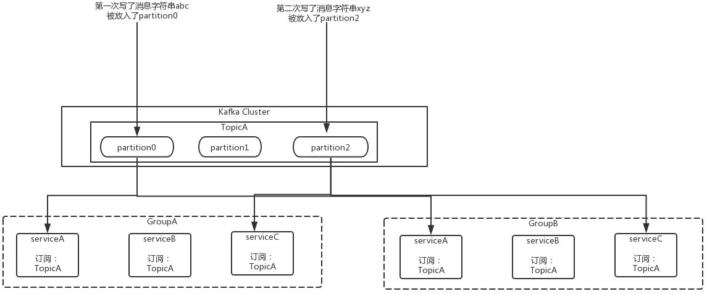

负载均衡发生在**两个不同的层面**，不要混为一谈：

```text
写入侧：消息按分区策略分散到多个 Partition → 多个 Broker 并行写
消费侧：同一 Group 内 Partition 分配给不同 Consumer → 多个 Consumer 并行读
```

### Partition 与顺序边界【P0】

```text
Kafka 的顺序保证边界 = Partition
```

| 顺序范围 | Kafka 是否保证 | 代价 |
| -------- | -------------- | ---- |
| 全局有序 | 只有单分区 Topic 才行 | 完全放弃并行度 |
| Topic 有序 | 否（多分区并行写） | — |
| Partition 有序 | **是** | 并行度 = 分区数 |
| Key 有序 | 是（同 key 同分区） | key 倾斜会造成热点 |

会破坏业务顺序语义的常见操作：

- **增加 partition**：`numPartitions` 变化后，同一 key 的后续消息可能落到新分区，与历史消息不再同序。
- **Producer retry 乱序**：`max.in.flight.requests.per.connection > 1` 且未开启幂等生产者时，前一批失败重试可能后到。
- **Consumer 内部并发**：把 poll 到的记录丢进线程池并行处理，分区顺序在业务侧被打散。
- **手动 `seek()` / 重置 offset**：跳过或重放会改变实际处理顺序。

## Producer【P0】

### Producer

*Producer publishes data to the topics by choosing the appropriate partition.*

消息生产者，将消息发布到topic的特定partition上。

Producer 内部并不是"来一条发一条"，而是：

```text
send(record)
   ↓ 拦截器 Interceptor
   ↓ Serializer 序列化 key / value
   ↓ Partitioner 决定分区
   ↓ RecordAccumulator 按 (topic, partition) 攒 batch
   ↓ Sender 线程批量发送
Broker
```

这解释了为什么 `batch.size` 与 `linger.ms` 是吞吐与延迟之间的核心旋钮。

### Producer 可靠性：acks【P0】

为保证生产者能**可靠**地发送数据到指定的topic，topic的每个partition收到生产者发送的数据后，都需要向生产者发送ack（确认收到）。生产者收到ack才会进行下一轮的发送，否则需要重新发送数据。

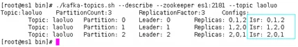

Kafka为用户提供了三种可靠性级别，用户可以根据可靠性和延迟进行权衡，这个设置在kafka的acks参数：

**acks=0**

生产者不等ack，只管往topic丢数据就可以了。这个丢数据的概率非常高。

**acks=1**

Leader落盘后就会返回ack，不等follower同步结果。如果leader在同步完成后出现故障，则会出现数据丢失。

**acks=-1/all**

Leader和ISR中的follower落盘才会返回ack. 可能会出现数据重复现象，比如leader已经写完成且follower同步完成，但是返回ack时出现故障。极限情况下也可能会出现数据丢失的情况，比如所有follower和leader通信都很慢，所以ISR中只有一个leader节点，这个时候，leader完成落盘，就会返回ack，如果此时leader故障后，就会导致丢失数据。

#### acks=all 并不等于"永远绝对不丢"

上面 acks=all 的描述里那句"极限情况下也可能丢"是**整段最关键的一句**，面试常被追问，必须能自己推出来。

`acks=all` 的真实含义是：

> **等待当前 ISR 中的所有副本确认。**

注意是 **ISR**，不是 **所有副本**。而 ISR 是会动态收缩的：

```text
RF = 3, min.insync.replicas = 1（默认）

正常：  ISR = {Leader, F1, F2}   → acks=all 等 3 个
F1/F2 网络抖动或磁盘变慢，超过 replica.lag.time.max.ms
        ↓
ISR 收缩 = {Leader}
        ↓
acks=all 退化成 acks=1
        ↓
Leader 落盘即返回成功 → Leader 宕机 → 已确认的消息丢失
```

所以"不丢已确认消息"需要**一组配置同时成立**：

| 配置 | 建议值 | 作用 |
| ---- | ------ | ---- |
| `replication.factor` | ≥ 3 | 有足够的副本 |
| `min.insync.replicas` | 2 | ISR 少于 2 个时直接拒绝写入，而不是退化成 acks=1 |
| `acks` | `all` | 等 ISR 全部确认 |
| `unclean.leader.election.enable` | `false` | 禁止非 ISR 副本当选 Leader（否则会用旧数据覆盖） |
| `enable.idempotence` | `true`（3.0+ 默认） | 重试不产生重复、不乱序 |

`min.insync.replicas=2` + `RF=3` 的代价：**同时挂 2 台 Broker 时该分区不可写**。这就是可靠性与可用性的直接交换，没有免费的午餐。

> **Interview Note：**"acks=all 会不会丢消息？"的标准回答：
>
> **单看 acks=all 不够。它等的是 ISR，而 ISR 会收缩。必须配合 `min.insync.replicas ≥ 2`、`replication.factor ≥ 3`、`unclean.leader.election.enable=false`，才能保证已确认的消息不因 Leader 故障而丢失。代价是 ISR 不足时写入会被拒绝，即可用性下降。**

#### 三个 ACK 级别的完整权衡

| acks | 确认条件 | 延迟 | 吞吐 | 丢失风险 | 适用 |
| ---- | -------- | ---- | ---- | -------- | ---- |
| `0` | 不等待 | 最低 | 最高 | 高（网络问题即丢） | 可容忍丢失的埋点、metrics |
| `1` | Leader 写入 | 低 | 高 | Leader 宕机且副本未同步时丢 | 日志、可重放数据 |
| `all` | ISR 全部写入 | 较高 | 较低 | 配合 min.insync.replicas 后极低 | 订单、支付、账务 |

### Retry机制

如果没有在规定时间内收到ACK, Kafka生产者会尝试若干次重新发送消息，然后丢弃。

现代 Kafka 的相关默认值（2.1 以后）：

```text
retries                       = 2147483647（Integer.MAX_VALUE，不含首次发送）
request.timeout.ms            = 30000   单次请求等待 Broker 响应的超时
delivery.timeout.ms           = 120000  一条消息从进入 Accumulator 到最终确认/放弃的总预算
retry.backoff.ms              = 100     两次重试之间的退避
```

```java
// 重试次数（2.1+ 默认为 Integer.MAX_VALUE，实际由 delivery.timeout.ms 兜底）
props.put(ProducerConfig.RETRIES_CONFIG, Integer.MAX_VALUE);

// 单次请求超时
props.put(ProducerConfig.REQUEST_TIMEOUT_MS_CONFIG, 30000);

// 投递总预算：超过它，消息以 TimeoutException 交给回调
props.put(ProducerConfig.DELIVERY_TIMEOUT_MS_CONFIG, 120000);
```

> **修正说明：**原始资料中 `RETRIES_CONFIG` 与 `REQUEST_TIMEOUT_MS_CONFIG` 两段说明与示例代码的对应关系发生了错位（`retries=3` 配在了 `request.timeout.ms` 说明下、`request.timeout.ms=100` 配在了 `retries` 说明下），已按上表修正。
>
> 另外，现代 Kafka 中 `retries` 的实际约束来自 `delivery.timeout.ms`：只调大 `retries` 而不管 `delivery.timeout.ms`，消息仍会在 2 分钟后被放弃。

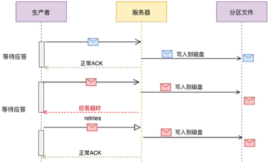

#### Retry 与重复

Producer 重试是 Kafka 消息重复的主要来源之一，本质就是 [基本概念](./SYS3111.md) 里的 **Outcome Unknown**：

```text
Producer send → Broker 写入成功 → ACK 丢失 → Producer timeout → 重发
```

Broker 侧此时可能已经有两条。解决方案是幂等生产者。

### Idempotent Producer 幂等生产者【P0】

HTTP/1.1中对幂等性的定义是：一次和多次请求某一个资源对于资源本身应该具有同样的结果（网络超时等问题除外）。也就是说，其任意多次执行对资源本身所产生的影响均与一次执行的影响相同。

Kafka在0.11.0.0版本增加了针对生产者角度的对幂等的支持。

要想区分请求是否重复，请求中就得有唯一标识Producer ID或PID，还需要记录下哪些请求是已经处理过的。这样当收到新的请求时，用新请求中的标识和处理记录进行比较，仅当消息的序列号比该PID / TopicPartition对中最后提交的消息正好大1时，Broker才会接受该消息。否则说明是重复记录，拒绝掉。

```text
<PID, TopicPartition> → 最后已接受的 sequence number
新消息 sequence == last + 1  → 接受
新消息 sequence <= last      → 判定为重复，丢弃并返回成功
新消息 sequence >  last + 1  → OutOfOrderSequenceException
```

> **修正说明（重要）：**原始资料写的是 `enable.idempotence=false 默认`。这是 **Kafka 3.0 之前**的行为。
>
> **自 Kafka 3.0 起（KIP-679），`enable.idempotence` 默认为 `true`，且 `acks` 默认为 `all`。**也就是说现代 Kafka Producer 开箱即是幂等的。回答时如果说"默认不开幂等"会被判定为版本知识过时。

配置约束：

```text
enable.idempotence = true 时，Kafka 会强制要求：
  acks = all
  retries > 0
  max.in.flight.requests.per.connection <= 5
```

`max.in.flight.requests.per.connection`是阻塞客户端的请求个数，大于1时将不保证有序；开启幂等后，Kafka 会在 Broker 侧按 sequence 重排，因此**在不超过 5 的前提下仍然能保证单分区顺序**。

```java
props.put(ProducerConfig.ENABLE_IDEMPOTENCE_CONFIG, true);
props.put(ProducerConfig.ACKS_CONFIG, "all");
// 幂等开启后最多允许 5 个 in-flight 请求且仍保序；设为 1 是最保守做法，会牺牲吞吐
props.put(ProducerConfig.MAX_IN_FLIGHT_REQUESTS_PER_CONNECTION, 5);
```

 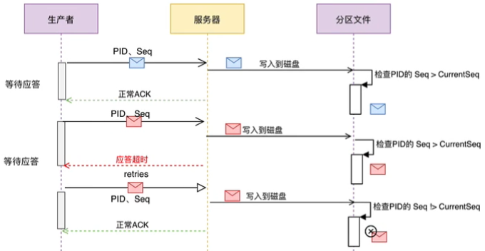

#### 幂等生产者的边界

必须说清它**不能**做什么：

```text
✓ 同一 Producer 会话内、单个分区的重试不产生重复、不乱序
✗ 跨 Producer 实例（PID 不同，各自独立计数）
✗ 跨分区
✗ Producer 重启后（PID 会变，除非配合 transactional.id）
✗ Consumer 侧的重复消费
✗ Consumer 写数据库 / 调外部接口产生的重复副作用
```

> **Interview Note：**"Kafka 开了幂等生产者是不是就不会重复了？"
>
> **不是。幂等生产者只解决"同一个 Producer 会话内、单分区、因重试导致的重复写入"。Consumer 侧因 offset 未提交而发生的重复消费、以及业务副作用的重复，它一概管不了。**

## Kafka Storage【P1】

### Append Log

每个 Partition 在磁盘上就是一个**只能追加写的日志目录**：

```text
/topic-name-0/
   ├─ 00000000000000000000.log      ← 消息数据
   ├─ 00000000000000000000.index    ← offset → 物理位置 稀疏索引
   ├─ 00000000000000000000.timeindex
   ├─ 0000000000000368769.log
   ├─ 0000000000000368769.index
   └─ ...
```

写入永远是 append，不修改已有数据。删除以 segment 为单位整体删除，不做行级删除。

### segment

segment file由.index索引文件和.log数据文件成对组成。两个文件名的设置是从0开始的长度为19的64位long类型变量，没有数字用0填充，后续生成的文件的文件名则是所在partion已发布的最大offset(偏移message数)，如下所示：

- 0000000000000000000.index
- 0000000000000000000.log
- 0000000000000368769.index
- 0000000000000368769.log
- 0000000000000737337.index
- 0000000000000737337.log
- 0000000000001105814.index
- 0000000000001105814.log
- …  

索引文件存储大量元数据，数据文件存储大量消息，索引文件中元数据指向对应数据文件中message的物理偏移地址。索引文件和数据文件的对应关系如下：

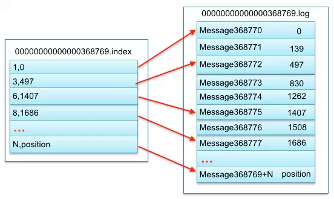

其中以索引文件中元数据3,497为例，依次在数据文件中表示第3个message(在全局partiton表示第368772个message)、以及该消息的物理偏移地址为497。

为什么要分 segment：

- 单个文件不能无限增长，否则无法管理。
- **retention / GC 以 segment 为粒度**，删旧数据只是删文件，代价极低。
- 索引可以按 segment 局部加载，查找不需要扫全量。
- 副本迁移、故障恢复可以按 segment 进行。

### Offset 体系【P0】

*Each message in the partition is assigned a unique sequential ID called the offset.*

消息在日志中的位置，可以理解是消息在partition上的偏移量，代表该消息的唯一序号。

#### LogStartOffset

表示一个Partition的起始位移，初始为0，虽然消息的增加以及日志清除策略的影响，这个值会阶段性的增大。

#### ConsumerOffset

消费位移，表示Partition的某个消费者消费到的位移位置。

#### HighWatermark

简称HW，代表消费端所能"观察"到的Partition的最高日志位移，HW大于等于ConsumerOffset的值。

#### LogEndOffset

简称LEO, 标识的是每个分区中最后一条消息的下一个位置，其值对消费者不可见。

由于主从需要同步，HW必然不会一直与Leader的LEO相等，即HW<=LEO。

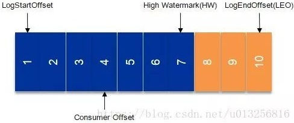

#### 四个 Offset 的关系

```text
LogStartOffset ≤ Consumer Committed Offset ≤ Consumer Position ≤ HW ≤ LEO
      │                    │                        │            │     │
   最早可读          Group 已提交的进度        实际读到哪     消费者可见  下一条待写
   （受 retention 影响）                                    上限
```

两个必须分清的点：

1. **HW 是消费者的可见上限。**Consumer 永远读不到 HW 之后的消息，即使 Leader 的 LEO 已经更大——因为那部分还没被 ISR 确认，可能在 Leader 切换后消失。
2. **Consumer Position ≠ Committed Offset。**见下一节。

### Consumer 实际读取位置 ≠ 已提交位置

这是 Kafka 重复消费问题的根源，必须彻底讲清。

```text
poll() 拿到 offset 100~199
        ↓
Consumer Position = 200（内存里，下次从这继续读）
        ↓
业务处理中……
        ↓
commit 成功 → Committed Offset = 200（写进 __consumer_offsets）
```

如果业务处理完但 commit 之前 Consumer 崩溃：

```text
Committed Offset 仍是 100
        ↓
新 Consumer 接管 → 从 100 重新读
        ↓
100~199 被第二次消费
```

**Offset commit 的本质是 Consumer 告诉 Kafka："这个 Group 的消费进度到哪里了。"**它是一个**由应用控制的、显式的进度声明**，不是 Kafka 自动帮你保证的业务成功。

### 数据自动清除条件

如果同时设定了自动清除数据的时间条件和数据大小条件，那么只要满足任意一个条件，Kafka就会执行数据清除操作。

```text
log.retention.hours / minutes / ms   按时间保留
log.retention.bytes                  按单分区大小保留
log.segment.bytes                    单个 segment 大小，滚动条件
log.cleanup.policy                   delete（默认）/ compact / 两者组合
```

> **Interview Note：**retention 是"消息疑似丢失"排查中极其常见但常被忽略的原因。**Consumer Lag 超过 retention，旧消息会被按策略正常删除**，这不是 Bug，是设计。此时唯一的补救是上游重放或数据补偿。

### Kafka 为什么磁盘存储仍然快【P0】

高频面试题。不要只答"零拷贝"，要把这条链完整串起来：

```text
Sequential Append      顺序追加写，避免磁盘寻道
      +
Page Cache             读写走操作系统页缓存，不在 JVM 堆里存消息
      +
Batch                  Producer 攒批、Broker 批量落盘，摊薄单次 IO 成本
      +
Compression            批量压缩，减少网络与磁盘字节数
      +
Zero Copy              sendfile 直接把 Page Cache 送到网卡，不经用户态
      +
Partition Parallelism  多分区分布到多 Broker，并行读写
      +
Sparse Index           稀疏索引 + 二分查找，O(log n) 定位消息
```

具体展开见下一节。

## Kafka 如何实现高吞吐率【P0】

虽然Kafka的消息是保存或缓存在硬盘上，但是即使是普通服务器也能轻松支持每秒百万级的写入请求。主要利用了以下技术：

### 顺序读写

硬盘是机械结构，每次读写都会进行寻址+写入操作，而寻址是一个"机械动作"最为耗时。顺序读写不需要硬盘磁头的寻道时间（圆盘上的针来回移动），只需很少的扇区旋转时间，速度远快于随机读写。

Kafka的消息是不断追加到文件中的，可以充分利用磁盘的顺序读写性能。

Kafka官方给出了测试数据(Raid-5，7200rpm)：

顺序I/O: 600MB/s

随机I/O: 100KB/s

但是Kafka归根结底还是机械式的写入，性能跟内存还是没法比，因此Kafka的数据不是实时地写入硬盘中。

> **补充（现代视角）：**600MB/s vs 100KB/s 这组数据来自机械盘时代，用来解释"为什么必须顺序写"仍然非常有力。在 NVMe SSD 上随机与顺序的差距缩小了很多个量级，但**顺序写在 CPU 开销、写放大和延迟稳定性上依然明显更优**，Kafka 的 append-only 设计没有因此改变。

### PageCache

#### 写数据

Server端的I/O线程统一将请求中的数据写入到操作系统的PageCache后立即返回，利用操作系统的PageCache实现文件到物理内存的直接映射，当消息条数到达一定阈值后，Kafka应用本身或操作系统内核会触发强制刷盘操作，极大降低了IO使用率。

而且只要应用数据写入了内核空间的内存，即使应用宕机，写入的数据也不会再丢失。

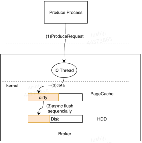

使用PageCache虽然提升性能，但是也降低了稳定性：如果操作系统不稳定，例如断电，PageCache丢失就会导致丢数据。所以也可以停用PageCache, 以阻塞的形式直接写入磁盘，等待刷新，刷新后视作写入成功，性能低但是安全。

> **关键区分：**"应用宕机不丢"与"机器掉电不丢"是两件事。
>
> - Kafka **进程**崩溃：数据已在内核 Page Cache，操作系统仍会刷盘，不丢。
> - **整机掉电 / 内核崩溃**：Page Cache 未刷盘的部分丢失。
>
> Kafka 的应对不是靠单机 fsync，而是靠**多副本 + `acks=all` + `min.insync.replicas`**：只要不同时掉电，副本能补上。这也解释了为什么 Kafka 默认不调用 `fsync`（`log.flush.interval.messages` / `log.flush.interval.ms` 默认交给操作系统）——它用复制而不是刷盘换持久性。

#### 读数据

当Kafka Broker接收到读数据请求时，会向操作系统发送sendfile系统调用，操作系统接收后，首先试图从PageCache中获取数据。

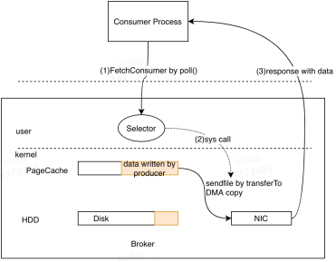

如果数据不存在，会触发缺页异常中断，将数据从磁盘读入到临时缓冲区中，随后通过DMA操作直接将数据拷贝到网卡缓冲区中等待后续的TCP传输。

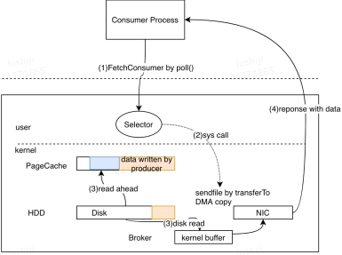

**Consumer 追热点数据（刚写入的）几乎全在 Page Cache 命中，不产生读 IO**；只有回放历史消息才会真正读盘，这也是"回放老数据容易把 Broker 打出读 IO 热点"的原因。

### 零拷贝

传统IO操作的整个过程为：

- 读取磁盘文件到操作系统内核缓冲区；

- 将内核缓冲区的数据，copy 到应用程序的 buffer；

- 将应用程序 buffer 中的数据，copy 到 socket 网络发送缓冲区；

- 将 socket buffer 的数据，copy 到网卡，由网卡进行网络传输。

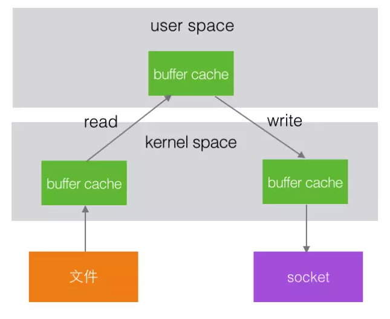

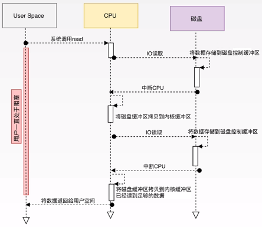

在Linux kernel 2.2之后出现了一种叫做"零拷贝(zero-copy)"系统调用机制，就是跳过"用户缓冲区"的拷贝，建立一个磁盘空间和内存的直接映射，数据不再复制到"用户态缓冲区"，系统上下文切换减少为2次，可以提升一倍的性能。

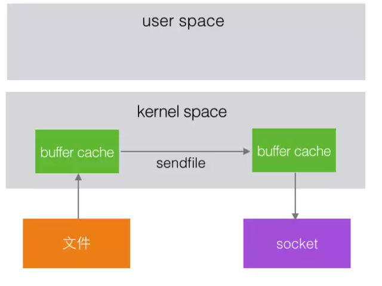

Kafka使用到了mmap和sendfile的方式来实现零拷贝，分别对应Java的MappedByteBuffer和FileChannel.transferTo

在此模型下，上下文切换的数量减少到一个。transferTo()方法指示块设备通过DMA直接内存控制引擎，将数据读取到读取缓冲区中。然后，将该缓冲区复制到另一个内核缓冲区以暂存到套接字。最后，套接字缓冲区通过 DMA 复制到 NIC 缓冲区。CPU绝对不参与复制缓冲区。

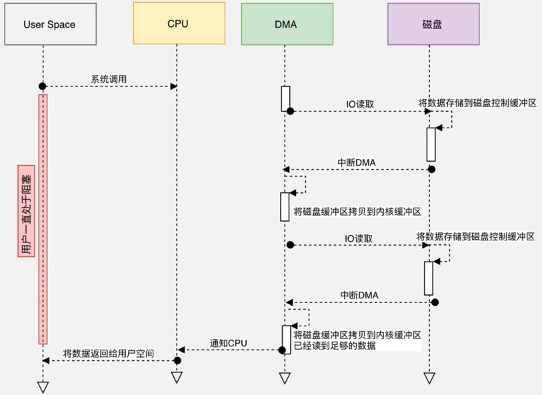

两者的分工：

| 机制 | Java API | Kafka 用途 |
| ---- | -------- | ---------- |
| mmap | `MappedByteBuffer` | **索引文件**的读写（小文件、需要随机访问） |
| sendfile | `FileChannel.transferTo` | **消息数据文件**发送给 Consumer（大文件、只出不进） |

> 现代补充：Linux 4.14+ 且启用 TLS offload 等场景下，Kafka 也可用 `sendfile` 的变体；开启 SSL 时零拷贝效果会打折，因为数据需要在用户态加解密。这是"开了 TLS 之后吞吐下降"的常见原因。

### 文件分段

Kafka的队列topic被分为了多个区partition，每个partition又分为多个段segment，所以一个队列中的消息实际上是保存在N多个片段文件中，通过分段的方式，每次文件操作都是对一个小文件的操作，非常轻便，同时也增加了并行处理能力。

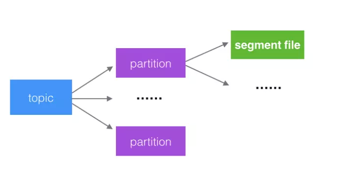

### 批量发送

Kafka允许进行批量发送消息，是提高消息吞吐量重要的方式。

Producer端可以先将消息缓存在内存中，合并多条消息后，以一次请求的方式发送了批量的消息给broker. 可以指定缓存的消息达到某个量的时候就发出去，或者缓存了固定的时间后就发送出去，如100条消息就发送，或者每5秒发送一次。

这种策略将大大减少broker存储消息的IO操作次数，但也一定程度上影响了消息的实时性。相当于以时延代价，换取更好的吞吐量。

```text
batch.size   = 16384（默认，按字节）
linger.ms    = 0    （默认，不等待；调大可攒更大 batch）
buffer.memory= 33554432（Accumulator 总内存，满了 send() 会阻塞）
```

> `linger.ms` 是吞吐与延迟之间最直接的旋钮。日志/流式场景常调到 5~100ms；对延迟敏感的在线业务保持 0~5ms。

### 数据压缩

Kafka还支持对消息集合进行压缩，Producer可以通过GZIP或Snappy格式对消息集合进行压缩。

压缩的好处就是减少传输的数据量，减轻对网络传输的压力。

Producer压缩之后，在Consumer需进行解压，虽然增加了CPU的工作，但在对大数据处理上，瓶颈在网络上而不是CPU，所以这个成本很值得。

现代支持的压缩算法：

| 算法 | 压缩比 | CPU 开销 | 备注 |
| ---- | ------ | -------- | ---- |
| GZIP | 最高 | 高 | 早期支持，CPU 成本大 |
| Snappy | 中 | 低 | 早期主流选择 |
| LZ4 | 中 | **最低** | 现代 Kafka 常见默认推荐 |
| Zstd | **高** | 中 | Kafka 2.1+ 引入，压缩比与速度综合最优 |

> **重要：压缩是以 batch 为单位，不是以单条消息为单位。**这带来一个实际后果——**batch 越大，压缩率越高**。这也是 sticky partitioner 提升吞吐的原因之一：把无 key 消息粘在同一分区能攒出更大的 batch。
>
> Broker 端默认保持 Producer 的压缩格式（`compression.type=producer`），不做解压重压，避免额外 CPU。

### Broker

Kafka服务器，负责消息存储和转发。

下面的网络模型、Reactor、Page Cache、零拷贝等内容，都是 Broker 这一侧的实现。

#### 网络模型：Reactor

Kafka自己实现了网络模型做RPC。底层基于Java NIO, 采用和Netty一样的Reactor线程模型，实现了多路复用和处理线程池。

#### 传统阻塞IO模型存在的问题

一个线程负责一个连接，并发数大时创建线程数多占用资源。

- Reactor模型基于池化思想，避免为每个连接创建线程，连接完成后将业务处理交给线程池处理。

连接建立后，若当前线程没有数据可读，线程会阻塞在读操作上，造成资源浪费。

- 基于IO复用模型，多个连接共用同一个阻塞对象，不用等待所有的连接。遍历到有新数据可以处理时，操作系统会通知程序，线程跳出阻塞状态，进行业务逻辑处理。

其中包含了一个Acceptor线程，用于处理新的连接。Acceptor有N个Processor线程select和read socket请求，N个Handler线程处理请求并相应，即处理业务逻辑。

- 首先客户端发送请求全部会先发送给一个Acceptor. Acceptor不会对客户端的请求做任何的处理，直接封装成socketChannel, 以轮询方式发送给Broker里面的默认3个processor线程，形成socketChannel的队列。

- 消费者线程去消费这些socketChannel时会获取request请求，如果是发布请求则会伴随着数据。

- 线程池里面默认有8个handler线程，这些线程是用来处理request的。handler线程解析请求后，将写请求写到磁盘里，把结果返回给读请求。

- processor会从response中读取响应数据，然后再返回给客户端。

如果需要对kafka进行增强调优，增加processor线程个数和线程池里的处理线程个数，就可以达到效果。request和response那一块部分其实就是起到了一个缓存的效果，作用是防止processor生成请求太快导致线程池处理线程数不够不能及时处理。

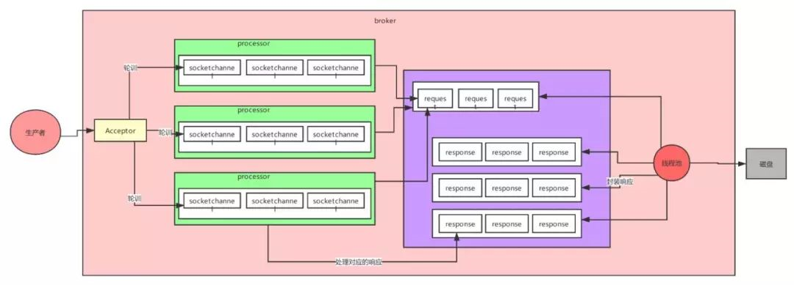

```text
num.network.threads = 3   ← Acceptor 分发到的 Processor 线程数
num.io.threads      = 8   ← 处理请求的 Handler 线程数（通常设为磁盘数相关）
queued.max.requests = 500 ← Handler 队列长度，即上文提到的"缓存"效果
```

**关键设计原则：IO 线程只做收包、解码、派发；真正的读写与业务逻辑交给 IO 线程池。**如果 Processor 线程被慢操作阻塞，它管理的所有连接都会卡住。

> NIO / Selector / Reactor / partial read-write / TCP 粘包拆包的完整原理见 [CSE351](./CSE351.md)。本章只保留理解 Kafka Broker 线程模型所需的部分。

## Replication & High Availability【P0】

### 副本角色

为了防止数据不丢失，每一个partition有多个副本，在整个集群中总共有三种副本角色：

- **首领副本**（leader）：也就是leader主副本，每个分区都有一个首领副本，为了保证数据一致性，所有的生产者与消费者的请求都会经过该副本来处理。

- **跟随者副本**（follower）：除了首领副本外的其他所有副本都是跟随者副本，跟随者副本不处理来自客户端的任何请求，只负责从首领副本同步数据，保证与首领保持一致。如果首领副本发生崩溃，就会从这其中选举出一个leader。

- **首选首领副本**：创建分区时指定的首选首领。如果不指定，则为分区的第一个副本。

为了避免数据同步时遇到阻塞造成问题，follower向leader发送的同步请求中包含了follower需要数据的偏移量offset，而且这些offset是有序的。

leader通过跟踪每一个follower的offset来判断它们的复制进度。默认的，如果follower与leader之间超过10s没有发送请求，或者说没有收到请求数据，此时该follower就会被认为**不同步副本**，而持续请求的副本就是**同步副本**。当leader发生故障时，只有**同步副本**才可以被选举为leader. 其中的请求超时时间。可以通过参数replica.lag.time.max.ms参数来配置超时时间。

我们希望每个分区的leader可以分布到不同的broker中，尽可能的达到负载均衡，所以会有一个首选首领，如果我们设置参数**auto.leader.rebalance.enable**为true，那么它会检查首选首领是否是真正的首领，如果不是，则会触发选举，让首选首领成为首领。

```text
写路径：  Producer → Leader Replica
读路径：  Consumer → Leader Replica
复制路径：Follower → 主动 fetch → Leader
```

> **注意：Follower 不对外提供服务。**这与"主从读写分离"的直觉相反——Kafka 的 Follower 只做复制，读写全部走 Leader。这样设计是为了让一致性模型简单：Consumer 永远只看到一个 Leader 的日志。

### ISR机制

Kafka采取全部follower同步完成后leader发送ack的方案。为了预防个别follower宕机阻塞发送ack, leader维护了一个动态的ISR(In-sync-replicas)列表（同步副本的作用）。当ISR中的follower完成数据的同步之后，leader就会给生产者发送ack.

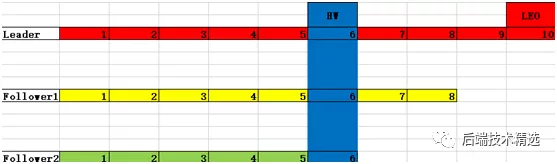

这种设计是为了避免主从数据不一致引发消费者报错的情况，如上图所示，假如消费者消费了8条数据后，leader挂了，Follower2成为leader，上面并没有7、8两条数据，那么消费者就会报错。

- Follower如果在`replica.lag.time.max.ms`时间内没有开始发送fetch请求主从消息同步就被踢出ISR列表，默认10秒。

- 在Kafka-0.9.0版本取消了`replica.lag.max.messages`消息个数限定，默认10000条，之所以被移除是因为kafka发送消息是批量发送的，leader接受消息的一瞬间follower可能还没有拉取，所以会频繁的踢出加入ISR，导致频繁更新zk和内存。

ISR 的核心性质：

```text
ISR ⊆ 所有副本（AR）
Leader 永远在 ISR 中
只有 ISR 内的副本才有资格当选新 Leader
acks=all 等待的是 ISR，不是 AR
```

**ISR 是动态的**——这是理解 Kafka 可靠性的关键：

```text
Follower 落后超过 replica.lag.time.max.ms（默认 10s / 30s，视版本）
        ↓
被踢出 ISR（shrink）
        ↓
追上 Leader 的 LEO 后重新加入（expand）
```

因此 `min.insync.replicas` 必须与 ISR 收缩一起理解，见上文「acks=all 并不等于永远绝对不丢」。

### High Watermark

高水位线HW(high watermarker), 指消费者能见到的最大的offset，ISR队列中最小的LEO，在它之前的的数据都被视作已经备份，后面的数据消费者看不到也消费不了。当所有节点都备份成功后，Leader会更新水位线。

```text
Leader:    [0][1][2][3][4][5][6]  LEO = 7
Follower1: [0][1][2][3][4]        LEO = 5
Follower2: [0][1][2][3]           LEO = 4
                             ↓
                    HW = min(ISR 各副本 LEO) = 4
                             ↓
        Consumer 只能读到 offset < 4 的消息
```

HW 的意义：**保证 Consumer 读到的消息一定已经被 ISR 确认过，不会在 Leader 切换后消失。**

> **Legacy Note：**Kafka 0.11 之前**仅**依赖 HW 做副本截断（truncation），存在两个已知缺陷——数据丢失与数据不一致。0.11 引入 Leader Epoch 后，截断依据从 HW 改为 Leader Epoch。两个历史问题的完整推演见 **Appendix B**。

### Leader Epoch

Kafka-0.11版本引入了Leader Epoch取代HW作为数据截断的依据。Leader持有一个Leader Epoch, 一个由Controller管理的4字节数字，存储在Zookeeper的分区状态信息中，并作为LeaderAndIsrRequest的一部分传递给继任Leader.

> **现代化说明：**Leader Epoch 本身仍是现代 Kafka 的核心机制，但它的存储位置已经变化。ZooKeeper-era 存放在 ZK 的分区状态里；**KRaft 模式下存放在元数据日志中**，副本本地则持久化在 `leader-epoch-checkpoint` 文件里。

Leader接受Producer请求数据上使用LeaderEpoch标记每个Message。然后，该LeaderEpoch编号将通过复制协议传播，作为消息截断的参考点。

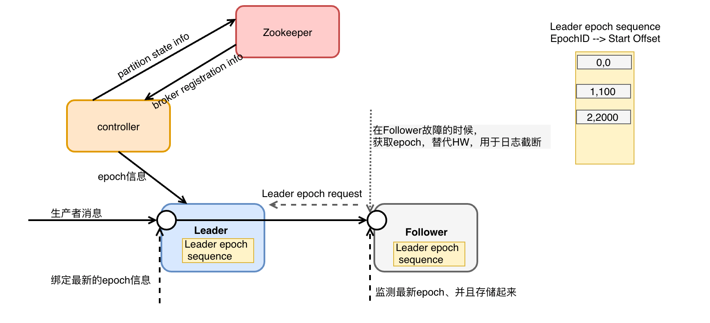

**Follower成为Leader时**

将新的Leader Epoch和对应的LEO添加到Leader Epoch Sequence序列文件的末尾，标记新消息。

**Leader成为Follower时**

向Leader发送包含最新的EpochID和StartOffset信息的epoch请求。Leader接收到以后返回该EpochID所对应的LastOffset信息。

返回的LastOffset更大：Follower需要同步缺少的数据，然后更新Leader Epoch.

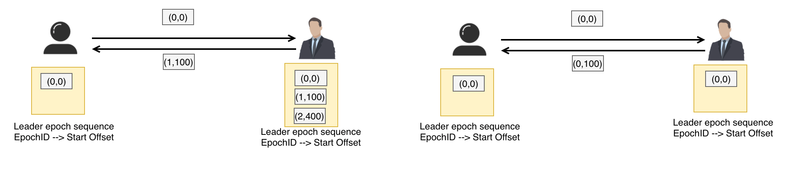

返回的LastOffset更小：Follower需要重置自己的Leader Epoch文件，将Offset修改为Leader返回的LastOffset信息，并且截断自己的日志信息。更新后的Epoch有可能和Leader返回的Epoch存在差异。

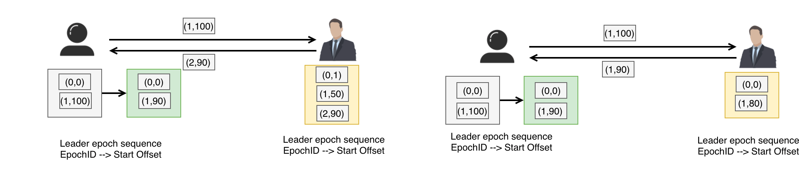

一句话概括 Leader Epoch 解决的问题：

> **副本重启或角色切换后，不再盲目按 HW 截断日志，而是先向 Leader 询问"我这一任 epoch 应该截到哪里"，从而避免误删已确认数据和副本间日志分叉。**

### Controller 与 Leader 选举

```text
Broker 故障
   ↓
Controller 检测到（KRaft：心跳超时；ZK-era：临时节点消失 + watch 通知）
   ↓
从该分区的 ISR 中选出新 Leader（优先 preferred replica）
   ↓
下发 LeaderAndIsr 元数据
   ↓
Producer / Consumer 刷新 metadata，重连新 Leader
```

关键配置：

```text
auto.leader.rebalance.enable   = true     定期检查并让 preferred replica 回到 Leader
leader.imbalance.check.interval.seconds = 300
unclean.leader.election.enable = false    禁止非 ISR 副本当选（保数据一致性，牺牲可用性）
```

`unclean.leader.election.enable` 是一道直接的取舍题：

| 取值 | 行为 | 后果 |
| ---- | ---- | ---- |
| `false`（默认，推荐） | ISR 全挂时分区不可用，等待原副本恢复 | 保一致性，牺牲可用性 |
| `true` | 允许落后的非 ISR 副本当选 Leader | 保可用性，**已确认的消息会被覆盖丢失** |

ZooKeeper-era 的 Controller 选举细节（`/controller` 临时节点、watch、controller epoch、防脑裂）见 **Appendix A**。

### 判断一个 Broker 节点是否存活

**现代 Kafka（KRaft）：**Broker 与 Controller Quorum 之间维持心跳，心跳超时即被判定失效，Controller 触发受影响分区的 Leader 重选。

**Legacy（ZooKeeper-era）的两个条件：**

- 节点必须可以维护和ZooKeeper的连接，Zookeeper通过心跳机制检查每个节点的连接。
- 如果节点是个follower, 他必须能及时的同步leader的写操作，延时不能太久。

完整历史描述见 **Appendix A**。

## Consumer Group【P0】

### Consumer

*Consumer is the application/process that subscribes to topics and process the feed of published messages.*

消息消费者，通过pull方式消费消息。

**为什么是 pull 而不是 push：**

| | push（Broker 推） | pull（Consumer 拉，Kafka 采用） |
| - | ---------------- | ------------------------------ |
| 速率控制 | Broker 决定，容易压垮慢 Consumer | **Consumer 自己决定**，天然背压 |
| 批量 | 难以攒批 | 一次 poll 可拉一批，吞吐高 |
| 无数据时 | 不浪费 | 需要 long polling（`fetch.max.wait.ms`）避免空转 |

### group.id

`group.id` 表示 Consumer 属于哪个**逻辑消费组**。它是 Kafka 消费模型的核心：

```text
同一个 Group：组内多个 Consumer 协作分摊 Topic 的 Partitions
              → 竞争消费，每条消息在组内只被处理一次

不同 Group：各自独立消费同一个 Topic
              → 广播效果，每个组都能拿到全量消息
```

```text
              Topic T（P0 P1 P2 P3）
                     │
        ┌────────────┴────────────┐
        ▼                         ▼
   Group A（订单处理）        Group B（实时风控）
   ├─ Consumer A1: P0 P1      └─ Consumer B1: P0 P1 P2 P3
   └─ Consumer A2: P2 P3
```

关键性质：

- **Offset 是按 `(group.id, topic, partition)` 维度提交的。**Group A 消费到哪里，与 Group B 完全无关。
- **Group 才是长期逻辑身份，Consumer 实例是可替换的。**Consumer 崩溃、重启、扩容，Group 的进度不丢。
- 新增一个 Group 可以从 `earliest` 重新消费全量历史数据（受 retention 限制），这是 Kafka 相比传统 MQ 的重要能力：**消费与存储解耦，支持回放**。

### Partition 分配规则【P0】

同一Consumer Group中的多个Consumer实例，不同时竞争消费同一个partition.

> **一个 Partition 在同一个 Consumer Group 中，同一时刻由且仅由一个 Consumer 成员负责。**

```text
4 Partitions, 2 Consumers
P0 ─┐
P1 ─┤→ Consumer A
P2 ─┐
P3 ─┤→ Consumer B
```

由此推出几条必须记住的结论：

| 情况 | 结果 |
| ---- | ---- |
| Consumer 数 < Partition 数 | 部分 Consumer 负责多个 Partition |
| Consumer 数 = Partition 数 | 一对一，最理想 |
| **Consumer 数 > Partition 数** | **多出来的 Consumer 空闲，拿不到任何分区** |
| 不同 Group | 各自都能消费全部 Partition，互不影响 |

> **Interview Note：**绝对不要说成"一个 Consumer 只能消费一个 Partition"。正确的是**反过来**——一个 Partition 在组内只能给一个 Consumer，但**一个 Consumer 可以同时消费多个 Partition**。
>
> 这条规则直接决定了：**Consumer 并行度的上限是 Partition 数**。所以"消息积压时加 Consumer"是否有效，先要看分区数够不够。

#### 分区分配策略

```text
RangeAssignor          按 Topic 连续区间分配（早期默认，易造成前面的 Consumer 偏重）
RoundRobinAssignor     所有分区轮询分配
StickyAssignor         尽量均匀 + 尽量保留上次的分配（减少 rebalance 时的分区迁移）
CooperativeStickyAssignor  增量协作式再均衡（现代推荐）
```

`partition.assignment.strategy` 配置，现代生产环境通常用 `CooperativeStickyAssignor`。

### 消费组选主

在kafka的消费端，会有一个消费者协调器以及消费组，组协调器GroupCoordinator需要为消费组内的消费者选举出一个消费组的leader.

如果消费组内还没有leader，那么第一个加入消费组的消费者即为消费组的leader，如果某一个时刻leader消费者由于某些原因退出了消费组，Kafka就会从存放<消费者ID,元数据信息>的HashMap中选出第一项作为新的leader.

```scala
private val members = new mutable.HashMap[String, MemberMetadata]
leaderId = members.keys.headOption
```

Group Coordinator 的职责：

```text
① 管理 Group 成员（JoinGroup / SyncGroup / Heartbeat / LeaveGroup）
② 选出 Consumer Leader
③ 由 Consumer Leader 计算分区分配方案，Coordinator 下发给所有成员
④ 保管该 Group 的 Committed Offset（存在内部 Topic __consumer_offsets）
```

> **注意区分两个"Leader"**：Partition Leader 是 Broker 侧的副本角色；Consumer Leader 是 Group 内负责计算分配方案的那个 Consumer 成员。二者毫无关系。

Group Coordinator 的定位方式：`__consumer_offsets` 这个内部 Topic 有 50 个分区，按 `group.id.hashCode % 50` 找到对应分区，该分区的 Leader 所在 Broker 就是这个 Group 的 Coordinator。

## Rebalance【P0】

### 什么是 Rebalance

```text
Consumer 加入 Group
Consumer 主动退出 / 崩溃
Consumer 被判定失联（心跳超时 / poll 超时）
Topic 的 Partition 数量变化
订阅的 Topic 集合变化（正则订阅匹配到新 Topic）
        ↓
    Rebalance
        ↓
Partition ownership 在 Group 成员之间重新分配
```

### Rebalance 的代价

Rebalance 不是免费的，它是 Kafka 消费端大部分"抖动"的来源：

| 影响 | 原因 |
| ---- | ---- |
| **消费暂停（Stop-The-World）** | Eager 协议下所有成员先放弃全部分区，等分配完成才恢复，期间不消费 |
| **重复消费** | 成员的 Position 尚未 commit，分区被重新分配后新成员从旧的 Committed Offset 开始 |
| **延迟与 Lag 突增** | 暂停期间 Producer 继续写入 |
| **下游抖动** | 恢复瞬间可能集中处理积压，把 DB / RPC 打出尖峰 |
| **Rebalance 风暴** | 处理慢 → 超过 `max.poll.interval.ms` → 被踢出 → 重新加入 → 再超时，循环 |

### 关键参数

```text
group.initial.rebalance.delay.ms = 3000   首次 rebalance 前的等待，让成员批量加入，避免连续多次 rebalance
session.timeout.ms               = 45000  心跳超时判定成员死亡（3.0+ 默认 45s）
heartbeat.interval.ms            = 3000   心跳间隔，通常设为 session.timeout.ms 的 1/3
max.poll.interval.ms             = 300000 两次 poll 之间的最大间隔，超了被认为"活着但不干活"而踢出
max.poll.records                 = 500    单次 poll 返回条数，处理慢时调小它比调大超时更安全
```

> **Senior Java Focus：**`session.timeout.ms` 和 `max.poll.interval.ms` 是两种不同的失联判定：
>
> - **心跳线程**负责 `session.timeout.ms`——进程死了、网络断了，心跳停，超时踢出。
> - **业务线程**负责 `max.poll.interval.ms`——进程活着、心跳正常，但一直在处理消息没回来 poll。Kafka 认为它卡住了，同样踢出。
>
> 线上"Consumer 频繁被踢出但进程明明活着"，绝大多数是 `max.poll.interval.ms` 太小或单批处理太慢。正确做法是**调小 `max.poll.records`**，而不是一味加大超时。

### Eager vs Cooperative Rebalancing

```text
【Eager（早期协议）】
所有成员 revoke 全部分区 → Stop-The-World → 重新分配全部
即使只加了一个 Consumer，所有分区都要停下来重分

【Cooperative（KIP-429，Kafka 2.4+）】
增量式再均衡：只 revoke 需要迁移的那部分分区
其余分区在 rebalance 期间继续消费
```

启用方式：`partition.assignment.strategy=org.apache.kafka.clients.consumer.CooperativeStickyAssignor`。

> 从 Eager 切换到 Cooperative 需要两轮 rebalance 才能完成迁移，滚动升级时要注意，不能直接混跑两种协议。

### 减少不必要的 Rebalance

```text
① 用 CooperativeStickyAssignor，避免全量 STW
② 合理设置 max.poll.interval.ms 与 max.poll.records，别被误判失联
③ 消费逻辑里的慢操作异步化 / 拆批，不要占住 poll 线程
④ 部署时批量重启而不是逐台重启，配合 group.initial.rebalance.delay.ms
⑤ 不要让 Consumer 数长期多于 Partition 数（多余成员空转且加剧抖动）
```

## Consumer Lag 与消息积压【P0】

### Lag 的定义

```text
Lag = Log End Offset (LEO / 最新写入位置)
    -  Consumer Group 的 Committed Offset（或当前处理位置）
```

按 `(group.id, topic, partition)` 维度统计，**总 Lag 是各分区 Lag 之和**。

```text
Partition 0:  LEO=10000  committed=9800   Lag=200
Partition 1:  LEO=10000  committed=2000   Lag=8000   ← 热点分区
Partition 2:  LEO=10000  committed=9990   Lag=10
                                     总 Lag = 8210
```

上面这个例子说明：**只看总 Lag 会漏掉热点分区**。必须按分区看。

### Lag 的两种形态

```text
短 spike 后回落  →  正常削峰，MQ 正在干它该干的事
持续增长        →  消费能力长期跟不上生产，必须处理
```

判断标准是**趋势**，不是绝对值。一个高吞吐 Topic 常态 Lag 几十万可能是正常的；一个低吞吐 Topic Lag 500 却可能意味着消费完全停了。

### 积压排查 SOP

「Kafka 消息积压怎么办」是 Senior Java 高频题。**不要一上来就说加 Consumer。**

```text
① 定位范围
   哪些 Topic / 哪些 Partition 在积压？是全局还是单分区？
   工具：kafka-consumer-groups.sh --describe --group <g>

② 确认趋势
   Lag 是持续增长还是 spike 后回落？持续多久了？

③ 看 Producer 侧（arrival 变快了吗）
   MessagesInPerSec、BytesInPerSec 是否突增？
   是否有重复 publish、retry storm、大促、批处理任务？

④ 看 Consumer 侧（service 变慢了吗）
   records-consumed-rate 是否下降？
   Consumer 实例数是否减少？
   单条处理耗时是否变长？

⑤ 看 Consumer 是否异常
   有没有频繁 Rebalance？有没有被踢出 Group？
   线程池是否打满、队列是否堆积？
   GC 时间、CPU、内存

⑥ 沿下游继续查
   DB 慢查询 / 连接池耗尽 / 锁竞争 / 下游 RPC 超时 / 下游限流

⑦ 看 Broker 侧
   磁盘延迟、网络、副本同步延迟、是否有 hot node
   Broker 输出能力下降时，Consumer 再多也拿不到数据

⑧ 看分区分布
   是否 Hot Partition / key 倾斜
   此时加 Consumer 无效——一个分区同时只能给组内一个 Consumer

⑨ 再决定动作
   扩 Consumer（前提：分区数够 + 下游能扛）
   扩 Partition（注意会改变 key 路由，影响顺序）
   优化业务逻辑（batch、cache、异步、去掉同步等待）
   限流保护下游 / 暂停非关键 Producer
   必要时跳过或转储非关键消息
```

### 止血策略对照

| 根因 | 正确处理 | 错误处理 |
| ---- | -------- | -------- |
| Producer 流量突增 | 上游限流、暂停非关键生产、削减 retry | 盲目扩 Consumer |
| Consumer 实例不足且分区有余量 | 扩 Consumer | — |
| Consumer 不足且分区已用满 | 扩 Partition（评估顺序影响）或优化单条耗时 | 只加 Consumer（空转） |
| 单条处理慢 | 优化 SQL / RPC、批处理、加缓存、减少同步等待 | 加线程把下游打死 |
| Hot Partition | 重新设计 key、拆热点、增加分区 | 加 Consumer（无效） |
| 下游 DB 快崩 | **停止扩 Consumer**，先保护 DB，必要时上游限流 | 继续扩 Consumer |
| 频繁 Rebalance | 修 `max.poll.interval.ms` / `max.poll.records`，排查慢消费 | 只加超时时间 |

### 恢复之后还要做

```text
确认 Lag 回落到正常水位
确认 error / retry 指标回落
确认 DB / RPC 没有被恢复流量二次打爆
补上缺失的报警（Lag 阈值、增长速率）
做容量复盘：这次的峰值是否已超出当前设计容量
```

> **Senior Java Focus：**积压排查和线程池任务堆积是**同一个数学问题**：`arrival rate > service rate → queue grows`。用同一套框架回答（谁变快了？谁变慢了？并行度够吗？下游卡了吗？queue 有界吗？扩容会不会只是把瓶颈推到下一层？）比背两套独立八股更能体现深度。
>
> Lag 相关的 JMX 指标清单见 **Appendix E**。

## 重复消费【P0】

### 为什么 Kafka 会重复消费

最经典、也是面试最想听到的那条链路：

```text
Consumer 收到消息 M
        ↓
   业务处理成功（DB 已更新）
        ↓
   Offset 还没提交
        ↓
   Consumer 宕机 / 发生 Rebalance
        ↓
   新的 Consumer 从旧的 Committed Offset 接管
        ↓
   M 被再次消费
```

**第一次业务其实已经成功了。**

其他重复来源：

| 来源 | 说明 |
| ---- | ---- |
| 自动提交的时间窗 | `enable.auto.commit=true` 每 5s 提交一次，两次提交之间崩溃则整批重放 |
| 手动提交前崩溃 | 同上，窗口由业务处理时长决定 |
| Rebalance | 分区被重新分配，新成员从旧的 Committed Offset 开始 |
| Producer 重试 | Broker 已写入但 ACK 丢失，Producer 重发（未开幂等生产者时） |
| 手动 `seek()` | 主动回退消费位置 |

### 结论

```text
Kafka Consumer 端的设计目标不应该是"永远不收到重复消息"
而应该是"允许 at-least-once + 业务幂等"
```

> **Interview Note：**"Kafka 能不能做到消费端 exactly-once？"
>
> **在 Kafka 内部（consume-transform-produce，配合事务 + `read_committed`）可以做到。但只要 Consumer 的副作用落在 Kafka 之外——写 MySQL、调支付、发邮件——就无法由 Kafka 保证，必须业务侧幂等。**

## Offset 先提交还是后提交【P0】

这是一道必须能画出两种失败场景的题。

### 先提交 Offset，再做业务

```text
commit offset = N+1
      ↓
   do business
      ↓
   ✗ crash
```

**风险：Kafka 认为已经消费过了，但业务没完成 → 消息丢失，且无法自动恢复。**

因为 Committed Offset 已经推进，重启后 Kafka 会从 N+1 继续，消息 N 永远不会再被投递。

### 先做业务，再提交 Offset

```text
   do business → success
      ↓
   ✗ crash（offset 未提交）
      ↓
   新 Consumer 从旧 offset 接管
      ↓
   消息被再次消费 → 重复
```

**风险：重复，但可以用幂等消除。**

### 工程上的常见选择

```text
先完成业务
   ↓
再提交进度
   ↓
接受"可能重复"
   ↓
Consumer 侧做幂等
```

理由：**丢失通常不可恢复，重复可以靠幂等消除。**两种风险不对称，所以选择承受可消除的那一种。

> **但不要把它描述成所有场景的唯一方案。**
>
> - **日志采集 / metrics / 可重放的流式计算**：丢一点可接受，重复代价更高（污染统计），可以先提交甚至 `acks=0`。
> - **资金 / 订单 / 库存**：绝不能丢，必须后提交 + 幂等 + 死信队列。
> - **副作用可安全重放且幂等成本低**：后提交几乎没有代价。
> - **单条业务耗时极长**：需要引入"处理中"状态记录或分段提交，否则一次崩溃重放整批代价过大。

## Consumer 幂等 SOP【P0】

收到消息后，先取出业务身份：

```text
eventId = E123   （或 orderId / paymentId / 业务唯一键）
```

### 方法 A：业务唯一键 + 数据库唯一约束

```sql
-- 表上建立唯一约束
ALTER TABLE payment_record ADD UNIQUE KEY uk_event_id (event_id);
```

```text
第一次：INSERT 成功 → 执行业务
第二次：INSERT 触发 duplicate key → 识别为"已处理"，直接跳过
```

要点：**必须把 duplicate key 当作"已成功处理"的正常分支，而不是抛异常**。同时业务写入和去重记录最好在**同一个本地事务**里，否则会出现"去重记录写了但业务回滚了"。

### 方法 B：状态机

```text
INIT → PROCESSING → SUCCESS / FAILED
```

```sql
UPDATE order SET status = 'PROCESSING'
WHERE order_id = ? AND status = 'INIT';
```

```text
受影响行数 = 1 → 抢到，执行业务
受影响行数 = 0 → 已被处理或正在处理，跳过
```

要点：状态转移必须是**原子的条件更新（CAS）**，不能"先查后改"。

### 方法 C：幂等记录表

```text
idempotency_table:  event_id | status | result | created_at
```

```text
SELECT not exists → INSERT → do business → UPDATE status
```

> **陷阱：**`SELECT not exists` 与 `INSERT` 之间存在并发窗口，两个 Consumer 可能同时判定"不存在"。所以幂等表**本身必须有唯一约束**，或整个判断放在事务 / 分布式锁内。

### 三种方法的选择

| 方法 | 适用 | 注意 |
| ---- | ---- | ---- |
| 业务唯一键 | 天然有唯一 ID 且落库 | 最可靠，优先选择 |
| 状态机 | 有明确生命周期的实体（订单、审批） | 转移必须 CAS |
| 幂等记录表 | 副作用不落主库（调外部接口、发消息） | 唯一约束 + 事务，注意记录表的清理与保留期 |

## 顺序性【P0/P1】

```text
Kafka 的顺序边界 = Partition
```

要求同一业务实体有序时：

```text
same business key  →  same partition
```

具体做法与代价，以及会破坏顺序的操作清单，见上文 **Topic 与 Partition → Partition 与顺序边界**。

## 事务与 Exactly-Once【P1】

### 生产者事务

Kafka0.11.0.0引入的幂等性只能保证一条记录在单分区发送的原子性，如果要保证多条记录、多个分区之间的完整性就需要开启Kafka0.11.0.0引入的事务操作。

生产者需要配置transaction.id属性

生产者不需要再配置enable.idempotence，因为如果配置了transaction.id，则此时enable.idempotence会被设置为true

```java
//配置事务ID
props.put(ProducerConfig.TRANSACTIONAL_ID_CONFIG, "transaction-id" + UUID.randomUUID().toString());
//配置Kafka批处理大小
props.put(ProducerConfig.BATCH_SIZE_CONFIG, 1024);
//配置大小不满足批处理大小时的自动发送等待时间
props.put(ProducerConfig.LINGER_MS_CONFIG, 5);
```

事务提供的能力：

```text
① 跨多个 Partition / 多个 Topic 的原子写入（要么全部可见，要么全部不可见）
② Producer 重启后延续同一 transactional.id，僵尸实例（zombie）被 fence 掉
③ 配合 read_committed，实现 consume-transform-produce 的 Exactly-Once
```

```java
producer.initTransactions();
try {
    producer.beginTransaction();
    producer.send(record1);
    producer.send(record2);
    // 把 Consumer 的 offset 也纳入同一事务
    producer.sendOffsetsToTransaction(offsets, consumerGroupMetadata);
    producer.commitTransaction();
} catch (Exception e) {
    producer.abortTransaction();
}
```

> **修正说明：**原示例用 `UUID.randomUUID()` 生成 `transactional.id`，这只能演示 API，**不能用于生产**。`transactional.id` 必须**稳定且唯一地绑定到"逻辑处理单元"**（通常是 `应用名-topic-partition` 之类），这样 Producer 重启后才能 fence 掉旧实例（僵尸生产者）。每次启动生成新 UUID 会让 fencing 机制完全失效。

### 消费者事务

消费者需要设置自动模式为false, 并且不能再手动执行consumer#commitSync或者consumer#commitAsyc

```java
props.put(ConsumerConfig.ENABLE_AUTO_COMMIT_CONFIG, false);
```

消费者需要配置Isolation.level, 默认为READ_UNCOMMITTED. 在consume-transform-produce模式下使用事务时，必须设置为READ_COMMITTED.

```java
props.put(ConsumerConfig.ISOLATION_LEVEL_CONFIG, "read_committed");
```

两个隔离级别的区别：

| isolation.level | 读到什么 |
| --------------- | -------- |
| `read_uncommitted`（默认） | 所有消息，包括未提交和已中止的事务消息 |
| `read_committed` | 只读已提交事务的消息；会阻塞在 LSO（Last Stable Offset）之前 |

> **注意代价：**`read_committed` 下 Consumer 的可读上限从 HW 变成 **LSO**，长事务会拖住 LSO，导致其他 Consumer 读不到后面的消息。所以事务要短，`transaction.timeout.ms` 要合理。

### 流式EOS

EOS保证整个操作是原子性，仅限Kafka Streams.

在Kafka Streams程序中设置processing.guarantee=exactly_once

> **版本更新：**`processing.guarantee=exactly_once` 是早期写法。Kafka 2.5 引入 `exactly_once_beta`，**3.0 起改名为 `exactly_once_v2`**，3.3 起 `exactly_once`（v1）被废弃。现代配置应使用：
>
> ```java
> props.put(StreamsConfig.PROCESSING_GUARANTEE_CONFIG, StreamsConfig.EXACTLY_ONCE_V2);
> ```
>
> v2 相比 v1 的关键改进：每个 Streams 应用只用**一个** `transactional.id`（v1 是每个线程一个），大幅减少事务协调开销和启动时间。

### Exactly-Once 的边界【P0】

必须说清楚 Kafka EOS **能**和**不能**做什么：

```text
✓ 能：Kafka → Kafka（consume-transform-produce）的端到端 exactly-once
      多分区 / 多 Topic 的原子写入
      offset 提交与业务写入的原子性

✗ 不能：Kafka → MySQL      的 exactly-once
✗ 不能：Kafka → Payment API 的 exactly-once
✗ 不能：Kafka → Email / SMS 的 exactly-once
✗ 不能：Kafka → 任何外部系统的 exactly-once
```

原因很简单：**外部系统不参与 Kafka 的事务协议。**Kafka 无法让 MySQL 的写入和自己的 offset 提交进入同一个两阶段提交，除非外部系统本身支持 XA 或提供了幂等接口。

> **Interview Note：**"Kafka 不是支持 exactly-once 吗，为什么还要做幂等？"
>
> **Kafka 的 exactly-once 只覆盖 Kafka 内部的数据流。一旦 Consumer 把结果写到数据库、调用支付接口或发邮件，就已经跨出了 Kafka 的事务边界，这部分必须由业务侧的唯一键、状态机或幂等记录来保证。夸大 Kafka 事务能力是这道题最常见的失分点。**

## 延迟队列

Kafka 原生不提供延迟消息能力，需要自己实现。

### 方案设计

在发送延时消息的时候并不是先投递到要发送的真实主题（real_topic）中，而是先按照不同的延时等级投递到一些对外不可见的Kafka内部的主题（delay_topic）中，然后通过一个自定义的服务拉取这些内部主题中的消息，并将满足条件的消息再投递到要发送的真实的主题中，消费者所订阅的还是真实的主题。

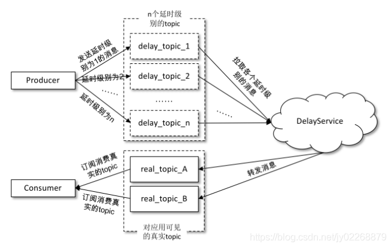

发送到内部主题（delaytopic*）中的消息会被一个独立的DelayService进程消费，这个DelayService进程和Kafka broker进程可以以一对一的配比进行同机部署以保证服务的可用性。

针对不同延时级别的主题，在DelayService的内部都会有单独的线程来进行消息的拉取，以及单独的DelayQueue（这里用的是JUC中DelayQueue）进行消息的暂存。与此同时，在DelayService内部还会有专门的消息发送线程来获取 DelayQueue 的消息并转发到真实的主题中。从消费、暂存再到转发，线程之间都是一一对应的关系。

DelayService 的设计应当尽量保持简单，避免锁机制产生的隐患。

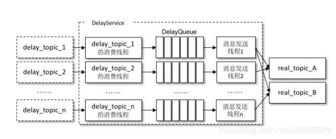

为了保障内部DelayQueue不会因为未处理的消息过多而导致内存的占用过大，DelayService会对主题中的每个分区进行计数，当达到一定的阈值之后，就会暂停拉取该分区中的消息。

因为一个主题中一般不止一个分区，分区之间的消息并不会按照投递时间进行排序，DelayQueue的作用是将消息按照再次投递时间进行有序排序，这样下游的消息发送线程就能够按照先后顺序获取最先满足投递条件的消息。

> **这个设计里最值得学的两点：**
>
> 1. **按延时等级分 Topic**，而不是给每条消息带任意延时时间——避免了对全量消息排序。
> 2. **达到阈值就暂停拉取该分区**——这就是 backpressure（背压），对应 Kafka Consumer 的 `pause()` / `resume()` API。内存里的 DelayQueue 必须有界，否则 DelayService 自己会先 OOM。

### 重试队列和死信队列

死信可以看作消费者不能处理收到的消息，也可以看作消费者不想处理收到的消息，还可以看作不符合处理要求的消息。

**重试队列**在消息消费失败时将消息回滚到broker中，一般分成多个重试等级、设置对应的重新投递延时，重试次数越多投递延时就越大。

当投递次数超过设置的上限，消息进入**死信队列**。

重试队列与延时队列有相同的地方，都需要设置延时级别。

```text
业务 Topic
   ↓ 消费失败
Retry Topic（level 1: 10s / level 2: 30s / level 3: 1min ...）
   ↓ 超过最大重试次数
Dead Letter Topic（DLQ）→ 告警 + 人工介入 / 定时补偿任务
```

> **Senior Java Focus：**DLQ 不是垃圾桶。生产环境必须回答三个问题：
>
> - **DLQ 里的消息谁看？** 没有告警和值班机制的 DLQ 等于静默丢消息。
> - **怎么重放？** 修复 Bug 之后要能把 DLQ 里的消息重新投回业务 Topic。
> - **哪些错误该进 DLQ？** 反序列化失败、业务规则拒绝属于永久失败，进 DLQ；下游超时、限流属于临时失败，应该重试而不是进 DLQ。**区分可重试与不可重试错误**是重试设计的核心。

## Kafka Failure & Troubleshooting【P0】

线上问题统一按这个框架分析：

```text
① 现象是什么？
② 故障发生在链路的哪一段？（Producer → Client → Broker → Replica/Disk → Consumer → Business）
③ 系统此刻"确定知道什么"？哪些结果是 unknown？
④ 先止血还是先恢复？
⑤ 如何恢复？
⑥ 如何防止再次发生？
```

### 消息突然大量重复

| | |
| - | - |
| **现象** | 下游出现重复订单 / 重复扣款 / 重复统计；Consumer 日志出现同 eventId 多次 |
| **链路定位** | Producer 重复发送？Broker 重复存储？Consumer 重复投递？还是业务副作用重复？ |
| **指标** | Producer `record-retry-total`、`record-send-rate`；Consumer `records-consumed-rate`、rebalance 次数、offset commit 失败数；Consumer 重启次数 |
| **常见原因** | ① Broker 成功但 ACK 丢失 → Producer 重试（未开幂等）② 业务成功但 offset 未提交 → 崩溃/Rebalance 后重放 ③ `enable.auto.commit=true` 的时间窗 ④ 业务代码调用了两次 publish ⑤ Consumer 内部并发 + 幂等失效 |
| **处理** | 先确认是哪一类。Producer 侧 → 开启 `enable.idempotence`、保持消息身份不变；Consumer 侧 → 修 offset 提交时机、修 rebalance 根因；业务侧 → 启用/修复唯一键或状态机闸门 |
| **防复发** | 业务侧幂等是最后防线，**无论 MQ 原因是什么都必须有**；补 eventId 维度的重复率监控 |

> **第一步永远不是查 Broker，而是先定义"重复"是哪一种**：Broker 里真的出现两条不同消息？同一逻辑消息被重复投递？还是消息只来一次但业务做了两次？不做这一步，后面全是猜。

### 消息疑似丢失

| | |
| - | - |
| **现象** | 下游少数据；Consumer 查不到某段消息 |
| **链路定位** | Producer 真的发了吗 → 收到 ACK 了吗 → Broker 持久化/复制了吗 → retention 删了吗 → Consumer 位置对吗 → 业务真的失败了吗 |
| **指标** | Producer 异常数、`record-error-total`、timeout 数；Broker ISR shrink 次数、`under-replicated-partitions`、磁盘错误；Consumer `records-lag-max`、当前 offset |
| **常见原因** | ① `acks=0/1` + Leader 故障 ② `min.insync.replicas=1` 导致 acks=all 退化 ③ `unclean.leader.election.enable=true` 让落后副本覆盖数据 ④ Producer 异步发送后没处理回调就退出（`send()` 是异步的，进程结束前必须 `flush()`/`close()`）⑤ **retention 到期正常删除**，Consumer 落后太久 ⑥ offset 被错误 `seek` 推进 ⑦ **Consumer 收到了但提交过早、业务失败**——最常被误报为"MQ 丢消息" |
| **处理** | 按定位到的层次分别处理：Producer 侧修发送逻辑与 acks；Broker 侧修副本配置；retention 丢失只能上游重放或数据补偿；offset 错误则回退重放 |
| **防复发** | 生产环境固定 `RF≥3 + min.insync.replicas=2 + acks=all + unclean.leader.election=false`；Lag 报警必须早于 retention 窗口 |

### Consumer Lag 暴涨

见上文 **Consumer Lag 与消息积压** 的完整 SOP。

### Rebalance 频繁

| | |
| - | - |
| **现象** | 消费忽快忽慢；日志大量 `Attempt to heartbeat failed`、`Rebalancing`、`(Re-)joining group`；Lag 锯齿状 |
| **链路定位** | Consumer ↔ Group Coordinator |
| **指标** | rebalance 频率与耗时、`session.timeout.ms` 触发次数、单批处理耗时、GC 停顿时间 |
| **常见原因** | ① 单批处理时间超过 `max.poll.interval.ms`（最常见）② 心跳线程被长时间 Full GC 阻塞 ③ Consumer 频繁重启/扩缩容 ④ 网络抖动导致心跳丢失 ⑤ 分区数远大于 Consumer 数，分配方案抖动 |
| **处理** | **调小 `max.poll.records`** 而不是单纯加大超时；把慢逻辑移出 poll 线程；用 `CooperativeStickyAssignor`；排查 GC |
| **防复发** | 监控单批处理耗时 P99，为它设置远小于 `max.poll.interval.ms` 的报警阈值 |

### Producer timeout

| | |
| - | - |
| **现象** | `TimeoutException: Expiring N record(s)`；`NetworkException`；发送延迟升高 |
| **链路定位** | Producer ↔ Broker Leader |
| **指标** | `request-latency-avg`、`record-queue-time-avg`、`record-error-total`、`buffer-available-bytes`；Broker 端磁盘延迟、`requestQueueTimeMs` |
| **常见原因** | ① Broker 磁盘慢 / Page Cache 压力大 ② ISR 收缩后 `min.insync.replicas` 不满足，`acks=all` 直接拒绝（`NotEnoughReplicasException`）③ Leader 切换期间 metadata 过期 ④ Producer 端 `buffer.memory` 打满，`send()` 阻塞 ⑤ batch 太大或 `linger.ms` 太长 ⑥ 网络问题 |
| **处理** | 区分是"Broker 处理不过来"还是"副本条件不满足"。前者查磁盘与负载；后者查 ISR 状态。Producer 侧检查 buffer 与回调处理 |
| **防复发** | 合理的 `delivery.timeout.ms` + 有界重试 + **回调里必须有失败处理逻辑**（记录、落本地、告警），不能静默丢弃 |

> **危险实现：**`send()` 之后不管回调、不做 `flush()`、进程直接退出——消息还在 Accumulator 里就没了。这不叫 Broker 丢消息，叫 Producer 没发出去。

### Broker failure

| | |
| - | - |
| **现象** | Producer/Consumer 报 `NotLeaderForPartition`、连接被拒；部分分区不可用 |
| **链路定位** | Broker / Controller |
| **指标** | `under-replicated-partitions`、`offline-partitions-count`、ISR shrink/expand 次数、Controller 活跃数 |
| **常见原因** | 进程崩溃、机器宕机、磁盘故障、Full GC 导致心跳超时被判定失效、网络分区 |
| **处理** | Controller 自动从 ISR 选新 Leader → 客户端刷新 metadata 重连。人工确认：受影响分区的 ISR 是否恢复、是否有分区因 `unclean.leader.election=false` 而处于不可用状态 |
| **防复发** | `RF≥3`；Broker 反亲和部署（不放在同一机架/同一电源）；磁盘与 GC 监控；`offline-partitions-count > 0` 必须立即告警 |

### Hot Partition

| | |
| - | - |
| **现象** | 集群整体 CPU 不高，但某个 Partition / 某个 Broker 的 Lag 或流量远高于其他 |
| **链路定位** | Producer 分区策略 → 单个 Partition |
| **指标** | 按分区的 `MessagesInPerSec`、按分区的 Lag、按 Broker 的磁盘与网络 |
| **常见原因** | ① key 分布不均（大客户、热点账号、null key 集中）② 顺序要求把大量消息固定到同一分区 ③ 自定义 Partitioner 实现有偏 |
| **处理** | 按分区看流量 → 找 key 分布 → 判断顺序边界能否缩小（比如从"按客户有序"细化到"按客户+业务类型有序"）→ 调整 key 或分区数 → 必要时隔离热点 key |
| **防复发** | 上线前评估 key 的基数与倾斜度；对 null key 的消息要有明确策略 |

> **关键：Hot Partition 场景下加 Consumer 是无效的**，因为一个分区在同一时刻只能由组内一个 Consumer 处理。

### Consumer processing slow

| | |
| - | - |
| **现象** | Lag 持续增长，Consumer 进程活着、心跳正常，但 `records-consumed-rate` 低 |
| **链路定位** | Consumer → 下游依赖 |
| **指标** | 单条处理耗时 P50/P99、线程池 active/queue、DB 连接池使用率、下游 RPC 延迟、GC 时间 |
| **常见原因** | ① 逐条同步调 DB/RPC，没有批处理 ② 下游变慢或连接池耗尽 ③ 锁竞争 ④ 反序列化开销大（消息体过大）⑤ GC ⑥ 在 poll 线程里做了重活 |
| **处理** | 固定排查链：`Consumer alive? → thread pool active? → queue size? → worker state? → processing latency? → offset commit?`；然后 batch 化、加缓存、异步化、去掉同步等待 |
| **防复发** | 为单条处理耗时设报警；容量规划时按下游能力反推 Consumer 并发度 |

## Appendix — Legacy Knowledge

> 以下为历史知识完整存档：ZooKeeper-era Kafka 架构、旧版本内部机制与二进制格式、CLI 运维操作、Java API 示例、Confluent 监控与 Avro。这些内容在原始资料中积累且**本身正确**，在存量集群维护、老面试题中仍会出现，因此完整保留，只是不再作为现代 Kafka 的正文主线。

### Appendix A — ZooKeeper-era Kafka Architecture

> **Historical：**以下是 Kafka 3.x 及以前传统部署方式的架构。现代 Kafka 使用 KRaft，不再依赖 ZooKeeper（Kafka 4.0 已完全移除 ZooKeeper 支持）。存量集群仍大量运行 ZooKeeper 模式，因此这套知识不能丢，但**不能作为"现代 Kafka 架构"来回答**。

#### Zookeeper 的角色

保存着集群broker、topic、partition 等meta 数据；另外，还负责broker故障发现，partition leader选举，负载均衡等功能。

Kafka不能脱离Zookeeper单独使用，因为Kafka使用Zookeeper管理和协调Kafka的节点服务器。

> **修正说明：**最后一句在 ZooKeeper-era 成立，**在今天已经不成立**。现代 Kafka 通过 KRaft 把元数据管理内化到 Kafka 自身的 Controller Quorum 与 `__cluster_metadata` 日志中，不再需要 ZooKeeper。

ZooKeeper 上典型保存的内容：

```text
/brokers/ids/{id}        Broker 注册信息（临时节点，Broker 存活判断的依据）
/brokers/topics/{topic}  Topic 与分区的副本分配
/controller              当前 Controller（临时节点，抢占式选举）
/controller_epoch        Controller 任期编号
/config                  动态配置
/consumer_offsets        早期消费位移（0.9 之后迁移到内部 Topic __consumer_offsets）
```

#### 判断一个Broker节点还存活的两个条件

- 节点必须可以维护和ZooKeeper的连接，Zookeeper通过心跳机制检查每个节点的连接。
- 如果节点是个follower, 他必须能及时的同步leader的写操作，延时不能太久。

第一个条件在 ZooKeeper-era 通过 `/brokers/ids/{id}` 临时节点实现：Broker 与 ZK 的 session 断开，临时节点消失，Controller 通过 watch 感知。

#### Broker选举（Controller 选举）

集群中第一个启动的broker会通过在zookeeper中创建临时节点/controller来让自己成为控制器，其他broker启动时也会在zookeeper中创建临时节点，但是发现节点已经存在，所以它们会收到一个异常，意识到控制器已经存在，那么就会在zookeeper中创建watch对象，便于它们收到控制器变更的通知。

- 如果控制器由于网络原因与zookeeper断开连接或者异常退出，那么其他broker通过watch收到控制器变更的通知，就会去尝试创建临时节点/controller，如果有一个broker创建成功，那么其他broker就会收到创建异常通知，也就意味着集群中已经有了控制器，其他broker只需创建watch对象即可。

- 如果集群中有一个broker发生异常退出了，那么控制器就会检查这个broker是否有分区的副本leader，如果有那么这个分区就需要一个新的leader，此时控制器就会去遍历其他副本，决定哪一个成为新的leader，同时更新分区的ISR集合。

- 如果有一个broker加入集群中，那么控制器就会通过Broker ID去判断新加入的broker中是否含有现有分区的副本，如果有，就会从分区副本中去同步数据。

集群中每选举一次控制器，就会通过zookeeper创建一个controller epoch，每一个选举都会创建一个更大，包含最新信息的epoch，如果有broker收到比这个epoch旧的数据，就会忽略它们，kafka也通过这个epoch来防止集群产生"脑裂"。

#### ZooKeeper-era 与 KRaft 的对照

| 关注点 | ZooKeeper-era | KRaft |
| ------ | ------------- | ----- |
| Broker 存活 | `/brokers/ids/{id}` 临时节点 + ZK session 心跳 | Broker 向 Controller Quorum 发心跳 |
| Controller 选举 | 抢占创建 `/controller` 临时节点 | Raft 选举，Controller Quorum 内部完成 |
| 变更通知 | ZK watch | 元数据日志复制 + Broker 拉取 |
| 防脑裂 | `controller_epoch` | Raft term / epoch |
| 分区规模瓶颈 | ZK 写入 + Controller 全量推送 | 元数据日志增量传播，规模显著提升 |
| 故障切换速度 | 较慢（需重建内存状态） | 快（Controller 本身持有元数据） |

### Appendix B — Historical Kafka Internals

> **Historical：**旧版本的内部实现细节与二进制格式。理解它们有助于回答"为什么 Kafka 要做这些改进"，但现代 Kafka 的实现已经不同。

#### HW 机制存在的两个历史问题

0.11版本之前Kafka使用high watermarker机制保证数据同步。

**问题一：High Watermarker Truncation followed by Immediate Leader Election（数据丢失）**

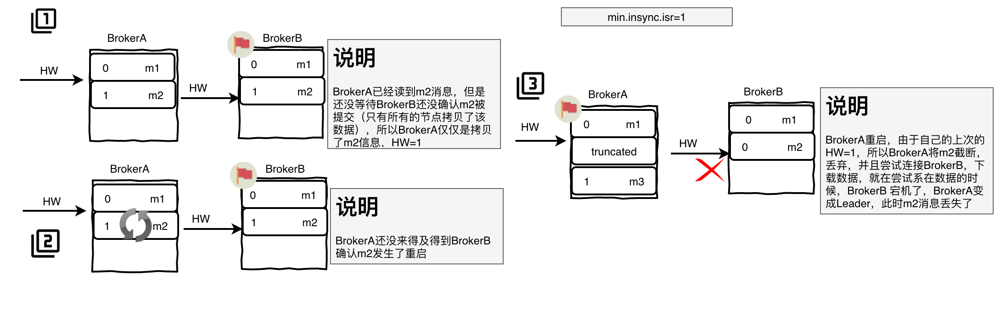

**问题二：Replica Divergence on Restart after Multiple Hard Failures（数据不一致）**

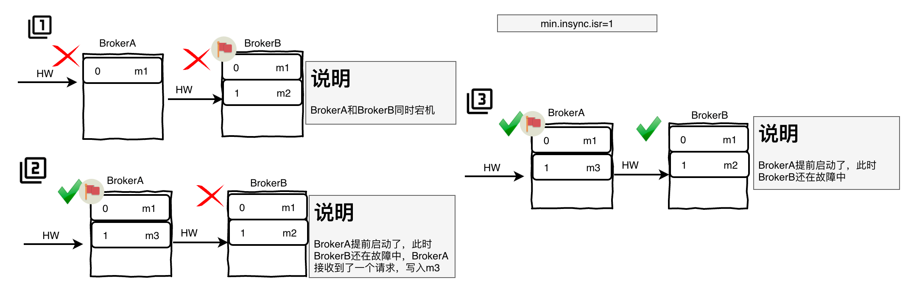

#### Leader Epoch 如何解决这两个问题

**针对问题一（数据丢失）：**

Epoch保证了从其他Broker获取最大LastOffset, 使得消息不会被错误标号，从而避免此问题。

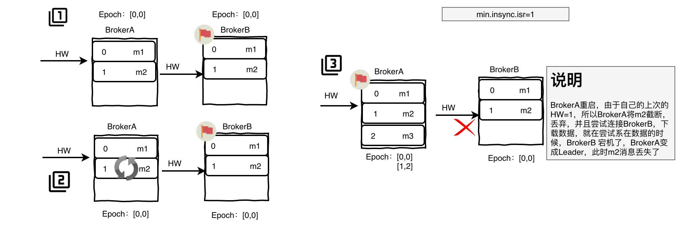

**针对问题二（数据不一致）：**

根据其他Broker返回的Epoch, 同步到Leader的数据，从而保证了数据一致性。

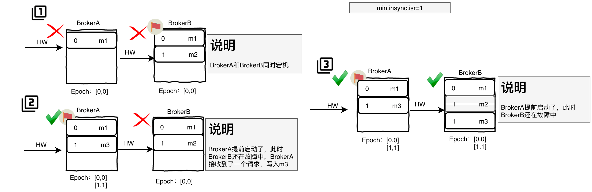

#### Kafka 0.9 / 0.11 的关键演进

| 版本 | 变化 | 影响 |
| ---- | ---- | ---- |
| 0.8 | 引入 Replication（Leader/Follower + ISR） | Kafka 具备高可用基础 |
| **0.9** | 移除 `replica.lag.max.messages`（默认 10000 条） | 因为 Kafka 批量发送，Leader 收到消息的一瞬间 Follower 可能还没拉取，按消息条数判定会导致 ISR 频繁踢出/加入，进而频繁更新 ZK 和内存。改为只按时间（`replica.lag.time.max.ms`）判定 |
| 0.9 | 消费位移从 ZooKeeper 迁移到内部 Topic `__consumer_offsets` | 位移提交不再受 ZK 写入能力限制 |
| 0.9 | 引入新的 Java Consumer API（`KafkaConsumer`，非线程安全、单线程 poll 模型） | 旧 `kafka.consumer.Consumer`（ZK 存储位移、多线程）废弃 |
| 0.10 | 消息中新增 timestamp；引入 Kafka Streams | 支持基于时间的查找与流处理 |
| **0.11** | 引入 **Leader Epoch** 取代纯 HW 截断 | 解决上述数据丢失与不一致问题 |
| 0.11 | 引入**幂等生产者**（PID + sequence）与**事务** | 支持 EOS |
| 2.4 | Sticky Partitioner（KIP-480）、Cooperative Rebalancing（KIP-429） | 无 key 消息吞吐提升；rebalance 不再全量 STW |
| 2.8 | KRaft early access | 开始去 ZooKeeper |
| 3.0 | `enable.idempotence` 与 `acks` 默认改为 `true` / `all`（KIP-679） | Producer 默认可靠 |
| 3.3 | KRaft 生产可用；UniformStickyPartitioner（KIP-794） | — |
| 4.0 | 移除 ZooKeeper 支持 | ZooKeeper-era 正式结束 |

#### 旧版 Message 二进制格式

> **Historical：**以下是 Kafka 0.11 之前的 Message（v0/v1）格式。0.11 引入事务与幂等后改为 **RecordBatch + Record** 两级结构（v2），新增了 `producerId`、`producerEpoch`、`baseSequence`、`baseOffset`、`lastOffsetDelta` 等字段，并使用变长整数（varint/zigzag）编码以节省空间。现代 Kafka 使用 v2。

| **关键字**   | **长度（字节）** | **解释说明**                                           |
| ------------ | ---------------- | ------------------------------------------------------ |
| offset       | 8                | 消息编号，偏移量，确定每条消息在parition(分区)内的位置 |
| message size | 4                | message大小                                            |
| CRC32        | 4                | 用crc32校验message                                     |
| "magic"      | 1                | 表示本次发布Kafka服务程序协议版本号                    |
| "attributes" | 1                | 表示为独立版本、或标识压缩类型、或编码类型。           |
| key length   | 4                | 表示key的长度，当key为-1时，K byte key字段不填         |
| key          | 同key length     | 可选                                                   |
| payload      |                  | 表示实际消息数据。                                     |

v2 RecordBatch 的关键新增字段（了解即可）：

```text
producerId (8)      幂等生产者的 PID
producerEpoch (2)   用于 fence 僵尸生产者
baseSequence (4)    幂等去重的序列号基准
baseOffset (8)      batch 内首条消息的 offset
lastOffsetDelta (4) batch 内最后一条的偏移量
attributes (2)      事务标记、压缩类型、timestamp 类型
```

面试中不需要背字段，但要知道：**幂等与事务能力是消息格式层面的改造带来的，不是纯客户端功能。**

### Appendix C — Kafka CLI / Operations

> **Reference：**部署与命令行操作。运维和排障时会用到，但不属于 Senior Java 面试主线。
>
> **版本提示：**以下 `--zookeeper` 相关说明仅适用于 ZooKeeper-era。Kafka 2.0 起 `kafka-topics.sh` 的 `--zookeeper` 参数已被废弃，统一使用 `--bootstrap-server`；**Kafka 4.0 起该参数已彻底移除**。KRaft 模式下启动使用 `kafka-storage.sh format` 初始化元数据目录，配置文件改用 `kraft/server.properties`。

#### 部署

将压缩包解压，修改./config/server.properties

在Socket Server Settings下定义listerners=PLAINTEXT://{主机名}:9092, 注意务必填写主机名而不是IP.

在Log Basics下定义自己需要的log.dirs

在Zookeeper下定义zookeeper.connect={主机名}:2181

#### 启动

确保Zookeeper正常运行后，通过./bin/kafka-server-start.sh {-daemon} config/server.properties启动Kafka, 如果希望Kafka在后台执行不随着窗口关闭而退出就加上参数-daemon. 执行jps可以看到Kafka进程、/usr/下成功创建kafka-logs目录，即代表Kafka启动成功。

如果报以下错误，请将配置文件的位置与配置保持一致

```bash
INFO Registered kafka:type=kafka.Log4jController MBean (kafka.utils.Log4jControllerRegistration$)
[2019-10-30 15:16:57,057] ERROR Exiting Kafka due to fatal exception (kafka.Kafka$)
java.nio.file.NoSuchFileException: config.server.properties
```

#### 关闭

通过./bin/kafka-server-stop.sh关闭Kafka, 优雅的关闭过程需要等待几秒钟的时间，执行jps看不到Kafka进程就代表已经关闭。

#### Topic指令

Kafka 2.0起，./bin/kafka-topics.sh的--zookeeper参数已被废弃，统一使用--bootstrap-server参数。

##### 创建topic

```bash
./bin/kafka-topics.sh --bootstrap-server {主机名}:9092 --create --topic {topic名} --partitions {分区数} --replication-factor {副本因子，不能超过broker个数}
```

##### 查看topic列表

```bash
./bin/kafka-topics.sh --bootstrap-server {主机名}:9092 --list
topic01
topic1
```

##### 查看topic详情

```bash
./bin/kafka-topics.sh --bootstrap-server ltprcCentOS:9092 --describe

Topic:topic01 PartitionCount:3    ReplicationFactor:1   Configs:segment.bytes=1073741824
Topic: topic01 Partition: 0  Leader: 0    Replicas: 0   Isr: 0
Topic: topic01 Partition: 1  Leader: 0    Replicas: 0   Isr: 0
Topic: topic01 Partition: 2  Leader: 0    Replicas: 0   Isr: 0
Topic:topic1  PartitionCount:1    ReplicationFactor:1   Configs:segment.bytes=1073741824        
Topic: topic1  Partition:  0  Leader: 0    Replicas: 0   Isr: 0
```

##### 修改topic的partition个数

```bash
./bin/kafka-topics.sh --bootstrap-server {主机名}:9092 --alter --topic {topic名} --partitions {新的分区数，只能更高不能更低}
```

> **警告：**扩分区会改变 `numPartitions`，导致**基于 key 的路由结果变化**，同一 key 的新消息可能落到不同分区，历史顺序被打断。对顺序敏感的业务，扩分区前必须评估。

##### 删除topic

```bash
./bin/kafka-topics.sh --bootstrap-server {主机名}:9092 --delete --topic {topic名}
```

##### 查看group列表

```bash
./bin/kafka-consumer-groups.sh --bootstrap-server {主机名}:9092 --list
```

##### 查看group详情

```bash
./bin/kafka-consumer-groups.sh --bootstrap-server {主机名}:9092 --group {group名} --describe
```

输出中的关键列：

```text
TOPIC  PARTITION  CURRENT-OFFSET  LOG-END-OFFSET  LAG  CONSUMER-ID  HOST  CLIENT-ID
                                    │                 │
                                    └── LEO           └── LAG = LOG-END-OFFSET - CURRENT-OFFSET
```

**这是排查 Consumer Lag 最常用的命令。**

##### 重置消费位置

```bash
# 必须先停掉该 group 的所有 consumer，或使用 --dry-run 预演
./bin/kafka-consumer-groups.sh --bootstrap-server {主机名}:9092 \
  --group {group名} --topic {topic名} \
  --reset-offsets --to-earliest --execute
```

其他常用重置方式：`--to-latest`、`--to-offset <n>`、`--shift-by <n>`、`--to-datetime <ISO8601>`、`--by-duration <PT1H>`。

#### 收发消息指令

##### 发送topic

```bash
./bin/kafka-console-producer.sh --broker-list {主机名}:9092 --topic {topic名}
```

##### 订阅topic

```bash
./bin/kafka-console-consumer.sh --bootstrap-server {主机名}:9092 --topic {topic名} --group {group名}
```

如果多个group名相同的订阅者订阅同一个topic, 会进行竞争消费，每条消息只有一个接受者。

如果多个group名不同的订阅者订阅同一个topic, 会进行组间广播，每条消息都全会被收到。

```bash
--property print.key=true #消费时是否打印key
--property print.value=true #消费时是否打印value即消息内容
--property key.separator=, #消费时key和value的打印间隔
```

```bash
# 从头消费（不加 --group 时会用随机 group，且默认从 latest 开始）
./bin/kafka-console-consumer.sh --bootstrap-server {主机名}:9092 \
  --topic {topic名} --from-beginning
```

> **修正说明：**原始资料中该参数拼写为 `key.seperator`，正确拼写是 `key.separator`。代码块语言标记 ```` ```bas ```` 已修正为 ```` ```bash ````。

### Appendix D — Legacy Java API / Configuration Examples

> **Reference：**基于 `kafka-clients-2.6.0` 的 API 示例。核心 API 在现代版本中基本兼容，但部分默认值已变化（尤其是 `enable.idempotence`、`acks`），使用时以正文说明为准。

#### 引用

kafka-clients-2.6.0.jar中的org.apache.kafka.*等组件。

#### 初始化客户端连接

```java
public static void init() {
    Properties props = new Properties();
    props.put(AdminClientConfig.BOOTSTRAP_SERVERS_CONFIG, KAFKA_IP + ":" + KAFKA_PORT);
    adminClient = (KafkaAdminClient) KafkaAdminClient.create(props);
}
```

```bash
INFO 2021-01-23 08:57:43 org.apache.kafka.clients.admin.AdminClientConfig - AdminClientConfig values: 
	bootstrap.servers = [192.168.137.128:9092]
	client.dns.lookup = use_all_dns_ips
	client.id = 
	connections.max.idle.ms = 300000
	default.api.timeout.ms = 60000
	metadata.max.age.ms = 300000
	metric.reporters = []
	metrics.num.samples = 2
	metrics.recording.level = INFO
	metrics.sample.window.ms = 30000
	receive.buffer.bytes = 65536
	reconnect.backoff.max.ms = 1000
	reconnect.backoff.ms = 50
	request.timeout.ms = 30000
	retries = 2147483647
	retry.backoff.ms = 100
	sasl.client.callback.handler.class = null
	sasl.jaas.config = null
	sasl.kerberos.channel.binding.class = null
	sasl.kerberos.kinit.cmd = /usr/bin/kinit
	sasl.kerberos.min.time.before.relogin = 60000
	sasl.kerberos.service.name = null
	sasl.kerberos.ticket.renew.jitter = 0.05
	sasl.kerberos.ticket.renew.window.factor = 0.8
	sasl.login.callback.handler.class = null
	sasl.login.class = null
	sasl.login.refresh.buffer.seconds = 300
	sasl.login.refresh.min.period.seconds = 60
	sasl.login.refresh.window.factor = 0.8
	sasl.login.refresh.window.jitter = 0.05
	sasl.mechanism = GSSAPI
	security.protocol = PLAINTEXT
	security.providers = null
	send.buffer.bytes = 131072
	ssl.cipher.suites = null
	ssl.enabled.protocols = [TLSv1.2, TLSv1.3]
	ssl.endpoint.identification.algorithm = https
	ssl.engine.factory.class = null
	ssl.key.password = null
	ssl.keymanager.algorithm = SunX509
	ssl.keystore.location = null
	ssl.keystore.password = null
	ssl.keystore.type = JKS
	ssl.protocol = TLSv1.3
	ssl.provider = null
	ssl.secure.random.implementation = null
	ssl.trustmanager.algorithm = PKIX
	ssl.truststore.location = null
	ssl.truststore.password = null
	ssl.truststore.type = JKS

INFO 2021-01-23 08:57:44 org.apache.kafka.common.utils.AppInfoParser - Kafka version: 2.6.0
INFO 2021-01-23 08:57:44 org.apache.kafka.common.utils.AppInfoParser - Kafka commitId: 62abe01bee039651
INFO 2021-01-23 08:57:44 org.apache.kafka.common.utils.AppInfoParser - Kafka startTimeMs: 1611363464344
```

#### 关闭客户端连接

```java
public static void close() {
    adminClient.close();
}
```

#### 查看topic列表

```java
public static void listTopic() throws InterruptedException, ExecutionException {
    ListTopicsResult topicsResult =  adminClient.listTopics();
    Set<String> names = topicsResult.names().get();
    for (String name : names) {
        System.out.println(name);
    }
}
```

#### 查看topic详情

```java
public static void describeTopic(List<String> names) throws InterruptedException, ExecutionException {
    DescribeTopicsResult dtr =  adminClient.describeTopics(names);
    Map<String, TopicDescription> topicDescriptionMap = dtr.all().get();
    for (Entry<String, TopicDescription> entry : topicDescriptionMap.entrySet()) {
        System.out.println(entry.getKey() + ":" + entry.getValue());
    }
}
```

#### 创建topic

三个参数分别为topic名称、partition个数、副本因子。

可以同步执行，也可以异步执行（不会立即返回结果）。

```java
public static void createTopic(boolean isAsync) throws InterruptedException, ExecutionException {
    if (isAsync) {
        //异步，不会立即看到结果
        adminClient.createTopics(Arrays.asList(new NewTopic("topic101", 3, (short)3)));
    } else {
        //同步
        CreateTopicsResult createTopicsResult = adminClient.createTopics(Arrays.asList(new NewTopic("topic101", 3, (short)3)));
        createTopicsResult.all().get();
    }
}
```

#### 删除topic

```java
public static void deleteTopic(List<String> names) throws InterruptedException, ExecutionException {
    deleteTopic(names, false);
}
public static void deleteTopic(List<String> names, boolean isAsync) throws InterruptedException, ExecutionException {
    DeleteTopicsResult deleteTopicsResult = adminClient.deleteTopics(names);
    //如果是同步处理，会立即看到结果
    if (!isAsync) {
        deleteTopicsResult.all().get();
    }
}
```

#### 管理生产者

```java
public class Producer {
    private static KafkaProducer<String, String> producer;
    public static void init() {
        Properties props = new Properties();
        props.put(ProducerConfig.BOOTSTRAP_SERVERS_CONFIG, KafkaConfig.KAFKA_HOST + ":" + KafkaConfig.KAFKA_PORT);
        props.put(ProducerConfig.KEY_SERIALIZER_CLASS_CONFIG, StringSerializer.class.getName());
        props.put(ProducerConfig.VALUE_SERIALIZER_CLASS_CONFIG, StringSerializer.class.getName());
        producer = new KafkaProducer<String, String>(props);
    }
    public static void close() {
        producer.close();
    }
    public static void main(String[] args) {
        init();
        for (int i = 0; i < 10; i++) {
            ProducerRecord<String, String> record = new ProducerRecord<>("topic01", "KEY", "VALUE");
            producer.send(record);
            System.out.println("Send: " + i);
        }
        close();
    }
}
```

> **示例中的隐患（生产环境必须修正）：**
>
> 1. `producer.send(record)` 是**异步**的，返回 `Future`。这里既不传 callback 也不 `get()`，发送失败会被**静默丢弃**。
> 2. `close()` 虽然会 flush，但如果中间抛异常提前退出，Accumulator 里的消息就没了。
>
> 正确写法：
>
> ```java
> producer.send(record, (metadata, exception) -> {
>     if (exception != null) {
>         log.error("send failed, offset={}", metadata != null ? metadata.offset() : -1, exception);
>         // 落本地文件 / 告警 / 补偿，绝不能静默丢弃
>     }
> });
> ```

##### 指定发布分区策略

```java
//指定用户自定义的发布分区策略
    props.put(ProducerConfig.PARTITIONER_CLASS_CONFIG, UserDefinePartitioner.class.getName());
//…
public class UserDefinePartitioner implements Partitioner {
    private AtomicInteger atomicInteger = new AtomicInteger(0);
    @Override
    public int partition(String topic, Object key, byte[] keyBytes, Object value, byte[] valueBytes, Cluster cluster) {
        int numPartitions = cluster.partitionsForTopic(topic).size();
        if (keyBytes == null || keyBytes.length == 0) {
            return atomicInteger.addAndGet(1) & Integer.MAX_VALUE % numPartitions;
        } else {
            return Utils.toPositive(Utils.murmur2(keyBytes)) % numPartitions;
        }
    }
    //…
```

> **示例中的两个问题：**
>
> 1. `atomicInteger.addAndGet(1) & Integer.MAX_VALUE % numPartitions` 的**运算符优先级有误**：`%` 优先级高于 `&`，实际计算的是 `n & (Integer.MAX_VALUE % numPartitions)`，而不是 `(n & Integer.MAX_VALUE) % numPartitions`。应加括号。
> 2. 无 key 时使用逐条轮询，这正是 Kafka 2.4 之前的行为；现代 Kafka 默认使用 sticky 策略以获得更好的 batch 局部性（见正文「分区策略」）。
> 3. 这段代码同时印证了正文的修正：**有 key 时用的是 `Utils.murmur2`，不是 `hashCode()`。**

##### 自定义发布者序列化策略

```java
    props.put(ProducerConfig.VALUE_SERIALIZER_CLASS_CONFIG, UserDefineSerializer.class.getName());
//…
public class UserDefineSerializer implements Serializer<Object>{
    @Override
    public void configure(Map<String, ?> configs, boolean isKey) {
        System.out.println("configure");
    }
    @Override
    public byte[] serialize(String topic, Object data) {
        return SerializationUtils.serialize((Serializable) data);
    }
    @Override
    public void close() {
        System.out.println("close");
    }
}
```

> **注意：**这里用的是 Java 原生序列化，跨语言不兼容且体积大。现代实践应使用 JSON（配合 Schema Registry）或 Protobuf / Avro。

##### 自定义拦截器

以发布者拦截器为例。

```java
    //配置自定义拦截器
    props.put(ProducerConfig.INTERCEPTOR_CLASSES_CONFIG, UserDefineProducerInterceptor.class.getName());
//…
public class UserDefineProducerInterceptor implements ProducerInterceptor {
    @Override
    public ProducerRecord onSend(ProducerRecord record) {
        ProducerRecord wrapRecord = new ProducerRecord(record.topic(), record.key(), record.value());
        wrapRecord.headers().add("user","mashibing".getBytes());
        return wrapRecord;
    }
    @Override
    public void onAcknowledgement(RecordMetadata metadata, Exception exception) {
        System.out.println("metadata:"+metadata+",exception:"+exception);
    }
    @Override
    public void close() {
        System.out.println("close");
    }
    @Override
    public void configure(Map<String, ?> configs) {
        System.out.println("configure");
    }
}
```

> 拦截器是注入 trace id、埋点统计、统一加 header 的正确位置。`onAcknowledgement` 在 Sender 线程回调，**不要在里面做耗时操作**。

#### 管理消费者

```java
public class Consumer {
    private static KafkaConsumer<String, String> consumer;
    public static void init(String groupId) {
        Properties props = new Properties();
        props.put(ConsumerConfig.BOOTSTRAP_SERVERS_CONFIG, KafkaConfig.KAFKA_HOST + ":" + KafkaConfig.KAFKA_PORT);
        props.put(ConsumerConfig.KEY_DESERIALIZER_CLASS_CONFIG, StringDeserializer.class.getName());
        props.put(ConsumerConfig.VALUE_DESERIALIZER_CLASS_CONFIG, StringDeserializer.class.getName());
        props.put(ConsumerConfig.GROUP_ID_CONFIG, groupId);
        consumer = new KafkaConsumer<String, String>(props);
    }
    public static void close() {
        consumer.close();
    }
    public static void main(String[] args) {
        init("group1");
        consumer.subscribe(Pattern.compile("^topic.*"));
//        consumer.subscribe(Arrays.asList("topic01"));
        while (true) {
            ConsumerRecords consumerRecords = consumer.poll(Duration.ofSeconds(1));
            if (!consumerRecords.isEmpty()) {
                Iterator<ConsumerRecord<String, String>> recordIterator = consumerRecords.iterator();
                while (recordIterator.hasNext()) {
                    ConsumerRecord<String, String> record = recordIterator.next();
                    System.out.println("Receive: topic-" + record.topic() + " partition-" + record.partition() + " offset-" + record.offset() 
                    + " key-" + record.key() + " value-" + record.value());
                }
            }
        }
//        close();
    }
}
```

> **示例中的问题：**
>
> 1. `KafkaConsumer` **不是线程安全的**，不能被多线程共享（除了 `wakeup()`）。
> 2. `while(true)` 且没有 `close()`，进程被 kill 时不会执行 LeaveGroup，只能等 `session.timeout.ms` 超时，会拖慢 rebalance。应加 shutdown hook。
> 3. 没有异常处理：一次反序列化失败（`SerializationException`）会让整个消费循环崩溃，形成"毒丸消息"（poison pill）。生产环境需要 catch 并转入 DLQ。
> 4. 没有 offset 提交逻辑，依赖默认自动提交——见下文的修正说明。

##### 指定订阅分区策略

```java
//指定消费partition
List<TopicPartition> partitions = Arrays.asList(new TopicPartition("topic01", 0));
consumer.assign(partitions);
//指定offset
//consumer.seekToBeginning(partitions);
consumer.seek(new TopicPartition("topic01", 0), 1);
```

> **`subscribe()` 与 `assign()` 的区别很重要：**
>
> | | `subscribe()` | `assign()` |
> | - | ------------- | ---------- |
> | 分区分配 | 由 Group 协调，自动 rebalance | **手动指定，不参与 Consumer Group 分配** |
> | 成员变化时 | 自动重新分配 | 不受影响，也不会自动接管别人的分区 |
> | offset 提交 | 正常按 group 提交 | 仍可提交，但 Kafka 不会帮你做分配 |
>
> `assign()` 常用于：只需要读数据不需要组语义的场景（如监控工具、数据修复工具、自定义分配策略）。**用了 `assign()` 就失去了自动容错能力**——实例挂了没人接管它的分区。

##### 自定义消费者反序列化策略

```java
    props.put(ConsumerConfig.VALUE_DESERIALIZER_CLASS_CONFIG, UserDefineDeserializer.class.getName());
//…
public class UserDefineDeserializer implements Deserializer<Object>{
    @Override
    public void configure(Map<String, ?> configs, boolean isKey) {
        System.out.println("configure");
    }
    @Override
    public Object deserialize(String topic, byte[] data) {
        return SerializationUtils.deserialize(data);
    }
    @Override
    public void close() {
        System.out.println("close");
    }
}
```

##### 自定义订阅点

Kafka消费者默认对于未订阅的topic的offset的时候，也就是系统并没有存储该消费者的消费分区的记录信息，默认Kafka消费者的默认首次消费策略：auto.offset.reset=latest

```java
//自动将偏移量重置为最新的偏移量（默认值）：只消费启动之后新产生的消息
props.put(ConsumerConfig.AUTO_OFFSET_RESET_CONFIG, "latest");
//自动将偏移量重置为最早的偏移量：从头开始消费全部历史消息（受 retention 限制）
props.put(ConsumerConfig.AUTO_OFFSET_RESET_CONFIG, "earliest");
//如果未找到消费者组的先前偏移量，则向消费者抛出异常（NoOffsetForPartitionException）
props.put(ConsumerConfig.AUTO_OFFSET_RESET_CONFIG, "none");
```

> **修正说明：**原始资料中 `latest` 与 `earliest` 两条的注释文字互相错位（`latest` 被注释为"重置为最早的偏移量"，`earliest` 被注释为"重置为最新早的偏移量"），已按 Kafka 实际语义修正。
>
> **另外要强调：`auto.offset.reset` 只在"找不到已提交 offset"时生效**，即：新 Group 首次消费、或 offset 已因 retention 过期被删除、或 offset 非法。已有有效 Committed Offset 时它不起作用。因此新服务上线时用默认 `latest` 会**静默跳过全部历史消息**，这是很常见的线上事故。

##### Offset 提交方式

**① 自动提交（默认）**

```java
props.put(ConsumerConfig.ENABLE_AUTO_COMMIT_CONFIG, true);
props.put(ConsumerConfig.AUTO_COMMIT_INTERVAL_MS_CONFIG, 5000);
```

以上为默认值。如果用户需要自己管理offset的自动提交，可以关闭offset的自动提交，手动管理offset提交的偏移量，注意用户提交的offset偏移量永远都要比本次消费的偏移量+1，因为提交的offset是kafka消费者下一次抓取数据的位置。

> **这条 `+1` 规则是手动提交最容易踩的坑。**`commitSync` 提交的语义是"**下一次要从哪里开始拉**"，不是"我处理完了哪一条"。少加 1 会导致重启后重复消费最后一条；加错位置则可能跳过消息。

> **修正说明：**原始资料称"默认会定期提交消费偏移量，**这样就可以保证所有的消息至少可以被消费者消费1次**"——**这个结论是错误的**。
>
> 自动提交的语义恰恰相反：它按**时间**提交 poll 到的位置，与业务是否处理完成无关。
>
> ```text
> poll 拿到 offset 100~199
>     ↓ 5s 定时到，自动提交 offset = 200
>     ↓ 业务还在处理 150
>     ↓ ✗ crash
>     ↓ 重启后从 200 继续 → 150~199 永久丢失
> ```
>
> 所以 `enable.auto.commit=true` 带来的是 **at-most-once 倾向**（可能丢），不是 at-least-once。要做 at-least-once 必须关闭自动提交、业务成功后手动提交。

**② 手动同步提交**

```java
props.put(ConsumerConfig.ENABLE_AUTO_COMMIT_CONFIG, false);
//…
while (true) {
    ConsumerRecords<String, String> records = consumer.poll(Duration.ofSeconds(1));
    for (ConsumerRecord<String, String> record : records) {
        process(record);            // 先做业务
    }
    try {
        consumer.commitSync();      // 业务成功后再提交，阻塞直到提交完成
    } catch (CommitFailedException e) {
        // 通常意味着已经发生了 rebalance，本批消息可能被别人重复消费 → 靠幂等兜住
        log.warn("commit failed, likely rebalanced", e);
    }
}
```

**③ 手动异步提交**

```java
consumer.commitAsync((offsets, exception) -> {
    if (exception != null) {
        log.error("async commit failed", exception);
    }
});
```

`commitAsync` 不阻塞，吞吐更高，但失败时**不会重试**（重试可能造成旧 offset 覆盖新 offset）。常见组合：**平时用 `commitAsync`，关闭前用 `commitSync` 兜底**。

**④ 按分区细粒度提交**

用户提交的offset偏移量永远都要比本次消费的偏移量+1，因为提交的offset是kafka消费者下一次抓取数据的位置。

```java
//记录分区的消费元数据信息
Map<TopicPartition, OffsetAndMetadata> offsets = new HashMap<>();
//…
offsets.put(new TopicPartition(record.topic(), record.partition()),
            new OffsetAndMetadata(record.offset() + 1));   // 注意 +1
//异步提交
consumer.commitAsync(offsets, new OffsetCommitCallback() {
    @Override
    public void onComplete(Map<TopicPartition, OffsetAndMetadata> offsets, Exception exception) {
        System.out.println("offsets:" + offsets + "\texceptions:" + exception);
    }
});
```

> **修正说明：**原始资料的注释写着"提交的 offset 永远要比本次消费的偏移量 +1"（正确），但示例代码是 `new OffsetAndMetadata(record.offset())`（少加 1），两者矛盾。已修正为 `record.offset() + 1`。
>
> 少加 1 的后果：**每次重启都会重复消费最后一条消息**。
>
> 另外，原文的小标题是"异步提交订阅位置 —— 避免重复消费"。更准确的表述是：细粒度提交能**缩小**重复消费的窗口（只重放未提交的那部分），但**不能避免**重复消费。真正避免重复副作用靠的是业务幂等。

### Appendix E — Confluent 监控指标 / Avro

> **Reference：**JMX 监控指标清单与序列化方案。指标本身在排障时非常有用（正文「Consumer Lag」与「Troubleshooting」两节会引用其中的关键项），但完整的 objectName 清单不属于面试主线。

#### Confluent

One of the best Apache Kafka monitoring tools.

#### 监控指标

##### 操作系统监控项

| **objectName**                                              | **指标项**             | **说明**      |
| ----------------------------------------------------------- | ---------------------- | ------------- |
| java.lang:type=OperatingSystem                              | FreePhysicalMemorySize | 空闲物理内存  |
| java.lang:type=OperatingSystem                              | SystemCpuLoad          | 系统CPU利用率 |
| java.lang:type=OperatingSystem                              | ProcessCpuLoad         | 进程CPU利用率 |
| java.lang:type=GarbageCollector,   name=G1 Young Generation | CollectionCount        | GC次数        |

##### Broker指标

| **objectName**                                               | **指标项** | **说明**                            |
| ------------------------------------------------------------ | ---------- | ----------------------------------- |
| kafka.server:type=BrokerTopicMetrics,   name=BytesInPerSec   | Count      | 每秒输入的流量                      |
| kafka.server:type=BrokerTopicMetrics,   name=BytesOutPerSec  | Count      | 每秒输出的流量                      |
| kafka.server:type=BrokerTopicMetrics,   name=BytesRejectedPerSec | Count      | 每秒扔掉的流量                      |
| kafka.server:type=BrokerTopicMetrics,   name=MessagesInPerSec | Count      | 每秒的消息写入总量                  |
| kafka.server:type=BrokerTopicMetrics,   name=FailedFetchRequestsPerSec | Count      | 当前机器每秒fetch请求失败的数量     |
| kafka.server:type=BrokerTopicMetrics,   name=FailedProduceRequestsPerSec | Count      | 当前机器每秒produce请求失败的数量   |
| kafka.server:type=ReplicaManager,   name=PartitionCount      | Value      | 该broker上的partition的数量         |
| kafka.server:type=ReplicaManager,   name=LeaderCount         | Value      | Leader的replica的数量               |
| kafka.network:type=RequestMetrics,   name=TotalTimeMs,request=FetchConsumer | Count      | 一个请求FetchConsumer耗费的所有时间 |
| kafka.network:type=RequestMetrics,   name=TotalTimeMs,request=FetchFollower | Count      | 一个请求FetchFollower耗费的所有时间 |
| kafka.network:type=RequestMetrics,   name=TotalTimeMs,request=Produce | Count      | 一个请求Produce耗费的所有时间       |

**排障时还应重点关注的 Broker 指标（补充）：**

| 指标 | 含义 | 为什么重要 |
| ---- | ---- | ---------- |
| `kafka.server:type=ReplicaManager,name=UnderReplicatedPartitions` | 副本未同步的分区数 | **> 0 就应该告警**，意味着冗余度下降 |
| `kafka.controller:type=KafkaController,name=OfflinePartitionsCount` | 无 Leader 的分区数 | **> 0 意味着该分区不可读写**，最高优先级 |
| `kafka.controller:type=KafkaController,name=ActiveControllerCount` | 活跃 Controller 数 | 集群总和必须为 1，为 0 或多个都是严重故障 |
| `kafka.server:type=ReplicaManager,name=IsrShrinksPerSec` / `IsrExpandsPerSec` | ISR 收缩/扩张频率 | 频繁收缩说明有 Broker 或磁盘跟不上 |
| `kafka.network:type=RequestMetrics,name=RequestQueueTimeMs` | 请求在队列中的等待时间 | 区分"Broker 忙"与"磁盘慢"的关键 |
| `kafka.log:type=LogFlushStats,name=LogFlushRateAndTimeMs` | 刷盘频率与耗时 | 磁盘性能的直接指标 |

##### Producer以及topic指标

| **objectName**                                               | **指标项**          | **官网说明**                                                 | **译文说明**                             |
| ------------------------------------------------------------ | ------------------- | ------------------------------------------------------------ | ---------------------------------------- |
| kafka.producer:type=producer-metrics,client-id=console-producer(client-id会变化) | incoming-byte-rate  | The average number of incoming bytes received per second from all  servers. | producer每秒的平均写入流量               |
| kafka.producer:type=producer-metrics,client-id=console-producer(client-id会变化) | outgoing-byte-rate  | The average number of outgoing bytes sent per second to all servers. | producer每秒的输出流量                   |
| kafka.producer:type=producer-metrics,client-id=console-producer(client-id会变化) | request-rate        | The average number of requests sent per second to the broker. | producer每秒发给broker的平均request次数  |
| kafka.producer:type=producer-metrics,client-id=console-producer(client-id会变化) | response-rate       | The average number of responses received per second from the broker. | producer每秒发给broker的平均response次数 |
| kafka.producer:type=producer-metrics,client-id=console-producer(client-id会变化) | request-latency-avg | The average time taken for a fetch request.                  | 一个fetch请求的平均时间                  |
| kafka.producer:type=producer-topic-metrics,client-id=console-producer,topic=testjmx(client-id和topic名称会变化) | record-send-rate    | The average number of records sent per second for a topic.   | 每秒从topic发送的平均记录数              |
| kafka.producer:type=producer-topic-metrics,client-id=console-producer,topic=testjmx(client-id和topic名称会变化) | record-retry-total  | The total number of retried record sends                     | 重试发送的消息总数量                     |
| kafka.producer:type=producer-topic-metrics,client-id=console-producer,topic=testjmx(client-id和topic名称会变化) | record-error-total  | The total number of record sends that resulted in errors     | 发送错误的消息总数量                     |

**排障时还应关注的 Producer 指标（补充）：**

| 指标 | 含义 |
| ---- | ---- |
| `record-queue-time-avg` | 消息在 Accumulator 里的平均等待时间，判断是 Producer 攒批慢还是 Broker 慢 |
| `buffer-available-bytes` | 剩余 buffer，接近 0 说明 `buffer.memory` 打满，`send()` 会阻塞 |
| `batch-size-avg` / `compression-rate-avg` | 实际 batch 大小与压缩率，判断 `linger.ms` / `batch.size` 是否合理 |
| `waiting-threads` | 因 buffer 满而阻塞在 `send()` 上的线程数，**> 0 就是明确的背压信号** |

##### Consumer指标

| **objectName**                                               | **指标项**            | **官网说明**                                                 | **说明**                    |
| ------------------------------------------------------------ | --------------------- | ------------------------------------------------------------ | --------------------------- |
| kafka.consumer:type=consumer-fetch-manager-metrics,client-id=consumer-1(client-id会变化) | records-lag-max       | Number of messages the consumer lags behind the producer by. Published  by the consumer, not broker. | 由consumer提交的消息消费lag |
| kafka.consumer:type=consumer-fetch-manager-metrics,client-id=consumer-1(client-id会变化) | records-consumed-rate | The average number of records consumed per second            | 每秒平均消费的消息数量      |

**排障时还应关注的 Consumer 指标（补充）：**

| 指标 | 含义 |
| ---- | ---- |
| `records-lag`（按 topic-partition 维度） | **必须按分区看**，总 Lag 会掩盖热点分区 |
| `commit-latency-avg` / `commit-rate` | offset 提交延迟与频率，判断提交是否成为瓶颈 |
| `fetch-latency-avg` | 一次 fetch 的耗时，判断是 Broker 慢还是网络慢 |
| `heartbeat-rate` | 心跳频率，异常下降预示即将被踢出 Group |
| `reassign-partitions-rate`（较新版本） | 分区被重新分配的频率，即 rebalance 频率 |

> **注意：**`records-lag-max` 是 **Consumer 客户端上报的**，不是 Broker 上报的。Consumer 全部挂掉时这个指标会消失——**指标消失本身就是最严重的告警**。生产环境应同时用 `kafka-consumer-groups.sh --describe` 从 Broker 侧采集 Lag，避免 Consumer 死了却看不到积压。

#### Avro

Avro是一个数据序列化系统，设计用于支持大批量数据交换的应用。

Avro 在 Kafka 生态中通常与 **Confluent Schema Registry** 配合使用：

```text
Producer
   ↓ 用 Schema 序列化成紧凑二进制（消息里只带 schema id）
Kafka
   ↓
Consumer
   ↓ 按 schema id 从 Registry 拉取 Schema 反序列化
```

| 方案 | 特点 |
| ---- | ---- |
| JSON | 可读、自描述，但体积大、无强制 Schema，字段变更容易出错 |
| **Avro** | 二进制紧凑、Schema 显式演进（向前/向后兼容）、Confluent 生态标准 |
| Protobuf | 二进制紧凑、跨语言代码生成、gRPC 生态标准 |

> Schema 演进兼容性（backward / forward / full）是 Avro 与 Schema Registry 的核心价值——它让 Producer 和 Consumer 可以**独立发版**而不互相打挂。这是大型 Kafka 集群治理的关键能力。
