# SYS311 - Message Queue - Bigpipe

返回[Bulletin](./bulletin.md)

返回[SYS311 - Message Queue](./SYS311.md)

[TOC]

Bigpipe是⼀个分布式消息队列服务，可以帮助模块间的通信实现解耦、流量移峰填谷等。

## 使用场景

- 实时消息传输：关注时效性，一般10-20ms（不超过100ms）。

- 流式数据传输：关注流量，300-500MB/s，延时5-6分钟即可，用于指标计算、trace等。

- 日志文件分发：关注不重不漏和流量，将数据库文件通过流式系统DStream发布，1+GB/s，不关注延时。

## 优势

- 分布式：类似于命名服务，⽤户不⽤关⼼pipelet分布在哪⼀台机器上，只需根据pipe名和pipeletid进⾏连接，就可以发布或者订阅数据；能容忍单机的故障因素，pipelet遇到故障会由系统进⾏转移，保障可⽤性。

- 多副本：单台机器丢失数据不会导致系统数据丢失。

- 持久化：消息可回溯，保障消息不重不丢。

## 劣势

- 系统部署成本高：和系统架构有关。

- API支持的编程语言少
  - C++
  - Java
  - PHP (api会造成内存泄漏和连接数过多的问题，现已停用)

## 系统层级

| 层级     | 说明                                                 |
| -------- | ---------------------------------------------------- |
| 应用层   | 各类业务模块，minos，计算生态的服务等等              |
| 接入层   | Webservice，Queuesvr，各类重API，c-api，libbigpipe等 |
| 元数据层 | Zookeeper，还有bigpipe自己的管理模块Master           |
| 存储层   | Broker，bigpipe的存储节点，多副本机制                |
| 持久化层 | SATA盘，硬件RAID                                     |

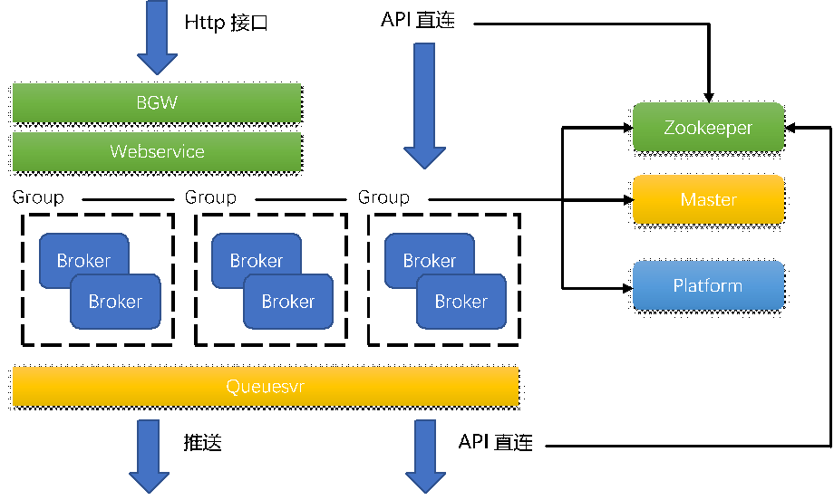

## ZooKeeper

保存Bigpipe的元数据、运行时信息等系统关键信息。

## Master

实现负载均衡、故障迁移等功能的管理模块

## Broker

Broker是Bigpipe的数据传输实体，接收发布/订阅请求的服务器，能够把发布的数据持久化到本地，具备主从同步、冗余、故障感知（定时自动检查group和集群的元信息）等特点。

Broker分为两种角色：

•   Primary broker是发布服务的入口，可以提供发布服务和订阅服务，有且只有一个。

•   Secondary broker只能提供订阅服务。

### 发布订阅模式

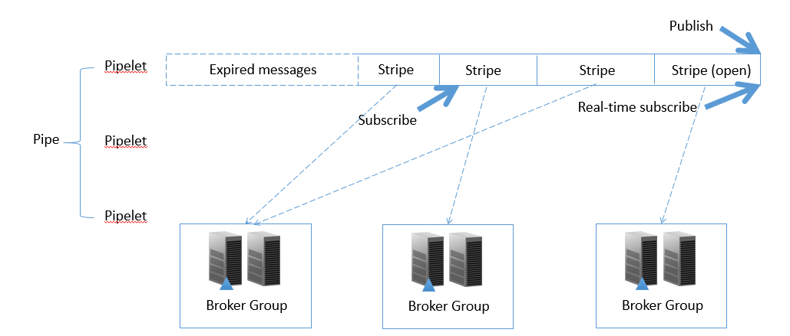

#### Pipe

相当于发布订阅模式中的topic概念，是⼀类内容的消息通道，⽬前对应着⽤户的⼀种服务发布的数据。⼀个pipe通过名字来标识。

#### Pipelet

⼀个Pipe由pipelet组成，pipelet是pipe的partition, 是最细粒度的传输通道。将pipe拆分是分布式中常见的分散压力的方式。

⼀条消息将被发往⼀个pipelet. Pipelet中的每⼀段数据（stripe）有其⽣存时间，过期后可能被系统清除。每个pipelet的msgid 严格递增。

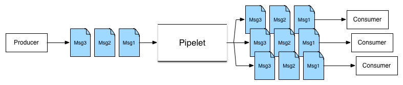

#### Stripe

Pipelet的不定长的切块。来自不同pipe/pipelet的消息会以stripe为单位存储在Broker Group上。

##### 创建pipe流程

- API将pipe创建命令发送给Master
- Master首先根据创建命令访问ZK进行验证，如果验证通过，则根据在ZK中新增pipe的元数据，标记pipe为safe状态。
- 然后master根据创建命令为该pipe创建各个pipelet，该步骤需要用到负载均衡模块的选择group功能。
- 在创建pipelet的过程中为每个pipelet创建第一个stripe.
- 待所有pipelet均创建成功后，设置pipe属性为normal状态，并返回API成功。

##### Stripe迁移

如果故障检测模块发现Broker Group某个Broker不能再进行发布服务时，在ZK中标记此broker的对应状态，然后将最后一批数据、pipelet进度、session等写入ZooKeeper.

原Stripe在原Broker Group停止写入，且存量数据不会向外迁移。

Master按照负载均衡策略选择新的broker group来服务此stripe。然后在ZK中封闭当前stripe,创建新的stripe, 设置新的stripe对应的broker group, 请求broker group执行增加stripe流程。

新的broker group发现自己需要执行增加stripe流程时，在本地创建对应的文件或者其他资源。从ZK中获取到上一个stripe记录的session信息，然后开始提供此stripe的发布和订阅服务。

客户端发现新的stripe后，会向新的broker group发布数据。

##### 触发条件

- Stripe写满
- 负载均衡
- 手动迁移
- 系统内部触发
  - 单节点故障终止同步，进程挂掉，磁盘故障等
  - 主从之间心跳超时
  - Broker Group被标记删除

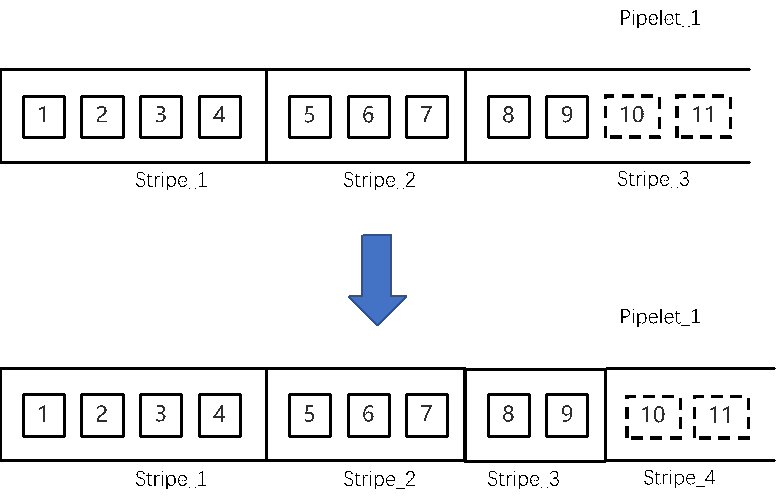

##### Stripe粒度GC

目前Bigpipe不适合长期保存，建议最多保存14天以内的消息。第一，Bigpipe Broker的磁盘空间紧张。第二，Stripe信息在ZooKeeper中单节点长期保存会膨胀，有可能突破节点大小上限。

- Master先从ZooKeeper上移除待删除stripe节点。
- Broker跟ZooKeeper对比后，将废弃stripe移入trash.
- Broker定期清理trash.

#### Message

消息个体，内部包含sequence, 如果消息是打包后发布的那么它就有多个sequence, 否则只有一个。

##### 消息发布流程

•   客户端访问ZK, 获取到数据所在pipelet当前提供发布服务的stripe, 及其对应的broker group. 

•   客户端与指定broker发起连接，同时会创建使用session id字符串标识的session. Server对于同一个session id只接受一个client连接，否则报错errno 2504或6006。

•   客户端向primary broker发送数据。

•   Primary broker接收到数据后，首先访问ZK验证stripe是否为最新的提供发布服务的stripe, 如果不是则返回异常。

•   Primary broker根据当前session对当前pipelet特有的session message id验证发布的消息是否为重复发送的数据，如果是则返回异常。

•   Primary broker向所有secondary broker进行同步。如果所有broker都完成同步，则返回成功；如果无法完成所有broker的同步或者处理超时，则返回失败。

•   Broker具有主动断开机制，防止客户端占用连接，如果被主动断开，客户端只需重新连接即可。

连接关闭后session会在server残留十秒左右，这段时间内如果同一个session id再度发起连接，仍会报错errno 2504或6006.

##### 主从同步

###### Group commit

- 10ms时间内能能够将写入多条命令合并出一条WAL, 最大3MB. 合成后的WAL依次同步落盘。
- 引擎实现并发写磁盘，拆开WAL后同一个stripe的落同一块磁盘。

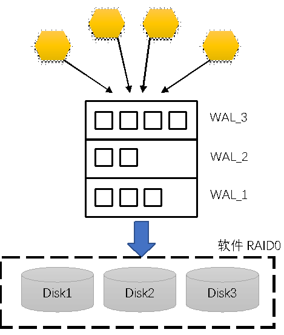

###### 强一致写

主从都成功才回发布方ACK, 以及订阅可见。

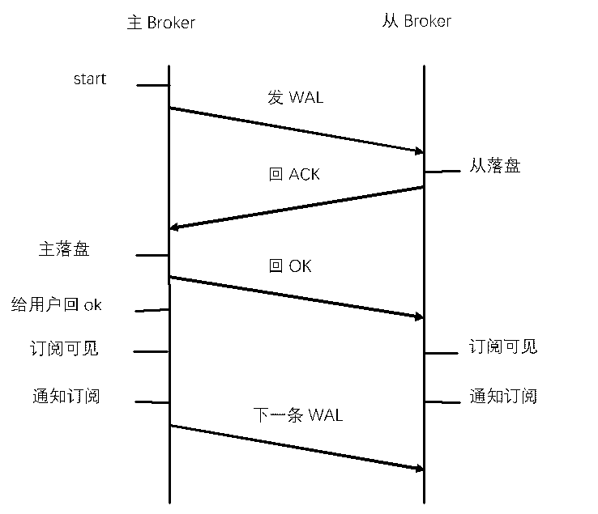

##### 消息订阅流程

- 客户端首先访问ZK获取到pipelet包含的所有stripe，选择订阅点所在的stripe，然后向stripe所在的broker group发送订阅要求。订阅时需要指定订阅的broker的角色是主还是从，该逻辑可能被封装，无需用户再度设置。
- Broker group的broker接收到订阅请求时，首先访问ZK进行验证stripe是否存在，如果验证通过，则根据订阅点进行数据推送。当broker发现此stripe为历史stripe，并且数据都已经向订阅者传输完毕后，则返回给API告知此stripe的数据订阅全部完成。
- 当客户端发现一个stripe的数据订阅完成时，访问ZooKeeper获取到新的stripe继续订阅。
- 当broker出现故障时，API会选择同组其他broker进行订阅，除非全组broker无法提供服务。

#### Startpoint

订阅点（Startpoint）代表着pipelet中的⼀个位置，从这个位置开始之后的数据将都会被订阅⽅读取到。订阅点主要反映上⼀次订阅到什么地⽅，由订阅⽅保存。有两个特殊的点：pipelet中最⽼的（队⾸）或者最新的（队尾）数据。

### Broker常见异常

| 代码 | 宏                         | 含义                                                         |
| ---- | -------------------------- | ------------------------------------------------------------ |
| 2504 | BMQ_E_COMMAND_DUPLICATEMSG | 发布消息重复。当前发布的消息的msgId, 已被发布并向客户端成功返回ACK. |
| 2506 | BMQ_E_SKIPACK              | 发布消息重复。当前发布的消息的msgId, 已被发布但尚未向客户端返回ACK. |
| 2512 | BMQ_E_TOPIC_STOP           | 发布订阅达到当前stripe的结尾。                               |
| 2515 | BMQ_E_HANDLE_SUBSCRIBE     | 订阅点不存在当前消息区间。                                   |
| 6006 | BMQ_E_ALREADYINUSE         | Session冲突，可能是由于上一个session连接尚未释放就要建立一个新的。 |

## QueueServer

支持Queue模式的服务模块。

### Queue模式

Queue为pipelet上的消息附加了消费状态的管理。⼀个queue可以读取同一个pipe多个pipelet的数据。

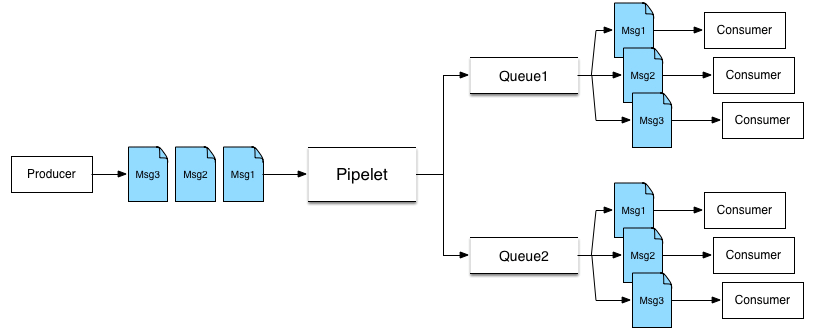

Queue模式是**竞争消费**的模式。一条消息被读取之后进入锁定状态，ACK超时时间过后如果收到了客户端回复的ACK就视作消费成功，从queue中移除消息，否则解除消息锁定状态。

#### 消费方式

- 手动拉取

- 手动RPC消费（只有网盘业务使用）
- 自动推送

#### 优点

- 支持针对不同用户资源隔离（给queue和queuesvr打tag）

- 支持负载均衡（监控queuesvr机器的网卡和CPU使用率）

- 支持JSON格式消息的消息过滤（例如："(json.AppKey == "idc1") && (msg.size > 1024)"）

#### 缺点

- Queue的单点问题：一个queue只会在一台机器上，因此单queue性能有限（6wqps以内，而且不建议太高）。

- 负载均衡没有对QPS热点做调度。

### QueueServer结构

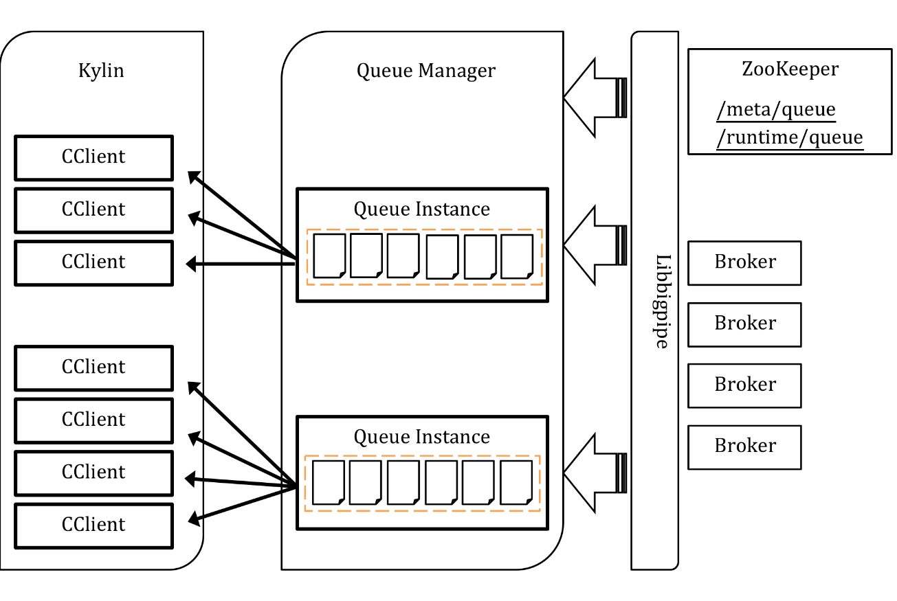

#### 特点

- 去中心化的设计
- 通过zk抢queue
- DropQueue负载均衡
- Qps/流量高低水位机制

#### QueueManager

管理多个queue instance，包括：

- _queues: 正在运行的queue

- _starting_queues: 准备运行的queue

- _closing_queues: 将要停止的queue

在一个线程循环中：

- 启动准备运行的queue.
- 关闭准备停止的queue.

- 检查正在运行的queue在ZooKeeper上的状态

- 提供管理监控查询

#### QueueInstance

Queue的实例对象，对应一个queue. 记录着queue大小及其每个pipelet的订阅进度信息。

#### QueueWindow

一个基于滑动窗口+定时器实现的发送窗口，内容会定期快照到ZK.

滑动窗口是一个连续的数组，分为3部分：

- 已发送，未ack的消息
- 未发送的消息
- 预留空位

长度也因此分为：

- 未发送消息个数, un-pushed messages

- 发送未ack的消息个数, pending messages

- 整个窗口的大小，可以最多容纳的消息个数

#### InflightTable

记录已经发送但没有收到ack的那些消息，它还有一个过期机制，检查消息是否过期。其中主要成员有:

- 含有已经发送没有ack的message，这是一个FIFO的queue，便于查找过期消息

- 含有已经过期的消息id->消息的map
- 含有已经发送没有ack的消息 id->消息的map

其中消息id通过对pipe, pipelet, msg_id, seq_id作hash得到。 

#### QueueService

QueueService提供网络服务，内部包含一个QueueRpcService和一个CListener, CListener里面又包含一个Cclient.

### Queue控制台

- 可以显示queue的消费状况和配置。
- 可以修改订阅点至-1实现清空消息的效果，或者修改订阅点至-2实现跳过过期消息id的效果。
- 可以启动自动跳过过期消息模式，模式是默认打开的，订阅点一旦过期就自动调整至-2。
- 可以设置返回ACK的timeout.
- 可以设置queue的窗口大小。

## Webservice

提供HTTP发布订阅服务。

因为经过nginx进行负载均衡调度，所以发布消息不能保证不重。

订阅不支持long poll模式，不能长时间等待，会超时。

expires参数用来设置超时时间：expires=`date +%s -d "+30 sec"`

**命令格式**

```bash
POST /rest/pipe/{pipename}?method=fetch
```

**层次结构**

- 用户（发布者、订阅者） 
- HTTP代理（内部网关BGW+Nginx）
- Webservice（发布者、订阅者） 
- Bigpipe集群

## 客户端API

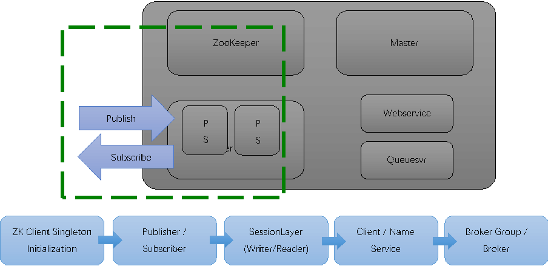

访问Bigpipe进行消息发布/订阅的客户端接口。

### API常用逻辑

#### API路由

- 直连的方式访问的不是对等节点
  - 需要路由
  - 容易因为网络问题访问不了
- 先从zk获取pipelet信息
- 根据要访问的位置确定stripe
  - 发布是最新的
  - 订阅则根据订阅点判断区间
- 重试
  - 遇到server错误时，需要重新路由

#### API发布

- 维持tcp长连接

- Session在tcp连接之上
  - tcp断了可重新连入之前的session
- 每个client每个pipelet 唯一session
- Session中每条消息都有id
  - 以此为凭据去重
- tcp断开时，client窗口内重放
  - 额外占用带宽
- 本地持久化可以拓展窗口大小

#### API订阅

- 维持tcp长连接
  - 每个pipelet一个连接
- Broker主动推数据
  - client注册到stripe
  - Stripe有新的可见消息时遍历通知client
- 尽量实时推送
  - 消息会在pagecache里，不产生读IO
  - 回放老消息容易读热点

### 常用API

#### c-api (C++)

##### 优点

- 支持记录发布进度
- 支持数据压缩

##### 缺点

- 接口不简洁容易用错
- 发布订阅模型不佳，会为每个pipelet建一个线程、维护一个发布方，占用内存高

#### libbigpipe (C++)

##### 优点

- 接口简洁

##### 缺点

- 不支持记录发布进度
- 不支持数据压缩

#### bigpipe4j (Java)

bigpipe4j是使⽤Java语⾔为Bigpipe开发的SDK.

⽀持Java 1.8 （spark就是1.8的）。

目前发布了⽀持protobuf2.4（使⽤者包括Spark）和2.5的两个版本。

⾃由度高，但是不当使⽤容易对服务端造成多种不良影响。

##### 层级

| 层级（从上到下）         | 含义                                                         |
| ------------------------ | ------------------------------------------------------------ |
| 框架层  Framework  Layer | 包括Producer, Subscriber等基于应⽤层类封装的异步发布订阅类。 |
| 应用层  Implement  Layer | 包括BigpipeBlockedWriter, BigpipeNonblockReader等基于元信息层类封装的发布订阅类。 |
| 协议层  Protocol  Layer  | 包括BigpipeSessionLayer等多种接⼝和抽象类。                  |
| 元信息层  Meta Layer     | 包括Bigpipe模块的POJO类、寻址逻辑、Zookeeper链接逻辑等。     |

##### Meta类

**ZookeeperUtil**

继承自Watcher, 封装了watcher和session失效自动重连的zookeeper的类，为了尽量减少对zookeeper服务的压⼒，使⽤单例模式。

使⽤ConcurrentHashMap保存已创建的ZooKeeperUtil连接实例，key为集群名称（对应着ZooKeeper地址）。

具备以下功能：

- 创建默认/指定名称的Zookeeper连接

- 释放默认/指定名称的Zookeeper连接

- 检查默认/指定名称的Zookeeper连接是否存在

- 获取默认/指定名称的Zookeeper连接

- 获取默认/指定名称的Zookeeper的数据/节点信息

##### Writer & Reader类

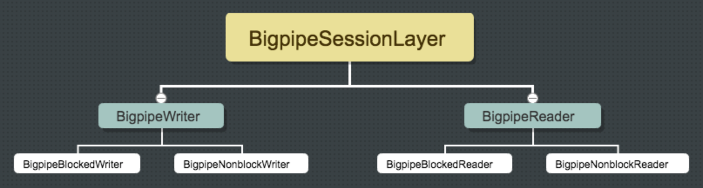

**BigpipeSessionLayer**

⽤于实现bigpipe协议的session功能，从⽽在服务端通过sessionId保存⼀些客户端的状态。sessionId ⽤于区分每⼀个客户端连接，每⼀个客户端连接sessionId是要求唯⼀的。

- 如果不同客户端创建了同⼀个sessionId, 使⽤起来会造成session冲突！

- 如果客户端创建了过多sessionId(万级以上)，使⽤起来会对Zookeeper模块造成冲击！

基类包含⼀个最基本的sessionId⽣成的实现，⽣成机制可以确保sessionId的单⼀性。为了防⽌冲击Zookeeper模块，建议⽤户按照合理逻辑⾃⾏设定sessionId.

封装了名称解析模块NameService，和bigpipe传输协议的客户端接⼝类IBigpipeClient（接⼝），规定了需要提供给上层的基本的跟协议相关的接⼝。

**NameService**

封装了broker选择逻辑IRoleSelectStrategy.

具备以下功能：

- 在zk上查找特定stripe信息

- 查找特定broker group信息

- 查找消息所在broker地址

- 查找发布位置所在broker地址

- 查找queue所在queuesvr地址 

**IRoleSelectStrategy**

此接⼝的实现类定义了bigpipe4j读消息时对于主/从broker的选择逻辑。

**BigpipeWriter**

继承BigpipeSessionLayer.

可以使⽤以下底层⽅法异步发布消息，可以⼤幅提⾼吞吐量但是需要⾃⼰管理session_msg_id.

具备以下功能：

- NameService查找pipelet队尾所在的提供发布的服务器地址

- IBigpipeClient发起连接

- 将⼆进制消息打包成ByteBlockList格式

- IBigpipeClient发布消息

- IBigpipeClient接收ACK

- IBigpipeClient关闭连接

**ByteBlockList**

定义了⼀个消息包，包括两个成员：

l List<byte[]> list 消息表

l int bytesLength 消息包总⻓度

**BigpipeBlockedWriter**

继承BigpipeWriter.

同步阻塞发布消息，内部将对session_msg_id进⾏管理，它的⽤途是防⽌重复发布。

具备以下功能：

- BigpipeBlockedClient阻塞式地完成⼀次bigpipe协议的连接协议交互，验证身份信息；协议成功将更新内部session_seq.

- 组装消息报⽂，BigpipeBlockedClient发送⼀条消息，等待接收到服务器ack后将其返回 

**BigpipeNonblockWriter**

继承BigpipeWriter.

异步⾮阻塞发布消息，⽹络IO需要与NIO的selector配合使⽤。想实现同步的发送⽅式可以通过等待上⼀条消息的ack或者控制读写事件的轮换来实现。

本类的⽅法内部会管理session_msg_id，适⽤于对每⼀次发送与上⼀次前因后果逻辑联系很强的情况， 主要⽤于实现同步的发布。

具备以下功能：

- 按c-api打包协议打包消息

- 组装消息报⽂后，BigpipeNonblockClient发送⼀条消息，不等待服务器ack, 将⾃增sendingSeq

- 尝试从底层⽹络读取数据，如果能读取到⼀条完整的协议，将按协议逻辑处理； 收到connected报⽂后将更新内部sendingseq和ackedseq, 收到ack报⽂后将更新内部的ackedseq

**BigpipeReader**

继承BigpipeSessionLayer.

具备以下功能：

- NameService查找pipelet制定订阅点的服务器地址

- IBigpipeClient发起连接

- IBigpipeClient发起连接命令

- IBigpipeClient发起订阅消息命令

- IBigpipeClient返回ACK命令

- 将ByteBlockList格式解包成⼆进制消息，可以按照指定压缩类型/⾃定判断压缩类型从⽽解压消息

- IBigpipeClient关闭连接

**BigpipeBlockedReader**

继承BigpipeReader.

具备以下功能：

- BigpipeBlockedClient阻塞式地完成⼀次bigpipe协议的连接协议交互，验证身份信息

- BigpipeBlockedClient阻塞式地完成⼀次bigpipe协议的连接协议交互，服务端开始推送数据

- BigpipeBlockedClient接收消息报⽂，返回ACK命令，解包 

**BigpipeNonblockReader**

继承BigpipeReader.

具备以下功能：

- BigpipeNonblockedClient⾮阻塞式地完成⼀次bigpipe协议的连接协议交互，验证身份信息

- BigpipeNonblockedClient⾮阻塞式地完成⼀次bigpipe协议的连接协议交互，服务端开始推送数据

- 尝试从底层⽹络读取数据，如果能读取到⼀条完整的协议，将按协议逻辑处理； 如果是消息数据，将返回给调⽤者 

**SimpleSubscriber**

BigpipeBlockedReader的封装类，具有内部⾃动failover机制。

**BigpipeSessionLayer**

⽤于实现bigpipe协议的session功能，从⽽在服务端通过sessionId保存⼀些客户端的状态。sessionId ⽤于区分每⼀个客户端连接，每⼀个客户端连接sessionId是要求唯⼀的。

- 如果不同客户端创建了同⼀个sessionId, 使⽤起来会造成session冲突！

- 如果客户端创建了过多sessionId(万级以上)，使⽤起来会对Zookeeper模块造成冲击！

基类包含⼀个最基本的sessionId⽣成的实现，⽣成机制可以确保sessionId的单⼀性。为了防⽌冲击Zookeeper模块，建议⽤户按照合理逻辑⾃⾏设定sessionId.

封装了名称解析模块NameService，和bigpipe传输协议的客户端接⼝类IBigpipeClient（接⼝），规定了需要提供给上层的基本的跟协议相关的接⼝。 

**NameService**

封装了broker选择逻辑IRoleSelectStrategy.

具备以下功能：

- 在zk上查找特定stripe信息

- 查找特定broker group信息

- 查找消息所在broker地址

- 查找发布位置所在broker地址

- 查找queue所在queuesvr地址

**IRoleSelectStrategy**

此接⼝的实现类定义了bigpipe4j读消息时对于主/从broker的选择逻辑。 

**BigpipeWriter**

继承BigpipeSessionLayer.

可以使⽤以下底层⽅法异步发布消息，可以⼤幅提⾼吞吐量但是需要⾃⼰管理session_msg_id.

具备以下功能：

- NameService查找pipelet队尾所在的提供发布的服务器地址

- IBigpipeClient发起连接

- 将⼆进制消息打包成ByteBlockList格式

- IBigpipeClient发布消息

- IBigpipeClient接收ACK

- IBigpipeClient关闭连接

**ByteBlockList**

定义了⼀个消息包，包括两个成员：

- List<byte[]> list 消息表

- int bytesLength 消息包总⻓度 

**BigpipeBlockedWriter**

继承BigpipeWriter.

同步阻塞发布消息，内部将对session_msg_id进⾏管理，它的⽤途是防⽌重复发布。

具备以下功能：

- BigpipeBlockedClient阻塞式地完成⼀次bigpipe协议的连接协议交互，验证身份信息；协议成功将更新内部session_seq.

- 组装消息报⽂，BigpipeBlockedClient发送⼀条消息，等待接收到服务器ack后将其返回

**BigpipeNonblockWriter**

继承BigpipeWriter.

异步⾮阻塞发布消息，⽹络IO需要与NIO的selector配合使⽤。想实现同步的发送⽅式可以通过等待上⼀条消息的ack或者控制读写事件的轮换来实现。

本类的⽅法内部会管理session_msg_id，适⽤于对每⼀次发送与上⼀次前因后果逻辑联系很强的情况， 主要⽤于实现同步的发布。

具备以下功能：

- 按c-api打包协议打包消息

- 组装消息报⽂后，BigpipeNonblockClient发送⼀条消息，不等待服务器ack, 将⾃增sendingSeq

- 尝试从底层⽹络读取数据，如果能读取到⼀条完整的协议，将按协议逻辑处理； 收到connected报⽂后将更新内部sendingseq和ackedseq, 收到ack报⽂后将更新内部的ackedseq 

**BigpipeReader**

继承BigpipeSessionLayer.

具备以下功能：

- NameService查找pipelet制定订阅点的服务器地址

- IBigpipeClient发起连接

- IBigpipeClient发起连接命令

- IBigpipeClient发起订阅消息命令

- IBigpipeClient返回ACK命令

- 将ByteBlockList格式解包成⼆进制消息，可以按照指定压缩类型/⾃定判断压缩类型从⽽解压消息

- IBigpipeClient关闭连接

**BigpipeBlockedReader**

继承BigpipeReader.

具备以下功能：

- BigpipeBlockedClient阻塞式地完成⼀次bigpipe协议的连接协议交互，验证身份信息

- BigpipeBlockedClient阻塞式地完成⼀次bigpipe协议的连接协议交互，服务端开始推送数据

- BigpipeBlockedClient接收消息报⽂，返回ACK命令，解包

**BigpipeNonblockReader**

继承BigpipeReader.

具备以下功能：

- BigpipeNonblockedClient⾮阻塞式地完成⼀次bigpipe协议的连接协议交互，验证身份信息

- BigpipeNonblockedClient⾮阻塞式地完成⼀次bigpipe协议的连接协议交互，服务端开始推送数据

- 尝试从底层⽹络读取数据，如果能读取到⼀条完整的协议，将按协议逻辑处理； 如果是消息数据，将返回给调⽤者

**SimpleSubscriber**

BigpipeBlockedReader的封装类，具有内部⾃动failover机制。

##### Client类

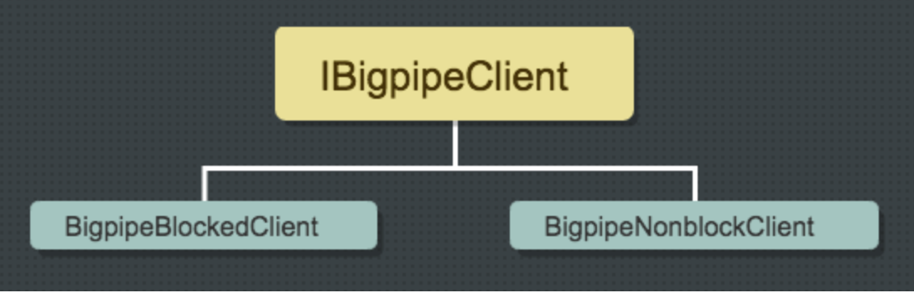

**IBigpipeClient**

具备以下功能：

- 与指定地址进⾏TCP连接

- 发布bigpipe协议protobuf报头/报⽂

- 接收bigpipe协议

- 关闭TCP连接

**BigpipeBlockedClient**

使⽤Socket连接

**BigpipeNonblockedClient**

使⽤SocketChannel连接

⽀持发送缓冲剩余未发送的字节数

##### Publisher & Subscriber类

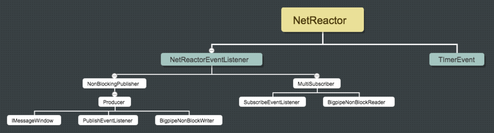

**NetReactor**

⽬前⽤于实现异步事件的reactor, 具备以下功能：

- 打开NIO选择器，从⽹络监听并且接收数据

- 关闭NIO选择器

- 将事件加⼊定时队列中

- 通知相应的Socketchannel，需要处理写请求

- 处理定时队列中的事件

**NetReactorEventListener**

处理定时事件和选择键。

**NonblockingPublisher**

继承NetReactorEventListener.

实现了NIO框架，⽤于托管多个Producer的IO，并进⾏⾃动捕获异常，容错重连等。

具备以下功能：

- 将Producer加⼊NetReactor

- 从⽹络监听并且接收数据

- 重连Producer 

**Producer**

单个BigpipeNonblockWriter的框架类，封装了异步的消息缓存窗⼝IMessageWindow，应⽤层只管往缓存中插⼊消息，Producer来管理缓冲的消息，但需要将Producer加⼊NonblockingPublisher框架，来执⾏事件驱动的IO.

提供打包发布功能；不提供恢复进度、去重功能。

**IMessageWindow**

描述异步消息窗⼝⾏为的接⼝，FIFO.

具备以下功能：

- 队尾增加消息

- 队⾸移除消息

- 获取窗⼝指针的下⼀条消息

- 指针重置队⾸

- 获取窗⼝⼤⼩

- 重设窗⼝⼤⼩

- 清空窗⼝

**MultiSubscriber**

MultiSubscriber在NonblockingReader的基础之上，增加⽐较健全的⾃动容错重连机制，封装了较为负载的NIO实现，通过监听接⼝来向调⽤者反馈接收到的消息。

实现此类的⽬的主要在于尽量⾃动容错重连，尽可能少地把异常抛给应⽤层。

具备以下功能：

- 将NonblockingReader加⼊NetReactor

- 从⽹络监听并且接收数据

- 重连NonblockingReader 

##### Queue类


**QueueBlockedClient**

Queuesvr客户端的阻塞实现，⽤于从queue中获取消息。

Queue的消费场景是这样实现的：客户端主动发起tcp连接之后，服务端向客户端异步推送数据。通过设置请求的window_size，可以限制服务端的推送速度。

客户端每处理完⼀条消息之后，需要向服务端返回对应的ack消息确认消费。

那些被服务端发出但是没有被客户端返回ack的消息，服务端基于queue的配置经过⼀段时间将会将消息重发给其他客户端。因此ack⼀定要尽快，只要能确认别⼈不再需要读这条消息了就返回ack，尽量把耗时逻辑放到ack之后。如果客户端处理完消息之后需要处理其他逻辑，希望服务端不⽴即推送下⼀条消息（相当于客户端主动fetch的模式），则客户端应该在ack的时候调用suspend方法，需要消息时再调用resume方法。

注意，⼀个client上，回ack的顺序要跟fetch到的消息的顺序是⼀致的，先fetch的先回ack，否则server端可能认为是错误。 

**SimpleQueueConsumer**

QueueBlockedClient的封装类，有设置重⼊锁。

##### Exception类

**InvalidParameter**

参数有误，⽐如pipeletName为空。

**MalformedPackageException**

数据包的⼤⼩或报头内容出现异常，⽐如订阅消息时订阅到了格式错误的消息，或者使⽤了不匹配的解压⽅式。

**MessageCodecException**

Codec相关异常，⽬前未启⽤。

**NameResolveException**

名称解析错误，⽐如从Zookeeper查找stripe信息时⽆法查找到对应Stripe.

避免这个问题，可以通过把session超时尽可能调⻓，或者ZookeeperUtil初始化之后调⽤下wait().

**PackingNumberException**

打包发布相关异常，⽬前未启⽤。

**ProtocolDisorderError**

协议状态错误，⽐如使⽤⾮阻塞订阅时protocolState不是START.

**QueueInteractException**

跟queuesvr进⾏协议交互遇到异常时抛出。可能的情况包括：

- queue为空

- 访问者不在queue的⽩名单上

- queue token设置有误

- queue不在线，没有在提供服务

**QueueLocateException**

⽆法解析queue名称到对应的queuesvr地址时抛出此异常。

**StripeEndException**

在当前stripe读完需要切换读下⼀个，需要应⽤层重连时抛出。⼤多数情况下，这个异常不代表系统异常或者使⽤错误。

如果抛出异常后没有继续订阅，可能是因为⽤户的订阅逻辑⾥缺少⾃动重连，或者版本较低（低于1.3.5.3），请升级到最新。

**StripeOffsetException**

订阅点不在当前stripe上时抛出此异常。

**UnexpectedProtocol**

报⽂协议异常。可能的情况包括：

- 接收到了⾮预期的BMQ报⽂

- 发布遇到限流 

##### Tool类

**BigpipeLogger**

⽇志类，在不同版本中使⽤了log4j或slf4j + logback. 鉴于公司内部情况，很难实现统⼀。

需要配置⽂件。

**BinaryTool**

提供⼆进制和部分基本类型相互转换的简单功能。

**ByteBlockList**

c-api格式的发布消息包。

**CodecTool**

Codec相关操作功能。

**DebugTool**

提供⼆进制和⼗六进制字符串相互转换的简单功能。

**PipeTool**

提供pipe相关功能，⽐如查询pipelet个数。

## Bigpipe VS Kakfa

|            | Bigpipe                                                      | Kafka                                          |
| ---------- | ------------------------------------------------------------ | ---------------------------------------------- |
| 数据结构   | Pipe  Pipelet  Stripe 分布式部署，便于提高性能               | Topic  Partition  Segment                      |
| 消息一致性 | exactly once  保证不重不漏                                   | at least  once  保证不漏                       |
| 吞吐量&QPS | 发布  小消息200M/s  大消息（100K+）100M/s  订阅（实时消息）  600M/s | 发布（ack==-1）  20kqps  79MB/s                |
| 竞争消费   | Queuesvr  面向多个pipe  单线程更新meta                       | consumer  group  面向单个topic  多线程更新meta |

