# SYS311 - Message Queue - BigPipe

返回[Bulletin](./bulletin.md)

返回[SYS311 - Message Queue](./SYS311.md)

[TOC]

> 本章是**个人真实项目知识库**，不是通用 MQ 教材。BigPipe 是本人实际参与过的百度内部分布式消息系统，bigpipe4j 是本人参与的 Java SDK。
>
> 阅读与复述时必须区分三类知识：
>
> - **[A] 本人真实参与**：bigpipe4j Java SDK、Java / Scala 业务接入、blocking / non-blocking 发布订阅、Session 管理、TCP reconnect、未确认消息 replay、NIO Reactor 异步发布优化、2019 春晚红包基础设施保障。
> - **[B] BigPipe 系统机制**：Master、ZooKeeper、Broker Group、Primary / Secondary、WAL、Stripe、Pipe / Pipelet、Startpoint、QueueServer。可以讲系统原理，**但不是本人设计的**。
> - **[C] 通用 MQ / 分布式知识**：ACK、Retry、Dedup、Idempotency、Replication、Backpressure。用来解释系统为什么这么设计，**不能包装成个人 ownership**。
>
> 消息队列的通用概念（投递语义、Outcome Unknown、ACK 分层、顺序范围、积压）见 [基本概念](./SYS3111.md)；Kafka 的对照实现见 [Kafka](./SYS3115.md)。
>
> 历史实现细节、内部错误码、内部类结构与运维操作完整保留在文末 [Appendix](#appendix--historical-bigpipe-implementation-details)。

## BigPipe 是什么【P0】

Bigpipe是⼀个分布式消息队列服务，可以帮助模块间的通信实现解耦、流量移峰填谷等。

### 使用场景

- 实时消息传输：关注时效性，一般10-20ms（不超过100ms）。

- 流式数据传输：关注流量，300-500MB/s，延时5-6分钟即可，用于指标计算、trace等。

- 日志文件分发：关注不重不漏和流量，将数据库文件通过流式系统DStream发布，1+GB/s，不关注延时。

> **Legacy Note**：以上延时与吞吐是历史生产环境的经验数字，依赖当时的硬件、消息大小、副本策略和集群规模，不应作为 BigPipe 的固有常数复述。真正值得记住的是**三类场景对延时、吞吐、不重不漏的取舍完全不同**：实时消息牺牲吞吐换延时，流式数据牺牲延时换吞吐，日志分发牺牲延时换不重不漏。

### 优势

- 分布式：类似于命名服务，⽤户不⽤关⼼pipelet分布在哪⼀台机器上，只需根据pipe名和pipeletid进⾏连接，就可以发布或者订阅数据；能容忍单机的故障因素，pipelet遇到故障会由系统进⾏转移，保障可⽤性。

- 多副本：单台机器丢失数据不会导致系统数据丢失。

- 持久化：消息可回溯，保障消息不重不丢。

### 劣势

- 系统部署成本高：和系统架构有关。

- API支持的编程语言少
  - C++
  - Java
  - PHP (api会造成内存泄漏和连接数过多的问题，现已停用)

> **Senior Java Focus**：客户端语言覆盖少是内部 MQ 的真实短板，也正是 bigpipe4j 存在的直接原因——没有可靠的 Java SDK，Java / Scala 业务就接不进来。

### 系统层级

| 层级     | 说明                                                 |
| -------- | ---------------------------------------------------- |
| 应用层   | 各类业务模块，minos，计算生态的服务等等              |
| 接入层   | Webservice，Queuesvr，各类重API，c-api，libbigpipe等 |
| 元数据层 | Zookeeper，还有bigpipe自己的管理模块Master           |
| 存储层   | Broker，bigpipe的存储节点，多副本机制                |
| 持久化层 | SATA盘，硬件RAID                                     |

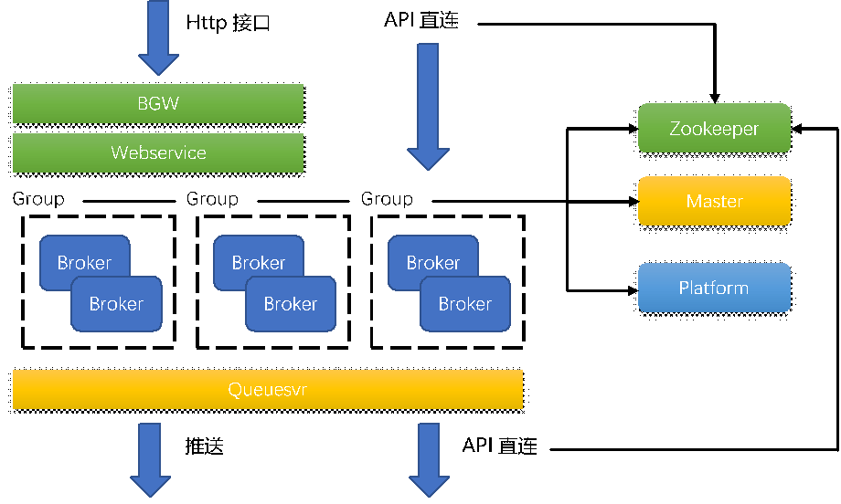

## 最小架构模型【P0】

理解 BigPipe 先分清两个平面：

```text
                 Control Plane（元数据 / 决策）
        ┌──────────────────────────────────────────────┐
        │    ZooKeeper          +         Master       │
        │  元数据、运行时状态        负载均衡、故障迁移   │
        └──────────────────────────────────────────────┘
                    ▲                   │
          查询/校验  │                   │  调度 / 迁移指令
                    │                   ▼
        ┌──────────────────────────────────────────────┐
        │              Data Plane（数据）               │
        │    Broker Group  =  Primary + Secondary × N   │
        │    发布入口             只提供订阅             │
        └──────────────────────────────────────────────┘
                    ▲                   │
             发布   │                   │  推送
                    │                   ▼
                Producer            Consumer
```

关键点：**客户端的数据流量不经过 ZooKeeper 和 Master**。客户端只在建连、路由、stripe 切换时访问 ZooKeeper 拿元数据，真正的消息读写直连 Broker。

因此：ZooKeeper 短暂抖动不一定立刻中断已建立连接的数据面，但会让**新建连接、路由查询和 stripe 切换**失败——这正是 `NameResolveException` 的成因。

### ZooKeeper

保存Bigpipe的元数据、运行时信息等系统关键信息。

在 BigPipe 中具体承担：

- pipe / pipelet / stripe 的元数据与所属 broker group
- stripe 的状态流转（safe / normal / 封闭）
- 故障检测标记，以及 stripe 迁移时的最后一批数据、pipelet 进度、session 信息
- QueueServer 抢占 queue、QueueWindow 定期快照

> ZooKeeper 自身的选举、ZAB、Watcher 等通用理论属于 [SYS301](./SYS301.md) 范围，本章只讲它在 BigPipe 里承担的角色。

### Master

实现负载均衡、故障迁移等功能的管理模块

Master 是纯控制面组件，不在数据路径上：

- 创建 pipe / pipelet / 每个 pipelet 的首个 stripe
- 按负载均衡策略为 stripe 选择 broker group
- 故障时封闭旧 stripe、创建新 stripe、指定新 broker group
- 驱动 stripe 粒度 GC

### Broker

Broker是Bigpipe的数据传输实体，接收发布/订阅请求的服务器，能够把发布的数据持久化到本地，具备主从同步、冗余、故障感知（定时自动检查group和集群的元信息）等特点。

Broker分为两种角色：

•   Primary broker是发布服务的入口，可以提供发布服务和订阅服务，有且只有一个。

•   Secondary broker只能提供订阅服务。

**Broker Group** 是服务同一个 stripe 的一组副本（一个 Primary + 若干 Secondary）。发布只走 Primary，订阅可以走 Primary 或 Secondary——这是 BigPipe 把**写入串行化**与**读取扇出**分开的方式。

> **Interview Note**：Kafka 的 Follower 同样不对外提供读写，只从 Leader 拉数据；但 BigPipe 的 Secondary **可以直接服务订阅**。差别来自写语义：BigPipe 是强一致写（主从都成功才 ACK），所以 ACK 时全组数据完整，读可以放心分散到从节点；Kafka 靠 ISR 动态收缩保住发布可用性，代价是消费者只能看到 HW 之前的数据。

## 数据模型：Pipe / Pipelet / Stripe【P0】

### 发布订阅模式

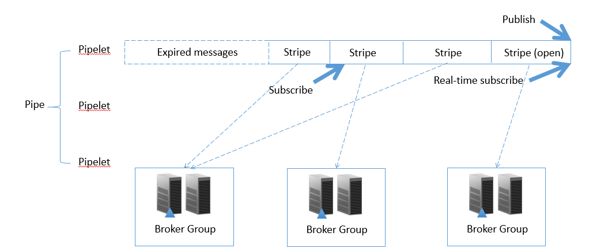

### Pipe

相当于发布订阅模式中的topic概念，是⼀类内容的消息通道，⽬前对应着⽤户的⼀种服务发布的数据。⼀个pipe通过名字来标识。

### Pipelet

⼀个Pipe由pipelet组成，pipelet是pipe的partition, 是最细粒度的传输通道。将pipe拆分是分布式中常见的分散压力的方式。

⼀条消息将被发往⼀个pipelet. Pipelet中的每⼀段数据（stripe）有其⽣存时间，过期后可能被系统清除。每个pipelet的msgid 严格递增。

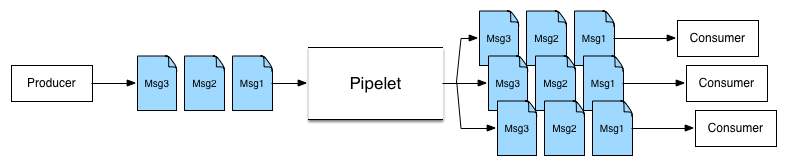

**`每个 pipelet 的 msgid 严格递增`** 是 BigPipe 顺序性的全部依据：顺序只在**单个 pipelet 内**成立，跨 pipelet 没有全局顺序保证。这与 Kafka 的顺序边界是 Partition 完全同构，见 [Kafka — Partition 与顺序边界](./SYS3115.md)。

### Stripe

Pipelet的不定长的切块。来自不同pipe/pipelet的消息会以stripe为单位存储在Broker Group上。

Stripe 是 BigPipe 的**副本归属单元和存储单元**：一个 stripe 绑定一个 broker group；stripe 写满或所在 broker 故障时，就封闭旧 stripe、在新 broker group 上开新 stripe，**存量数据不搬迁**，客户端通过 ZooKeeper 发现新 stripe 后继续写入。

### Message

消息个体，内部包含sequence, 如果消息是打包后发布的那么它就有多个sequence, 否则只有一个。

打包发布（`ByteBlockList`）让多条业务消息共用一次协议交互，是提升吞吐的主要手段；代价是一条 Message 内部有多个 sequence，判重与定位都要按 sequence 粒度处理。

### 与 Kafka 的概念对照

| BigPipe | Kafka | 是否等价 | 差异要点 |
| ------- | ----- | -------- | -------- |
| Pipe | Topic | 近似 | 都是逻辑消息通道，按名字标识 |
| Pipelet | Partition | 近似 | 都是最细粒度传输通道、顺序边界、并行度上限 |
| Stripe | Segment | **不等价** | Kafka Segment 只是 Partition 内的文件切分，不改变副本归属；BigPipe Stripe 是**副本组归属单元**，切 stripe 意味着换 broker group |
| Startpoint | Consumer Position / Committed Offset | 近似 | BigPipe 订阅点**由订阅方保存**；Kafka offset 默认存在 Broker 侧 `__consumer_offsets` |
| msgid（pipelet 内递增） | offset（partition 内递增） | 近似 | 都是分区内单调递增的定位依据 |
| Broker Group（Primary + Secondary） | Replicas（Leader + Follower） | 近似 | BigPipe Secondary 可服务订阅，Kafka Follower 不对外服务 |
| session_msg_id | Producer PID + sequence | 近似 | 都用于服务端识别重放；BigPipe 作用域是 **session × pipelet**，Kafka 是 **PID × TopicPartition** |
| QueueServer（queue） | Consumer Group | **不等价** | queue 单点归属一台机器、可跨多 pipelet；Consumer Group 按 Partition 分散、面向单 topic |

### 创建pipe流程

- API将pipe创建命令发送给Master
- Master首先根据创建命令访问ZK进行验证，如果验证通过，则根据在ZK中新增pipe的元数据，标记pipe为safe状态。
- 然后master根据创建命令为该pipe创建各个pipelet，该步骤需要用到负载均衡模块的选择group功能。
- 在创建pipelet的过程中为每个pipelet创建第一个stripe.
- 待所有pipelet均创建成功后，设置pipe属性为normal状态，并返回API成功。

`safe → normal` 是一个两阶段状态：元数据先落地，全部 pipelet 与首个 stripe 都创建成功后才对外可用。中途失败不会留下一个"半可用"的 pipe。

### Stripe迁移

如果故障检测模块发现Broker Group某个Broker不能再进行发布服务时，在ZK中标记此broker的对应状态，然后将最后一批数据、pipelet进度、session等写入ZooKeeper.

原Stripe在原Broker Group停止写入，且存量数据不会向外迁移。

Master按照负载均衡策略选择新的broker group来服务此stripe。然后在ZK中封闭当前stripe,创建新的stripe, 设置新的stripe对应的broker group, 请求broker group执行增加stripe流程。

新的broker group发现自己需要执行增加stripe流程时，在本地创建对应的文件或者其他资源。从ZK中获取到上一个stripe记录的session信息，然后开始提供此stripe的发布和订阅服务。

客户端发现新的stripe后，会向新的broker group发布数据。

**两个最值得追问的设计取舍：**

- **存量数据不迁移**。搬迁数据成本高、耗时长，而且会同时给新旧两组 Broker 加压。BigPipe 选择"新旧 stripe 并存 + 订阅端顺序读完旧的再读新的"，用**订阅端多一次 stripe 切换**换掉**存储层大规模数据搬迁**。代价是历史数据仍留在可能已故障的 broker group 上，全组不可用时那部分数据读不到。
- **session 信息写入 ZooKeeper，再由新 broker group 读取**。这是迁移后**判重能力不中断**的关键：新 Primary 拿到旧 stripe 的 session 与进度，才能继续识别客户端 replay 上来的重复消息。如果 session 丢了，迁移之后的重放会被当成新消息重复落盘。

### Stripe迁移触发条件

- Stripe写满
- 负载均衡
- 手动迁移
- 系统内部触发
  - 单节点故障终止同步，进程挂掉，磁盘故障等
  - 主从之间心跳超时
  - Broker Group被标记删除

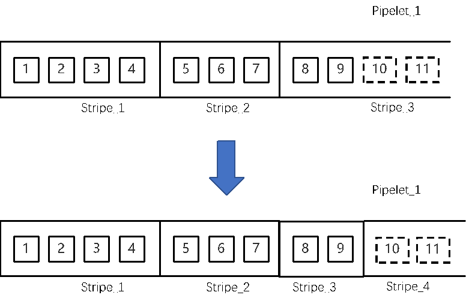

Stripe 粒度 GC 的具体流程与历史保留时长限制见 [Appendix F](#appendix-f--stripe-粒度-gc-与历史容量限制)。

## 一条消息的完整链路【P0】

### 发布链路

```text
Producer 业务代码
   │
   ▼
bigpipe4j（Producer / BigpipeWriter）
   │  ① 查 ZooKeeper：该 pipelet 当前提供发布服务的 stripe + broker group
   │  ② 建 TCP 长连接，用 session id 连回原 Session 或创建新 Session
   │  ③ 分配 session_msg_id，消息进 IMessageWindow 的"已发送未确认"区
   ▼
Primary Broker
   │  ④ 访问 ZK 校验 stripe 是否仍是最新的发布 stripe（否则返回异常，客户端需重新路由）
   │  ⑤ 按 (session, pipelet) 的 session_msg_id 判重
   │  ⑥ 写 WAL（Group Commit：10ms 窗口内合并多条命令）
   │  ⑦ 向所有 Secondary 同步
   ▼
全部 Secondary 同步完成
   │  ⑧ 强一致写达成 → 回 ACK，消息同时对订阅可见
   ▼
客户端收到 ACK → ackedSeq 前进 → 从 Window 释放消息

任一步失败 / 超时 / TCP 断开
   → Window 中未确认消息全部保留 → reconnect → replay
   → Primary 用 session_msg_id 识别重放，返回 2504/2506，不重复落盘
```

#### 消息发布流程

•   客户端访问ZK, 获取到数据所在pipelet当前提供发布服务的stripe, 及其对应的broker group. 

•   客户端与指定broker发起连接，同时会创建使用session id字符串标识的session. Server对于同一个session id只接受一个client连接，否则报错errno 2504或6006。

•   客户端向primary broker发送数据。

•   Primary broker接收到数据后，首先访问ZK验证stripe是否为最新的提供发布服务的stripe, 如果不是则返回异常。

•   Primary broker根据当前session对当前pipelet特有的session message id验证发布的消息是否为重复发送的数据，如果是则返回异常。

•   Primary broker向所有secondary broker进行同步。如果所有broker都完成同步，则返回成功；如果无法完成所有broker的同步或者处理超时，则返回失败。

•   Broker具有主动断开机制，防止客户端占用连接，如果被主动断开，客户端只需重新连接即可。

连接关闭后session会在server残留十秒左右，这段时间内如果同一个session id再度发起连接，仍会报错errno 2504或6006.

> **Senior Java Focus**：`如果无法完成所有broker的同步或者处理超时，则返回失败` —— 这里的"失败"是**结果未知（Outcome Unknown）**，不是"一定没写进去"。可能 Primary 已落盘、部分 Secondary 已同步，只是没能在规定时间内凑齐全组确认。客户端此时唯一安全的选择是重放，而重放必然制造重复，所以**判重能力（session_msg_id）必须与重试机制同时存在**。这是 BigPipe 整套客户端可靠性设计的出发点，也是 [基本概念](./SYS3111.md) 中 "retry 与 dedup 必须成对设计" 的真实工程实例。

### 订阅链路

```text
Consumer 业务代码
   │
   ▼
bigpipe4j（SimpleSubscriber / MultiSubscriber）
   │  ① 查 ZooKeeper：该 pipelet 包含的所有 stripe
   │  ② 按 Startpoint 定位所属 stripe
   │  ③ 向该 stripe 的 broker group 发订阅请求（指定主 / 从角色）
   ▼
Broker（Primary 或 Secondary）
   │  ④ 访问 ZK 校验 stripe 存在 → 从订阅点开始推送
   │  ⑤ 实时推送时消息还在 Page Cache，不产生读 IO
   ▼
客户端收到消息 → 业务处理 → 回 ACK → 更新本地保存的 Startpoint

stripe 为历史 stripe 且数据已推完
   → Broker 返回"此 stripe 订阅全部完成"（客户端表现为 StripeEndException）
   → 客户端查 ZooKeeper 取下一个 stripe，继续订阅
   → 应用层缺少自动重连时，这里就是"订阅莫名停住"的常见原因

broker 故障
   → API 选择同组其他 broker 继续订阅，除非全组无法提供服务
```

#### 消息订阅流程

- 客户端首先访问ZK获取到pipelet包含的所有stripe，选择订阅点所在的stripe，然后向stripe所在的broker group发送订阅要求。订阅时需要指定订阅的broker的角色是主还是从，该逻辑可能被封装，无需用户再度设置。
- Broker group的broker接收到订阅请求时，首先访问ZK进行验证stripe是否存在，如果验证通过，则根据订阅点进行数据推送。当broker发现此stripe为历史stripe，并且数据都已经向订阅者传输完毕后，则返回给API告知此stripe的数据订阅全部完成。
- 当客户端发现一个stripe的数据订阅完成时，访问ZooKeeper获取到新的stripe继续订阅。
- 当broker出现故障时，API会选择同组其他broker进行订阅，除非全组broker无法提供服务。

### Startpoint

订阅点（Startpoint）代表着pipelet中的⼀个位置，从这个位置开始之后的数据将都会被订阅⽅读取到。订阅点主要反映上⼀次订阅到什么地⽅，由订阅⽅保存。有两个特殊的点：pipelet中最⽼的（队⾸）或者最新的（队尾）数据。

**`由订阅⽅保存`** 是 BigPipe 与 Kafka 的一个本质差别：

| | BigPipe Startpoint | Kafka Committed Offset |
| --- | --- | --- |
| 存储位置 | 订阅方自己保存 | Broker 侧 `__consumer_offsets` |
| 多消费方隔离 | 各自独立维护，互不影响 | 按 `(group.id, topic, partition)` 维度隔离 |
| 回放 | 改订阅点即可回溯（受 stripe 生存时间限制） | `--reset-offsets` 或换一个新的 `group.id` |
| 位置丢失后果 | 重启后位置不确定，可能重读或跳过 | 从上次提交点重读，产生重复消费 |

> **Interview Note**：消费位置由谁保存，直接决定了"进程崩溃后会发生什么"。位置保存在消费方本地、又不与业务处理原子提交时，重放窗口就完全取决于业务什么时候把位置落盘——这和 Kafka 里"先提交 offset 还是先做业务"是同一个问题，见 [Kafka — Offset 先提交还是后提交](./SYS3115.md)。

## Session 与消息身份【P0】

这是 BigPipe 客户端可靠性设计中最核心、也是本人参与最深的一部分。

### API 发布侧的 Session 语义

- 维持tcp长连接

- Session在tcp连接之上
  - tcp断了可重新连入之前的session
- 每个client每个pipelet 唯一session
- Session中每条消息都有id
  - 以此为凭据去重
- tcp断开时，client窗口内重放
  - 额外占用带宽
- 本地持久化可以拓展窗口大小

### Session ≠ TCP Connection

这是最容易被答错的一点。

```text
TCP Connection ：物理通道。会因网络抖动、Broker 主动断开、机器重启而消失
Session        ：逻辑发布身份。作用域是 (client, pipelet)，跨越多次 TCP 连接
session_msg_id ：Session 内递增的消息序号，Broker 判重的唯一凭据
```

正因为 Session 独立于 TCP 连接存在：

- TCP 断开后客户端可以**重新连回原 Session**，而不是从零开始
- 未确认消息还在客户端 Window 里，重连后按原 session_msg_id **replay**
- Broker 看到已处理过的 session_msg_id，直接返回"重复"而不重复落盘

如果没有这层逻辑 Session，TCP 一断就只剩两个坏选择：要么放弃未确认消息（**丢**），要么重发但 Broker 无法识别（**重**）。

### session_msg_id 与 Broker 判重

判重作用域是 **当前 session × 当前 pipelet**，不是全局。Broker 侧两种"重复"返回的含义完全不同：

| 错误码 | 宏 | Broker 的实际状态 | 客户端正确处理 |
| ------ | --- | ----------------- | -------------- |
| 2504 | BMQ_E_COMMAND_DUPLICATEMSG | 该 msgId **已发布且已成功返回过 ACK** | 视为成功，推进 ackedSeq，释放 Window |
| 2506 | BMQ_E_SKIPACK | 该 msgId **已发布但尚未返回过 ACK** | 视为"上次结果未知"，等确认后推进，不要当新消息重发 |

2504 与 2506 的区分正是 **Outcome Unknown 在服务端的落地**：2504 说明上一次其实成功了，2506 说明上一次的结果没能送达客户端。完整错误码表见 [Appendix A](#appendix-a--broker-错误码)。

> **Senior Java Focus**：不要说"BigPipe 用 session_msg_id 实现了 exactly-once"。准确表述是：**为了不丢，必须允许重放；为了不重，必须能够判重**。BigPipe 做到的是"发布链路上 Broker 不会因客户端重放而存储两份"；但消费侧业务副作用（写库、扣款、发下游消息）仍是 at-least-once，仍需业务幂等。详见 [基本概念 — Exactly-once 的边界](./SYS3111.md)。

### 连接与 Session 的生命周期约束

- Server对于同一个session id只接受一个client连接，否则报错errno 2504或6006。
- 连接关闭后session会在server残留十秒左右，这段时间内如果同一个session id再度发起连接，仍会报错errno 2504或6006。
- Broker具有主动断开机制，防止客户端占用连接，如果被主动断开，客户端只需重新连接即可。

**这条约束在工程上的直接后果：sessionId 必须稳定且唯一。**

| 错误做法 | 后果 |
| -------- | ---- |
| 两个进程硬编码同一个 sessionId | session 冲突（6006），双方互相踢 |
| 每次启动随机生成 sessionId | 旧 session 在服务端与 ZooKeeper 上残留；万级以上会**冲击 ZooKeeper 模块** |
| 断线后十秒内密集重连 | 撞上服务端残留 session，报 6006，必须退避重试 |

bigpipe4j 的 `BigpipeSessionLayer` 基类提供了一个保证单一性的默认 sessionId 生成实现，但**建议用户按照合理逻辑自行设定 sessionId**（例如 `应用名 + 实例标识 + pipelet`）：既避免冲突，也便于服务端排查。

## 主从同步与持久化【P1】

### 主从同步

#### Group commit

- 10ms时间内能能够将写入多条命令合并出一条WAL, 最大3MB. 合成后的WAL依次同步落盘。
- 引擎实现并发写磁盘，拆开WAL后同一个stripe的落同一块磁盘。

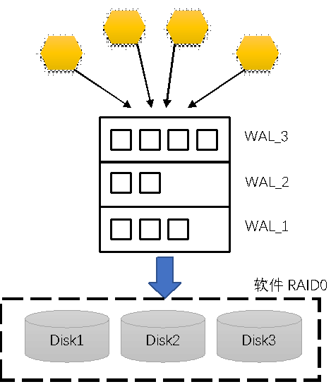

Group Commit 解决的是**同步落盘的次数**：每条消息一次 fsync 会让磁盘 IOPS 立刻成为瓶颈；把 10ms 窗口内的多条写入合并成一条 WAL 再落盘，一次 fsync 就被摊薄到成百上千条消息上。

两个设计细节值得记住：

- **合并有大小上限（3MB）**：防止单个大 batch 把 WAL 撑到难以恢复，同时限制单次落盘的尾延迟。
- **拆开 WAL 后同一个 stripe 落同一块磁盘**：并发写多块磁盘提升总吞吐，同时保证单个 stripe 内部仍是顺序写——顺序写是机械盘上唯一便宜的写法，也是"同一 stripe 内 msgid 有序"的物理基础。

> **Legacy Note**：`10ms` 与 `3MB` 是历史实现的具体参数，作为工程记忆保留即可，不建议在面试中主动背数字。真正要讲的是**"批量合并 WAL + 并发落盘 + 单 stripe 顺序写"这套组合为什么能同时拿到吞吐与有序性**。WAL 与 Group Commit 的通用原理属于 [SYS301](./SYS301.md)。

#### 强一致写

主从都成功才回发布方ACK, 以及订阅可见。

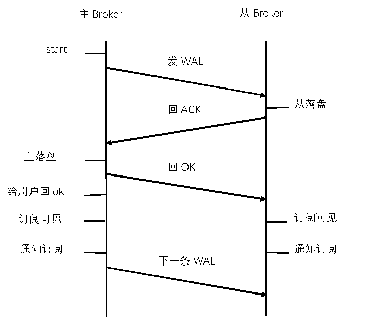

**"主从都成功"与"订阅可见"是同一时刻**，这是 BigPipe 与 Kafka 最本质的区别之一：

| | BigPipe 强一致写 | Kafka HW 机制 |
| --- | --- | --- |
| ACK 条件 | Primary + **所有** Secondary 同步成功 | Leader + **ISR 中**的副本同步完成 |
| 可见性 | ACK 时全组都已具备数据 | 消费者只能看到 HW 之前的数据（HW ≤ LEO） |
| 慢副本影响 | **直接拖慢甚至失败发布** | 慢副本被踢出 ISR，不阻塞发布 |
| 从副本能否服务读 | **能**（订阅可走 Secondary） | 不能（只从 Leader 读） |
| 取向 | 一致性优先，牺牲部分发布可用性 | 可用性优先，靠 ISR 动态收缩 |

代价很明确：**任何一个 Secondary 变慢或挂掉，都会让发布变慢甚至失败**。这正是 Stripe 迁移存在的理由——故障检测发现某个 Broker 不能再提供发布服务时，直接换 broker group 开新 stripe，而不是让整组一直等下去。

> **Interview Note**：不要说"强一致写所以 BigPipe 比 Kafka 更先进"。这是取舍不是优劣：BigPipe 用发布可用性换来读扇出与强一致可见性；Kafka 用 ISR 收缩保住发布可用性，代价是消费者可见性滞后于 Leader。

## QueueServer 与竞争消费【P1】

支持Queue模式的服务模块。

### Queue模式

Queue为pipelet上的消息附加了消费状态的管理。⼀个queue可以读取同一个pipe多个pipelet的数据。

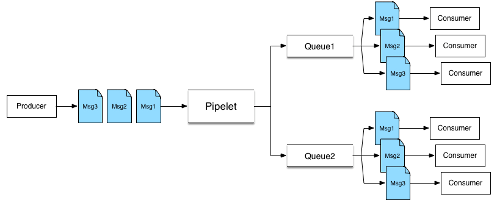

Queue模式是**竞争消费**的模式。一条消息被读取之后进入锁定状态，ACK超时时间过后如果收到了客户端回复的ACK就视作消费成功，从queue中移除消息，否则解除消息锁定状态。

Pub/Sub 订阅模式下每个订阅方都拿到全量数据；Queue 模式在其之上加了一层**消费状态管理**，让多个消费者竞争同一批消息。这对应 [基本概念](./SYS3111.md) 里的 P2P / 竞争消费模型。

**"锁定 + ACK 超时 + 解锁重发"这个三段式，就是消费端 at-least-once 的标准实现**：消费者处理到一半崩溃，锁到期自动释放，消息被重发给其他客户端。所以 Queue 模式的消费方**同样必须业务幂等**。

#### 消费方式

- 手动拉取

- 手动RPC消费（只有网盘业务使用）
- 自动推送

#### 优点

- 支持针对不同用户资源隔离（给queue和queuesvr打tag）

- 支持负载均衡（监控queuesvr机器的网卡和CPU使用率）

- 支持JSON格式消息的消息过滤（例如："(json.AppKey == "idc1") && (msg.size > 1024)"）

#### 缺点

- Queue的单点问题：一个queue只会在一台机器上，因此单queue性能有限（6wqps以内，而且不建议太高）。

- 负载均衡没有对QPS热点做调度。

**这两个缺点是结构性的**：竞争消费语义要求消费状态（谁锁了哪条、哪些已超时）集中在一处，所以一个 queue 只能有一个归属机器。这与 Kafka Consumer Group 的思路完全相反——Kafka 把状态按 Partition 切开分散到组内成员，并行度随 Partition 数扩展。

| | BigPipe QueueServer | Kafka Consumer Group |
| --- | --- | --- |
| 竞争消费单元 | 一个 queue（可跨同一 pipe 的多个 pipelet） | 一个 group.id（面向单个 topic） |
| 状态归属 | 单台 queuesvr，**单点** | 按 Partition 分配给组内成员，可水平扩展 |
| 并行度上限 | 单 queue 6w qps 量级 | Partition 数 |
| 热点调度 | 负载均衡未对 QPS 热点做调度 | 靠 key 设计与分区数控制 |
| 消费进度 | QueueWindow 定期快照到 ZooKeeper | `__consumer_offsets` |
| meta 更新 | 单线程更新 | 多线程更新 |

### QueueServer结构

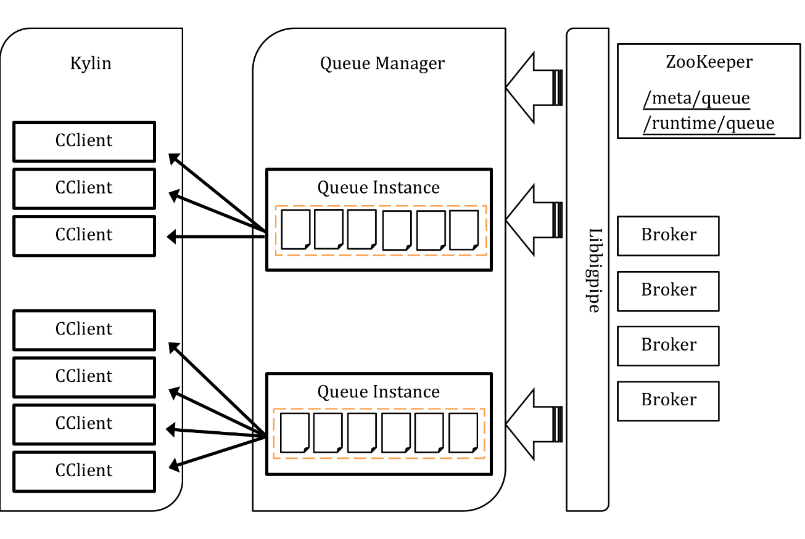

#### 特点

- 去中心化的设计
- 通过zk抢queue
- DropQueue负载均衡
- Qps/流量高低水位机制

**"去中心化 + 通过 zk 抢 queue"** 是关键：没有中心调度器指派 queue，各 queuesvr 实例自己去 ZooKeeper 抢占，抢到谁就服务谁。机器挂了，它持有的 queue 被其他实例抢走，天然完成故障转移。

**"Qps/流量高低水位机制"** 就是服务端背压：超过高水位时主动 DropQueue，把负载让给别的实例，避免整机被打死。

内部结构（QueueManager / QueueInstance / QueueWindow / InflightTable / QueueService）见 [Appendix B](#appendix-b--queueserver-内部结构)。其中 **QueueWindow 是理解 Queue 模式可靠性的核心**：一个"滑动窗口 + 定时器"的发送窗口，分成"已发送未 ack / 未发送 / 预留空位"三段，内容定期快照到 ZooKeeper；**InflightTable** 记录已发送未 ack 的消息并检查过期，过期消息被重发给其他客户端。

### Backpressure：window_size / suspend / resume

Queue 模式下客户端对服务端推送速度有三层控制：

```text
window_size ：请求时声明的窗口大小 → 限制服务端最多推多少条未 ack 消息
suspend()   ：回 ACK 时同时挂起   → 服务端不再推下一条（退回主动 fetch 模式）
resume()    ：需要消息时恢复推送
```

**为什么必须有这层控制**：服务端异步推送的速度只受窗口限制，与客户端实际处理能力无关。窗口设太大，消息堆在客户端内存里；完全不设窗口，慢消费者会被直接压垮。这是 [基本概念](./SYS3111.md) 中 backpressure 的具体落地。

> **Senior Java Focus**：Queue 模式的 ACK 时机有明确最佳实践——**只要能确认别人不再需要读这条消息了就立刻回 ACK，把耗时逻辑放到 ACK 之后**。未及时 ACK 的消息会被重发给其他客户端，所以把业务逻辑放在 ACK 之前会同时造成两个问题：重复消费，以及窗口被长期占满导致推送停滞。如果业务确实需要处理完再取下一条，用 `suspend()` / `resume()`，而不是靠拖住 ACK。

## 客户端API

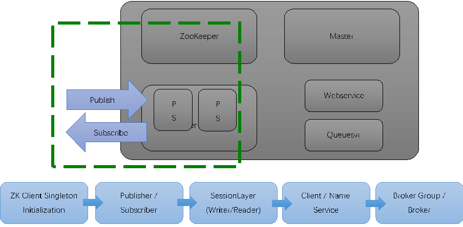

访问Bigpipe进行消息发布/订阅的客户端接口。

### API常用逻辑

#### API路由

- 直连的方式访问的不是对等节点
  - 需要路由
  - 容易因为网络问题访问不了
- 先从zk获取pipelet信息
- 根据要访问的位置确定stripe
  - 发布是最新的
  - 订阅则根据订阅点判断区间
- 重试
  - 遇到server错误时，需要重新路由

**路由与重试是一对**：`遇到 server 错误时需要重新路由`。因为 stripe 可能已经迁移到别的 broker group，此时对着旧地址原地重试永远失败。正确的重试是**先重新查 ZooKeeper 拿最新 stripe，再连新的 broker group**。

发布侧的 Session / replay 语义见上文 [Session 与消息身份](#session-与消息身份p0)。

#### API订阅

- 维持tcp长连接
  - 每个pipelet一个连接
- Broker主动推数据
  - client注册到stripe
  - Stripe有新的可见消息时遍历通知client
- 尽量实时推送
  - 消息会在pagecache里，不产生读IO
  - 回放老消息容易读热点

**"每个 pipelet 一个连接"** 是订阅侧连接数膨胀的根源：订阅一个有 N 个 pipelet 的 pipe，就要维持 N 条长连接。这正是 c-api "会为每个pipelet建一个线程、维护一个发布方，占用内存高" 这个历史缺点的由来，也是 bigpipe4j 用 NIO Reactor 托管多路 IO 的直接动机。

**"回放老消息容易读热点"**：实时推送时消息还在 Page Cache 里，读不产生磁盘 IO；一旦从很旧的 Startpoint 回放，数据早已被换出 Page Cache，变成大量磁盘读，容易把 Broker 磁盘打热，进而影响同机上其他 pipe 的实时发布订阅。这与 Kafka "消费者紧跟 Leader 时全部命中 Page Cache" 是同一个现象，见 [Kafka — PageCache](./SYS3115.md)。

### 各语言客户端

| 客户端 | 语言 | 状态 | 说明 |
| ------ | ---- | ---- | ---- |
| c-api | C++ | 历史可用 | 支持记录发布进度与数据压缩；接口不简洁容易用错，每个 pipelet 一个线程一个发布方，内存占用高 |
| libbigpipe | C++ | 历史可用 | 接口简洁；不支持记录发布进度、不支持数据压缩 |
| **bigpipe4j** | **Java** | **本人参与研发** | 见下一章 |
| PHP API | PHP | **已停用** | 会造成内存泄漏和连接数过多 |

c-api / libbigpipe / PHP API 的详细优缺点见 [Appendix E](#appendix-e--cc-客户端与已停用-api)。

## bigpipe4j — Java SDK【P0｜个人 Ownership 核心】

bigpipe4j是使⽤Java语⾔为Bigpipe开发的SDK.

⽀持Java 1.8 （spark就是1.8的）。

目前发布了⽀持protobuf2.4（使⽤者包括Spark）和2.5的两个版本。

⾃由度高，但是不当使⽤容易对服务端造成多种不良影响。

### 为什么需要这个 SDK

```text
Problem
  Java / Scala 业务（含 Spark 计算生态）需要接入 BigPipe，
  但当时只有 C++ 客户端，Java 侧没有可靠的接入能力。

Constraint
  网络会断，Broker 还会主动断开连接
  ACK 会丢，发布结果是 outcome unknown
  每个 pipelet 一条长连接 → 连接数与线程数随 pipelet 数线性增长
  sessionId 冲突或泛滥会直接冲击 ZooKeeper
  客户端不当使用会反过来打坏服务端

Design
  四层分层：Framework / Implement / Protocol / Meta
  逻辑 Session 与 session_msg_id 管理
  IMessageWindow 保存未确认消息
  NetReactor + NonblockingPublisher：用 NIO 托管多路 Producer IO
  SimpleSubscriber / MultiSubscriber：内置自动 failover 与容错重连

Trade-off
  reliability vs complexity ：窗口 + replay + 判重换来不丢，代价是客户端状态机复杂
  window size vs memory     ：窗口越大越能扛抖动，但内存占用与重放带宽越高
  blocking vs non-blocking  ：阻塞简单但吞吐低；非阻塞吞吐高但需与 Selector 配合
  自由度 vs 安全            ：底层 API 把 session_msg_id 管理暴露给调用方，用错会打坏服务端

Result
  Java / Scala 业务获得统一、可恢复的 BigPipe 接入能力，
  支撑了包括 Spark 在内的计算生态接入。
```

> **Ownership 边界**：以上是**客户端 SDK 侧**的工作。Broker 存储引擎、WAL 格式、Master 负载均衡与故障迁移算法、Stripe 迁移机制、QueueServer 属于 [B] 类系统机制——本人了解其原理，但不宣称设计所有权。

### 层级

| 层级（从上到下）         | 含义                                                         |
| ------------------------ | ------------------------------------------------------------ |
| 框架层  Framework  Layer | 包括Producer, Subscriber等基于应⽤层类封装的异步发布订阅类。 |
| 应用层  Implement  Layer | 包括BigpipeBlockedWriter, BigpipeNonblockReader等基于元信息层类封装的发布订阅类。 |
| 协议层  Protocol  Layer  | 包括BigpipeSessionLayer等多种接⼝和抽象类。                  |
| 元信息层  Meta Layer     | 包括Bigpipe模块的POJO类、寻址逻辑、Zookeeper链接逻辑等。     |

分层的核心价值是**把"可靠性策略"与"网络 IO"分开**：

```text
框架层    Producer / MultiSubscriber / NonblockingPublisher / NetReactor
          ↑ 异步编排、消息窗口、自动重连、容错、事件驱动 IO
应用层    BigpipeBlockedWriter / BigpipeNonblockWriter
          BigpipeBlockedReader / BigpipeNonblockReader / SimpleSubscriber
          ↑ 同步 or 异步的发布订阅语义、session_msg_id 管理
协议层    BigpipeSessionLayer / IBigpipeClient / ByteBlockList
          ↑ Session 抽象、报文打包解包、协议状态机
元信息层  ZookeeperUtil / NameService / IRoleSelectStrategy
          ↑ 寻址、stripe 定位、broker 角色选择、ZK 连接复用
```

`⾃由度高，但是不当使⽤容易对服务端造成多种不良影响` 正是这个分层带来的：应用层把 `session_msg_id` 的管理能力暴露给了调用方（`BigpipeWriter` 可以使⽤底层⽅法异步发布消息，可以⼤幅提⾼吞吐量但是需要⾃⼰管理 session_msg_id），用错就会造成服务端判重失效，或让 ZooKeeper 被过量 session 冲击。

### Meta类

**ZookeeperUtil**

继承自Watcher, 封装了watcher和session失效自动重连的zookeeper的类，为了尽量减少对zookeeper服务的压⼒，使⽤单例模式。

使⽤ConcurrentHashMap保存已创建的ZooKeeperUtil连接实例，key为集群名称（对应着ZooKeeper地址）。

具备以下功能：

- 创建默认/指定名称的Zookeeper连接

- 释放默认/指定名称的Zookeeper连接

- 检查默认/指定名称的Zookeeper连接是否存在

- 获取默认/指定名称的Zookeeper连接

- 获取默认/指定名称的Zookeeper的数据/节点信息

**单例 + ConcurrentHashMap 按集群名缓存连接**直接对应一个真实约束：**ZooKeeper 连接是昂贵资源，客户端连接数泛滥会打垮 ZK**。如果一个 JVM 里每个 Producer / Subscriber 各自建一条 ZK 连接，接入方规模一上来 ZK 就撑不住。按集群名复用把连接数收敛到"每个 BigPipe 集群一条"。

这与 `BigpipeSessionLayer` 中"sessionId 万级以上会冲击 ZooKeeper"是同一类问题的两个侧面：**SDK 必须在客户端侧主动收敛对元数据层的压力**。

### Writer & Reader类

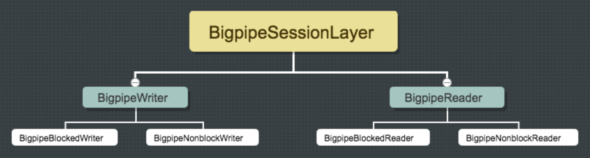

**BigpipeSessionLayer**

⽤于实现bigpipe协议的session功能，从⽽在服务端通过sessionId保存⼀些客户端的状态。sessionId ⽤于区分每⼀个客户端连接，每⼀个客户端连接sessionId是要求唯⼀的。

- 如果不同客户端创建了同⼀个sessionId, 使⽤起来会造成session冲突！

- 如果客户端创建了过多sessionId(万级以上)，使⽤起来会对Zookeeper模块造成冲击！

基类包含⼀个最基本的sessionId⽣成的实现，⽣成机制可以确保sessionId的单⼀性。为了防⽌冲击Zookeeper模块，建议⽤户按照合理逻辑⾃⾏设定sessionId.

封装了名称解析模块NameService，和bigpipe传输协议的客户端接⼝类IBigpipeClient（接⼝），规定了需要提供给上层的基本的跟协议相关的接⼝。

**NameService**

封装了broker选择逻辑IRoleSelectStrategy.

具备以下功能：

- 在zk上查找特定stripe信息

- 查找特定broker group信息

- 查找消息所在broker地址

- 查找发布位置所在broker地址

- 查找queue所在queuesvr地址

**IRoleSelectStrategy**

此接⼝的实现类定义了bigpipe4j读消息时对于主/从broker的选择逻辑。

`IRoleSelectStrategy` 存在的意义：BigPipe 的 Secondary **可以直接服务订阅**，所以读可以在主从之间分摊。把选择逻辑抽成策略接口，调用方可以按需选择"只读主"（一致性最强、压力集中在 Primary）或"分散读从"（读扇出、减轻 Primary 负担）。

**BigpipeWriter**

继承BigpipeSessionLayer.

可以使⽤以下底层⽅法异步发布消息，可以⼤幅提⾼吞吐量但是需要⾃⼰管理session_msg_id.

具备以下功能：

- NameService查找pipelet队尾所在的提供发布的服务器地址

- IBigpipeClient发起连接

- 将⼆进制消息打包成ByteBlockList格式

- IBigpipeClient发布消息

- IBigpipeClient接收ACK

- IBigpipeClient关闭连接

**ByteBlockList**

定义了⼀个消息包，包括两个成员：

- List<byte[]> list 消息表

- int bytesLength 消息包总⻓度

**BigpipeBlockedWriter**

继承BigpipeWriter.

同步阻塞发布消息，内部将对session_msg_id进⾏管理，它的⽤途是防⽌重复发布。

具备以下功能：

- BigpipeBlockedClient阻塞式地完成⼀次bigpipe协议的连接协议交互，验证身份信息；协议成功将更新内部session_seq.

- 组装消息报⽂，BigpipeBlockedClient发送⼀条消息，等待接收到服务器ack后将其返回

**BigpipeNonblockWriter**

继承BigpipeWriter.

异步⾮阻塞发布消息，⽹络IO需要与NIO的selector配合使⽤。想实现同步的发送⽅式可以通过等待上⼀条消息的ack或者控制读写事件的轮换来实现。

本类的⽅法内部会管理session_msg_id，适⽤于对每⼀次发送与上⼀次前因后果逻辑联系很强的情况， 主要⽤于实现同步的发布。

具备以下功能：

- 按c-api打包协议打包消息

- 组装消息报⽂后，BigpipeNonblockClient发送⼀条消息，不等待服务器ack, 将⾃增sendingSeq

- 尝试从底层⽹络读取数据，如果能读取到⼀条完整的协议，将按协议逻辑处理； 收到connected报⽂后将更新内部sendingseq和ackedseq, 收到ack报⽂后将更新内部的ackedseq

**BigpipeReader**

继承BigpipeSessionLayer.

具备以下功能：

- NameService查找pipelet制定订阅点的服务器地址

- IBigpipeClient发起连接

- IBigpipeClient发起连接命令

- IBigpipeClient发起订阅消息命令

- IBigpipeClient返回ACK命令

- 将ByteBlockList格式解包成⼆进制消息，可以按照指定压缩类型/⾃定判断压缩类型从⽽解压消息

- IBigpipeClient关闭连接

**BigpipeBlockedReader**

继承BigpipeReader.

具备以下功能：

- BigpipeBlockedClient阻塞式地完成⼀次bigpipe协议的连接协议交互，验证身份信息

- BigpipeBlockedClient阻塞式地完成⼀次bigpipe协议的连接协议交互，服务端开始推送数据

- BigpipeBlockedClient接收消息报⽂，返回ACK命令，解包

**BigpipeNonblockReader**

继承BigpipeReader.

具备以下功能：

- BigpipeNonblockedClient⾮阻塞式地完成⼀次bigpipe协议的连接协议交互，验证身份信息

- BigpipeNonblockedClient⾮阻塞式地完成⼀次bigpipe协议的连接协议交互，服务端开始推送数据

- 尝试从底层⽹络读取数据，如果能读取到⼀条完整的协议，将按协议逻辑处理； 如果是消息数据，将返回给调⽤者

**SimpleSubscriber**

BigpipeBlockedReader的封装类，具有内部⾃动failover机制。

`SimpleSubscriber` 的"内部自动 failover"具体覆盖：broker 故障时切换同组其他 broker、stripe 读完时切换到下一个 stripe（`StripeEndException`）、连接断开后重连。**应用层不需要自己写重连循环**——这也是历史上"抛出 StripeEndException 后订阅就停住"这类问题的根因：调用方绕过 SimpleSubscriber 直接用底层 Reader，却漏掉了重连逻辑。

### 三个 Writer 怎么选

| 类 | 语义 | session_msg_id | 吞吐 | 适用场景 |
| --- | --- | --- | --- | --- |
| `BigpipeWriter`（底层方法） | 异步 | **调用方自管** | 最高 | 需要极致吞吐，且完全理解判重语义 |
| `BigpipeBlockedWriter` | 同步阻塞，等到 ACK 才返回 | 内部管理 | 最低 | 每条消息必须确认成功才继续；逻辑简单不易错 |
| `BigpipeNonblockWriter` | 异步非阻塞，不等 ACK，自增 sendingSeq | 内部管理 | 高 | 批量 / 流式发布，配合 NIO Selector |

`BigpipeNonblockWriter` 想退化成同步有两种方式：**等待上一条消息的 ack**，或**控制读写事件的轮换**。

`BigpipeBlockedWriter` 的 `它的⽤途是防⽌重复发布` 需要准确理解：不是"阻塞就不会重复"，而是**由 SDK 内部管理 session_msg_id，调用方不会因自己乱编号而破坏判重**。

### Client类

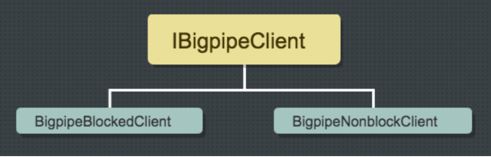

**IBigpipeClient**

具备以下功能：

- 与指定地址进⾏TCP连接

- 发布bigpipe协议protobuf报头/报⽂

- 接收bigpipe协议

- 关闭TCP连接

**BigpipeBlockedClient**

使⽤Socket连接

**BigpipeNonblockedClient**

使⽤SocketChannel连接

⽀持发送缓冲剩余未发送的字节数

`IBigpipeClient` 是整个 SDK 的网络抽象接口，两个实现对应两种 IO 模型：

```text
BigpipeBlockedClient    → java.net.Socket        → BIO，一线程一连接
BigpipeNonblockedClient → java.nio.SocketChannel → NIO，多连接复用到 Selector
```

**`⽀持发送缓冲剩余未发送的字节数`** 这一句是 NIO **partial write** 在 SDK 里的落点：非阻塞 `write()` 不保证一次写完，剩余字节必须留在发送缓冲里，等下一次 channel 可写时继续发。上层必须能查询"还剩多少没发出去"，才能决定是继续写还是先等 writable 事件。

> NIO / Selector / Reactor / partial read-write / TCP 粘包拆包的通用原理见 [CSE351](./CSE351.md)。本章只保留理解 bigpipe4j 所需的部分。

### Publisher & Subscriber类

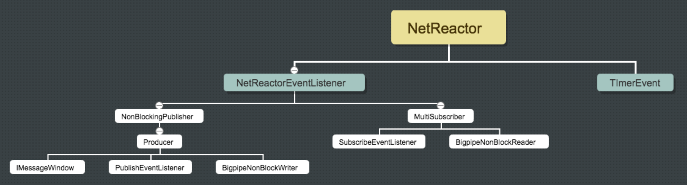

**NetReactor**

⽬前⽤于实现异步事件的reactor, 具备以下功能：

- 打开NIO选择器，从⽹络监听并且接收数据

- 关闭NIO选择器

- 将事件加⼊定时队列中

- 通知相应的Socketchannel，需要处理写请求

- 处理定时队列中的事件

**NetReactorEventListener**

处理定时事件和选择键。

**NonblockingPublisher**

继承NetReactorEventListener.

实现了NIO框架，⽤于托管多个Producer的IO，并进⾏⾃动捕获异常，容错重连等。

具备以下功能：

- 将Producer加⼊NetReactor

- 从⽹络监听并且接收数据

- 重连Producer

**Producer**

单个BigpipeNonblockWriter的框架类，封装了异步的消息缓存窗⼝IMessageWindow，应⽤层只管往缓存中插⼊消息，Producer来管理缓冲的消息，但需要将Producer加⼊NonblockingPublisher框架，来执⾏事件驱动的IO.

提供打包发布功能；不提供恢复进度、去重功能。

**IMessageWindow**

描述异步消息窗⼝⾏为的接⼝，FIFO.

具备以下功能：

- 队尾增加消息

- 队⾸移除消息

- 获取窗⼝指针的下⼀条消息

- 指针重置队⾸

- 获取窗⼝⼤⼩

- 重设窗⼝⼤⼩

- 清空窗⼝

**MultiSubscriber**

MultiSubscriber在NonblockingReader的基础之上，增加⽐较健全的⾃动容错重连机制，封装了较为负载的NIO实现，通过监听接⼝来向调⽤者反馈接收到的消息。

实现此类的⽬的主要在于尽量⾃动容错重连，尽可能少地把异常抛给应⽤层。

具备以下功能：

- 将NonblockingReader加⼊NetReactor

- 从⽹络监听并且接收数据

- 重连NonblockingReader

### 异步发布为什么必须有 Message Window【P0】

```text
send() 返回  ≠  Broker 已确认
```

异步发送时消息发出去就返回了，但 ACK 是稍后才到的。这中间存在一段**"已发送未确认"**的区间，必须有地方保存这些消息，否则 TCP 一断就全丢。这就是 `IMessageWindow` 的作用：

```text
   已确认（可释放）       已发送未确认（必须保留）        可继续发送
──────────────────┬──────────────────────────────┬─────────────────
                  │                              │
              ackedSeq                       sendingSeq

发送一条消息        → sendingSeq 自增，消息进窗口
ACK 到达           → ackedSeq 前进，队首消息移除，窗口腾出空间
收到 connected 报文 → 重新对齐 sendingSeq / ackedSeq（服务端告知它实际收到了哪里）
收到 ack 报文       → 更新内部 ackedseq
TCP 断开           → 未确认区间全部保留 → 重连 → 指针重置队首 → replay
服务端返回 2504/2506 → 该 msgId 已处理过 → 推进 ackedSeq，不重复落盘
```

`IMessageWindow` 的 `指针重置队⾸` 对应的就是 **replay**：重连后把窗口指针拉回队首，把仍未确认的消息按原 session_msg_id 依次重发。

由此推出三个约束：

- **窗口大小 = 内存占用 = 可容忍的抖动时长**。窗口越大，越能在网络抖动期间继续发送而不阻塞业务；但断线后要重放的消息也越多，原文已明确指出这会**额外占用带宽**。
- **本地持久化可以拓展窗口大小**。窗口只放内存时，大小受堆内存限制，且进程崩溃窗口内容全丢。把未确认消息落到本地磁盘，窗口就能开到远大于内存的规模，代价是多一次本地 IO 与恢复逻辑。
- **`Producer` 不提供恢复进度、去重功能**。这句必须准确理解：Producer 框架类本身不做跨进程重启的进度恢复，也不做业务级去重；它提供的是**单次运行内的窗口管理与 replay**，判重能力来自服务端的 session_msg_id。跨进程重启的进度需要调用方自己持久化 Startpoint。

> **Senior Java Focus**：**NIO 解决的是连接与线程效率；Window + Session + Dedup 解决的是异步可靠性**。这两件事经常被混为一谈。不要说"用了 NIO 所以消息不会丢"——NIO 只让你用更少的线程管理更多连接，它本身不提供任何投递保证；不丢是靠"窗口保留未确认消息 + 重连重放 + 服务端判重"三者合起来实现的。

### NIO Reactor 在 bigpipe4j 中解决的具体问题

```text
没有 Reactor（c-api 的历史模型）：
  pipelet 1 → thread 1 + 一个发布方
  pipelet 2 → thread 2 + 一个发布方
  ...
  pipelet N → thread N + 一个发布方
  → 线程数与内存随 pipelet 数线性增长

NonblockingPublisher + NetReactor：
  Producer A（pipelet 1）─┐
  Producer B（pipelet 2）─┼→ NetReactor / Selector → 少量 IO 线程
  Producer C（pipelet N）─┘
  → 多路 Producer 的 IO 托管在同一个 Reactor 上
  → 并行自动捕获异常、容错重连
```

价值不是"单条消息处理更快"，而是**更多连接用更少的长期等待线程**，降低线程栈内存、调度与上下文切换成本。

`NetReactor` 除了 Selector 事件之外还管理一个**定时队列**（`将事件加⼊定时队列中` / `处理定时队列中的事件`）。这是异步客户端的必需品：连接超时、ACK 超时、重连退避、心跳都需要定时触发，而 NIO 线程不能 `sleep()` 阻塞——一旦阻塞，它管理的所有其他连接都跟着停摆。所以定时任务必须放进事件循环里统一驱动。

`NonblockingPublisher` 的 `重连Producer` 与 `MultiSubscriber` 的 `重连NonblockingReader` 是同一套思路：**把重连收敛到框架层，尽可能少地把异常抛给应用层**。

### Queue类

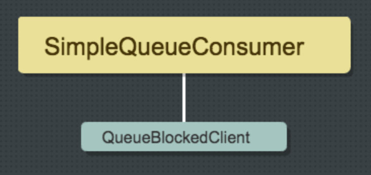

**QueueBlockedClient**

Queuesvr客户端的阻塞实现，⽤于从queue中获取消息。

Queue的消费场景是这样实现的：客户端主动发起tcp连接之后，服务端向客户端异步推送数据。通过设置请求的window_size，可以限制服务端的推送速度。

客户端每处理完⼀条消息之后，需要向服务端返回对应的ack消息确认消费。

那些被服务端发出但是没有被客户端返回ack的消息，服务端基于queue的配置经过⼀段时间将会将消息重发给其他客户端。因此ack⼀定要尽快，只要能确认别⼈不再需要读这条消息了就返回ack，尽量把耗时逻辑放到ack之后。如果客户端处理完消息之后需要处理其他逻辑，希望服务端不⽴即推送下⼀条消息（相当于客户端主动fetch的模式），则客户端应该在ack的时候调用suspend方法，需要消息时再调用resume方法。

注意，⼀个client上，回ack的顺序要跟fetch到的消息的顺序是⼀致的，先fetch的先回ack，否则server端可能认为是错误。

**"ACK 必须按 fetch 顺序回"**这个约束来自服务端的滑动窗口实现：QueueWindow 是一个连续数组，"已发送未 ack" 是数组的前缀段，只有前缀被连续确认，窗口才能整体前移。乱序 ACK 会让服务端无法判断窗口该推进到哪里。

这与 Kafka 的 offset 提交同构——Kafka 提交的也是"此位置之前全部处理完"的单一水位，同样无法表达"我处理完了 5 但还没处理 3"。

**SimpleQueueConsumer**

QueueBlockedClient的封装类，有设置重⼊锁。

重入锁的存在说明 `SimpleQueueConsumer` 预期会被多线程调用，而底层 `QueueBlockedClient` 本身不是线程安全的。

### Exception类

**InvalidParameter**

参数有误，⽐如pipeletName为空。

**MalformedPackageException**

数据包的⼤⼩或报头内容出现异常，⽐如订阅消息时订阅到了格式错误的消息，或者使⽤了不匹配的解压⽅式。

**MessageCodecException**

Codec相关异常，⽬前未启⽤。

**NameResolveException**

名称解析错误，⽐如从Zookeeper查找stripe信息时⽆法查找到对应Stripe.

避免这个问题，可以通过把session超时尽可能调⻓，或者ZookeeperUtil初始化之后调⽤下wait().

**PackingNumberException**

打包发布相关异常，⽬前未启⽤。

**ProtocolDisorderError**

协议状态错误，⽐如使⽤⾮阻塞订阅时protocolState不是START.

**QueueInteractException**

跟queuesvr进⾏协议交互遇到异常时抛出。可能的情况包括：

- queue为空

- 访问者不在queue的⽩名单上

- queue token设置有误

- queue不在线，没有在提供服务

**QueueLocateException**

⽆法解析queue名称到对应的queuesvr地址时抛出此异常。

**StripeEndException**

在当前stripe读完需要切换读下⼀个，需要应⽤层重连时抛出。⼤多数情况下，这个异常不代表系统异常或者使⽤错误。

如果抛出异常后没有继续订阅，可能是因为⽤户的订阅逻辑⾥缺少⾃动重连，或者版本较低（低于1.3.5.3），请升级到最新。

**StripeOffsetException**

订阅点不在当前stripe上时抛出此异常。

**UnexpectedProtocol**

报⽂协议异常。可能的情况包括：

- 接收到了⾮预期的BMQ报⽂

- 发布遇到限流

**异常性质与处理动作：**

| 异常 | 性质 | 正确处理 |
| ---- | ---- | -------- |
| `StripeEndException` | **正常流程信号**，不是故障 | 切换到下一个 stripe 继续订阅；用 `SimpleSubscriber` / `MultiSubscriber` 可自动处理 |
| `StripeOffsetException` | 订阅点落在别的 stripe 区间 | 重新按 Startpoint 定位 stripe |
| `NameResolveException` | ZooKeeper 元数据未就绪或 ZK 抖动 | 调长 session 超时；`ZookeeperUtil` 初始化后 `wait()`；重新路由后重试 |
| `QueueInteractException` / `QueueLocateException` | 配置或权限问题 | 检查白名单、queue token、queue 是否在线 |
| `UnexpectedProtocol` | 报文不匹配，或**发布被限流** | 限流时指数退避，不要无脑重试 |
| `MalformedPackageException` | 压缩方式不匹配或数据损坏 | 检查发布 / 订阅两端的压缩配置 |
| `ProtocolDisorderError` | 客户端协议状态机用错 | 检查是否在非 START 状态复用了非阻塞 Reader |
| `InvalidParameter` | 调用方参数错误 | 修正参数，属于编码期问题 |

`UnexpectedProtocol` 里的"发布遇到限流"值得单独强调：**限流场景下重试会加剧限流**。正确做法是指数退避 + 降低并发，而不是立刻重发——否则限流会演变成重试风暴。

### Tool类

**BigpipeLogger**

⽇志类，在不同版本中使⽤了log4j或slf4j + logback. 鉴于公司内部情况，很难实现统⼀。

需要配置⽂件。

**BinaryTool**

提供⼆进制和部分基本类型相互转换的简单功能。

**ByteBlockList**

c-api格式的发布消息包。

**CodecTool**

Codec相关操作功能。

**DebugTool**

提供⼆进制和⼗六进制字符串相互转换的简单功能。

**PipeTool**

提供pipe相关功能，⽐如查询pipelet个数。

`BigpipeLogger` 同时兼容 log4j 与 slf4j + logback，是内部 SDK 的典型现实：**接入方的日志框架不统一，SDK 只能两边都支持**。代价是必须提供配置文件，且不同版本行为不一致。

`ByteBlockList` 说明为"c-api格式的发布消息包"，印证了 `BigpipeNonblockWriter` 的 `按c-api打包协议打包消息`：Java SDK 在**线格式上完全对齐 c-api**，这样服务端不需要为 Java 客户端单独实现一套协议。

## BigPipe vs Kafka【P0】

|            | Bigpipe                                                      | Kafka                                          |
| ---------- | ------------------------------------------------------------ | ---------------------------------------------- |
| 数据结构   | Pipe  Pipelet  Stripe 分布式部署，便于提高性能               | Topic  Partition  Segment                      |
| 消息一致性 | exactly once  保证不重不漏                                   | at least  once  保证不漏                       |
| 吞吐量&QPS | 发布  小消息200M/s  大消息（100K+）100M/s  订阅（实时消息）  600M/s | 发布（ack==-1）  20kqps  79MB/s                |
| 竞争消费   | Queuesvr  面向多个pipe  单线程更新meta                       | consumer  group  面向单个topic  多线程更新meta |

表中"消息一致性"这一行是最容易被追问、也最容易失分的地方。

> **Historical Benchmark Warning**：表中吞吐与 QPS 数字来自历史测试环境，高度依赖消息大小、副本数、磁盘类型、Group Commit 参数与测试模型。**不应把它们当作两个系统的固有常数复述**，更不能据此推导"BigPipe 一定比 Kafka 快"。Kafka 侧 `ack==-1 / 20kqps / 79MB/s` 显然是某个受限配置下的结果，现代 Kafka 单集群远不止此，横向比较没有意义。

### 表中需要修正的表述

**① `Bigpipe exactly once 保证不重不漏`**

这个说法必须限定作用域。准确表述是：

```text
✓ 发布链路：Primary + 所有 Secondary 同步成功才回 ACK（强一致写）
✓ 发布链路：客户端 replay 时，Broker 用 (session, session_msg_id) 判重，
            不会把重放的消息重复落盘
✗ 消费侧：Startpoint 由订阅方保存，与业务处理不是原子的
          → 消费方崩溃仍会重读，仍是 at-least-once
✗ Queue 模式：ACK 超时后锁释放，消息重发给其他客户端 → 明确会重复消费
✗ Webservice（HTTP 接入）：经过 nginx 负载均衡，发布消息不能保证不重
✗ 任何跨系统副作用（写库、扣款、发下游消息）：不在 BigPipe 判重范围内
```

**② `Kafka at least once 保证不漏`**

这是**默认配置下**的结论。Kafka 通过 `enable.idempotence=true`（3.0 起默认开启）+ 事务 + `read_committed`，可以在 **Kafka → Kafka** 链路内做到 exactly-once；但同样无法覆盖外部系统副作用。详见 [Kafka — Exactly-Once 的边界](./SYS3115.md)。

**③ `Queuesvr 单线程更新meta` vs `consumer group 多线程更新meta`**

这一行讲的是**竞争消费状态的归属方式**：BigPipe 的一个 queue 只在一台 queuesvr 上，消费状态集中更新，所以单 queue 有 6w qps 量级的上限；Kafka 的消费状态按 Partition 分散到组内成员，并行度随 Partition 数扩展。这是架构取舍，不是实现优劣。

### 更完整的对照维度

| 维度 | BigPipe | Kafka |
| ---- | ------- | ----- |
| 控制面 / 元数据 | ZooKeeper + Master | 历史 ZooKeeper + Controller；现代 KRaft |
| 副本写入语义 | 强一致写：全组成功才 ACK | ISR 内成功即 ACK（`acks=all`）；慢副本被踢出 ISR |
| 从副本能否服务读 | **能**（Secondary 提供订阅） | 不能（只从 Leader 读） |
| 副本迁移单元 | Stripe（换 broker group，存量数据不搬迁） | Partition 重分配（数据需要搬迁） |
| 消费位置 | Startpoint，**订阅方保存** | Offset，Broker 侧 `__consumer_offsets` |
| 竞争消费 | QueueServer（单点归属，可跨多 pipelet） | Consumer Group（按 Partition 分散） |
| 发布判重 | `(session, pipelet)` 作用域的 `session_msg_id` | `PID + sequence`，作用域 `<PID, TopicPartition>` |
| 客户端重连 | 逻辑 Session 跨 TCP 连接，窗口内 replay | Producer 内部重试；Consumer 靠 Rebalance |
| 消费并行度上限 | pipelet 数 / 单 queue 归属机器 | Partition 数 |
| 顺序边界 | 单个 pipelet 内 msgid 严格递增 | 单个 Partition 内 offset 递增 |
| 消息保留 | 建议 ≤ 14 天（磁盘 + ZK 节点膨胀双重限制） | retention.ms / retention.bytes 可配 |
| 客户端语言 | C++ / Java（PHP 已停用） | 多语言客户端生态 |

### 不要这样说 / 应该这样说

```text
✗ "BigPipe 是百度版 Kafka，我设计了它。"
✓ "BigPipe 是百度的分布式消息系统。我参与的是 Java 客户端 SDK
   bigpipe4j 这一侧，包括 Session 管理、未确认消息窗口、
   断线重连与重放，以及基于 NIO Reactor 的异步发布优化。"

✗ "BigPipe 是 exactly-once 的，所以业务不用做幂等。"
✓ "发布链路上 Broker 能用 session_msg_id 识别客户端重放，
   不会重复落盘；但消费侧的 Startpoint 由订阅方保存，
   和业务流程不是原子的，Queue 模式锁超时还会重发，
   所以消费方仍然必须做业务幂等。"

✗ "强一致写比 Kafka 的 ISR 更先进。"
✓ "强一致写让 Secondary 可以直接服务订阅、ACK 时全组数据完整，
   代价是任何一个从副本变慢都会拖慢甚至失败发布，
   所以需要 Stripe 迁移来兜底；Kafka 用 ISR 动态收缩
   保住发布可用性，代价是消费者可见性滞后。这是取舍不是优劣。"

✗ "我用 NIO 重写了发布链路，所以消息不会丢。"
✓ "NIO Reactor 解决的是连接与线程效率——用少量 IO 线程托管
   多路 Producer，替代 c-api 每 pipelet 一线程的模型。
   不丢靠的是 IMessageWindow 保留未确认消息、断线后 replay，
   再加上服务端按 session_msg_id 判重。"
```

## BigPipe 线上问题排查【P1】

统一分析框架：**先定位在哪一层**（客户端 SDK / ZooKeeper 元数据 / Broker 数据面 / 业务消费逻辑），再看具体现象。不要一上来就怀疑网络。

```text
① 客户端 SDK 层  ：sessionId、窗口、重连、协议状态机、异常处理
② 元数据层       ：ZooKeeper 抖动、stripe 定位失败、路由过期
③ Broker 数据面  ：强一致写被慢副本拖住、Stripe 迁移、限流、磁盘
④ 业务消费逻辑   ：ACK 时机、Startpoint 保存、幂等、下游依赖
```

### 发布侧反复报 2504 / 2506

```text
现象    发布大量返回"消息重复"
定位    客户端在 replay 未确认窗口，属保护行为，不一定是故障
常见原因
  - ACK 回程慢或丢失，客户端超时后重放
  - 网络抖动导致频繁断连重连，每次重连都重放整个窗口
  - 窗口设置过大，单次重放量过大，进一步加剧延迟
  - 强一致写下某个 Secondary 变慢，全组 ACK 被拖住 → 客户端超时 → 重放
  - 触发了 Stripe 迁移，客户端对着旧 broker group 重试
处理
  - 2504 应视为成功（服务端已落盘且已 ACK 过），推进 ackedSeq 释放窗口
  - 2506 说明上次结果未知，等待确认，不要当作新消息重发
  - 检查 Broker Group 是否有慢副本、是否正在迁移 stripe
  - 校验窗口大小与本地持久化配置是否匹配业务峰值
防复发  监控重放频率与 ACK 延迟分布，而不只看发布成功率
```

### Session 冲突（errno 6006 / BMQ_E_ALREADYINUSE）

```text
现象    客户端连不上，或两个实例互相踢
定位    Session 层，不是网络层
常见原因
  - 两个进程使用了同一个 sessionId（多实例部署时硬编码了相同的值）
  - 客户端快速重连，撞上服务端残留约十秒的旧 session
  - 上一个连接未正常关闭，服务端还没清理
处理
  - sessionId 必须包含实例区分度（应用名 + 实例标识 + pipelet）
  - 重连加退避，不要在十秒内密集重试
  - 确认是否触发了 Broker 主动断开机制（防止客户端占用连接）
防复发  在 SDK 层统一 sessionId 生成规则，禁止业务方随意硬编码
```

### sessionId 泛滥冲击 ZooKeeper

```text
现象    ZooKeeper 压力升高、元数据查询变慢，波及所有接入方
定位    元数据层，但由客户端行为引起
常见原因
  - 每次启动 / 每个连接都生成新的随机 sessionId
  - 短生命周期进程频繁创建销毁 session
  - 万级以上 sessionId 在 ZooKeeper 上残留
处理
  - 改用稳定的、按业务逻辑推导的 sessionId
  - 复用 ZookeeperUtil 的单例连接（按集群名缓存），不要每对象一条 ZK 连接
防复发  这是 bigpipe4j 基类提供默认 sessionId 生成实现的原因，
        但更推荐调用方按合理逻辑自行设定
```

### 订阅莫名停住，不再收到消息

```text
现象    消费者进程活着，但长时间没有新消息
定位    绝大多数在客户端订阅逻辑，不在 Broker
常见原因
  - 抛出 StripeEndException 后没有切换到下一个 stripe
    （这是正常流程信号；低于 1.3.5.3 的版本需升级）
  - 自己用底层 BigpipeBlockedReader / BigpipeNonblockReader，漏掉了自动重连
  - Startpoint 落在别的 stripe 区间 → StripeOffsetException
  - NameResolveException：ZooKeeper 元数据未就绪或抖动
  - Queue 模式下 suspend() 之后忘记 resume()
  - Startpoint 已过期且"自动跳过过期消息"模式默认打开 → 订阅点被自动调到 -2
处理
  - 改用 SimpleSubscriber / MultiSubscriber，让框架处理 failover 与重连
  - 订阅点定位失败时重新查 ZooKeeper 取 stripe 列表
  - ZookeeperUtil 初始化后 wait()，或调长 session 超时
防复发  监控"最后一次收到消息的时间"，而不只是监控进程存活
```

### 消息积压 / 回放打热 Broker

```text
现象    积压持续增长，或回放历史消息时 Broker 磁盘 IO 飙升
定位    先分清是"生产变快"还是"消费变慢"
常见原因
  - 消费方处理慢、下游依赖慢、消费并发不足
  - pipelet 数据倾斜，个别 pipelet 积压而总量看不出来
  - Queue 模式下单 queue 归属一台机器，已达 6w qps 量级上限
  - QueueServer 负载均衡没有对 QPS 热点做调度
  - 从很旧的 Startpoint 回放：消息已不在 Page Cache，产生大量读 IO
处理
  - 增加消费实例；Queue 模式下受单 queue 归属限制，需要增加 queue
  - 回放老消息时降低速率，避免影响同机其他 pipe 的实时链路
  - Queue 模式下调 window_size，或用 suspend / resume 控制推送节奏
防复发  按 pipelet 维度监控积压，不要只看总量
```

积压的通用方法论（arrival rate vs service rate、与线程池堆积是同一个数学问题、止血策略选择）见 [Kafka — Consumer Lag 与消息积压](./SYS3115.md) 与 [基本概念](./SYS3111.md)。

### 发布遇到限流

```text
现象    UnexpectedProtocol，报文中携带限流信息
定位    服务端保护机制生效，说明客户端发送速率已超出配额
处理
  - 指数退避、降低并发，而不是立刻重发
  - 检查是否因为频繁 replay 放大了实际发送量
  - 确认业务是否真需要这个发布速率，或应改走流式通道
防复发  限流是明确信号，重试风暴会把限流变成雪崩
```

### 发布成功但下游没收到 / 怀疑丢消息

```text
现象    业务认为消息发了，下游说没收到
定位    按顺序排除，不要直接怀疑 Broker 丢数据
排查顺序
  ① 客户端是否真的拿到了 ACK？异步发送后没等 ACK、进程直接退出 → 窗口内容全丢
  ② 是否用的是 Producer 框架类？它"不提供恢复进度"，进程重启后未确认窗口不会自动恢复
  ③ Startpoint 是否已过期？stripe 有生存时间，过期数据会被 GC
  ④ Queue 模式下"自动跳过过期消息"是否默认打开（订阅点自动调至 -2）
  ⑤ 是否走 Webservice？经 nginx 负载均衡，语义与长连接客户端不同
  ⑥ 订阅方是否在某次 StripeEndException 后停住了（见上一节）
结论    BigPipe 是强一致写 + 持久化，"Broker 凭空丢已 ACK 消息"是最后才怀疑的选项
```

## 个人 Ownership 边界【P0】

### 可以明确说的 [A]

- 参与 BigPipe 分布式消息系统的相关研发工作
- 参与 **bigpipe4j Java SDK** 的开发
- Java / Scala 业务接入 BigPipe
- blocking / non-blocking 两种发布订阅模式的实现与取舍
- **Session 管理**：sessionId 生成与唯一性、session_msg_id 维护、session 冲突与残留处理
- **TCP reconnect**：断线检测、退避重连、重连后借 `connected` 报文对齐 sendingSeq / ackedSeq
- **unconfirmed message replay**：IMessageWindow 未确认窗口、指针重置队首重放、配合服务端判重
- **NIO Reactor 异步发布优化**：NetReactor / NonblockingPublisher 托管多路 Producer IO，替代 c-api 每 pipelet 一线程的模型
- 2019 CCTV 春晚红包的基础设施保障工作

### 不能说的

- ✗ 设计了 BigPipe 的整体架构
- ✗ 设计了 Broker 存储引擎、WAL 格式、Group Commit 策略
- ✗ 设计了 Master 的负载均衡与故障迁移算法
- ✗ 设计了 Stripe 迁移机制或 QueueServer
- ✗ 春晚整体系统的容量指标、跨团队架构是本人成果
- ✗ brpc / Dubbo / gRPC 的长期生产开发经验

### 三种知识的使用方式

| 类型 | 内容 | 正确用法 |
| ---- | ---- | -------- |
| **[A] 本人真实参与** | bigpipe4j、Session、reconnect、replay、NIO Reactor 优化、春晚保障 | 用第一人称，按 Problem / Constraint / Design / Trade-off / Result 展开 |
| **[B] BigPipe 系统机制** | Master、ZooKeeper、Broker Group、Primary / Secondary、WAL、Stripe、Pipe / Pipelet、Startpoint、QueueServer | 讲原理与取舍，说"BigPipe 的设计是……"，**不说"我设计了……"** |
| **[C] 通用 MQ / 分布式知识** | ACK、Retry、Dedup、Idempotency、Replication、Backpressure、Outcome Unknown | 用来解释 [B] 为什么这样设计，**不伪装成个人 ownership** |

RPC（gRPC / brpc / Dubbo）、CAP、复制理论、ZooKeeper 通用原理属于其他章节范围，不在本章展开。

### 2019 春晚红包怎么讲

> 2019 春晚红包是我经历过的高压力生产保障场景。我参与的是 BigPipe 相关基础设施保障，个人更熟悉 Java SDK 和客户端可靠性这一侧。这个经历让我真正意识到，高峰系统可靠性不是靠某一个 retry，而是客户端、Broker、持久化、故障恢复、容量和监控共同作用。整体春晚系统的容量和跨团队架构不是我的个人成果，我不会把整体指标说成 BigPipe 或我个人的指标。

这段表述的价值在于**主动划清边界**：既说明经历过真实的高压生产场景，又不侵占不属于自己的成果。比夸大指标更可信。

### 最有说服力的一条主线

```text
Problem      Java 业务接入底层分布式 MQ 很复杂
Constraint   网络会断 / ACK 会丢 / 连接数随 pipelet 增长 / 需要可靠恢复
Design       SDK 四层分层 + 逻辑 Session + session_msg_id
             + IMessageWindow + reconnect / replay + NIO Reactor
Trade-off    reliability vs complexity
             window size vs memory & replay bandwidth
             强一致写 vs 发布可用性
Result       Java / Scala 业务获得统一、可恢复的 BigPipe 接入能力
```

> 不要把 bigpipe4j 讲成"我写了一个 SDK"。要讲成"我在网络必然失败的前提下，用逻辑 Session、消息身份、未确认窗口和重放，把不可靠的异步发布变成了业务可用的可靠接入，并且清楚每一处取舍的代价"。

## Appendix — Historical BigPipe Implementation Details

> 以下是历史实现细节、内部错误码、内部类结构与运维操作。它们**不属于面试主线**，但都是真实项目积累，排查线上问题或被深入追问时会用到，因此完整保留，未做删减。

### Appendix A — Broker 错误码

原 `Broker常见异常`

| 代码 | 宏                         | 含义                                                         |
| ---- | -------------------------- | ------------------------------------------------------------ |
| 2504 | BMQ_E_COMMAND_DUPLICATEMSG | 发布消息重复。当前发布的消息的msgId, 已被发布并向客户端成功返回ACK. |
| 2506 | BMQ_E_SKIPACK              | 发布消息重复。当前发布的消息的msgId, 已被发布但尚未向客户端返回ACK. |
| 2512 | BMQ_E_TOPIC_STOP           | 发布订阅达到当前stripe的结尾。                               |
| 2515 | BMQ_E_HANDLE_SUBSCRIBE     | 订阅点不存在当前消息区间。                                   |
| 6006 | BMQ_E_ALREADYINUSE         | Session冲突，可能是由于上一个session连接尚未释放就要建立一个新的。 |

与客户端异常、处理动作的对应关系：

| errno | 客户端表现 | 处理动作 |
| ----- | ---------- | -------- |
| 2504 | 重放被判为"已成功过" | 视为成功，推进 ackedSeq，释放窗口 |
| 2506 | 重放被判为"结果未知" | 等待确认，不作为新消息重发 |
| 2512 | stripe 已读到结尾 | 对应 `StripeEndException`，切换下一个 stripe |
| 2515 | 订阅点不在当前消息区间 | 对应 `StripeOffsetException`，重新定位 stripe |
| 6006 | session 冲突 | 检查 sessionId 唯一性；重连加退避（服务端 session 残留约十秒） |

### Appendix B — QueueServer 内部结构

**QueueManager**

管理多个queue instance，包括：

- _queues: 正在运行的queue

- _starting_queues: 准备运行的queue

- _closing_queues: 将要停止的queue

在一个线程循环中：

- 启动准备运行的queue.
- 关闭准备停止的queue.

- 检查正在运行的queue在ZooKeeper上的状态

- 提供管理监控查询

三个集合 + 单线程循环是典型的状态机驱动设计：queue 的启动与关闭都是**异步两阶段**的（先进 starting / closing，再由循环推进到 running 或彻底停止），避免在 ZooKeeper 抢占或释放的过程中阻塞主循环。

**QueueInstance**

Queue的实例对象，对应一个queue. 记录着queue大小及其每个pipelet的订阅进度信息。

**QueueWindow**

一个基于滑动窗口+定时器实现的发送窗口，内容会定期快照到ZK.

滑动窗口是一个连续的数组，分为3部分：

- 已发送，未ack的消息
- 未发送的消息
- 预留空位

长度也因此分为：

- 未发送消息个数, un-pushed messages

- 发送未ack的消息个数, pending messages

- 整个窗口的大小，可以最多容纳的消息个数

**定期快照到 ZooKeeper** 是 queue 能在机器间转移的前提：queuesvr 实例挂掉后，抢到该 queue 的新实例需要从 ZooKeeper 恢复窗口状态，才知道哪些消息已发出未确认、该从哪里继续推送。代价是快照频率与 ZooKeeper 压力之间的权衡。

窗口是**连续数组 + 前缀确认**模型，这正是"回 ack 的顺序要跟 fetch 到的消息顺序一致"这条客户端约束的服务端来源。

**InflightTable**

记录已经发送但没有收到ack的那些消息，它还有一个过期机制，检查消息是否过期。其中主要成员有:

- 含有已经发送没有ack的message，这是一个FIFO的queue，便于查找过期消息

- 含有已经过期的消息id->消息的map
- 含有已经发送没有ack的消息 id->消息的map

其中消息id通过对pipe, pipelet, msg_id, seq_id作hash得到。

同时维护 FIFO queue 与两个 map 是典型的空间换时间：FIFO 用于按发送顺序快速找出最早过期的消息（超时重发），map 用于收到 ACK 时 O(1) 定位并移除。消息 id 由 `(pipe, pipelet, msg_id, seq_id)` 四元组 hash 得到，因此**跨 pipelet 的消息也能在同一个 queue 的 InflightTable 里被唯一标识**——这正是"⼀个queue可以读取同一个pipe多个pipelet的数据"能够实现的基础。

**QueueService**

QueueService提供网络服务，内部包含一个QueueRpcService和一个CListener, CListener里面又包含一个Cclient.

### Appendix C — Queue 控制台

原 `Queue控制台`

- 可以显示queue的消费状况和配置。
- 可以修改订阅点至-1实现清空消息的效果，或者修改订阅点至-2实现跳过过期消息id的效果。
- 可以启动自动跳过过期消息模式，模式是默认打开的，订阅点一旦过期就自动调整至-2。
- 可以设置返回ACK的timeout.
- 可以设置queue的窗口大小。

`-1` 与 `-2` 是两个特殊哨兵值：`-1` 清空（不再消费任何存量消息），`-2` 跳过已过期的消息 id。

**"自动跳过过期消息模式默认打开"** 意味着订阅点一旦过期会被自动调整到 `-2`。排查"消息莫名少了"时必须先确认这个开关，否则很容易把"自动跳过过期消息"误判成"消息丢失"。

可运维调整的三项：ACK timeout、窗口大小、自动跳过过期消息开关。

### Appendix D — Webservice（HTTP 接入）

原 `Webservice`

提供HTTP发布订阅服务。

因为经过nginx进行负载均衡调度，所以发布消息不能保证不重。

订阅不支持long poll模式，不能长时间等待，会超时。

expires参数用来设置超时时间：expires=`date +%s -d "+30 sec"`

**命令格式**

```bash
POST /rest/pipe/{pipename}?method=fetch
```

**层次结构**

- 用户（发布者、订阅者） 
- HTTP代理（内部网关BGW+Nginx）
- Webservice（发布者、订阅者） 
- Bigpipe集群

**为什么 Webservice 发布不能保证不重**：HTTP 请求经过 nginx 负载均衡转发，一次请求可能被重试到不同的 Webservice 实例；而**逻辑 Session 与 session_msg_id 是绑定在长连接语义上的**，HTTP 短请求无法维持稳定的 session 身份，服务端也就无从判重。

这条正好反证了 Session 机制的价值：**判重能力依赖一个跨请求稳定的发布身份**。任何无状态、经负载均衡的接入方式都会失去这个能力。

另两个限制：订阅不支持 long poll，不能长时间等待会超时，因此不适合低流量实时订阅；`expires` 用绝对时间戳设置超时。

### Appendix E — C/C++ 客户端与已停用 API

**c-api (C++)**

优点：

- 支持记录发布进度
- 支持数据压缩

缺点：

- 接口不简洁容易用错
- 发布订阅模型不佳，会为每个pipelet建一个线程、维护一个发布方，占用内存高

**libbigpipe (C++)**

优点：

- 接口简洁

缺点：

- 不支持记录发布进度
- 不支持数据压缩

**PHP API（已停用）**

api会造成内存泄漏和连接数过多的问题，现已停用。

**三者的取舍线索**：c-api 功能全但模型差（每 pipelet 一线程一发布方 → 内存随 pipelet 数线性增长）；libbigpipe 接口简洁但砍掉了发布进度记录与数据压缩；PHP API 因内存泄漏与连接数问题被直接停用。

bigpipe4j 的 `NonblockingPublisher` + `NetReactor` 正是针对 c-api 这个模型缺陷的解法：**用 NIO Reactor 托管多路 Producer IO，把"每 pipelet 一线程"换成"多 pipelet 共享少量 IO 线程"**。

`ByteBlockList` 被描述为"c-api格式的发布消息包"、`BigpipeNonblockWriter` 会"按c-api打包协议打包消息"，说明 bigpipe4j 在线格式上完全对齐 c-api，服务端不需要为 Java 客户端单独实现一套协议。

### Appendix F — Stripe 粒度 GC 与历史容量限制

**Stripe粒度GC**

目前Bigpipe不适合长期保存，建议最多保存14天以内的消息。第一，Bigpipe Broker的磁盘空间紧张。第二，Stripe信息在ZooKeeper中单节点长期保存会膨胀，有可能突破节点大小上限。

- Master先从ZooKeeper上移除待删除stripe节点。
- Broker跟ZooKeeper对比后，将废弃stripe移入trash.
- Broker定期清理trash.

**两个约束值得单独记住：**

- **磁盘空间**：Broker 用 SATA 盘 + 硬件 RAID（见系统层级表），不是为长期归档设计的。
- **ZooKeeper 单节点大小上限**：每个 stripe 都要在 ZooKeeper 上有元数据节点，长期累积会膨胀到突破节点大小限制。这是**控制面反过来限制数据面保留时长**的典型案例——即使磁盘还够，元数据也撑不住。

**GC 的三步走（ZooKeeper 先行 + trash 两阶段删除）**：Master 先删 ZooKeeper 节点，Broker 对比后把废弃 stripe 移入 trash，再定期清理 trash。用 trash 中转而不是直接删文件，是为了留出误删恢复窗口，也避免"ZooKeeper 已删但 Broker 还没删"期间出现状态不一致。

**保留时长建议**：≤ 14 天。需要长期归档的场景应通过流式通道（DStream）落到专门的存储，而不是靠 BigPipe 保留。

**历史容量与性能数字汇总**（均为历史环境经验值，不作为固有常数复述）：

| 项 | 历史数值 |
| --- | --- |
| 实时消息延时 | 10-20ms，不超过 100ms |
| 流式数据吞吐 | 300-500MB/s，延时 5-6 分钟可接受 |
| 日志分发吞吐 | 1+GB/s（经 DStream） |
| 发布吞吐（小消息） | 200M/s |
| 发布吞吐（大消息 100K+） | 100M/s |
| 订阅吞吐（实时消息） | 600M/s |
| 单 queue 上限 | 6w qps 以内，不建议更高 |
| Group Commit 窗口 | 10ms，单条 WAL 最大 3MB |
| Session 服务端残留 | 连接关闭后约十秒 |
| 消息建议保留时长 | ≤ 14 天 |
| 支持的 protobuf 版本 | 2.4（使用者包括 Spark）、2.5 |
| 支持的 Java 版本 | 1.8 |
| `StripeEndException` 自动重连修复版本 | 1.3.5.3 |
| sessionId 冲击 ZooKeeper 阈值 | 万级以上 |
