# SYS401 - Financial Technology - 中国支付结算体系

返回[Bulletin](./bulletin.md)

返回[SYS401 - Financial Technology](./SYS401.md)

[TOC]

## 基本概念

### 清算

$$
清算=清分+结算
$$

#### 清分

$$
清分=记账+发送指令+算账
$$

此阶段主要由清算企业参与，比如银联、网联。

例如：A刷POS向商场B付款5000元，A的开户行在建行(发卡行)，商场B的开户行在工行(收单行)。在清分阶段，银联系统记下这笔交易计算出这笔交易中发卡行、银联、收单行各自收取多少手续费分别向发卡行与收单行发起交易指令。

#### 结算

$$
结算=扣费+转账
$$

此阶段主要由清算企业与人民银行的支付系统共同参与。

例如：发卡行根据交易指令从A的银行卡账户扣除5000元，并从5000中扣除相应的手续费。剩余的钱银联再扣除相应的手续费，通过人民银行大额支付系统转给收单行，收单行再扣除相应的手续费将剩下的钱打入B的账户。

## 中国支付结算体系

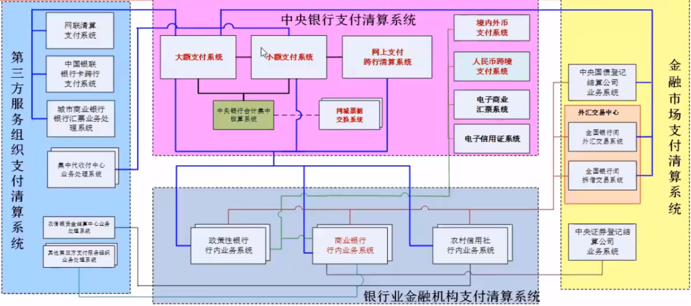

以**人民银行现代化支付系统**为核心，

以**商业银行行内结算清算系统**为基础，

以**第三方支付组织系统**为补充的现代化支付体系。

### 人行支付系统

#### 内部结构

核心：

- 清算账户管理系统

业务应用子系统：

- 大额实时支付系统：全年5X21小时工作：5个工作日为周一到周五，一个工作日的计算为23:30到次日20:30。

- 小额批量支付系统：除系统维护外，全年7X24小时工作，单笔交易金额小于5W。该系统主要用于社保、工资的发放，银联、网联不接入这个系统。

- 网上支付跨行清算系统：全年7X24时工作，负责网银、手机银行、第三方支付平台的转账与支付业务。

支持系统：

- 公共管理控制系统
- 支付管理信息系统

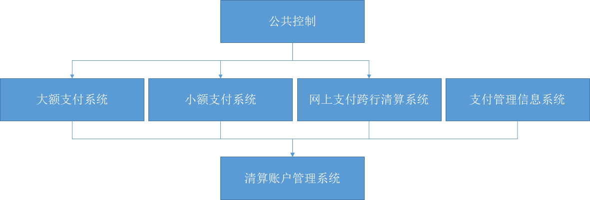

#### 第一代 VS 第二代

2002年上线运行的人行第一代支付系统主要包括大额支付系统、小额支付系统和全国支票影像交换系统三个应用系统。

2009年人行决定立足第一代支付系统的成功经验，建设第二代支付系统。改进主要体现在：

**支持商业银行以法人为单位一点集中接入**

总部及其分支机构的支付业务可以集中通过一个账户完成处理，这样有利于提高业务处理效率，也有利于提高资金使用效率。总部的资金管理部门可以方便地监测全行的流动性使用情况，更加灵活地调度资金。

**提供更加丰富的流动性管理功能**

第二代支付系统新增了大额支付系统排队业务撮合、“资金池”管理、“一揽子”流动性实时查询等功能，清算效率提高。

**支持在线支付业务的跨行处理**

客户通过开户银行的网上银行或自助服务终端发起跨行支付业务后，在很短时间之内就可以了解资金到账情况，有助于改进客户网上支付体验，促进电子商务发展。

**系统运行维护更加高效**

第二代支付系统的风险预警能力和运行监控效率都有很大提高，系统运行更加安全、稳定。

**系统备份功能更加健全**

第二代支付系统以生产为中心，以远程备份中心和同城数据中心为架构，具有健全的生产恢复能力，确保突发事件发生时支付业务的连续处理及信息数据的安全完整。

**采用国际通用的报文标准**

第二代支付系统的报文标准采用国际通用的ISO20022报文规范，有利于各系统之间的互联互通，如计划通过第二代支付系统与有关外币清算系统对接，实现本外币交易的PVP（同步收付）结算，提高本外币交易的结算效率，防范结算风险。

#### 参与方

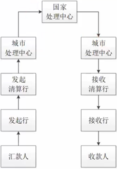

一点接入，一点清算。商业银行总行接入人民银行，开立一个清算账户。

**国家处理中心**

对接城市处理中心和工农中建四大行。

**城市处理中心**

对接当前城市所辖内的商业银行，例如中信银行对接北京城市处理中心。

**发起清算行、接收清算行**

直接参与者，与人行支付系统连接，直接通过支付系统办理支付清算业务的机构。包括人民银行总行、在人民银行开设清算账户的银行和非银行金融机构。

**发起行、接收行**

间接参与者，委托清算行通过支付系统办理支付清算业务的机构，包括人民银行分支行以及未在人民银行开设清算账户的银行。

#### 业务流程

**贷记类**

是一种主动给别人汇款的行为。不需要收款行确认汇款是否已经抵达，付款行这边流程就已经结束了。贷记包括以下支付工具：

- 汇兑
- 委托收款
- 托收承付

- 定期贷记

- 网银贷记支付

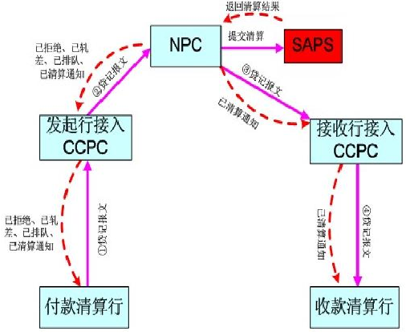

**借记类**

是一种主动向别人取款的行为。收款行需要等待付款行回复同意付款或者拒绝付款才能结束整个流程。借记包括以下支付工具：

- 银行汇票

- 银行本票

- 支票

- 定期借记

- 实时借记

- 商业汇票

- 国内信用证

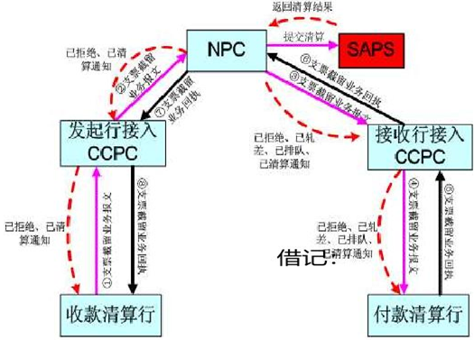

**实时类**

借记时间比较宽松，一般三到五天，遇到节假日还可能更久，所以人行推出了实时类业务场景。

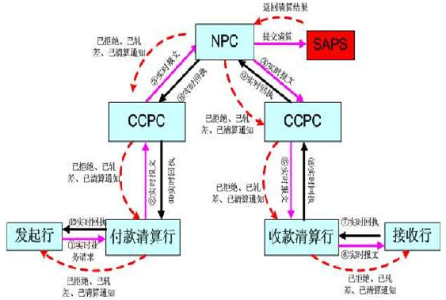

### 银联支付清算

银联成立于2002年3月，是人民银行批准设立的中国银行卡联合组织，实现银行卡跨行交易信息转接与交易清算。

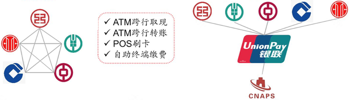

银联负责处理POS与ATM的跨行支付、转账、取款业务，并制定统一的标准规范。

#### 业务流程

**交易**

联机交易系统于D日发起各银行的跨行交易。

**清分**

清算系统D+1日汇总D日各行之间发生的交易明细数据，并对跨行转接和收单业务进行清分，然后发送发卡侧、收单对账数据给交易银行予以确认。

**对账**

各行分别对明细对账确认。

**清算**

对账完成后，银联系统开始清算，调用人行二代支付系统的**大额实时交易系统**/**小额实时交易系统**转账。

**结算**

清算完成后，各行分别获取备付金系统的真实金额和银行系统内部的影子账户进行对账。

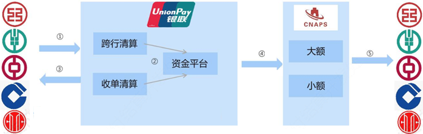

#### 清算种类

**跨行清算**

针对收单机构和发卡机构的清算。

**收单清算**

代替收单机构，针对商户和收单专业化服务机构的清算。

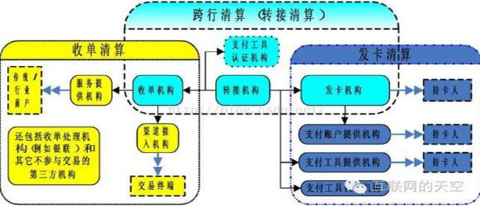 

### 网联支付清算

负责支付宝、微信等第三方支付平台的支付与转账业务。清算阶段由网联完成，结算阶段由网联接入**网上支付跨行清算系统**完成。

#### 直连模式

非银行支付机构（支付宝）与各家银行进行直连。当处理客户支付业务时，支付机构清分后再在各银行的备付金账户进行结算。这实质上是变相行使了央行或清算组织的跨行清算职能。

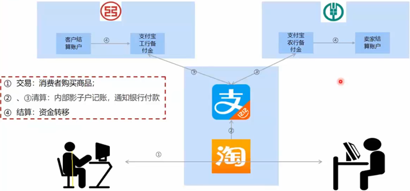

#### 12、网联支付清算 – 网联模式

根据人民银行的银支付【2017】209号文规定，为了便于反洗钱、刷卡套现等监管，非银行支付机构不允许直连各家银行（仅可选择一家银行开立备付金账户），采用网联模式、断直连，原有的变相清算功能将不复存在。

网联履行了对所有第三方支付平台的集中清算功能。

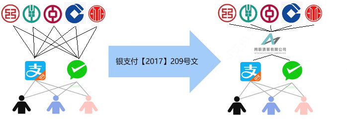

### 银联 VS 网联

|            | 银联               | 网联               |
| ---------- | ------------------ | ------------------ |
| 运行模式   | 线上、线下         | 线上               |
| 定位       | 卡组织+清算平台    | 清算平台           |
| 对接机构   | 银行之间、银行机构 | 银行与三方支付机构 |
| 信息类业务 | 无卡快捷签约       | 协议支付签约       |
|            | 代扣签约           | 商委支付签约       |
| 支付类业务 | 无卡快捷           | 协议支付           |
|            | 代扣               | 商委支付           |
|            | 网关支付           | 网关支付           |
|            |                    | 认证支付           |
|            | 付款、退款         | 付款、退款         |
|            | 清算对账、差错处理 | 清算对账、差错处理 |

