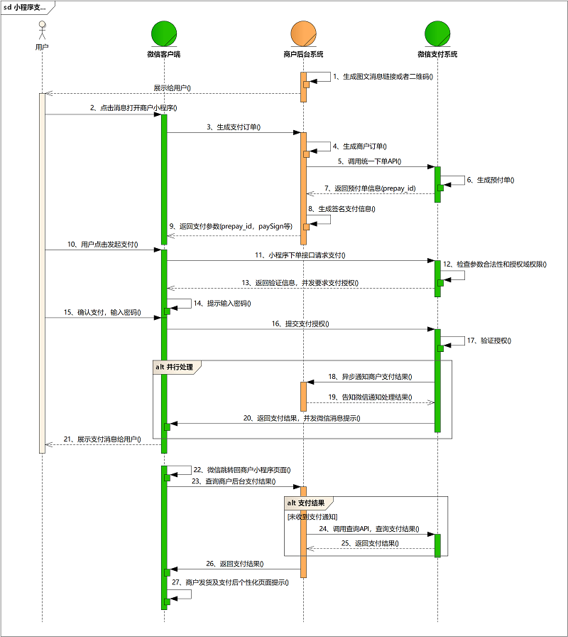

# SYS401 - System Design - 常见系统设计

返回[Bulletin](./bulletin.md)

返回[SYS401 - System Design](./SYS401.md)

[TOC]

## 要注意的问题

### 提高硬件能力、增加系统服务器

当服务器增加到某个程度的时候系统所能提供的并发访问量几乎不变，所以不能根本解决问题。

### 分层

分层是处理任何复杂系统最常见的手段之一，将系统横向切分成若干个层面，每个层面只承担单一的职责，然后通过下层为上层提供的基础设施和服务以及上层对下层的调用来形成一个完整的复杂的系统。

计算机网络的开放系统互联参考模型（OSI/RM）和Internet的TCP/IP模型都是分层结构，大型网站的软件系统也可以使用分层的理念将其分为持久层（提供数据存储和访问服务）、业务层（处理业务逻辑，系统中最核心的部分）和表示层（系统交互、视图展示）。

需要注意：

1. 分层是逻辑上的划分，在物理上可以位于同一设备上也可以在不同的设备上部署不同的功能模块，这样可以使用更多的计算资源来应对用户的并发访问；
2. 层与层之间应当有清晰的边界，这样分层才有意义，才更利于软件的开发和维护。

### 分割

分割是对软件的纵向切分。我们可以将大型网站的不同功能和服务分割开，形成高内聚低耦合的功能模块（单元）。在设计初期可以做一个粗粒度的分割，将网站分割为若干个功能模块，后期还可以进一步对每个模块进行细粒度的分割，这样一方面有助于软件的开发和维护，另一方面有助于分布式的部署，提供网站的并发处理能力和功能的扩展。

### 使用缓存

所谓缓存就是用空间换取时间的技术，将数据尽可能放在距离计算最近的位置。使用缓存是网站优化的第一定律。我们通常说的CDN、反向代理、热点数据都是对缓存技术的使用。

### 消息队列

解耦+削峰+异步。

### 分布式开发

不同的服务部署在不同的机器节点上，并且一个服务也可以部署在多台机器上，然后利用 Nginx 负载均衡访问。这样就解决了单点部署(All In)的缺点，大大提高的系统并发量。

### 分库分表

数据库分库（读写分离）、分表（水平分表、垂直分表）。

### 集群

集群使得多台服务器提供相同的服务，可以更好的提供对并发的支持。

### 冗余

各种服务器都要提供相应的冗余服务器以便在某台或某些服务器宕机时还能保证网站可以正常工作，同时也提供了灾难恢复的可能性。冗余是网站高可用性的重要保证。 

## 秒杀系统

秒杀系统的整体架构可以概括为“稳、准、快”：

**稳**

整个系统架构要满足高可用，流量符合预期时肯定要稳定，超出预期时也同样不能掉链子，你要保证秒杀活动顺利完成，即秒杀商品顺利地卖出去，这个是最基本的前提。

**准**

你的业务需求是秒杀10台iPhone XS，那就只能成交10台，多一台少一台都不行。一旦库存不对，那平台就要承担损失。

**快**

就是说系统的性能要足够高，否则你怎么支撑这么大的流量呢？不光是服务端要做极致的性能优化，而且在整个请求链路上都要做协同的优化，每个地方快一点，整个系统就完美了。

**设计思路**：将请求拦截在系统上游，降低下游压力。在一个并发量大，实际需求小的系统中，应当尽量在前端拦截无效流量，降低下游服务器和数据库的压力，不然很可能造成数据库读写锁冲突，甚至导致死锁，最终请求超时。

**限流**：前端直接限流，允许少部分流量流向后端。

**削峰**：瞬时大流量峰值容易压垮系统，解决这个问题是重中之重。常用的消峰方法有异步处理、缓存和消息中间件等技术。

**异步处理**：秒杀系统是一个高并发系统，采用异步处理模式可以极大地提高系统并发量，其实异步处理就是削峰的一种实现方式。

**内存缓存**：秒杀系统最大的瓶颈一般都是数据库读写，由于数据库读写属于磁盘IO，性能很低，如果能够把部分数据或业务逻辑转移到内存缓存，效率会有极大地提升。

**消息队列**：消息队列可以削峰，将拦截大量并发请求，这也是一个异步处理过程，后台业务根据自己的处理能力，从消息队列中主动的拉取请求消息进行业务处理。

**可拓展**：当然如果我们想支持更多用户，更大的并发，最好就将系统设计成弹性可拓展的，如果流量来了，拓展机器就好了，像淘宝、京东等双十一活动时会临时增加大量机器应对交易高峰。

## 微信支付系统

### 业务流程

### 如何保证幂等性

如果支付相关接口不保证幂等性。可能会造成很严重的后果，例如：

- 前端重复提交选中的数据，后台产生可能后产生多个响应结果，数据不能保持一致性。

- 用户发起一笔付款请求，如果遇到网络超时，同一个请求重复发送多次，可能造成用户账号多次扣款。

- 创建业务订单时，一次业务请求可能会产生多个订单。

因此，幂等需要通过**唯一的业务单号**来保证，相同的业务单号可以被认为是同一笔业务：

- 先查询一下订单是否已经支付过；

- 如果已经支付过，则返回支付成功；如果没有支付，进行支付流程，然后修改订单状态为‘已支付’。

为了保证以上两步的原子性，查询状态和变更状态两步操作需要加锁。

#### 乐观锁

如果只是更新已有数据，可以考虑使用基于版本号的乐观锁：UPDATE tab1 SET col1=1,version=version+1 WHERE version=#version#

#### 防重表

使用订单号orderNo做为防重表（流水表）的唯一索引，插入的成功或失败可以作为加锁的功能。

#### 分布式锁

防重表可以使用分布式锁代替，例如放在缓存中的Redis分布式锁会比较高效。

#### Token令牌

这样可以将支付分成两个阶段：

- 申请token阶段，订单系统在提交订单之前，根据用户信息向支付系统发起一次申请token的请求，然后保存到Redis缓存中用于下一阶段的支付。

- 支付阶段，订单系统拿着申请到的token发起支付请求，支付系统会检查Redis中是否存在该token:
  - 如果存在，表示第一次发起支付请求，删除缓存中token后开始支付逻辑处理；
  - 如果缓存中不存在，表示非法请求。

这里的token是一个信物，支付系统根据token确认操作权限。缺点是需要系统间交互两次，流程较加锁方法复杂一些。

#### 异步处理

为了加快支付处理，可以借助一个快速接单的缓冲管道把订单的支付请求都快速地接下来，后续使用异步任务处理管道中的数据，进行去重和支付。

优点是同步转异步，高吞吐量。

缺点是不能及时地返回支付结果，需要后续监听支付结果的异步返回。
