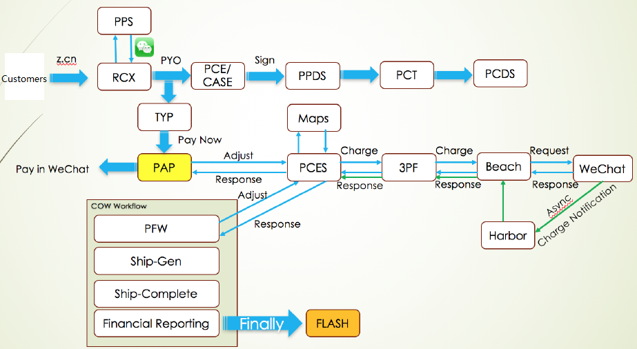
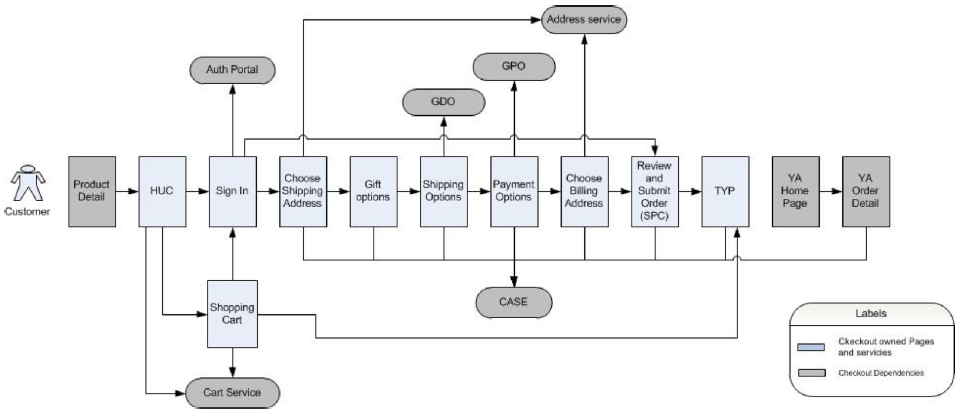
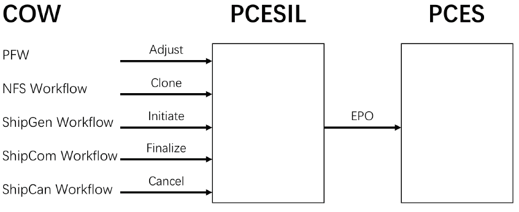
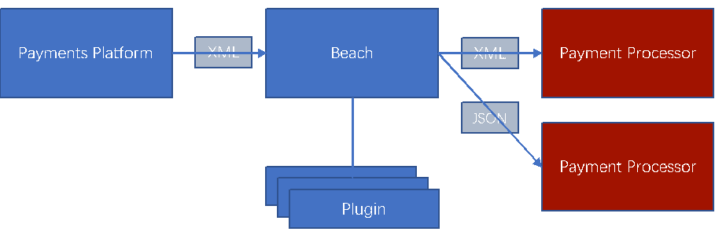
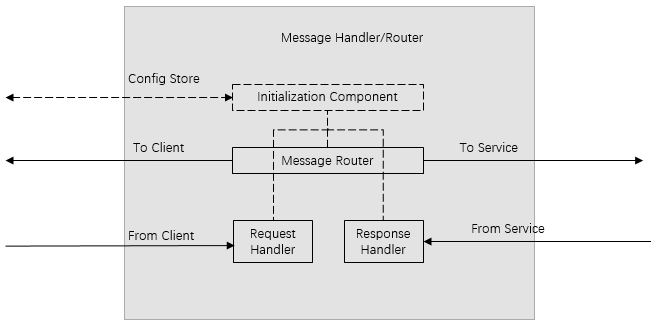
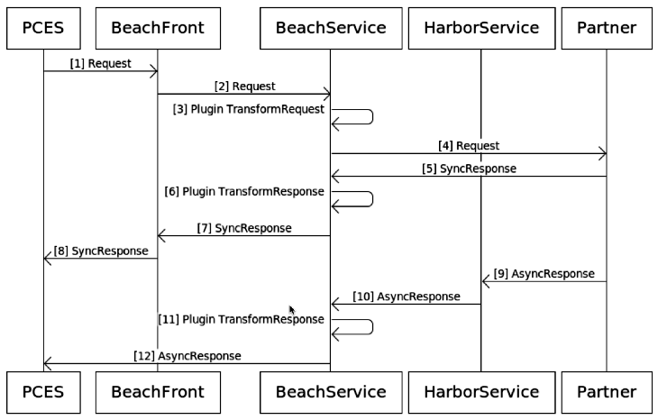
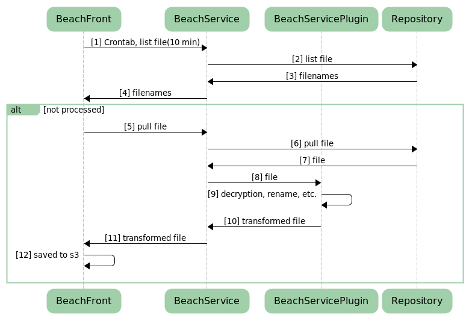
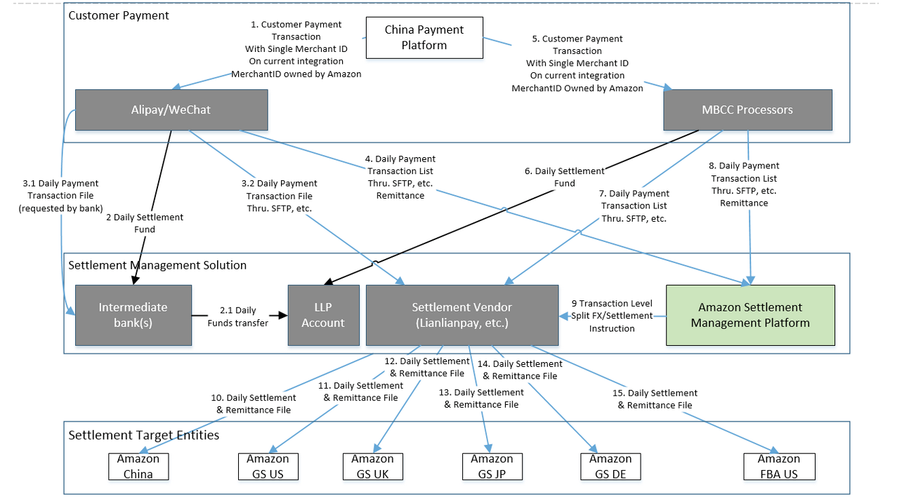
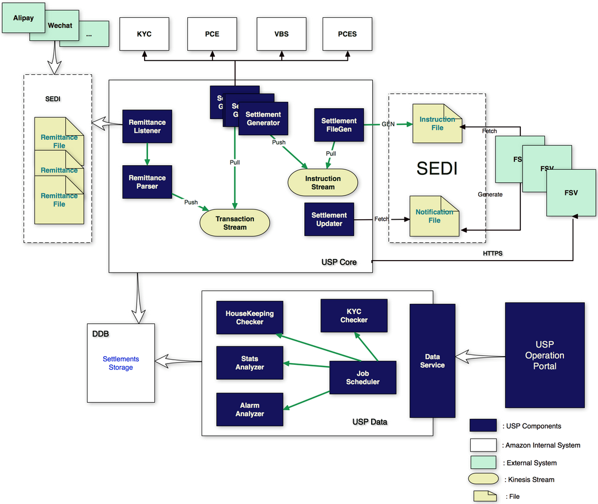
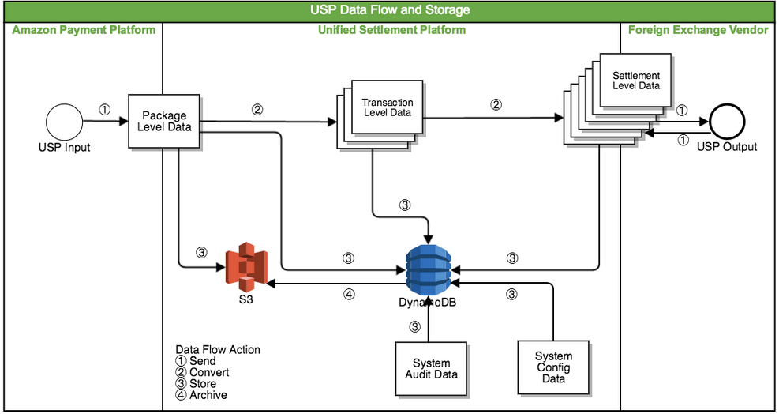

# SYS401 - Financial Technology - 电商订单体系

返回[Bulletin](./bulletin.md)

返回[SYS401 - Financial Technology](./SYS401.md)

[TOC]

## 订单流程

### 订单结算

用户在网上选择商品放入购物车以后，进入结算中心，发起**Checkout**流程（RCX）。

- 先检查登录状态，然后进入一系列Checkout页面。

- 用户选择发货地址、发货时间等信息，系统保存到Purchase Document.

- 用户选择支付方式，系统将价格、支付方式等支付相关信息保存到PCR, 图中示例选择微信支付。

以上为Global checkout流程，对于CN当前没有Gift option和Billing address的概念。

### 订单下单

用户点击PYO(Place Your Order)按钮后发起**下单**流程，后端发起Payment Plan Creation流程。

Payment Plan Creation使用新旧两个平台：

- PPDS (Payment Plan Definition Service)

- PCDS (Payment Contract Definition Service), 新的支付平台，经过旧平台PPDS需要PCT进行格式转化。

然后进入PAP(Payment Action Page), 为用户展示二维码进行Upfront Charge进行支付。

- 支付宝通过访问VBS系统获取。

- 微信支付通过访问PCES系统获取。

### 订单支付

支付操作经过一系列流程后到达Beach，访问微信支付，发起Payment Plan Execution流程。

Payment Execution Creation使用新旧两个平台：

- PPES (Payment Plan Execution Service)

- PCES (Payment Contract Execution Service), 新的支付平台，当前Upfront charge仅使用PCES平台。

#### 相关概念

**Payment Contract**

可以理解成和用户的合同，用来保存用户购买的商品、付款金额、支付方式等信息。

只有Payment Contract ID, 没有实体。

**Payment Contract Revision**

保存Payment Contract所有的详细信息，用户每次对订单的修改都会生成新的Payment Contract Revision, Payment Contract ID用来对其分组。

- Payables
  - 一件商品对应一个Payable, 可以存在多个Payable.
  - 标注有Business Name & Evaluated Business Name (???Retail, ???Marketplace|MFN, etc.) 随着商源而变会有所不同。根据它们可以获取Payable对应的Payable Group.
  - Payable Scope ID即Order ID.

- Selected Payment Option Details (SPOD)
  - 记录支付方式、支付金额和单位等信息。

**Payment Transaction**

记录了交易中的关键步骤，包括：

- Initiate
- Adjust
- Release
- Finalize
- Refund
- Cancel(Upfront Charge不涉及)

#### COW流程

向PCES系统发起**COW**(Customer Order Workflow)。

- 进入**Prefulfillment**阶段。
  - 做Front check判断是否为恶意下单。
    - TRMS系统可以设置多层级的白名单。
  - 在有需要的系统创建Shadow order.
  - 如果是Upfront charge, PCESIL检查是否已经完成支付。

- 进入**NFS**(Notify Fulfillment System)阶段。
  - 向FN(Fulfillment Network)检查是否可以发货。

- 进入**ShipGen**阶段。
  - 计算总计的费用，PCESIL进行initiate/信用卡授权操作。
  - 通知FN可以出库。

- 进入**ShipCom**阶段。
  - 扣款操作，PCESIL进行finalize/信用卡settle操作。
  - 等待收款到达。

- 进入**FRW**(Financial Reporting Workflow)阶段
  - 准备Accounting需要的信息，向FLASH系统进行发送。

### 外联平台

外联平台BEACH连接了电商和第三方。

#### 模式

- **Online实时模式** payment processor plugins use real-time in-memory messaging over HTTP or TCP to communicate with payment partners.
- **Batching对账模式** payment processor plugins use on-disk file-based messaging over SFTP or HTTP to communicate with payment partners.
- **Mixed混合模式** payment processor plugins utilize both online and batching techniques.

#### WeChatPay online流程

**BeachFront**

- JiffyConfig: Partner settings and config can be retrieved and updated at runtime, like endPoint and credentials.

- Beach Message

**BeachService**

- New Plugin: Plugin is responsible for translating messages to/from the partner structure and format.

**HarborService**

- Config to route request to specific plugin.

#### Batch流程

BeachFront controls the workflows

- BeachFront tells BeachService when to list 

- BeachFront tells BeachService to pull a file if it hasn't seen it already

- BeachFront will push a file to BeachService which will then delegate the file down to the plugin

BeachService : service that will talk to the partners SFTP endpoint

- BeachService will list available files from the endpoint

- BeachService will download the files and delegate them to the correct plugins

- BeachService will push files generated from the plugins

Plugin is responsible for translating to and from partner specific formats

BeachBatchController : service that clients use to integrate with Beach for batching Sample

- For instance flash would need to get white listed for the new batches that you will be generating

- After BeachService has processed a batch then that file will become available to BBC and to any client of BBC that is whitelisted to download that batch

## 订单分账系统

订单分账系统USP(Unified Settlement Platform)负责拆分订单中的购物信息，将拆分出的付汇指令发给外汇商，然后由外汇商将款项打入对应的国际商户的账户中。

Receive payment processor (Alipay/WeChat) remittances 

Get payment transactions (including sale, refund, chargeback and fee transactions)

Query and validate the transactions

Split each payment transaction into one or more settlements, and query the information of payment transaction method, order fulfillment marketplaces, the target entities and target currencies.

Send settlement instructions to FX/Settlement vendor(s).

### 立项背景

- 立项前，海外交易对于线上支付的支持较差，仅美国海外商品支持使用支付宝下单。需要对多地商城进行多种支付方式，尤其是支付宝和微信的支持。
- 多种商城的商品混合购买时，目前仅支持使用信用卡。
- 目前负责分账的合作公司为潜在竞争对手（网易宝）。
- 将发货付款改为下单付款。

### 系统处理流程

Alipay & Wechat send remittance file to SEDI by sftp. The first line of remittance file is the total amount, others are individual transactions.

Remittance Listener put it to S3.

Remittance Parser parse it to transactions.

Settlement Generator get and split transactions into instructions by the order info from ordering systems including VBS and PCES.

All information of transaction and instruction is to be transferred as stream by Kinesis. Because Kinesis is expensive and has bug, SQS is to be a better replacement.

Settlement FileGen generate instruction file, and send it to FSV(Foreign Settlement Vendor) such as LLP through SEDI. Compared with HTTPS, SEDI supports more protocol and supports large files better.

After receiving the instruction file, FSV send notification file through SEDI. 

Settlement Updater receive the notification file and update status to database.

Original remittance files and instruction files are stored in database S3.

All information of remittance, transaction and instruction is to be stored into cached database DynamoDB.

