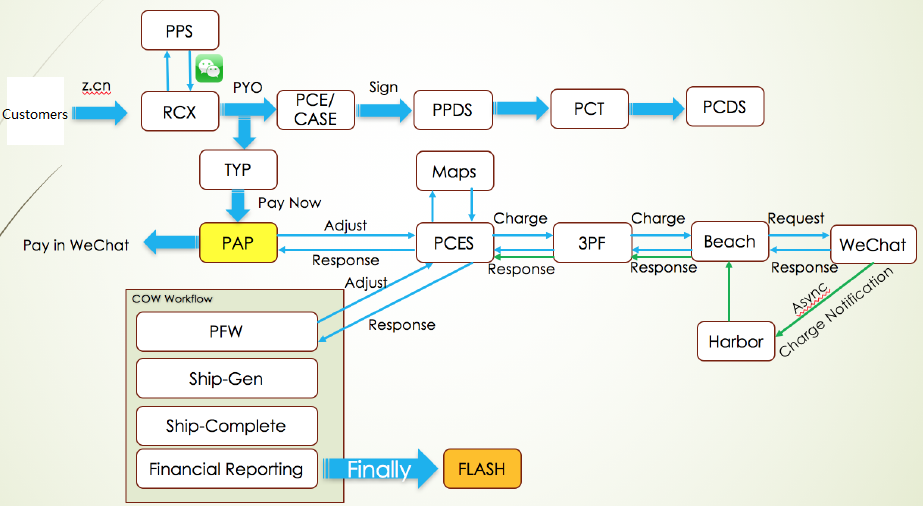
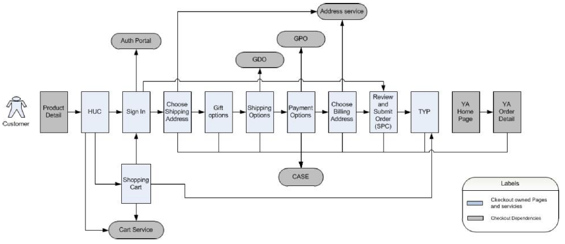
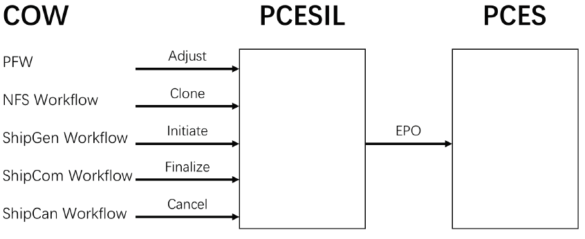
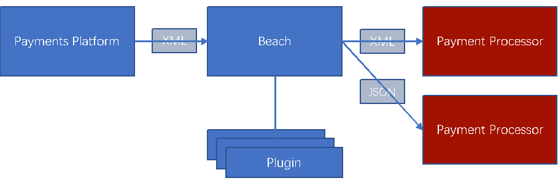
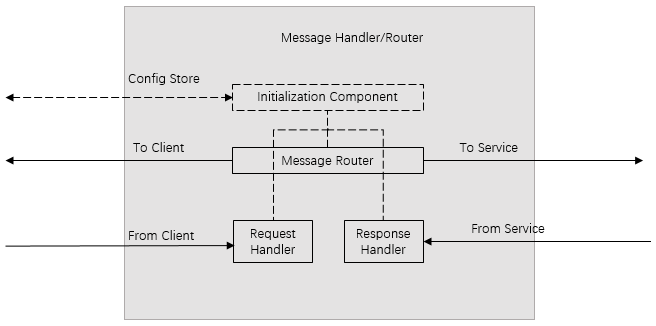
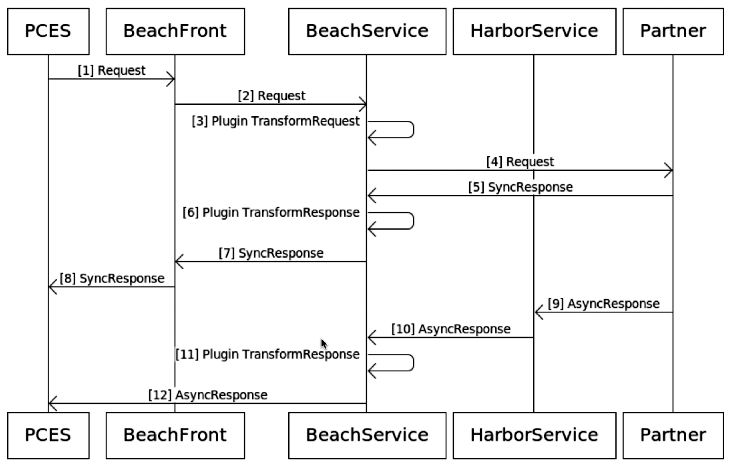
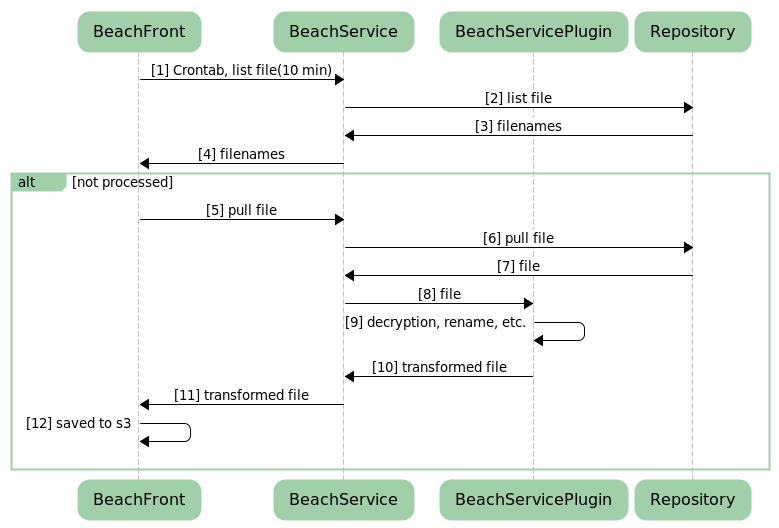

# SYS401 - System Design - Amazon China Checkout

返回[Bulletin](./bulletin.md)

返回[SYS401 - System Design](./SYS401.md)

[TOC]

> 定位：Amazon China Checkout / Payment 业务与技术知识章。本人参与程度相对浅，**不作为核心负责人项目包装**；主要用于恢复真实电商支付链路，并为 USP 提供上游背景。

## 1. Checkout 到 Payment

Checkout 不只是付款页面，而是把购物意图转化成订单和可执行支付计划。

``` text
Customer
 → Cart / Checkout
 → Payment Option
 → Review / Submit
 → Place Order
 → Payment Plan
 → Order / Fulfillment Workflow
 → Payment Execution
 → External Processor
```

### Checkout 前台链路

``` text
Customer
 → Product Detail
 → HUC
    ├→ Sign In ← Auth Portal
    └→ Shopping Cart ← Cart Service
 → Checkout
    → Choose Shipping Address
    → Gift Options（CN 无）
    → Shipping Options
    → Payment Options ← GPO
    → Choose Billing Address（CN 无）
    → Review and Submit Order (SPC)
    → Thank You Page (TYP)
 → YA Home
 → YA Order Detail
```

中国特殊/相关能力：KYC Page、CASE / PCE、GDO、Purchase Document、PCR。

### 订单流程总览



## 2. 已知系统地图

历史资料出现：

- RCX：Checkout / order entry
- PAP：Payment Action Page
- SPC：Review and Submit Order
- TYP：Thank You Page
- GPO：Get Payment Option
- CASE / PCE：Checkout payment capabilities
- PPDS / PCDS：Payment Plan Creation 侧
- COW：Order workflow（精确全称旧笔记有歧义）
- PCES：Payment Contract Execution System
- PPES：legacy Payment Plan Execution
- 3PF：third-party processor / facade layer
- Beach：external payment gateway
- Harbor：Beach asynchronous notification 相关
- SEALS / HOPS：legacy payment execution / transaction 相关

未知缩写不要自行补全。

## 3. Checkout 与 Payment Capability

Checkout 需要根据订单上下文判断哪些支付方式可用：

``` text
Checkout Context
      ↓
Payment Capability
      ↓
Available Payment Options
      ↓
Customer Selection
```

CASE / PCE 等能力存在，但当前资料不支持把其全部规则说成本人设计。

### 订单结算

用户在网上选择商品放入购物车以后，进入结算中心，发起**Checkout**流程（RCX）。

- 先检查登录状态，然后进入一系列Checkout页面。

- 用户选择发货地址、发货时间等信息，系统保存到Purchase Document.

- 用户选择支付方式，系统将价格、支付方式等支付相关信息保存到PCR, 图中示例选择微信支付。

以上为Global checkout流程，对于CN当前没有Gift option和Billing address的概念。



## 4. Payment Plan Creation

Checkout 完成后，支付意图进入 Payment Plan Creation：

``` text
Order / Checkout
 → Selected Payment Method
 → Payment Plan Creation
 → Payment Lifecycle
```

Payment Plan Creation使用新旧两个平台：

- PPDS (Payment Plan Definition Service)

- PCDS (Payment Contract Definition Service), 新的支付平台，经过旧平台PPDS需要PCT进行格式转化。

### 金额/业务粒度

| Level | 范围 | 关联 |
| ---- | ---- | ---- |
| Purchase | 多个 ASC | Payment Contract ID |
| Order | 单个 ASC、多个 package | Payable Scope / Order ID |
| Shipment | 单个 package | Shipment ID |

### 相关概念

**Payment Contract**

可以理解成和用户的合同，用来保存用户购买的商品、付款金额、支付方式等信息。

只有Payment Contract ID, 没有实体。

**Payment Contract Revision**

保存Payment Contract所有的详细信息，用户每次对订单的修改都会生成新的Payment Contract Revision, Payment Contract ID用来对其分组。

- Payables
  - 一件商品对应一个Payable, 可以存在多个Payable.
  - 标注有Business Name & Evaluated Business Name (???Retail, ???Marketplace|MFN, etc.) 随着商源而变会有所不同。根据它们可以获取Payable对应的Payable Group.
  - Payable Scope ID即Order ID.

- Selected Payment Option Details (SPOD)
  - 记录支付方式、支付金额和单位等信息。

**Payment Transaction**

记录了交易中的关键步骤，包括：

- Initiate
- Adjust
- Release
- Finalize
- Refund
- Cancel(Upfront Charge不涉及)

### 微信支付链路

Plan Creation：

``` text
z.cn
 ↓
RCX ↔ PPS（列出可用支付方式）
 ↓ PYO
PCE / CASE
 ↓ Sign
PPDS → PCT → PCDS
 ↓
TYP
```

用户点击PYO(Place Your Order)按钮后发起**下单**流程，后端发起Payment Plan Creation流程。然后进入PAP(Payment Action Page), 为用户展示二维码进行Upfront Charge进行支付。

- 支付宝通过访问VBS系统获取。

- 微信支付通过访问PCES系统获取。

用户支付：

``` text
TYP → Pay Now → PAP（二维码）→ Adjust → PCES → charge → 3PF → Beach → WeChat
```

响应沿原路返回。支付操作经过一系列流程后到达Beach，访问微信支付，发起Payment Plan Execution流程。Payment Execution Creation使用新旧两个平台：

- PPES (Payment Plan Execution Service)

- PCES (Payment Contract Execution Service), 新的支付平台，当前Upfront charge仅使用PCES平台。

同时存在异步通知路径：

``` text
WeChat → async notification → Harbor → Beach / Amazon Payment
```

Harbor 负责异步 Charge Notification。

具体对象模型、接口和本人代码 Ownership 尚未完全恢复。

## 5. Order Workflow 与 Payment Execution

端到端资料支持：

``` text
Amazon.cn Checkout
 → Payment Plan Creation
 → Order / COW / Fulfillment
 → Adjust / Initiate / Finalize / Refund
 → PCES / legacy PPES
 → 3PF / Beach
 → Alipay / WeChat / Processor
```

核心认知：**Order lifecycle 和 Payment lifecycle 相互关联，但不是同一个东西。**

### Order Workflow 主线

``` text
选择商品
 ↓
Shopping Cart
 ↓
Checkout / RCX
 ↓
PurchaseDocument / PCR
 ↓
选择地址 / 时间 / 支付方式
 ↓
Place Order
 ├─ Alipay Redirect URL → VBS
 └─ WeChat Redirect URL → PCES
 ↓
COW (Customer Order Workflow)
 ↓
Herd Workflow
 ↓
SIL
 ↓
Prefulfillment
 ↓
Notify Fulfillment System
 ↓
Fulfillment Network
 ↓
ShipGen
 ↓
ShipCom
 ↓
Financial Reporting Workflow
 ↓
FLASH
```

### COW流程

向PCES系统发起**COW**(Customer Order Workflow)。

- 进入**Prefulfillment**阶段。
  - 做Front check判断是否为恶意下单。
    - TRMS系统可以设置多层级的白名单。
  - 在有需要的系统创建Shadow order.
  - 如果是Upfront charge, PCESIL检查是否已经完成支付。

- 进入**NFS**(Notify Fulfillment System)阶段。
  - 向FN(Fulfillment Network)检查是否可以发货。

- 进入**ShipGen**阶段。
  - 计算总计的费用，PCESIL进行initiate/信用卡授权操作。
  - 通知FN可以出库。

- 进入**ShipCom**阶段。
  - 扣款操作，PCESIL进行finalize/信用卡settle操作。
  - 等待收款到达。

- 进入**FRW**(Financial Reporting Workflow)阶段
  - 准备Accounting需要的信息，向FLASH系统进行发送。



其中 Herd 运行 workflow（类似状态图），通过 SIL 决定下一步。各阶段与支付操作的映射：Prefulfillment 可对支付系统发 Adjust / 查询是否支付完成，也可能 Release；ShipGen 对支付系统发 Initiate（信用卡语义可类比 Auth）；ShipCom 发 Finalize（信用卡语义可类比 Settle/Capture）。

### PCESIL：订单语言到支付语言的适配层

PCESIL 是 COW 与 PCES 之间的适配层：

``` text
COW Event          PCES Operation
----------------   ---------------
PFW          →     Adjust
NFW          →     Clone
ShipGen      →     Initiate
ShipCom      →     Finalize
ShipCan      →     Cancel
                    ↓
                   EPO
                    ↓
                   PCES
```

架构理解：Order/Fulfillment 说的是"发货、取消、履约完成"等业务语言；PCES 处理的是 payment operation。PCESIL 把前者转换成后者。可以用 Adapter / Anti-Corruption Layer 帮助理解，但这些模式名是后验工程解释，不是原材料中的官方命名。

## 6. 外联平台 Beach / Harbor

外联平台BEACH连接了电商和第三方。



### 模式

- **Online实时模式** payment processor plugins use real-time in-memory messaging over HTTP or TCP to communicate with payment partners.
- **Batching对账模式** payment processor plugins use on-disk file-based messaging over SFTP or HTTP to communicate with payment partners.
- **Mixed混合模式** payment processor plugins utilize both online and batching techniques.

Beach 连外界，安全/加密要求高。Harbor 处理外部异步 notification，例如 WeChat Charge Notification。

### WeChatPay online流程

**BeachFront**

- JiffyConfig: Partner settings and config can be retrieved and updated at runtime, like endPoint and credentials.

- Beach Message

**BeachService**

- New Plugin: Plugin is responsible for translating messages to/from the partner structure and format.



**HarborService**

- Config to route request to specific plugin.



### Batch流程

BeachFront controls the workflows

- BeachFront tells BeachService when to list

- BeachFront tells BeachService to pull a file if it hasn't seen it already

- BeachFront will push a file to BeachService which will then delegate the file down to the plugin

BeachService : service that will talk to the partners SFTP endpoint

- BeachService will list available files from the endpoint

- BeachService will download the files and delegate them to the correct plugins

- BeachService will push files generated from the plugins

Plugin is responsible for translating to and from partner specific formats

BeachBatchController : service that clients use to integrate with Beach for batching Sample

- For instance flash would need to get white listed for the new batches that you will be generating

- After BeachService has processed a batch then that file will become available to BBC and to any client of BBC that is whitelisted to download that batch



## 7. 外部支付的可靠性

外部支付不是只有同步响应：

``` text
Amazon → Processor
          ↓
     Payment Processed
          ↓
 Response Lost / Delayed
```

因此要理解 Timeout、Outcome Unknown、Retry、Duplicate、Async Notification、Refund 等问题。但具体幂等键、重试策略和状态机若无项目证据，不反写成历史事实。

## 8. Refund

退款属于支付逆向流程：

`Order Event → Refund Request → Payment System → Processor → Refund Result`

订单侧退款链路：

``` text
CROW → CROWSIL → Refund Workflow → RRA Workflow → FLASH
```

USP 资料中也存在 SALE / REFUND processor transaction，因此退款还会进一步影响后端 Settlement。退款贯穿：

``` text
Order Refund → Payment Refund → Processor Refund Transaction → USP Settlement / Reconciliation
```

具体跨系统关联 key 仍待恢复。

## 9. Checkout / Payment 与 USP

``` text
Customer
 → Checkout
 → Payment Plan / Order Workflow
 → Payment Execution
 → Processor
 → Customer Payment
 =========================
 Payment / Settlement Boundary
 =========================
 → Processor Remittance
 → USP
 → Settlement
```

**Payment**：消费者怎么付款。
**Settlement**：Amazon 收到 Processor 的资金和交易数据后，如何拆分、换汇并结算到目标实体。

USP 不是 Checkout 的一个简单同步子调用。真正关系更像：

``` text
Consumer Payment Lifecycle
        ↓
Processor Transactions / Funds
        ↓
Settlement Lifecycle
```

## 10. Ownership

**可以说**：Amazon 早期接触过 China Checkout / Payment；理解 Checkout、Payment Plan、Order Workflow、Payment Execution、Processor 的大体关系；这些经历帮助理解 USP 上游交易如何产生。

**不要说**：负责整个 Amazon China Checkout；设计 PCES/Payment Plan；主导支付宝/微信接入；设计 Beach/Harbor 或 Checkout 高可用架构。

## 11. 60 秒项目介绍

> 我在 Amazon 早期接触过 China Checkout 和 Payment 体系，但这不是我当时 Ownership 最强的项目，所以不会包装成核心负责人。我的理解是 Checkout 先确定订单和可用支付方式并形成 Payment Plan，订单和履约流程再驱动 Payment Execution，通过内部支付系统和 gateway 调用支付宝、微信等 Processor。支付完成以后还有退款和异步通知等生命周期。这段经历最重要的价值，是让我理解消费者 Payment Transaction 怎么产生，而我真正持续参与的 USP 则接在支付链路之后负责 Settlement。

## 12. 面试重点

Checkout vs Payment；Payment Plan；Order Workflow vs Payment Lifecycle；为什么不能只依赖同步响应；Timeout 后为什么 Unknown；Refund 如何影响 Settlement；Payment vs Settlement；个人参与边界。

## Appendix — Legacy Systems

### PPES / SEALS / HOPS / VBS

旧信用卡路径：

``` text
PPES ⇔ SEALS ⇔ Beach ⇔ Vendor
```

PCES 不支持的 payment method 会路由到 SEALS：`PCES Route PO → SEALS`。HOPS 保存/查询 SEALS Transaction；VBS 不是 HOPS，有独立 VBS Query。

PPES、SEALS、HOPS、UFC、PFW/NFW/CROW、MAPS/BPAS/MPAS 等历史系统缩写保留用于恢复系统地图，不要求逐个背诵。这部分主要用于理解新旧支付平台兼容，不应抢占 USP 面试主线。

### Processor Selection / MAPS

Processor routing 维度包括：

``` text
paymentMethod Type
 → Issuer
 → Currency
 → operationType
 → Bank / CardType / paymentSource / Ledger
 → concrete Processor
```

例：CMB debit → CUP processor；CMB credit → CMB MBCC processor；China External Payment / WeChat → WeChatPay processor；OverRefund → GCRefund。

不要死背具体 processor 后缀，重点理解：Payment execution 与具体外部支付渠道之间还有一层规则化 processor selection/routing。

### EPO 在 PCES 中的执行链

EPO = Execute Payment Operation。当前笔记恢复的完整顺序：

``` text
1. Create Payment Operation (PO)
2. Start EPO workflow
3. Route PO（PCES 不支持的 method → SEALS）
4. Start EPO_PCES workflow
5. Load / Create Payment Transaction (PT)
6. Execute Payment Instruction Activities（EPG）
7. Create Payment Execution (PE) and execute（Real / Virtual）
8. Set Payment Processor Selection（BPAS / MPAS）
9. Invoke Payment Processor（3PF）
10. Register Payment Execution（PER）
11. Build Legacy Payment Transaction
12. EPO Response（SEALS Transaction）
```

记忆抽象：`PO = 我要做什么支付动作 → PT = 这次支付业务交易 → Payment Instruction / EPG → PE = 实际执行单元 → Processor`。这只是便于理解的抽象，具体对象生命周期以后续源码为准。

### EPG（Execution Plan Generator）

Payables 按 EBN 分组形成 Payable Group（Retail / AGS 等），再生成 Effective PO Type、Amount To Execute、Payment Instruction，最终落到 Payment Execution。

旧笔记强调：为了只生成一个 Payment Execution，需要统一 EBN，才能统一 Payment Group。SPOD 在 EPG 资料中出现，但全称/完整语义当前未知。
