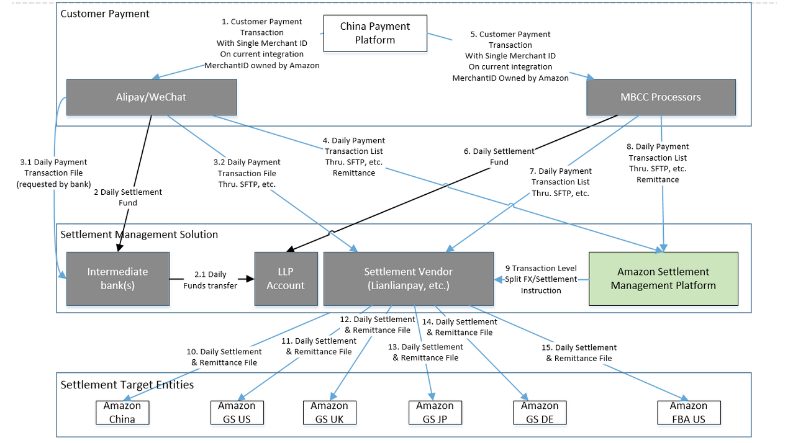
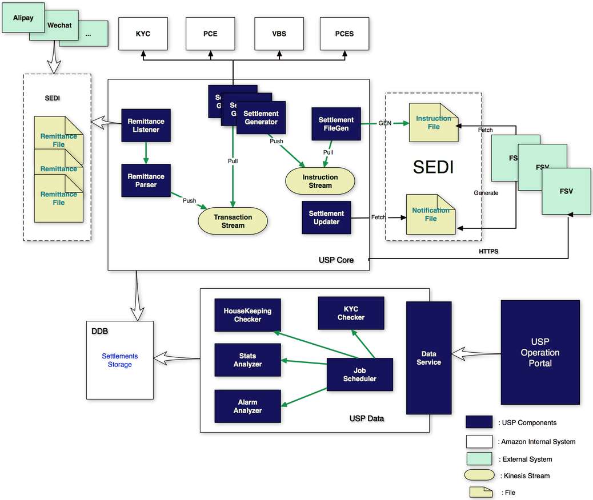
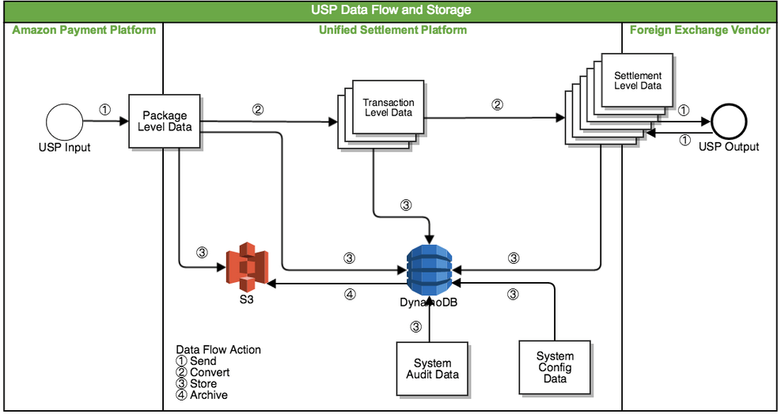

# SYS401 - System Design - Amazon China Unified Settlement Platform

返回[Bulletin](./bulletin.md)

返回[SYS401 - System Design](./SYS401.md)

[TOC]

> 定位：Amazon China Unified Settlement Platform 项目知识章。USP 是本人 Amazon 阶段**明确确认全程参与、最核心的项目**。
> 纪律：完整解释系统业务和架构没有问题，但尚未证明由本人亲自设计/实现的组件，只说"系统里有 / 当时整体架构是 / 我接触和理解到"。

## 1. USP 一句话

订单分账系统USP(Unified Settlement Platform)负责拆分订单中的购物信息，将拆分出的付汇指令发给外汇商，然后由外汇商将款项打入对应的国际商户的账户中。

USP 接收支付宝、微信等 Payment Processor 的 remittance / transaction 数据，将 payment transaction 与 Amazon 内部订单、履约 marketplace、目标法人实体和目标币种关联、校验，再把一笔 transaction 拆成一个或多个 settlement instructions，交给 FX / Settlement Vendor 完成换汇和资金划拨。

- Receive payment processor (Alipay/WeChat) remittances
- Get payment transactions (including sale, refund, chargeback and fee transactions)
- Query and validate the transactions
- Split each payment transaction into one or more settlements, and query the information of payment transaction method, order fulfillment marketplaces, the target entities and target currencies.
- Send settlement instructions to FX/Settlement vendor(s).



核心思想：

> **Decouple consumer payment from settlement workflow.**

## 2. Payment vs Settlement

``` text
Payment:
Customer → Checkout → Payment Execution → Alipay / WeChat

Settlement:
Processor Transaction / Remittance
 → USP
 → Validate / Split
 → Settlement Instructions
 → FX / Settlement Vendor
 → Amazon Entities
```

Payment 回答"消费者怎么付钱"；Settlement 回答"Amazon 收到钱后，最终如何把资金正确结算到不同实体和币种"。

材料明确画出的目标实体包括：Amazon China、Amazon GS US / GS UK / GS JP / GS DE、Amazon FBA US。Settlement Vendor 按 USP 指令 split RMB settlement、FX、disburse 到对应 Amazon entity bank account。

## 3. 为什么需要 USP

消费者看到"一次购物车、一次支付"，Amazon 内部却可能对应多个 order、shipment、Seller of Record、Global Store arc、legal entity 和 target currency。

``` text
Customer 视角：一次购物车，一次支付
Amazon 内部：多个 order / shipment / Seller of Record /
             Global Store arc / legal entity / target currency
```

如果让 Processor 理解 Amazon 内部全部拆分规则，会高度耦合。

``` text
Consumer Payment
       │
       X  decouple
       │
Settlement Workflow
```

Processor 负责收款和 transaction/remittance；USP 恢复 Amazon 内部业务归属并生成结算指令。

### 立项背景

- 2015-10 China Global Store 在 Amazon.cn 上线，用户可使用 credit/debit card 购买 Global Store ASIN。
- 2016-05 Alipay 作为 redirect payment method 上线，用于部分 US selection。
- Global Store 希望实现 **Payment Parity**：US / EU / JP / DE 等不同 Global Store arcs 都能支持 credit/debit card、Alipay、WeChat。
- 立项前，海外交易对于线上支付的支持较差，仅美国海外商品支持使用支付宝下单。需要对多地商城进行多种支付方式，尤其是支付宝和微信的支持。
- 多种商城的商品混合购买时，目前仅支持使用信用卡（Alipay/WeChat API 当时无法自然支持 mixed cart checkout）。
- 目前负责分账的合作公司为潜在竞争对手（网易宝，Mitigation of business continuity risk）。
- 将发货付款改为下单付款。

## 4. 端到端链路

``` text
Customer
 → Amazon.cn Checkout
 → Payment Plan
 → Order / Fulfillment
 → PCES / Payment Execution
 → 3PF / Beach
 → Alipay / WeChat
 → Payment + Remittance
 ================= PAYMENT / SETTLEMENT BOUNDARY ================
 → SEDI / Remittance File
 → USP
    ├─ Listener / Parser
    ├─ Transaction
    ├─ Internal Query / Validation
    ├─ Settlement Generator
    ├─ Settlement / Execution
    └─ FileGen / Transmit
 → FSV / Settlement Vendor
 → FX + Split + Disbursement
 → Amazon Entities
 → Notification / Reconciliation
 → Settlement Updater / Event Receiver
```

## 5. Domain Model

Processor transaction 类型已知包括 SALE、REFUND、CHARGEBACK、FEE。

``` text
1 Remittance Package
        ↓
N Payment Transactions
        ↓
Each Transaction
        ↓
1..N Settlements
```

拆分依据包括 covered orders、fulfillment marketplace、target entity、target currency、payment method / transaction type 等内部业务信息。

**Split 不是简单"拆订单"**，而是从 Processor 交易恢复资金的 Amazon 内部业务归属。概念例（仅用于理解，不代表真实生产样例）：

``` text
Alipay Transaction: CNY 1000
        ├─ Amazon GS US → USD
        └─ Amazon GS UK → GBP
```

Settlement 粒度可以因 payment method 不同而不同，例如 purchase level、order level、shipment level。

### Settlement 真实字段（样例）

| 分组 | 字段 |
| ---- | ---- |
| Source 侧 | SourcePackageId、SourcePackageProvider（ALIPAY 等）、SourcePaymentTransactionId、SourcePaymentTransactionType（SALE/REFUND 等）、SourceDepositBankTransferId |
| Amazon 业务侧 | AmazonOrderId、AmazonSellerId、AmazonSellingMarketplaceId、AmazonFulfillmentMarketplaceId、AmazonAccountingMatchKey、AmazonKycEligible |
| Settlement 目标侧 | SettlementAmount、SettlementLocalCurrency、SettlementTargetCurrency、SettlementPaymentProcessorFee、SettlementProductGl、SettlementDisbursementBankSecuredAccount、TargetFsv |
| 状态与执行 | SettlementStatus、SettlementSubmitActionType、LatestExecutionId、LatestExecutionStatus、LatestRevision、SettlementExecutions[]、PendingReasons[]、creationDate、updateDate、version |

## 6. 核心架构

USP Core 已知：Remittance Listener、Parser、Settlement Generator、FileGen、Updater、Transaction Stream、Instruction Stream。

USP Data 已知：Job Scheduler、HouseKeeping Checker、KYC Checker、Stats Analyzer、Alarm Analyzer、Data Service。

另有 USP Operation Portal，供运营/运维查看和操作 USP 数据。

USP Phase 1 项目代号 **Kungfu**：支持 Alipay / WeChat，Settlement Vendor 为 LLP，Scope 包括 USP instrument handling 和 USP Portal。System Design Task 中明确出现 Instrument Generation [Alipay] / [WeChat]、Data Model Design、API Design、Fee Calculation Design、KYC Design。

系统存在这些能力，不等于当前资料已证明每个组件都是本人设计。

## 7. Remittance → Transaction

Alipay & WeChat send remittance file to SEDI by sftp. The first line of remittance file is the total amount, others are individual transactions.

``` text
Alipay / WeChat
 → SFTP / SEDI
 → Remittance Listener
 → S3 / Package Storage
 → Remittance Parser
 → Payment Transactions
```

Remittance Listener put it to S3. S3 主要承担文件/package 原始数据和归档，不应称为主在线数据库。

Package 被解析为 transaction-level data，形成 Package → Transaction → Settlement 三层数据。



## 8. Kinesis 与 SQS

早期架构：

`Parser → Transaction Stream (Kinesis) → Settlement Generator`

All information of transaction and instruction is to be transferred as stream by Kinesis.

后续代码笔记：

`Transaction Manager → generate transaction → SQS`

因此可以说不同资料中存在 Kinesis 与 SQS，且高度疑似有架构演进；**不能直接说"我把 Kinesis 迁移成 SQS"**，除非找到个人 Ownership 证据。

证据链：早期架构图 Transaction/Instruction Stream = Kinesis；PPT speaker notes 写有 "Kinesis VS SQS"；个人旧笔记记载 Kinesis expensive and has bug，SQS is a better replacement；后续代码笔记 Transaction Manager / Settlement Manager → SQS。尚缺 exact timeline、migration design、bug detail、cost data、ownership。

### 面试停止线

如果问"为什么 SQS 更适合"，可以先从通用知识解释需求匹配：

- USP 更像 task/message processing，而非大规模 replayable event analytics；
- SQS 的 queue / visibility timeout / retry 语义可能更贴近工作分发；
- Kinesis 更适合 ordered stream / shard / replay 场景。

但必须明确：

> "这是我现在基于两类中间件特性的技术理解；当年项目具体决策原因我还在根据旧资料恢复，能够确认的是项目材料确实记录了 Kinesis vs SQS 的讨论以及后续 SQS 使用。"

## 9. Settlement Generator

Settlement Generator get and split transactions into instructions by the order info from ordering systems including VBS and PCES.

``` text
Transaction
 → Query Amazon Internal Systems
 → Validate
 → Order / Fulfillment / Entity / Currency
 → Split
 → Settlement Instructions
```

历史资料出现 VBS、PCES 等内部系统。各系统精确查询职责仍以原设计文档为准。

## 10. Instruction → Vendor

``` text
Settlement Generator
 → Instruction Stream
 → Settlement FileGen
 → Instruction File
 → SEDI
 → FSV
 → FX / Split / Disbursement
```

Settlement FileGen generate instruction file, and send it to FSV(Foreign Settlement Vendor) such as LLP through SEDI. Compared with HTTPS, SEDI supports more protocol and supports large files better.

Phase 1 / Kungfu 的 Settlement Vendor 为 LLP（Lianlian Pay）。

## 11. Notification / Reconciliation

After receiving the instruction file, FSV send notification file through SEDI.

``` text
FSV
 → Notification
 → SEDI / other integration
 → SettlementEventReceiver / Updater
 → Settlement State
```

Settlement Updater receive the notification file and update status to database.

资料同时出现 file 与 HTTPS 路径（架构图中 FSV 与 USP Core 之间也画有 HTTPS 路径），具体用途未完全确认时不强行定论。

## 12. Storage

### S3

Original remittance files and instruction files are stored in database S3.

原始 remittance/package、文件类输入输出和 archive。Package Level Data 存入 S3，数据也可以从 DynamoDB archive 到 S3。

### DynamoDB

All information of remittance, transaction and instruction is to be stored into cached database DynamoDB.

资料明确出现 Package、Transaction、Settlement、Audit、Config 数据以及 Settlements Storage（架构图直接标注 DDB --- Settlements Storage），因此更适合称为 USP operational datastore / settlement storage——个人旧笔记记为 "cached database"，属于当时口径，不是准确的架构定位。

Partition Key、Sort Key、GSI/LSI、conditional update、TTL、consistency mode 当前未知，不能编造。



## 13. Settlement / Execution / Event

真实字段显示 Settlement 下存在 executions、latest execution、revision、events、pending reasons 等：

``` text
Settlement
 └─ SettlementExecutions[]
       ├─ SettlementExecutionId
       ├─ Revision
       ├─ SettlementExecutionStatus
       └─ SettlementEvents[]
             ├─ externalSettlementEventId
             ├─ settlementEventCode
             ├─ settlementEventDate
             ├─ settlementEventDetail
             └─ settlementState
```

已见事件：SETTLEMENT_RECEIVED、SETTLEMENT_RECONCILIATION_FAILED。已见状态：PENDING、DISPATCHED、SettlementReceived、SettlementPermanentFailed。

真实失败示例：

> reconciliation settlement pretreatment failed, sale amount less than accumulated refund amount

这说明 sale/refund 之间存在业务约束，reconciliation 会发现"累计退款超过 sale"等不一致。

当前强推断：

``` text
Settlement = 稳定业务结算身份
Execution  = 一次实际提交/重试尝试
Event      = Vendor/System 对 execution 的反馈
```

这是模型恢复，仍需 Java model / design document 最终验证。

## 14. Reliability & Recovery

系统已知存在 PendingSettlementRedriver、resubmit、cancel、check rules、alarm、metrics、housekeeping、reconciliation。

``` text
Failure
 → Persist State
 → Business Validation
 → Can Retry?
      ├─ Yes → Redrive → New Execution
      └─ No/Uncertain → Alarm / Manual Resubmit / Cancel
 → Reconciliation / State Update
```

资金系统不能简单"失败就无限 retry"。某些异常必须先做业务校验，另一些需要可审计的人工补偿。

## 15. Check Rules

已知 Deposit Check Rule、RF Check Rule、Pending Instruction Check Rule：

| Rule | 校验对象/目的 |
| ---- | ---- |
| Deposit Check Rule | Deposit 总金额与实际金额一致性 |
| RF Check Rule | Remittance File 合法性/一致性 |
| Pending Instruction Check Rule | pending settlement 是否可发/重发 |

说明可靠性不只是技术重试，还包括业务合法性判断。

## 16. Managers / Repository

已恢复的职责包括：

- Remittance File Manager：保存 RF、状态、notification/event；
- Transaction Manager：generate transaction、send to SQS；
- Settlement Manager：instruction、execution、pending/dispatched、validation、redrive、notification、alarm/log；
- Settlement Instruction Transmit Manager：transmit instruction；
- Repository：按 ID、Order、Pending、Dispatched 等维度查询。

一条代码视角的 USP 链路：

``` text
WeChat RF / InputStream
 → WeChatStandardRemittanceFileFetcher / RFFactoryImpl
 → RemittanceFileAnalyzer
 → Remittance File Manager（RF / Deposit Check）
 → Transaction Manager（Repository / SQS / TransactionStreamGenerator）
 → SettlementContentFactoryRegistry（Alipay SC Factory / General SC Factory）
 → Settlement Manager（create instruction / create execution / pending check）
 → SQS / SettlementStream / File
 → Settlement Instruction Transmit Manager
 → FSV Gateway / SEDI / FSV
 → SettlementEventReceiver（instruction / bill notification）
 → Settlement status / FSV fund data
      ├─ PendingSettlementRedriver
      └─ Resubmit / Cancel Activity
```

这说明资金系统必须**可查询、可恢复、可重投**，而不是只有 happy path。

## 17. 自动恢复 + 人工补偿

``` text
PendingSettlementRedriver → Automatic Recovery
Resubmit / Cancel Activity → Controlled Manual Compensation
```

能安全自动恢复的自动恢复；不能自动判断的异常需要可控、可审计的操作入口（ResubmitSettlementsByIdActivity、CancelPackageInFsvByIdActivity）。

## 18. Reconciliation

资料存在 reconciliation failure，以及 sale/refund 业务约束异常。对账至少涉及外部结果、内部 Settlement 状态、sale/refund 关系、资金结果、异常识别与修复。精确算法当前仍待确认。

Refund 与原 Sale 存在业务关联，系统需要防止不合理退款累计；reconciliation 不只是文件数量对账，而可能涉及 transaction/settlement 业务语义。

## 19. Observability / Operations

已知存在 Portal、Stats Analyzer、Alarm Analyzer、HouseKeeping、Job Scheduler、Metrics、Log、Alarm、Manual Resubmit/Cancel。

核心：

`Runtime + Observability + Operability + Recovery`

资金系统不仅要正常处理，还必须知道哪笔失败、失败在哪、能否重试、如何人工处理以及最终资金状态。

## 20. AWS 技术栈

资料支持 S3、DynamoDB、Kinesis、SQS。可以说系统使用 AWS 存储和异步基础设施处理文件、在线状态以及 transaction/settlement processing。

不要编造 DynamoDB key、Exactly Once、Kinesis shard、SQS FIFO、TPS，也不要未经证据声称本人主导 Kinesis→SQS。

## 21. Ownership

**已确认**：USP 是本人 Amazon 阶段核心项目，本人全程参与，可以作为 Amazon 主项目介绍。

**系统存在但当前未确认本人设计**：Kinesis streams、SQS migration、DynamoDB schema、S3 archive、PendingSettlementRedriver、EventReceiver、Settlement Manager/Repository/Factory、Portal、KYC、Fee Calculation、PCES/Beach/COW。

**仍待恢复**：本人具体 Java package/class/API、精确状态机、idempotency key、DynamoDB schema、reconciliation 算法、生产规模/TPS/latency/amount。

## 22. 60--90 秒项目介绍

> 我在 Amazon China 早期最主要参与的是 Unified Settlement Platform，也就是 USP。它解决 Global Store 场景里消费者支付和后端跨境结算解耦的问题。消费者可能通过支付宝或微信一次支付，但 Amazon 内部可能对应多个订单、履约 marketplace、法人实体和目标币种，所以不能让支付 Processor 理解所有内部拆分规则。Processor 收款后提供 remittance 和 sale、refund 等 transaction，USP 再结合内部订单、履约、entity 和 currency 信息，把一笔 transaction 拆成一个或多个 settlement instructions，交给 FX/Settlement Vendor 做换汇和资金划拨。系统涉及 S3、DynamoDB、Kinesis/SQS、文件交换、状态持久化、reconciliation、redrive、告警和人工补偿。我当时职业阶段比较早，所以会严格区分整个系统能力和已经确认的个人 Ownership。

## 23. 面试重点

P0：Payment vs Settlement；为什么 USP；Package→Transaction→Settlement；为什么一笔 transaction 拆多个 settlement；S3 vs DynamoDB；Kinesis/SQS；Pending recovery；reconciliation；自动 redrive vs manual resubmit；个人 Ownership。

P1：Settlement/Execution/Event；Check Rule；幂等通用设计（注明真实实现待确认）；DynamoDB 设计题（不伪装历史 schema）；Kinesis vs SQS trade-off；文件交换；状态机设计。

### 追问地图

- 业务：为什么需要 USP；Payment 和 Settlement 区别；为什么一笔 transaction 拆多个 settlement；mixed cart 为什么让 settlement 变复杂；SOR/entity/currency 怎么影响 split；Refund 怎么关联 Sale。
- 架构：为什么外部用 file 内部用 stream/queue；SEDI 为什么存在；为什么 S3 + DynamoDB；Kinesis 与 SQS 怎么选；FSV 挂了怎么办；notification 丢了怎么办。
- 一致性：如何防重复 settlement；retry 会不会重复打款；pending 为什么需要 redrive；execution/revision 有什么意义；reconciliation 在解决什么；refund 先于 sale 到达怎么办。
- 数据：Package/Transaction/Settlement 为什么分三层；DynamoDB key 怎么设计；如何按 order id 查 settlement；如何保存状态历史；原始文件为什么还要保留。
- 运维：怎么查一笔钱；怎么发现卡住的 settlement；如何人工 resubmit；哪些错误可以自动 retry，哪些应该 permanent fail；Portal/alarm/metrics 如何协作。

### 记忆主线

1. **Payment 是消费者怎么付钱；Settlement 是 Amazon 收到钱以后怎么把钱正确分到各个实体。**
2. **USP 的核心价值是把 Consumer Payment 与 Settlement Workflow 解耦。**
3. **数据主线是 Package → Transaction → Settlement。**
4. **系统主线是 Processor → SEDI → USP → FSV → Amazon Entity。**
5. **技术主线是文件 + 异步消息/stream + S3 + DynamoDB + 状态持久化 + reconciliation + redrive。**
6. **面试永远区分"系统怎么做"和"我本人做了什么"，职业早期项目宁可准确，也不要过度包装。**

## 24. 如果今天重新设计

本节只能作为**现代系统设计推演**：

`Requirements → Domain Model → Idempotency → State Machine → Durable Storage → Async Messaging → Retry/Backoff → Manual Recovery → Reconciliation → Audit → Observability → Security/DR`

面试必须明确："这是今天让我重新设计会怎么考虑，不代表 2017 年 USP 当时就是这样实现。"

## Appendix — Fact Discipline & Abbreviations

### Fact Discipline

始终保持：

`Confirmed Personal Ownership > Confirmed System Fact > Historical Note/Memory > Engineering Inference`

不能因为一个方案工程上合理，就反写成 Amazon 当年的项目事实。不可直接宣称：Exactly-once、2PC、DynamoDB conditional write 做幂等、具体 idempotency key、retry/backoff 参数、DLQ、Saga、Outbox——除非后续材料证明。

### 缩写表

| 缩写 | 当前含义 |
| ---- | ---- |
| USP | Unified Settlement Platform |
| FSV | Foreign/Fund Settlement Vendor（旧资料两种写法，核心指外汇/资金结算供应商） |
| LLP | Lianlian Pay，Phase 1 Settlement Vendor |
| RF | Remittance File |
| SC | Settlement Content |
| SEDI | 文件交换基础设施；全称待确认 |
| PCES | Payment Contract Execution System |
| PCESIL | COW 与 PCES 间适配层 |
| PPDS / PCDS | Payment Plan Creation 侧 |
| PPES | legacy Payment Plan Execution |
| PPS | Payment Plan Service |
| PCR | Payment Contract Revision / Relation；旧笔记存在上下文混用 |
| PO / PT / PE | Payment Operation / Payment Transaction / Payment Execution |
| PER | Payment Execution 注册后的内部虚拟 Account（旧笔记口径） |
| EPO | Execute Payment Operation |
| EPG | Execution Plan Generator |
| EBN | Evaluated Business Name |
| SPOD | 全称待确认 |
| 3PF | Payment Processor Facade / third-party processor layer |
| BPAS / MPAS | Processor selection 服务 |
| MAPS | Processor routing/config UI |
| COW | Customer/Custom Order Workflow（旧笔记两种写法，待原文确认） |
| PFW / NFW | Pre-Fulfillment Workflow / Notify Fulfillment Workflow |
| CROW | Customer Refund Order Workflow |
| RRA | Retail Refund Accounts |
| SIL | Service Integration Layer |
| RCX | Checkout / order entry |
| PAP | Payment Action Page |
| TYP | Thank You Page |
| SPC | Review and Submit Order |
| GPO | Get Payment Option |
| CASE / PCE | Checkout payment capabilities |
| UFC | Upfront Fund Reservation / Balance Tracking 相关 |
| SEALS | legacy payment execution system |
| HOPS | SEALS Transaction 查询/存储相关 |
| VBS | Order/package query related internal system |
| FLASH | Financial reporting/accounting downstream |
| Beach | External payment gateway |
| Harbor | Beach 异步 notification 处理部分 |
