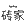

# Hall of Fame

以下标记主要代表了三类信息来源：

- 作者亲身经历过的面试题知识点。
- 作者收集的面经。
- 作者从培训课程、技术资料、博客、公众号、社交软件等整合而来的信息。

| 标识ID           | 标识名称         | 校招面试 | 社招面试 | 企业面经 | 技术课程 | 官方文档 | 学习笔记 | 标识图案                                   |
| :--------------- | ---------------- | -------- | -------- | -------- | -------- | -------- | -------- | ------------------------------------------ |
| 360              | 360              |          |          |          |          | √        |          |               |
| 51cto            | 51CTO            |          |          |          | √        |          | √        |             |
| andashu1006      | 测试那点事儿     |          |          |          |          |          | √        |       |
| alibaba          | 阿里巴巴         | √        | √        | √        |          | √        |          |           |
| amazon           | 亚马逊           | √        |          | √        |          | √        |          |            |
| apple            | 苹果             |          | √        |          |          |          |          |             |
| ausa             | 奥萨医药         |          |          | √        |          |          |          |              |
| baidu            | 百度             | √        | √        | √        | √        | √        |          |             |
| bbbbzxlb         | 袁广鑫           |          |          | √        |          |          | √        |          |
| bittiger         | 太阁             |          |          |          | √        |          |          |          |
| bytedance        | 字节跳动         | √        | √        | √        |          | √        |          |         |
| cai_ing          | cai_ing          |          |          |          |          |          | √        |           |
| chengyuqiang     | 程裕强           |          |          |          |          |          | √        |      |
| citic            | 中信银行         |          | √        | √        | √        | √        |          |             |
| codingnaga       | Coding-Naga      |          |          |          |          |          | √        |        |
| cxuan            | 程序员cxuan      |          |          |          |          |          | √        |             |
| didi             | 滴滴             |          | √        | √        |          |          |          |              |
| ericsson         | 爱立信           | √        |          |          |          |          |          |          |
| feichenwangyalin | 爱拼才会赢1991   |          |          |          |          |          | √        |  |
| google           | 谷歌             | √        | √        | √        |          |          |          |            |
| gupao            | 咕泡学院         |          |          |          | √        |          |          |             |
| hackerzhuanjia   | 我的安全专家之路 |          |          |          |          |          | √        |    |
| hdjsjx           | 后端技术精选     |          |          |          |          |          | √        |            |
| hollischuang     | Hollis           |          |          |          |          |          | √        |      |
| how2j            | HOW2J            |          |          |          | √        |          |          |             |
| hropt            | 网优雇佣军       |          |          |          |          |          | √        |             |
| huawei           | 华为             |          | √        | √        |          |          |          |            |
| hulu             | Hulu             |          | √        | √        |          |          |          |              |
| iqiyi            | 爱奇艺           |          |          | √        |          |          |          |             |
| itcast           | 传智播客         |          |          |          | √        |          |          |            |
| javaaudition     | 三太子敖丙       |          |          |          |          |          | √        |      |
| javamanongzhijia | Java码农之家     |          |          |          |          |          | √        |  |
| jd               | 京东             | √        |          | √        |          |          |          |                |
| kaikeba          | 开课吧           |          |          |          | √        |          |          |           |
| kingdee          | 金蝶             |          |          | √        |          |          |          |           |
| kuaixuejava      | 快学Java         |          |          |          |          |          | √        |       |
| kujiale          | 酷家乐           |          |          | √        |          |          |          |           |
| lagou            | 拉勾             |          |          |          | √        |          |          |             |
| lijiang          | 李疆             |          |          |          |          |          | √        |           |
| linkedin         | 领英             | √        |          |          |          |          |          |          |
| linuxlearning365 | Linux知识积累    |          |          |          |          |          | √        |  |
| luban            | 鲁班学院         |          |          |          | √        |          |          |             |
| mashibing        | 马士兵教育       |          |          |          | √        |          |          |         |
| meituan          | 美团             | √        |          | √        | √        |          |          |           |
| mi               | 小米             | √        |          | √        |          |          |          |                |
| microsoft        | 微软             |          | √        | √        |          |          |          |         |
| miisi            | 迈思             |          |          | √        |          |          |          |             |
| netease          | 网易             | √        |          | √        |          |          |          |           |
| paypal           | PayPal           |          | √        | √        |          |          |          |            |
| pingan           | 平安银行         |          |          | √        |          |          |          |            |
| qq_25940921      | 金发只是水一下   |          |          |          |          |          | √        |       |
| qinlin           | 亲邻科技         |          |          | √        |          |          |          |            |
| road5858         | 架构师之路       |          |          |          |          |          | √        |          |
| runoob           | 菜鸟教程         |          |          |          |          | √        |          |            |
| sf               | 顺丰             |          |          | √        |          |          |          |                |
| snailclimb       | Guide哥          |          |          |          |          |          | √        |        |
| sohu             | 搜狐             | √        |          |          |          |          |          |              |
| stonefu          | StoneFu          |          |          |          |          |          | √        |           |
| soonfly          | 唐大麦           |          |          |          |          |          | √        |           |
| summerday152     | 天乔巴夏丶       |          |          |          |          |          | √        |      |
| tencent          | 腾讯             |          |          | √        |          | √        |          |           |
| tr               | 汤森路透         | √        |          |          |          |          |          |                |
| tuling           | 图灵学院         |          |          |          | √        |          |          |            |
| xiaohui          | 程序员小灰       |          |          |          |          |          | √        |           |
|                  |                  |          |          |          |          |          |          |                                            |

